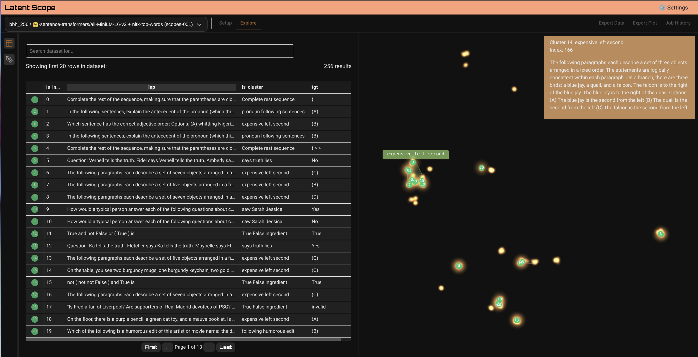

### [Latent Scope](https://github.com/enjalot/latent-scope)

> Handle: `latentscope`<br/>
> URL: [http://localhost:34381](http://localhost:34381)



Quickly embed, project, cluster and explore a dataset with open models locally or via API. This project is a new kind of workflow + tool for visualizing and exploring datasets through the lens of latent spaces.

### Starting

```bash
# [Optional] Pre-build the image
# Will take quite a while
harbor build latentscope

# Run the service
harbor up latentscope
```

- Harbor shares your HuggingFace hub cache with the service as it downloads and runs embeddings models

### Usage

Most of the configuration/setup is done via the service UI. You can upload a dataset, select a model, and start exploring the dataset.

### Configuration

Following options can be set via [`harbor config`](./3.-Harbor-CLI-Reference#harbor-config):

```bash
# Port on the host where latentscope endpoint will be available
LATENTSCOPE_HOST_PORT          34381

# Workspace directory for latentscope
# This is where the service will store its data
# Either relative to $(harbor home) or an absolute path
LATENTSCOPE_WORKSPACE          ./latentscope/data
```
