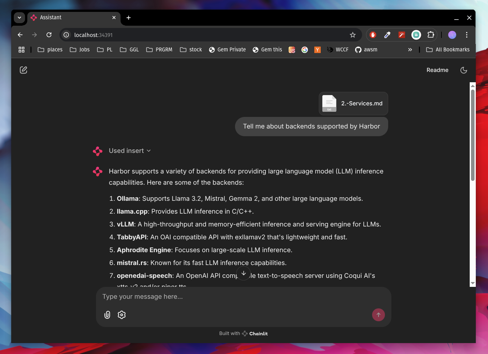

### [RAGLite](https://github.com/superlinear-ai/raglite)

> Handle: `raglite`<br/>
> URL: [http://localhost:34391](http://localhost:34391)



RAGLite is a Python toolkit for Retrieval-Augmented Generation (RAG) with PostgreSQL or SQLite.

### Starting

> [!WARN]
> Unfortunately due to bugs in `litellm` and `raglite` implementation, it's not possible to use `raglite` with a local Ollama instance. See [this issue](https://github.com/superlinear-ai/raglite/issues/108) for details.

```bash
# ⚠️ Due to above, before starting you'll need to supply
# an alternative model for RAGLite to use
# OpenRouter below is an example of a model that works
harbor config set openrouter.api_key <API_KEY>
harbor config set raglite.model openrouter/openai/gpt-4o

# [Optional] Pre-build the image
harbor build raglite

# Run the service
harbor up raglite
```

- Harbor runs [`chainlit` integration](https://github.com/superlinear-ai/raglite?tab=readme-ov-file#7-serving-a-customizable-chatgpt-like-frontend) as a `raglite` service
- Harbor shares your HuggingFace hub cache and token with the service as it can download and run embeddings models

### Configuration

Following options can be set via [`harbor config`](./3.-Harbor-CLI-Reference#harbor-config):

```bash
# RAGLite workspace location on the host
# Should be relative to $(harbor home) or an absolute path
RAGLITE_WORKSPACE              ./raglite/data

# LiteLLM-compatible notation for the model to use
# for chat completions. Must support:
# - tool calls with streaming
# - model info resolution
RAGLITE_MODEL                  ollama/llama3.1:8b

# LiteLLM-compatible notation for the model to use
# for embeddings
RAGLITE_EMBEDDER               ollama/mxbai-embed-large:latest
```