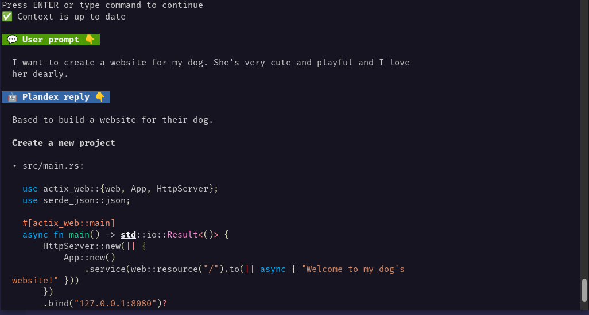

### [Plandex](https://github.com/plandex-ai/plandex)

> Handle: `plandex`
> URL: [http://localhost:33941/](http://localhost:33941/)

<div align="center">
 <a href="https://plandex.ai">
  <picture>
    <source media="(prefers-color-scheme: dark)" srcset="images/plandex-logo-dark.png"/>
    <source media="(prefers-color-scheme: light)" srcset="images/plandex-logo-light.png"/>
    
 </a>
 <br />
</div>

<p align="center">
  <a href="#install">
    <b>30-Second Install</b>
  </a>
   ·
  <a href="https://plandex.ai">
    <b>Website</b>
  </a>
   ·
  <a href="https://docs.plandex.ai/">
    <b>Docs</b>
  </a>
   ·
  <a href="#more-examples-">
    <b>Examples</b>
  </a>
   ·
  <a href="https://docs.plandex.ai/hosting/self-hosting">
    <b>Self-Hosting</b>
  </a>
</p>

AI driven development in your terminal. Designed for large, real-world tasks.

#### Starting

Kudos to @whipash for the rolling release images for Plandex.

```bash
# [Optional] pre-pull related images
harbor pull plandex

# [Optional] check that dockerized plandex
# CLI functions as expected
harbor plandex --help # Should print Plandex CLI help
```

Plandex uses a client-server architecture. It means that to use the CLI you still need to have the service running in the background.

```bash
# Run plandex service
harbor up plandex

# Run healthcheck against the Plandex service
harbor plandex health # should print "OK"
```

- [Official documentation](https://docs.plandex.ai/intro)

#### Setup

> [!NOTE]
> Disclaimer: this guide is mostly to touch on the places in the Harbor and Plandex that are needed for the setup to work, but the guide is not exhaustive and you will still need to adjust the settings and tweak the configuration to arrive to a setup that works in your context.

Before using Plandex, you'll need to [create a local account](https://docs.plandex.ai/hosting/self-hosting#create-a-new-account).

In order to complete the procedure, you'll want to keep the Plandex server logs open in another terminal:

```bash
# Open Plandex logs
harbor logs plandex | grep Development
```

1. Initiate the sign-in
```bash
user@host:~/code/my-new-startup$ ▼ harbor plandex sign-in
```

2. Choose "Another host"
3. type in "http://plandexserver:8080" for the host URL (Plandex Server from Harbor's compose)
4. Enter the email you want to register
5. Lookup the server logs
```bash
harbor.plandexserver  | 2032/50/42 59:72:84 Development mode: Verification pin is 39btmL for email av@av.codes
```
6. Grab the verification pin and type it in the CLI
7. Type in the username you'd like to use
8. Agree to create an org and provide the org name (could be the same as the username)

```bash
? Use Plandex Cloud or another host? Another host
✔ Host: … http://plandexserver:8080
✔ Your email: … av@av.codes
✉️  You'll now receive a 6 character pin by email. It will be valid for 5 minutes.
✔ Please enter your pin: … ******
```

After that, you can start using Plandex CLI. Harbor will mount `$PWD` to the CLI container, as if it was called directly in the terminal.

```bash
# Will run the Plandex CLI in
# the current folder
harbor plandex

# [For debug] Check which folder is mounted
# to the CLI container
harbor plandex pwd
```

#### Configuration

##### Ollama models

Unfortunately, there's no way to preset these settings on the Harbor's end, so one must configure it manually via TUI. Please find a sample setup flow completed below.

```bash
user@os:~/code/my-new-startup$ ▼ harbor plandex models add
? Select provider: custom
✔ Custom provider: … ollama
For model name, be sure to enter the exact, case-sensitive name of the model as it appears in the provider's API docs. Ex: 'gpt-4-turbo', 'meta-llama/Llama-3-70b-chat-hf'
✔ Model name: … llama3.1:8b-instruct-q6_K
Add a human friendly description if you want to.
✔ Description (optional): … l3
✔ Base URL: … http://ollama:11434/v1
✔ API key environment variable: … OPENAI_API_KEY
Max Tokens is the total maximum context size of the model.
✔ Max Tokens: … 4096
'Default Max Convo Tokens' is the default maximum size a conversation can reach in the 'planner' role before it is shortened by summarization. For models with 8k context, ~2500 is recommended. For 128k context, ~10000 is recommended.
✔ Default Max Convo Tokens: … 2500
'Default Reserved Output Tokens' is the default number of tokens reserved for model output in the 'planner' role. This ensures the model has enough tokens to generate a response. For models with 8k context, ~1000 is recommended. For 128k context, ~4000 is recommended.
✔ Default Reserved Output Tokens: … 1000
Is streaming supported? (y)es | (n)o> y
Is JSON mode supported? (y)es | (n)o> y
Is function calling supported? (y)es | (n)o> y
Are streaming function calls supported? (y)es | (n)o> y
Is multi-modal image support enabled? (y)es | (n)o> n
✅ Added custom model custom → llama3.1:8b-instruct-q6_K
```

After that, you'd want to assign this custom model for various roles supported by the tool. Setting all the roles to the same small model would likely not bring the best results, so try to balance it out if you have the resources.

> [!WARN]
> Settings below are not tested for optimality and are used for demonstration purposes only.

```bash
user@os:~/code/my-new-startup$ ▼ harbor plandex model-packs create
✔ Enter model pack name: … ollama
✔ Enter description: … ollama models
Select a model for the planner role 👇
? Select a provider: ollama
? Select a model: ollama → llama3.1:8b-instruct-q6_K | max 4096 🪙
✔ Temperature for planner: … 0.1
✔ Top P for planner: … 0.3
Select a model for the summarizer role 👇
? Select a provider: ollama
? Select a model: ollama → llama3.1:8b-instruct-q6_K | max 4096 🪙
✔ Temperature for summarizer: … 0.2
✔ Top P for summarizer: … 0.2
Select a model for the builder role 👇
? Select a provider: ollama
? Select a model: ollama → llama3.1:8b-instruct-q6_K | max 4096 🪙
✔ Temperature for builder: … 0.1
✔ Top P for builder: … 0.1
Select a model for the names role 👇
? Select a provider: ollama
? Select a model: ollama → llama3.1:8b-instruct-q6_K | max 4096 🪙
✔ Temperature for names: … 0.8
✔ Top P for names: … 0.5
Select a model for the commit-messages role 👇
? Select a provider: ollama
? Select a model: ollama → llama3.1:8b-instruct-q6_K | max 4096 🪙
✔ Temperature for commit-messages: … 0.8
✔ Top P for commit-messages: … 0.5
Select a model for the auto-continue role 👇
? Select a provider: ollama
? Select a model: ollama → llama3.1:8b-instruct-q6_K | max 4096 🪙
✔ Temperature for auto-continue: … 0.1
✔ Top P for auto-continue: … 0.1
Select a model for the verifier role 👇
? Select a provider: ollama
? Select a model: ollama → llama3.1:8b-instruct-q6_K | max 4096 🪙
✔ Temperature for verifier: … 0.2
✔ Top P for verifier: … 0.2
Select a model for the auto-fix role 👇
? Select a provider: ollama
? Select a model: ollama → llama3.1:8b-instruct-q6_K | max 4096 🪙
✔ Temperature for auto-fix: … 0.1
✔ Top P for auto-fix: … 0.1
✅ Created model pack ollama
```

> [!NOTE]
> See the `default` flag above. It'll apply to the new plandex "plans" going forward,
> so if you created any plans in between these setup steps - you'd need to adjust them manually.

```bash
user@os:~/code/my-new-startup$ ▼ harbor pdx set-model default
? Choose a new model pack, or select a role or override to update: 🎛️  choose a model pack to change all roles at once
? Select a model pack: Custom | ollama
⚙️  Updated model settings:
  • model-pack.id |  → fc947236-72c0-4458-98c1-0bcd8d08e2a3
  • model-pack.name | gpt-4o-latest → ollama
  • model-pack.description | Uses OpenAI's latest gpt-4o model, first released on 2024-05-13, for heavy lifting, and latest version of gpt-3.5-turbo for lighter tasks. → ollama models
  • model-pack.planner.temperature | 0.3 → 0.1

 plandex models  👉 show current plan model settings
 plandex set-model default  👉 update org-wide default model settings for new plans
 plandex log  👉 show log of plan updates
```

> [!TIP]
> For certain settings and configurations, it might be easier to just do them via Postgres directly. See the DB connection info in the `compose.plandex.yml` service file.

#### Usage

Start with creating a new plan:
```bash
# Init new empty plan
harbor pdx new

# Shortcut to (t)ell the tool
# what you want to do
harbor pdx t
```

Fill in necessary details and see the plan unfold.


