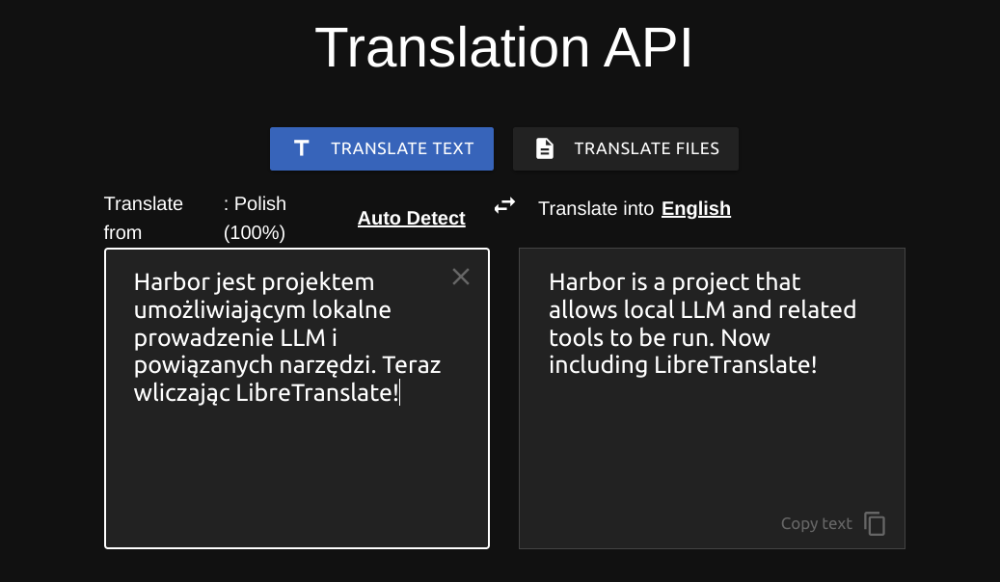

### [LibreTranslate](https://github.com/LibreTranslate/LibreTranslate)

> Handle: `libretranslate`<br/>
> URL: [http://localhost:34411](http://localhost:34411)



Free and Open Source Machine Translation API, entirely self-hosted. Unlike other APIs, it doesn't rely on proprietary providers such as Google or Azure to perform translations. Instead, its translation engine is powered by the open source Argos Translate library.

### Starting

```bash
# [Optional] pre-pull the image
harbor pull libretranslate

# Run the service
harbor up libretranslate
```

- It will take a while for initial download of the translate models, `harbor logs libretranslate` to see the progress
- There are community implementations for Filters/Functions/Pipes [for LibreTranslate in Open WebUI](https://docs.openwebui.com/tutorials/integrations/libre-translate#configuring-the-integration-in-open-webui)

### Configuration

Following options can be set via [`harbor config`](./3.-Harbor-CLI-Reference#harbor-config):

```bash
# Port on the host where libretranslate endpoint will be available
LIBRETRANSLATE_HOST_PORT       34411

# Version of libretranslate to run (docker image tag)
LIBRETRANSLATE_VERSION         latest

# Image to use for libretranslate service
LIBRETRANSLATE_IMAGE           libretranslate/libretranslate

# Workspace directory for libretranslate
# This is where the service will store its data
# Either relative to $(harbor home) or an absolute path
LIBRETRANSLATE_WORKSPACE       ./libretranslate/data
```