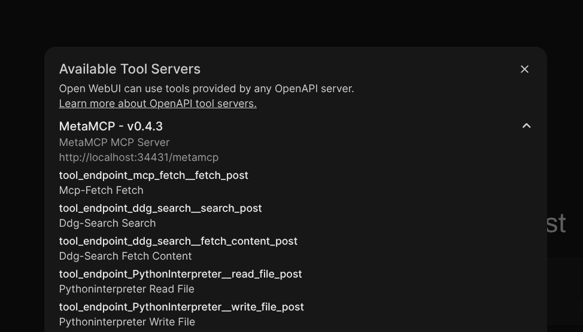

### [mcpo](https://github.com/open-webui/mcpo)

> Handle: `mcpo`<br/>
> URL: [http://localhost:34431](http://localhost:34431)



Expose any MCP tool as an OpenAPI-compatible HTTP server—instantly.

mcpo is a dead-simple proxy that takes an MCP server command and makes it accessible via standard RESTful OpenAPI, so your tools "just work" with LLM agents and apps expecting OpenAPI servers.

No custom protocol. No glue code. No hassle.

### Starting

```bash
# [Optional] pre-pull the image
harbor pull mcpo

# Start the service
harbor up mcpo
```

- `mcpo` is designed to turn MCP servers into OpanAPI-compatible HTTP servers, thus making them available to any OpenAPI-compatible client, including Open WebUI.
- Harbor will connect `webui` to `mcpo` and `mcpo` to `metamcp` automatically when started together
  - It means that you can start `harbor up webui metamcp mcpo` and use MCP tools in Open WebUI

### Configuration

In addition to `metamcp`, you can specify any other MCP servers for `mcpo` to proxy. To do so you can manually edit included MCPO config:

```bash
# Open in your favorite editor
open $(harbor home)/mcpo/configs/mcpo.override.json
```

`mcpo` image has necessary dependencies to run most MCP servers, such as `uvx`, `npx`, Python, Node.js, etc. Additionally, there's also `supergateway` included which can help to translate between SSE and STDIO MCP protocols where needed.

Additionally, if you want to have an experience similar to Harbor services - deciding what to run on the fly:

```bash
# 1. Create a new server config
cp $(harbor home)/mcpo/configs/mcpo.mcp-server-time.json $(harbor home)/mcpo/configs/my-mcp-server.json

# 2. Edit the config
# You can use same configuration options as supported by MCPO (Claude Desktop-style MCP config)
open $(harbor home)/mcpo/configs/my-mcp-server.json

# 3. Add cross-file for your server
cp $(harbor home)/compose.x.mcpo.mcp-server-time.yml $(harbor home)/compose.x.mcpo.my-mcp-server.yml

# 4. In the cross-file - change the config from "mcp-server-time" to "my-mcp-server"
# 5. You can now optionally start this server with `harbor up mcpo my-mcp-server`
```

Following options can be set via [`harbor config`](./3.-Harbor-CLI-Reference#harbor-config):

```bash
# Port on the host where the metamcp service will be available
MCPO_HOST_PORT                 34431
```

Finally, you can also use [`harbor env`](./3.-Harbor-CLI-Reference#harbor-env) to set environment variables that are supported by the service.