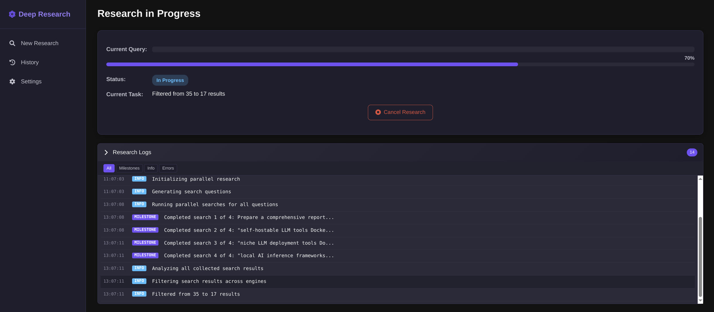

### [Local Deep Research](https://github.com/LearningCircuit/local-deep-research)

> Handle: `ldr`<br/>
> URL: [http://localhost:34441](http://localhost:34441)



Local Deep Research is an AI-powered assistant that transforms complex questions into comprehensive, cited reports by conducting iterative analysis using any LLM across diverse knowledge sources including academic databases, scientific repositories, web content, and private document collections.

#### Starting

```bash
# [Optional] pre-pull the image (~7GB)
harbor pull ldr

# It makes little sense to run ldr without a
# search engine such as SearXNG
harbor up ldr searxng

# Open in your browser
harbor open ldr
```

#### Configuration

See official [Docker Configuration guide](https://github.com/LearningCircuit/local-deep-research/blob/main/docs/docker-usage-readme.md#using-local-deep-research-with-docker) for reference.

Following options can be set via [`harbor config`](./3.-Harbor-CLI-Reference.md#harbor-config):

```bash
# Port on the host where the ldr service will be available
HARBOR_LDR_HOST_PORT                  34441

# Location on the host where service data will be stored
# Should be either relative to $(harbor home) or absolute
HARBOR_LDR_WORKSPACE                  ./services/ldr/data

# Docker image to use for this service
HARBOR_LDR_IMAGE                      localdeepresearch/local-deep-research

# Docker tag to use for this service
# Should be one of the tags for the image above
HARBOR_LDR_VERSION                    latest
```
