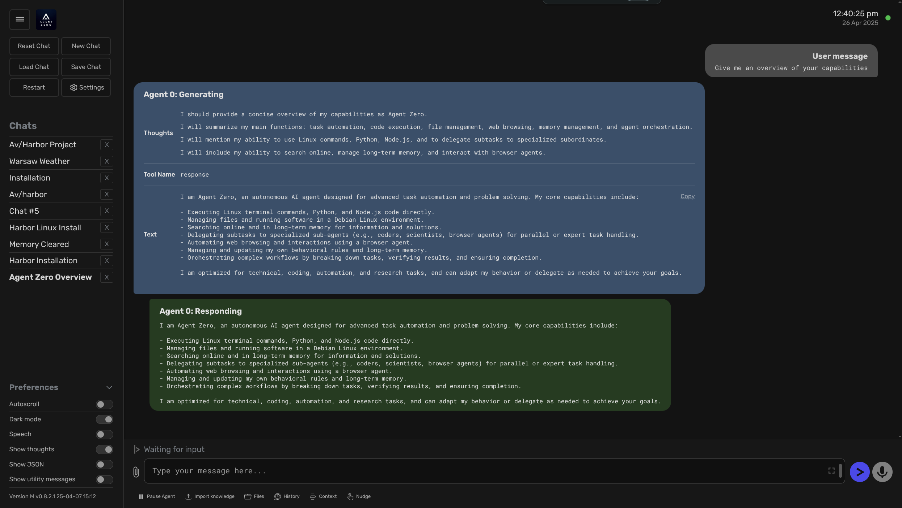

### [Agent Zero](https://github.com/frdel/agent-zero)

> Handle: `agentzero`<br/>
> URL: [http://localhost:34461](http://localhost:34461)



General-purpose personal assistant with: Web RAG, persistent memory, Browser Use.

### Starting

```bash
# [Optional] Pre-pull the image
harbor pull agentzero

# Start the service
# --open is optional, to open in browser
# ⚠️ On the first start - ensure to configure the models in the UI
harbor up agentzero --open
```

See [troubleshooting guide](./1.-Harbor-User-Guide#troubleshooting) if you encounter any issues.

- There's no way to pre-configure the models via environment variables, so on the first start you need to configure the models in the UI
  - You need to configure: Chat Model, Utility Model and Embedding Model for the service to work
  - _Example_ configuration for Ollama:
    - Chat Model: `gemma-3:12b-qat`
    - Utility Model: `gemma-3:12b-qat`
    - Web Browser Model: `gemma-3:12b-qat`
    - Embedding Model: `mxbai-embed-large`
      - ⚠️ Ensure to set `num_ctx=512` in the parameters, otherwise it will not work
  - TIP: These models needs to be fairly capable and run with ~40k context size to work with the features from Agent Zero
- Harbor will connect `agentzero` to `ollama` service when running together
- Harbor will share your API keys for Groq/Mistral/OpenRouter/Anthropic/Google with the service (if configured)

#### Usage

You'll mostly be interacting with Agent Zero via its Web UI, run [`harbor open`](./3.-Harbor-CLI-Reference#harbor-open-service) to access it.

```bash
# Open Agent Zero Web UI in the browser
harbor open agentzero

# Get a URL
harbor url agentzero

# Get a QR for the phone
harbor qr agentzero
```

#### Configuration

See official [Environment Variables guide](https://localai.io/advanced/#environment-variables) for reference.

Following options can be set via [`harbor config`](./3.-Harbor-CLI-Reference#harbor-config):

```bash
# The port on the host where Agent Zero endpoint will be available
AGENTZERO_HOST_PORT            34461

# Docker image to use for the Agent Zero service
AGENTZERO_IMAGE                frdel/agent-zero-run

# Docker tag to use for the service
AGENTZERO_VERSION              latest

# Folder that will be mounted to the container
# Should be either relative to $(harbor home) or absolute
AGENTZERO_WORKSPACE            ./agentzero/data
```

See [environment configuration guide](./1.-Harbor-User-Guide#environment-variables) to set arbitrary environment variables for the service.
