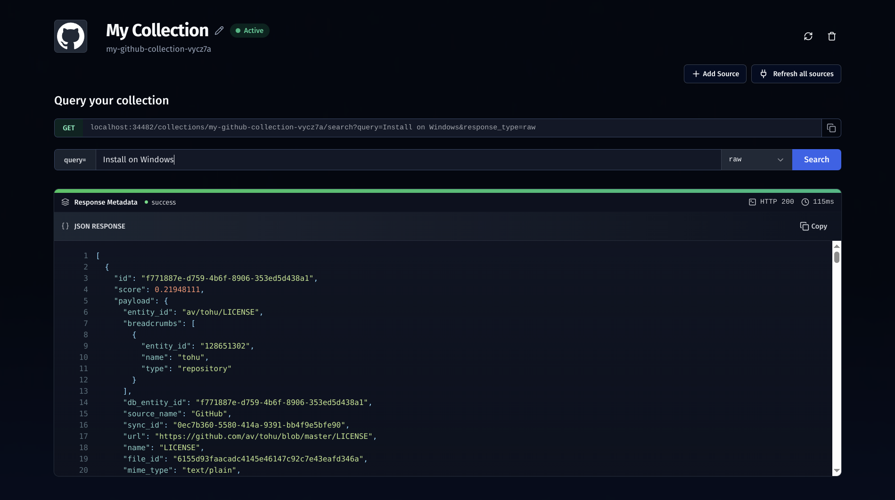

### [Airweave](https://github.com/airweave-ai/airweave)

> Handle: `airweave`<br/>
> URL: [http://localhost:34481](http://localhost:34481)



A lightweight, fast, and extensible vector database for AI applications. Airweave provides persistent storage and efficient similarity search for embeddings, making it ideal for RAG, chat history, and knowledge base use cases.

#### Starting

```bash
# [Optional] Pre-build the image
harbor build airweave

# Start the service
# --open is optional, to open in browser
harbor up airweave --open
```

- Airweave exposes a REST API and a web UI for managing collections and documents
  - Run `harbor url airweave-backend` to get API URL
- Data is persisted in the `airweave/data` folder by default, configurable via `airweave.workspace`

#### Usage

You will mostly interact with Airweave via its Web UI or API. Run [`harbor open`](./3.-Harbor-CLI-Reference#harbor-open-service) to access the UI.

```bash
# Open Airweave Web UI in the browser
harbor open airweave

# Get a URL
harbor url airweave

# Get a QR for the phone
harbor qr airweave
```

#### Configuration

See the [official documentation](https://github.com/av/airweave#configuration) for more details.

Following options can be set via [`harbor config`](./3.-Harbor-CLI-Reference.md#harbor-config):

```bash
# The port on the host where Airweave endpoint will be available
AIRWEAVE_HOST_PORT             34481

# Ports on the host for other services in Airweave group
AIRWEAVE_BACKEND_HOST_PORT     34482
AIRWEAVE_POSTGRES_HOST_PORT    34483
AIRWEAVE_REDIS_HOST_PORT       34484
AIRWEAVE_QDRANT_HOST_PORT      34485
AIRWEAVE_EMBEDDINGS_HOST_PORT  34486

# Git ref to build the image from
# You can adjust the branch/tag/commit to use by adjusting part after the #
AIRWEAVE_GIT_REF               https://github.com/airweave-ai/airweave.git#main

# Location of the Airweave workspace on the host
# This is where service data is stored
# Should be either relative to $(harbor home) or an absolute path
AIRWEAVE_WORKSPACE             ./airweave/data
```

See [environment configuration guide](./1.-Harbor-User-Guide.md#environment-variables) to set arbitrary environment variables for the service.
