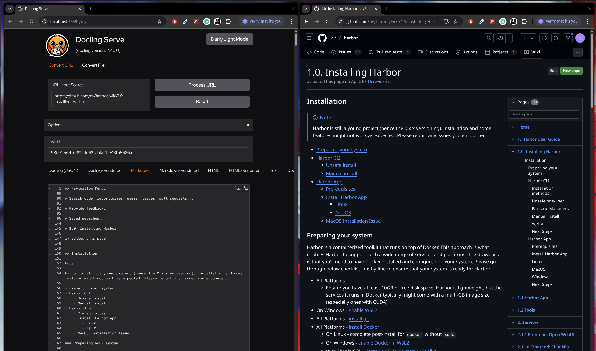

### [Docling](https://github.com/docling-project/docling)

> Handle: `docling`<br/>
> URL: [http://localhost:34491](http://localhost:34491)



Docling simplifies document processing, parsing diverse formats — including advanced PDF understanding — and providing seamless integrations with the gen AI ecosystem.

#### Starting

```bash
# [Optional] Pre-pull the image
harbor pull docling

# Start the service
# --open is optional, to open in browser
harbor up docling --open
```

- Harbor runs official [`docling-serve`](https://github.com/docling-project/docling-serve) service
- When running with `nvidia` GPU, set [one of the CUDA-enabled images](https://github.com/docling-project/docling-serve?tab=readme-ov-file#container-images) in the `harbor config`:
  ```bash
  harbor config set docling.image ghcr.io/docling-project/docling-serve-cu124
  ```
- As of July 2025, Cuda 12.6 and Cuda 12.8 images are broken, only Cuda 12.4 works
- You can use Docling with CPU only, but it will be much slower
- Main use-case is to pre-process documents from the internet or local files with the Docling API

#### Usage

Open built-in docs at [http://localhost:34491/docs](http://localhost:34491/docs) or use the [official documentation](https://github.com/docling-project/docling-serve/blob/main/docs/README.md)

#### Configuration

Following options can be set via [`harbor config`](./3.-Harbor-CLI-Reference.md#harbor-config):

```bash
# The port on the host where Docling endpoint will be available
DOCLING_HOST_PORT              34491

# Docker tag to use for Docling image
DOCLING_VERSION                latest

# Docker image to use for Docling
DOCLING_IMAGE                  ghcr.io/docling-project/docling-serve-cu124

# URL to open with `harbor open` command
DOCLING_OPEN_URL               http://localhost:34491/ui
```

You can set extra environment variables for Docling via [`harbor env`](./3.-Harbor-CLI-Reference#harbor-env). See the official [configuration reference](https://github.com/docling-project/docling-serve/blob/main/docs/configuration.md) for more options.