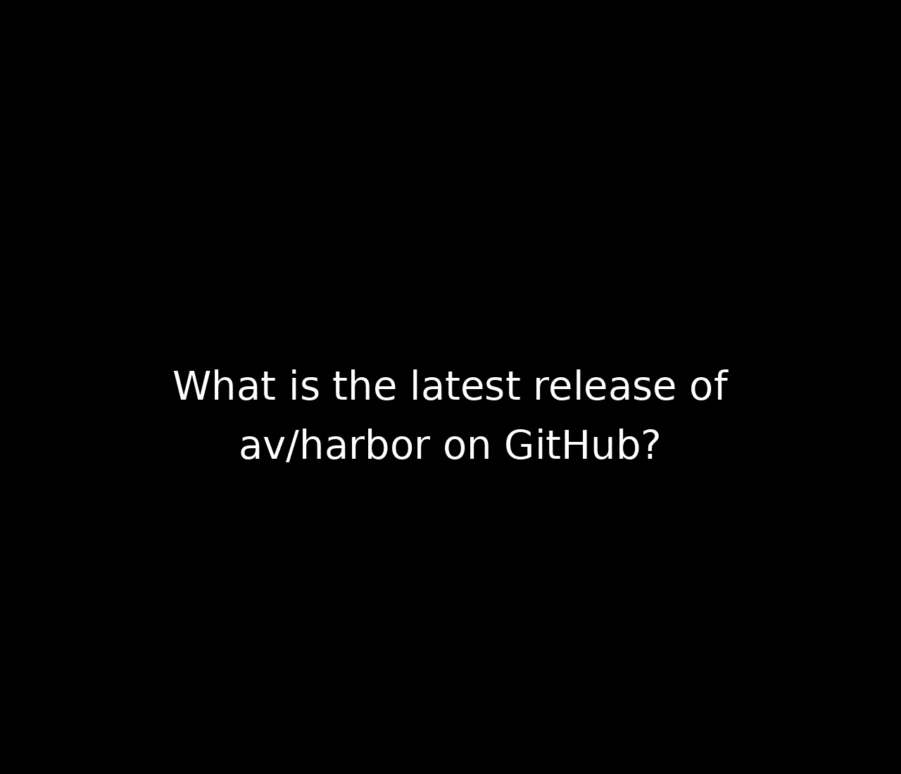

### [Browser Use](https://github.com/browser-use/web-ui)

> Handle: `browseruse`<br/>
> URL: [http://localhost:34501](http://localhost:34501)



AI-powered browser automation framework with web UI that makes websites accessible for AI agents. Allows agents to interact with web pages using natural language commands, performing tasks like clicking, typing, and navigating through complex web interfaces.

### Starting

```bash
# [Optional] Pre-build the image
harbor build browseruse

# Start the service
# --open is optional, to open in browser
harbor up browseruse --open
```

See [troubleshooting guide](./1.-Harbor-User-Guide#troubleshooting) if you encounter any issues.

- ⚠️ Harbor runs a version of `browser-use` from official `browser-use/web-ui` repo, however:
  - As of Sep 2025 - it runs severly outdated version of the Browser Use
  - None of the settings persist between UI restarts
  - The agent is almost unusable without a vision model
  - Agent relies on the LLM for tool call formatting and structured outputs - only most powerful LLMs will work well
- Harbor will connect `browseruse` to `ollama` service when running together
- Harbor will share your API keys for OpenAI/Anthropic/Google/Azure/Mistral/etc. with the service (if configured)
- Browser Use includes VNC access for visual debugging and monitoring of automation tasks
- The service exposes multiple ports:
  - Main web UI (34501)
  - VNC web viewer (34502)
  - VNC display (34503)
  - Browser debugging (34504)

#### Usage

You'll mostly be interacting with Browser Use via its Web UI, run [`harbor open`](./3.-Harbor-CLI-Reference#harbor-open-service) to access it.

```bash
# Open Browser Use Web UI in the browser
harbor open browseruse

# Get a URL
harbor url browseruse

# Get a QR for the phone
harbor qr browseruse

# View browser automation via VNC (web-based)
harbor open browseruse:vnc
```

The web UI provides an interface for:
- Creating and managing AI browser automation tasks
- Monitoring browser sessions and agent activities in real-time
- Configuring automation workflows and LLM models
- Viewing execution logs, screenshots, and results
- Remote browser control via integrated VNC viewer

#### Configuration

Following options can be set via [`harbor config`](./3.-Harbor-CLI-Reference.md#harbor-config):

```bash
# The port on the host where Browser Use web UI will be available
BROWSERUSE_HOST_PORT           34501

# VNC web viewer port (for browser monitoring)
BROWSERUSE_VNC_PORT            34502

# VNC display port
BROWSERUSE_VNC_DISPLAY_PORT    34503

# Browser debugging port
BROWSERUSE_DEBUG_PORT          34504

# Docker image to use for Browser Use
BROWSERUSE_IMAGE               browseruse/web-ui

# Docker tag to use for Browser Use
BROWSERUSE_VERSION             latest

# URL to open with `harbor open` command
BROWSERUSE_OPEN_URL            http://localhost:34501

# Ollama endpoint for local LLM integration
BROWSERUSE_OLLAMA_ENDPOINT     http://harbor.ollama:11434

# Application settings
BROWSERUSE_ANONYMIZED_TELEMETRY false
BROWSERUSE_LOGGING_LEVEL       info

# Browser configuration
BROWSERUSE_BROWSER_PATH        ""          # Path to custom browser executable
BROWSERUSE_BROWSER_USER_DATA   ""          # Custom browser user data directory
BROWSERUSE_BROWSER_DEBUG_PORT  "9222"      # Chrome DevTools debugging port
BROWSERUSE_USE_OWN_BROWSER     "false"     # Use external browser instance
BROWSERUSE_KEEP_BROWSER_OPEN   "true"      # Keep browser open between tasks
BROWSERUSE_BROWSER_CDP         ""          # Custom Chrome DevTools endpoint

# Display settings for VNC
BROWSERUSE_RESOLUTION          "1920x1080x24"  # Screen resolution
BROWSERUSE_RESOLUTION_WIDTH    "1920"          # Screen width
BROWSERUSE_RESOLUTION_HEIGHT   "1080"          # Screen height
BROWSERUSE_VNC_PASSWORD        "youvncpassword" # VNC access password
```

You can set extra environment variables for Browser Use via [`harbor env`](./3.-Harbor-CLI-Reference#harbor-env). The service automatically inherits all configured API keys from Harbor's environment for seamless integration with various LLM providers.
