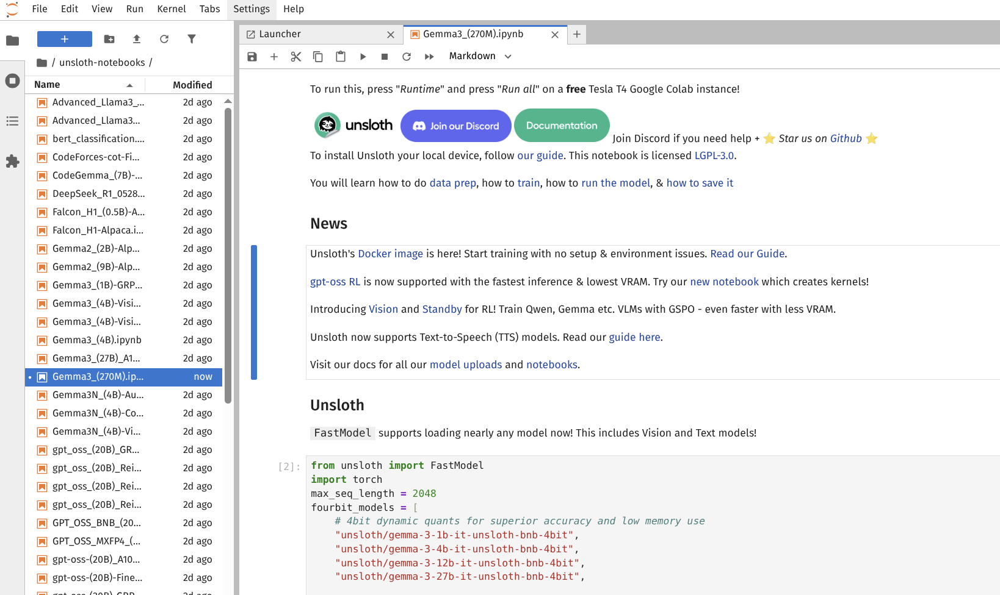

### [Unsloth](https://github.com/unslothai/unsloth)

> Handle: `unsloth`<br/>
> URL: [http://localhost:34511](http://localhost:34511)



Unsloth is a Jupyter Lab environment pre-configured with the Unsloth library for fast LLM fine-tuning. It provides 2x faster training with 70% less memory usage compared to standard fine-tuning methods, along with pre-loaded example notebooks for various fine-tuning tasks.

The service includes:
- Jupyter Lab with all dependencies pre-installed
- Unsloth library for efficient LLM fine-tuning
- Pre-configured notebooks for supervised fine-tuning, reinforcement learning (GRPO, DPO, ORPO, KTO), and vision fine-tuning
- SSH access for remote development
- GPU support with NVIDIA Container Toolkit

## Starting

```bash
# Pull the pre-built image
# Image is ~7GB which is typical for CUDA-enabled environments
harbor pull unsloth

# Start the service (opens Jupyter Lab in browser)
harbor up unsloth --open
```

Access Jupyter Lab at `http://localhost:34511` with the password (default: `unsloth`, configurable).

## Configuration

### Environment Variables

Following options can be set via [`harbor config`](./3.-Harbor-CLI-Reference.md#harbor-config):

```bash
# Jupyter Lab Configuration
HARBOR_UNSLOTH_HOST_PORT=34511              # Jupyter Lab web interface port
HARBOR_UNSLOTH_SSH_PORT=34512               # SSH access port (optional)
HARBOR_UNSLOTH_JUPYTER_PASSWORD="unsloth"   # Jupyter Lab password
HARBOR_UNSLOTH_WORKSPACE="./unsloth/workspace"  # Local workspace directory

# Docker Image
HARBOR_UNSLOTH_IMAGE="unsloth/unsloth"      # Docker image to use
HARBOR_UNSLOTH_VERSION="latest"             # Image version/tag
```

### Volumes

The service mounts the following directories:
- `HARBOR_UNSLOTH_WORKSPACE` → `/workspace/work` - Your working directory for notebooks and data
- `HARBOR_HF_CACHE` → `/root/.cache/huggingface` - HuggingFace model cache

## Usage

### Accessing Pre-loaded Notebooks

After starting the service, navigate to the `unsloth-notebooks` folder in Jupyter Lab to access example notebooks for:
- Text fine-tuning (Llama, Qwen, Gemma, Mistral, etc.)
- Reinforcement learning (GRPO, DPO, ORPO, KTO, SimPO)
- Vision fine-tuning (Qwen-VL, LLaVA)
- Text-to-speech fine-tuning
- Quantization-aware training

### HuggingFace Token

To download models from HuggingFace Hub, set your token:

```bash
harbor config set hf.token "hf_your_token_here"
```

## Examples

### Basic Fine-tuning Workflow

1. Start Unsloth and open Jupyter Lab
2. Navigate to `unsloth-notebooks/`
3. Choose a notebook (e.g., `Llama3.1_(8B)-Alpaca.ipynb`)
4. Run all cells or customize for your dataset
5. Export your fine-tuned model to GGUF, Ollama, vLLM, or HuggingFace

### Using Your Own Data

Place your datasets in the workspace directory (mapped to `/workspace/work`):

```bash
# From your local machine
cp my_dataset.json $(harbor home)/unsloth/workspace/

# In Jupyter Lab, access it at:
# /workspace/work/my_dataset.json
```

## Related Services

- [Jupyter](./2.3.25-Satellite:-Jupyter) - Standard Jupyter Lab environment
- [vLLM](./2.2.4-Backend:-vLLM) - For serving fine-tuned LLMs
