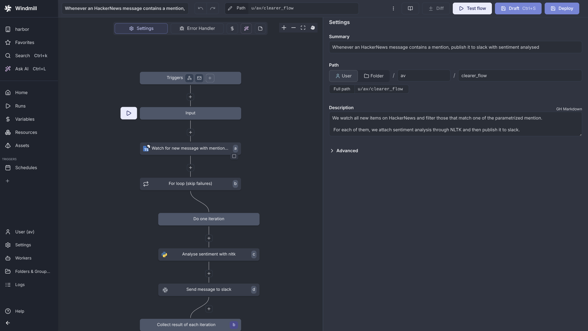

### [Windmill](https://github.com/windmill-labs/windmill)

> Handle: `windmill`<br/>
> URL: [http://localhost:34521](http://localhost:34521)



Windmill is an open-source developer platform for building internal tools through APIs, background jobs, workflows, and UIs. It's a self-hostable alternative to Retool, Pipedream, and Superblocks.

**Key Features:**
- **Multi-language support**: Python, TypeScript, Go, Bash, SQL, GraphQL
- **Auto-generated UIs**: Scripts automatically generate interactive frontends
- **Flow composition**: Chain scripts together into complex workflows
- **Custom UIs**: Build sophisticated applications with low-code builder
- **Scheduling**: Trigger workflows via cron schedules or webhooks
- **Enterprise-grade**: Rust backend, Svelte frontend, Postgres database

## Starting

```bash
# Pull the images
harbor pull windmill

# Start Windmill
harbor up windmill --open
```

- On the first start, you'll need to go through initial setup:
  - Default credentials: `admin@windmill.dev` / `changeme`
  - Telemetry is opt-out, ensure to disable if sharing stats is not desired
- There are some excellent tutorials in the official documentation: https://www.windmill.dev/docs/intro
- There's a hub with ready-made scripts, flows and apps: https://hub.windmill.dev/

## Configuration

### Environment Variables

Following options can be set via [`harbor config`](./3.-Harbor-CLI-Reference.md#harbor-config):

```bash
# Main UI port (Caddy reverse proxy)
HARBOR_WINDMILL_HOST_PORT          34521

# PostgreSQL database port (optional, for debugging)
HARBOR_WINDMILL_DB_HOST_PORT       34522

# Workspace directory for persistent data
HARBOR_WINDMILL_WORKSPACE          ./windmill

# Windmill server/worker image
HARBOR_WINDMILL_IMAGE              ghcr.io/windmill-labs/windmill
HARBOR_WINDMILL_VERSION            latest

# Database configuration
HARBOR_WINDMILL_DB_IMAGE           postgres
HARBOR_WINDMILL_DB_VERSION         16
HARBOR_WINDMILL_DB_USER            postgres
HARBOR_WINDMILL_DB_PASSWORD        changeme
HARBOR_WINDMILL_DB_NAME            windmill

# Caddy reverse proxy
HARBOR_WINDMILL_CADDY_IMAGE        ghcr.io/windmill-labs/caddy-l4
HARBOR_WINDMILL_CADDY_VERSION      latest
HARBOR_WINDMILL_BASE_URL           :80
HARBOR_WINDMILL_ADDRESS            0.0.0.0

# Language Server Protocol
HARBOR_WINDMILL_LSP_IMAGE          ghcr.io/windmill-labs/windmill-lsp
HARBOR_WINDMILL_LSP_VERSION        latest
```

### Volumes

Windmill persists data in the following directories:
- `windmill/db/` - PostgreSQL database
- `windmill/cache/` - Worker dependency cache
- `windmill/logs/` - Worker logs
- `windmill/lsp_cache/` - Language server cache
- `windmill/caddy_data/` - Caddy configuration and certificates

### Caddyfile

The Caddy reverse proxy configuration is in `windmill/Caddyfile`. It routes:
- `/ws/*` → Language Server (websockets)
- `/*` → Windmill Server (main UI/API)
- Port `25` → SMTP server (port 2525 on windmill-server)

## Integration with Harbor

Windmill can integrate with other Harbor services:
- Use Harbor LLM backends (Ollama, vLLM, etc.) via API calls
- Access SearXNG for web search in workflows
- Store files in Harbor's shared volumes
- Call other Harbor services via internal network

## Troubleshooting

### Check Logs

```bash
# All services
harbor logs windmill

# Specific service
harbor logs windmill-server
harbor logs windmill-worker
```

### Database Issues

If migrations fail or database is corrupted:

```bash
# Stop services
harbor down windmill

# Remove database (WARNING: destroys all data)
rm -rf windmill/db

# Restart
harbor up windmill
```

### Worker Issues

If jobs are stuck or failing:

```bash
# Check worker logs
harbor logs harbor.windmill-worker

# Restart windmill
harbor restart windmill
```

## Links

- [Official Documentation](https://www.windmill.dev/docs/intro/)
- [GitHub Repository](https://github.com/windmill-labs/windmill)
- [Windmill Hub](https://hub.windmill.dev/) - Community scripts and flows
- [Discord Community](https://discord.gg/V7PM2YHsPB)
