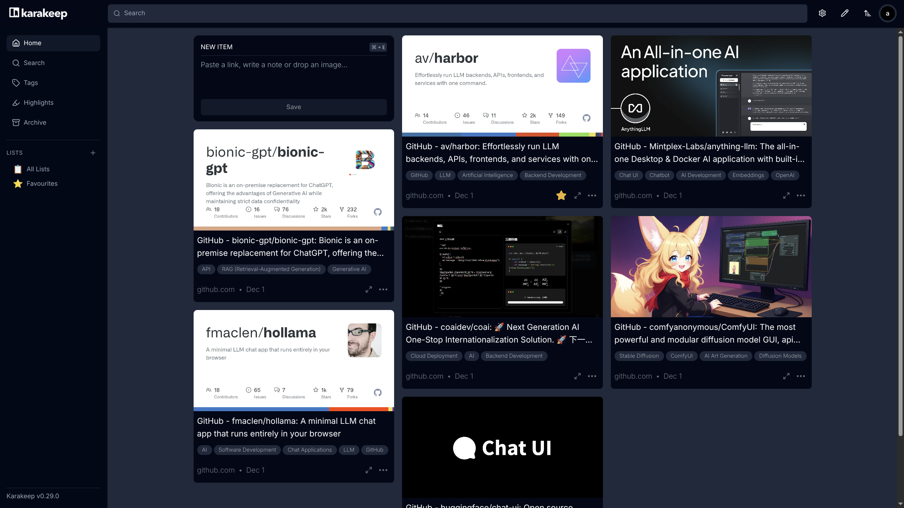

### [Karakeep](https://github.com/karakeep-app/karakeep)

> Handle: `karakeep`<br/>
> URL: [http://localhost:34541](http://localhost:34541)



Karakeep is an open-source, self-hosted bookmark manager with AI-powered automatic tagging. Save and organize links, notes, images, and PDFs with full-text search powered by Meilisearch.

#### Starting

```bash
# Start the service
harbor up karakeep

# Open in browser
harbor open karakeep

# With Ollama for AI tagging
harbor up karakeep ollama
```

#### Configuration

##### Environment Variables

The following options can be set via [`harbor config`](./3.-Harbor-CLI-Reference.md#harbor-config) or in `karakeep/override.env`:

```bash
# Host port (default: 34541)
HARBOR_KARAKEEP_HOST_PORT

# Docker image settings
HARBOR_KARAKEEP_IMAGE      # default: ghcr.io/karakeep-app/karakeep
HARBOR_KARAKEEP_VERSION    # default: release (or pin to specific version like 0.29.0)

# Chrome container for web crawling
HARBOR_KARAKEEP_CHROME_IMAGE   # default: gcr.io/zenika-hub/alpine-chrome
HARBOR_KARAKEEP_CHROME_VERSION # default: 124

# Meilisearch for full-text search
HARBOR_KARAKEEP_MEILI_IMAGE    # default: getmeili/meilisearch
HARBOR_KARAKEEP_MEILI_VERSION  # default: v1.13.3

# Security keys (change these!)
HARBOR_KARAKEEP_NEXTAUTH_SECRET   # JWT signing secret
HARBOR_KARAKEEP_MEILI_MASTER_KEY  # Meilisearch authentication key

# Data directory
HARBOR_KARAKEEP_WORKSPACE  # default: ./karakeep/data
```

##### AI Tagging with Ollama

When running with Ollama, Karakeep will automatically use it for AI-powered tagging:

```bash
harbor up karakeep ollama
```

You can configure the inference models in `karakeep/override.env`:

```bash
# Text model for tagging (must support chat completion)
INFERENCE_TEXT_MODEL=qwen3-vl:8b
# Image model for visual content (must support vision)
INFERENCE_IMAGE_MODEL=qwen3-vl:8b
```

Or set them via Harbor CLI:

```bash
harbor config set karakeep.inference_text_model qwen3-vl:8b
harbor config set karakeep.inference_image_model qwen3-vl:8b
```

##### AI Tagging with OpenAI

Set your OpenAI API key via Harbor:

```bash
harbor config set openai.key <your-api-key>
```

##### Additional Configuration

For more configuration options (OCR, crawling, webhooks, etc.), see the [Karakeep Configuration Docs](https://docs.karakeep.app/configuration).

#### Volumes

- `./karakeep/data` - Bookmark data, assets, and database
- `./karakeep/data/meilisearch` - Search index data
