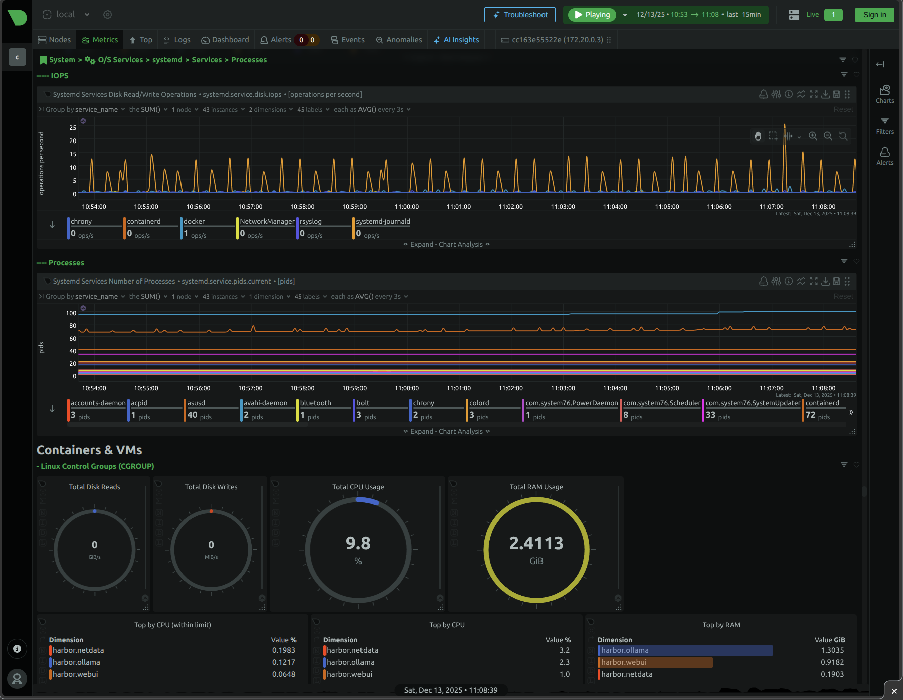

### [Netdata](https://github.com/netdata/netdata)

> Handle: `netdata`<br/>
> URL: [http://localhost:34551](http://localhost:34551)



Real-time infrastructure monitoring and troubleshooting. Netdata collects thousands of metrics from systems, hardware, containers, and applications with zero configuration. It provides beautiful, interactive, real-time dashboards with per-second granularity.

## Starting

```bash
# [Optional] Pre-pull the Netdata image
harbor pull netdata

# Start the service
harbor up netdata --open
```

## Configuration

### Environment Variables

Following options can be set via [`harbor config`](./3.-Harbor-CLI-Reference.md#harbor-config):

```bash
# Port for Netdata web UI
HARBOR_NETDATA_HOST_PORT           34551

# Docker image
HARBOR_NETDATA_IMAGE               netdata/netdata
HARBOR_NETDATA_VERSION             stable

# Workspace for persistent data
HARBOR_NETDATA_WORKSPACE           ./netdata
```

### Volumes

Netdata requires extensive access to host resources for monitoring:

| Path | Purpose |
|------|---------|
| `./netdata/config` | Netdata configuration files |
| `./netdata/lib` | Persistent library data |
| `./netdata/cache` | Cache for metrics |
| `/` | Host filesystem (read-only, for disk monitoring) |
| `/proc` | Process information |
| `/sys` | System information |
| `/var/log` | Log files |
| `/var/run/docker.sock` | Docker container monitoring |

### Security Notes

Netdata runs with elevated privileges for comprehensive monitoring:

- **`pid: host`** - Access to host PID namespace for process monitoring
- **`SYS_PTRACE`** - Required for process tracing
- **`SYS_ADMIN`** - Required for cgroup and network monitoring
- **`apparmor:unconfined`** - Disabled AppArmor for full access

These capabilities are required for Netdata's core functionality. If you need a more restricted setup, consider running Netdata directly on the host instead.

## Customizing Netdata

After starting the service, you can edit the configuration by:

1) Placing custom config files in `$(harbor home)/netdata/config/netdata.conf`
2) Using built-in `edit-config` script inside the container:

```bash
# Access the container
harbor exec netdata bash

# Edit configuration
cd /etc/netdata
./edit-config netdata.conf

# After editing, restart the service
harbor restart netdata
```

## Docker Tags

| Tag | Description |
|-----|-------------|
| `stable` | Most recently published stable build |
| `edge` | Most recently published nightly build |
| `latest` | Most recent build (stable or nightly) |
| `vX.Y.Z` | Specific version (e.g., v1.40.0) |
