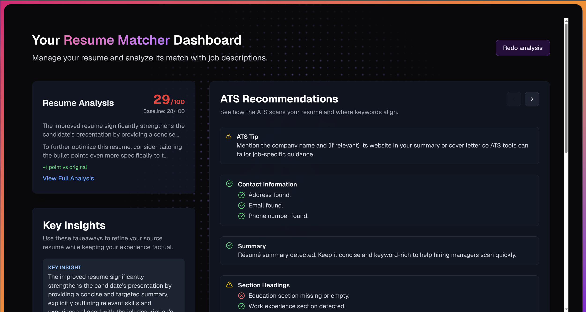

### [Resume Matcher](https://github.com/srbhr/Resume-Matcher)

> Handle: `resume-matcher`<br/>
> URL: [http://localhost:34561](http://localhost:34561)



Resume Matcher is an AI-powered tool for comparing resumes against job descriptions. It analyzes resumes in PDF/DOCX format, extracts keywords, compares them with job descriptions, and provides improvement suggestions using local LLMs via Ollama.

**Key Features:**
- **Resume Analysis**: Upload resumes in PDF or DOCX format for automated parsing
- **Keyword Extraction**: Identifies key skills and qualifications from resumes and job descriptions
- **Match Scoring**: Compares resume content against job requirements
- **AI Suggestions**: Provides improvement recommendations using local LLMs
- **Local Processing**: All data stays on your machine with Ollama-powered inference

**Architecture:**
- FastAPI backend (Python 3.12, uv package manager) on port 34562
- Next.js frontend (Node.js 18) on port 34561
- SQLite database for persistent storage
- Ollama integration for LLM and embeddings

## Starting

```bash
# Start Resume Matcher with Ollama
harbor up resume-matcher ollama

# Open in browser
harbor open resume-matcher
```

The first startup will:
1. Build both frontend and backend containers
2. Pull the required Ollama models (`gemma3:4b` for LLM, `bge-m3` for embeddings)

See [troubleshooting guide](./1.-Harbor-User-Guide#troubleshooting) if you encounter any issues.

## Configuration

### Environment Variables

Following options can be set via [`harbor config`](./3.-Harbor-CLI-Reference.md#harbor-config):

```bash
# Frontend UI port
HARBOR_RESUME_MATCHER_HOST_PORT            34561

# Backend API port
HARBOR_RESUME_MATCHER_BACKEND_HOST_PORT    34562

# Git reference for building
HARBOR_RESUME_MATCHER_GIT_REF              "https://github.com/srbhr/Resume-Matcher.git#main"

# Workspace directory for data persistence
HARBOR_RESUME_MATCHER_WORKSPACE            "./resume-matcher"

# Session secret (change in production)
HARBOR_RESUME_MATCHER_SESSION_SECRET       "harbor_resume_matcher_secret_change_me"

# LLM configuration
HARBOR_RESUME_MATCHER_LLM_PROVIDER         "ollama"
HARBOR_RESUME_MATCHER_LLM_MODEL            "gemma3:4b"

# Embedding configuration
HARBOR_RESUME_MATCHER_EMBEDDING_PROVIDER   "ollama"
HARBOR_RESUME_MATCHER_EMBEDDING_MODEL      "bge-m3:latest"
```

### Volumes

Resume Matcher persists data in the following directories:
- `resume-matcher/data/` - Uploaded resumes, job descriptions, and SQLite database

### Ollama Integration

When running with Ollama, Harbor automatically configures the connection between Resume Matcher and Ollama. Ensure the required models are available:

```bash
# Pull the LLM model
harbor pull gemma3:4b
harbor ollama pull gemma3:4b

# Pull the embedding model
harbor ollama pull bge-m3:latest
```

You can customize the models via configuration:

```bash
# Use a different LLM
harbor config set resume-matcher.llm.model llama3.2:3b

# Use a different embedding model
harbor config set resume-matcher.embedding.model nomic-embed-text:latest
```
