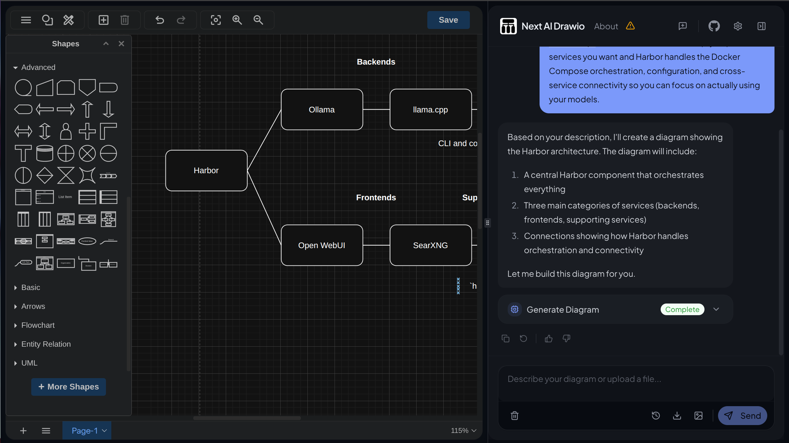
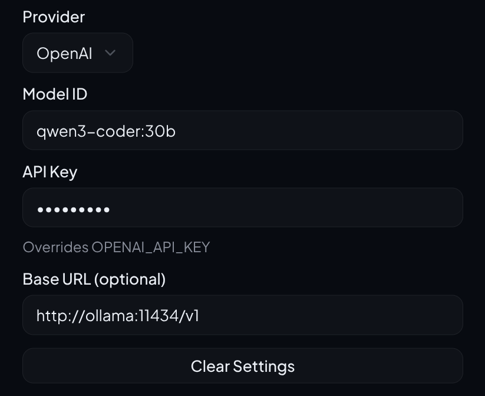

### [Next AI Draw.io](https://github.com/DayuanJiang/next-ai-draw-io)

> Handle: `drawio`<br/>
> URL: [http://localhost:34571](http://localhost:34571)



Next AI Draw.io is an AI-powered diagram creation tool that integrates with draw.io. It lets you create, modify, and enhance diagrams through natural language commands and AI-assisted visualization.

**Key Features:**

- **Natural Language Diagrams**: Create diagrams by describing them in plain English
- **Image Replication**: Upload an image and let AI replicate it as an editable diagram
- **File Upload Support**: Import PDFs and text files to generate diagrams from content
- **Cloud Architecture**: Create AWS, GCP, and Azure architecture diagrams with AI assistance
- **Multi-Provider AI**: Works with Ollama, OpenAI, Anthropic, Google, and DeepSeek
- **Animated Connectors**: Add animated connections between diagram elements

## Starting

```bash
# [Optional] Pull the image
harbor pull drawio

# Start with Ollama (default configuration)
harbor up drawio ollama

# Open in browser
harbor open drawio
```

- When running with Ollama, Harbor automatically configures the connection via `compose.x.drawio.ollama.yml`.
  - Despite Harbor sets configuration variables as required per service documentation, they might still reset in the UI, in that instance, please re-enter them.<br/>
  
- ⚠️ The smallest model that was able to generate simple diagrams was `qwen3:30b`

## Configuration

### Environment Variables

Following options can be set via [`harbor config`](./3.-Harbor-CLI-Reference.md#harbor-config):

```bash
# Main UI port
HARBOR_DRAWIO_HOST_PORT          34571

# Docker image
HARBOR_DRAWIO_IMAGE              ghcr.io/dayuanjiang/next-ai-draw-io
HARBOR_DRAWIO_VERSION            latest

# AI provider: ollama, openai, anthropic, google, deepseek
HARBOR_DRAWIO_AI_PROVIDER        ollama

# Model to use for diagram generation
HARBOR_DRAWIO_AI_MODEL           gemma3:4b

# Temperature for AI responses (leave empty for default)
HARBOR_DRAWIO_TEMPERATURE

# Optional access code to protect the UI
HARBOR_DRAWIO_ACCESS_CODE
```

### API Keys

Drawio uses the common Harbor API keys for external providers:

```bash
# OpenAI
HARBOR_OPENAI_KEY

# Anthropic
HARBOR_ANTHROPIC_KEY

# Google
HARBOR_GOOGLE_KEY

# DeepSeek
HARBOR_DEEPSEEK_API_KEY
```

Set these globally to use across multiple Harbor services.

### Using with Harbor Ollama

The default configuration uses Ollama with `llama3.2:latest`. When started alongside Ollama, Harbor automatically configures the Ollama URL:

```bash
# Start with Ollama
harbor up drawio ollama

# Pull the model if needed
harbor ollama pull llama3.2:latest
```

To use a different model:

```bash
harbor config set drawio.ai.model mistral:latest
```

### Using with OpenAI

```bash
# Set provider and common API key
harbor config set drawio.ai.provider openai
harbor config set openai.key sk-your-api-key

# Optionally set a specific model
harbor config set drawio.ai.model gpt-4o

# Start without Ollama
harbor up drawio
```

### Using with Anthropic

```bash
# Set provider and common API key
harbor config set drawio.ai.provider anthropic
harbor config set anthropic.key sk-ant-your-api-key

# Optionally set a specific model
harbor config set drawio.ai.model claude-sonnet-4-20250514

# Start
harbor up drawio
```

## Notes

**Model Recommendations:**

- For general diagrams: `llama3.2:latest` or similar models work well
- For cloud architecture diagrams (AWS, GCP, Azure): Claude Sonnet models are recommended for better accuracy with complex infrastructure patterns

**Access Protection:**

- Set `HARBOR_DRAWIO_ACCESS_CODE` to require a code before accessing the UI
- Useful when exposing the service externally
