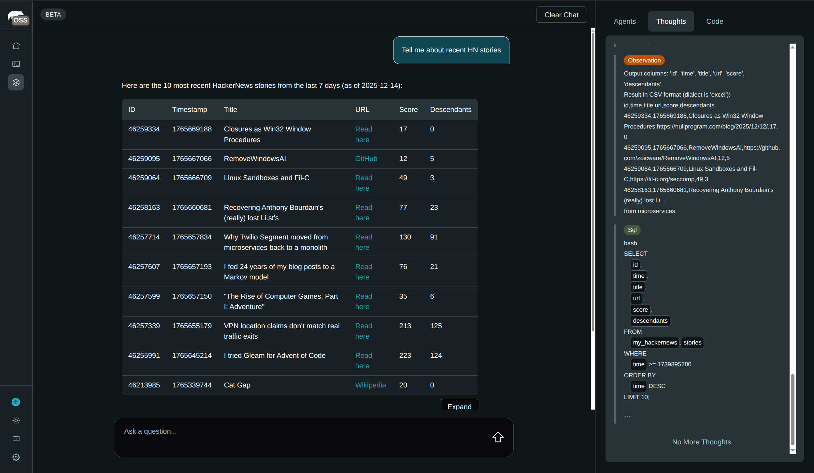

### [MindsDB](https://github.com/mindsdb/mindsdb)

> Handle: `mindsdb`<br/>
> URL: [http://localhost:34581](http://localhost:34581)



MindsDB is an AI platform that enables querying AI models using SQL. Harbor integrates MindsDB with local LLM backends (Ollama, llama.cpp, vLLM) so you can build AI-powered applications without external API dependencies.

## Starting

```bash
# Start MindsDB with Ollama
harbor up mindsdb ollama

# Or with other backends
harbor up mindsdb llamacpp
harbor up mindsdb vllm
```

## Configuration

Following options can be set via [`harbor config`](./3.-Harbor-CLI-Reference.md#harbor-config):

```bash
# Ports
HARBOR_MINDSDB_HOST_PORT           34581
HARBOR_MINDSDB_MYSQL_HOST_PORT     34582

# Docker image
HARBOR_MINDSDB_IMAGE               mindsdb/mindsdb
HARBOR_MINDSDB_VERSION             latest

# Persistent storage
HARBOR_MINDSDB_WORKSPACE           ./mindsdb/data

# APIs to expose (http, mysql, postgres)
HARBOR_MINDSDB_APIS                http,mysql

# Authentication (optional)
HARBOR_MINDSDB_USERNAME            ""
HARBOR_MINDSDB_PASSWORD            ""

# Default Ollama model for LLM() function
HARBOR_MINDSDB_OLLAMA_MODEL        llama3.1:8b
```

## LLM Integration

When running MindsDB with a Harbor LLM backend, the `LLM()` function is automatically configured:

| Backend | Base URL | Model | API Key |
|---------|----------|-------|---------|
| Ollama | `http://ollama:11434/v1` | `HARBOR_MINDSDB_OLLAMA_MODEL` | `sk-ollama` |
| llama.cpp | `http://llamacpp:8080/v1` | (loaded model) | `sk-llamacpp` |
| vLLM | `http://vllm:8000/v1` | (loaded model) | `sk-vllm` |

### Using LLM() Function

```sql
-- Text generation
SELECT LLM('What is the capital of France?');

-- Process data
SELECT LLM('Summarize: ' || content) FROM articles;
```

### Creating Agents

Agents query data sources using natural language. Specify the Harbor backend configuration:

```sql
CREATE AGENT mindsdb.my_agent
USING
    model = {
        "provider": "ollama",
        "model_name": "llama3.1:8b",
        "api_key": "sk-ollama",
        "base_url": "http://ollama:11434"
    },
    data = {
        "tables": ["my_database.my_table"]
    };
```

### Creating ML Engines

Create ML engines to use Harbor backends in models:

```sql
-- Ollama engine
CREATE ML_ENGINE ollama_engine
FROM ollama
USING
    ollama_serve_url = 'http://ollama:11434';

-- llama.cpp (OpenAI-compatible)
CREATE ML_ENGINE llamacpp_engine
FROM openai
USING
    openai_api_base = 'http://llamacpp:8080/v1',
    openai_api_key = 'sk-llamacpp';

-- vLLM (OpenAI-compatible)
CREATE ML_ENGINE vllm_engine
FROM openai
USING
    openai_api_base = 'http://vllm:8000/v1',
    openai_api_key = 'sk-vllm';
```

> **Note**: The `LLM()` function configuration is separate from the "Default MindsDB Configuration" UI settings. UI settings (Settings → Models) are for agents/knowledge bases and persist in `./mindsdb/data`.

## Connecting to Harbor Services

Use Docker network hostnames to connect MindsDB to other Harbor services:

```sql
-- Connect to a database running in Harbor
CREATE DATABASE harbor_postgres
WITH ENGINE = 'postgres',
PARAMETERS = {
    "host": "postgres",
    "port": "5432",
    "database": "mydb",
    "user": "user",
    "password": "password"
};
```

## MySQL API

Connect to MindsDB using MySQL clients for BI tools and integrations:

```bash
mysql -h 127.0.0.1 -P 34582
```
