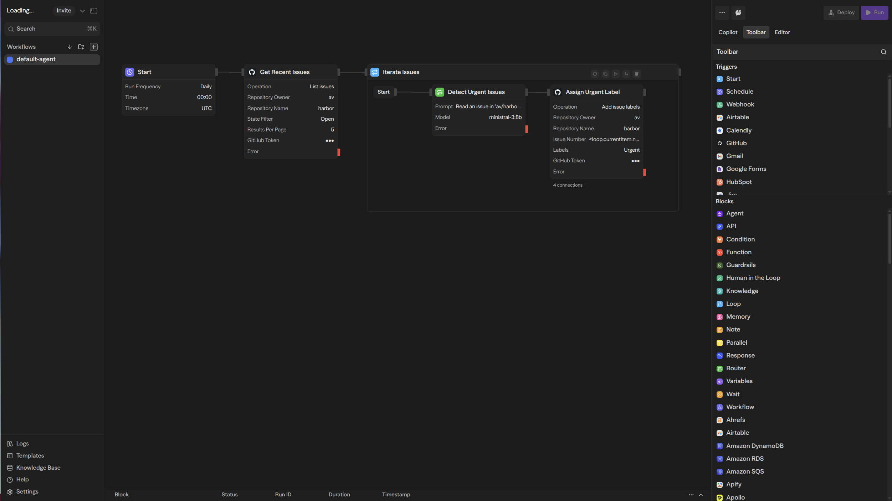

### [Sim Studio](https://github.com/simstudioai/sim)

> Handle: `sim`<br/>
> URL: [http://localhost:34591](http://localhost:34591)



Sim Studio is an open-source platform for building and deploying AI agent workflows. It provides a visual canvas editor where you can connect agents, tools, and blocks to create complex AI pipelines. The platform includes an AI Copilot that helps generate nodes and fix errors, plus support for vector databases enabling document uploads and RAG capabilities.

**Key Features:**
- **Visual Canvas Editor**: Drag-and-drop interface to connect agents, tools, and blocks
- **Vector Database Support**: Upload documents and enable RAG capabilities with pgvector
- **Real-time WebSocket**: Live updates and streaming responses
- **Extensible Blocks**: Connect various AI providers and tools

## Starting

```bash
# Start Sim Studio
harbor up sim

# With Ollama for local models
harbor up sim ollama
```

- Open the Sim Studio interface at [http://localhost:34591](http://localhost:34591)
- On first start, you'll need to create an account
- Harbor connects Sim Studio to Ollama automatically if both are running together, so local Ollama's models should be visible in LLM nodes in Sim Studio
  - ⚠️ Unfortunately Sim Studio Copilot (to help authoring workflows) requires their cloud service and cannot be self-hosted

## Configuration

### Environment Variables

Following options can be set via [`harbor config`](./3.-Harbor-CLI-Reference.md#harbor-config):

```bash
# Main application port
HARBOR_SIM_HOST_PORT               34591

# WebSocket server port
HARBOR_SIM_REALTIME_HOST_PORT      34592

# PostgreSQL database port
HARBOR_SIM_DB_HOST_PORT            34593

# Workspace directory for persistent data
HARBOR_SIM_WORKSPACE               ./sim

# Main application image
HARBOR_SIM_IMAGE                   ghcr.io/simstudioai/simstudio
HARBOR_SIM_VERSION                 latest

# WebSocket server image
HARBOR_SIM_REALTIME_IMAGE          ghcr.io/simstudioai/realtime

# Database migrations image
HARBOR_SIM_MIGRATIONS_IMAGE        ghcr.io/simstudioai/migrations

# Database configuration
HARBOR_SIM_DB_IMAGE                pgvector/pgvector
HARBOR_SIM_DB_VERSION              pg17
HARBOR_SIM_DB_NAME                 simstudio
HARBOR_SIM_DB_USER                 postgres
HARBOR_SIM_DB_PASSWORD             harbor_sim_postgres_password

# Security (auto-generated if not set)
HARBOR_SIM_AUTH_SECRET             # Authentication secret (32 characters)
HARBOR_SIM_ENCRYPTION_KEY          # Encryption key (32 characters)

# Ollama integration (auto-configured when running with Ollama)
HARBOR_SIM_OLLAMA_URL              # Ollama API URL for local models
```

### Volumes

Sim Studio persists data in the following directories:
- `sim/db/` - PostgreSQL database with pgvector

## Integration with Harbor

Sim Studio can integrate with other Harbor services:
- Use Ollama for local model inference in agent workflows
- Access other Harbor LLM backends via API calls
- Connect to Harbor services via internal network

When running Sim Studio together with Ollama, Harbor automatically configures the connection:

```bash
harbor up sim ollama
```

This sets `HARBOR_SIM_OLLAMA_URL` to point to the Ollama service.

## Troubleshooting

### Check Logs

```bash
# All services
harbor logs sim

# Specific service
docker logs harbor.sim
docker logs harbor.sim-realtime
```

### Database Issues

If migrations fail or database is corrupted:

```bash
# Stop services
harbor down sim

# Remove database (WARNING: destroys all data)
rm -rf sim/db

# Restart
harbor up sim
```

## Links

- [GitHub Repository](https://github.com/simstudioai/sim)
- [Website](https://sim.ai)
