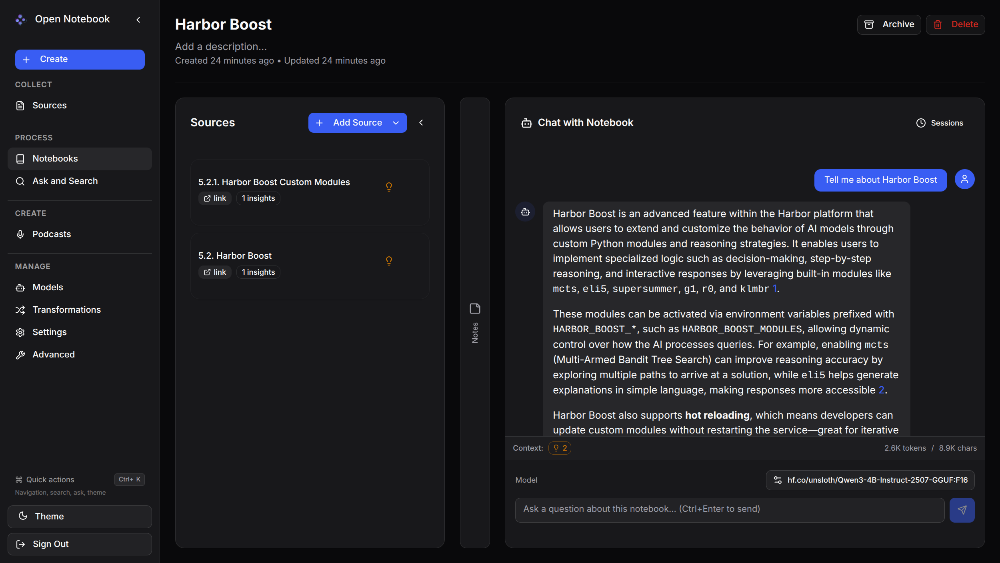

### [Open Notebook](https://github.com/lfnovo/open-notebook)

> Handle: `opennotebook`<br/>
> URL: [http://localhost:34611](http://localhost:34611)



Open Notebook is an AI-powered research and note-taking platform that helps you organize knowledge with intelligent assistance. It features multi-provider LLM support (OpenAI, Anthropic, Google, Groq, Ollama), automatic content extraction, RAG-based search, podcast generation, and comprehensive content transformations.

#### Starting

```bash
# Pull the image
harbor pull opennotebook

# Start the service
harbor up opennotebook

# Open in browser
harbor open opennotebook
```

- **Model Configuration Required**: Open Notebook does not auto-configure models. After first start, you must manually add models through the UI (Settings → Models)
- When started with `ollama`, the integration is automatic via `OLLAMA_API_BASE` environment variable. Use `harbor ollama list` to see available models
- Can use Harbor's shared keys (`HARBOR_OPENAI_KEY`, `HARBOR_ANTHROPIC_KEY`, etc.) for cloud providers
- Open Notebook really benefits from large context models (128k+ tokens) for best results

#### Configuration

##### Environment Variables

The following options can be set via [`harbor config`](./3.-Harbor-CLI-Reference.md#harbor-config) or in `opennotebook/override.env`:

```bash
# Main UI port
HARBOR_OPENNOTEBOOK_HOST_PORT         34611

# API backend port
HARBOR_OPENNOTEBOOK_API_PORT          34612

# Docker image settings
HARBOR_OPENNOTEBOOK_IMAGE             lfnovo/open_notebook
HARBOR_OPENNOTEBOOK_VERSION           v1-latest-single

# Data directory
HARBOR_OPENNOTEBOOK_WORKSPACE         ./opennotebook

# Database Configuration (internal SurrealDB)
HARBOR_OPENNOTEBOOK_SURREAL_URL       ws://localhost:8000/rpc
HARBOR_OPENNOTEBOOK_SURREAL_USER      root
HARBOR_OPENNOTEBOOK_SURREAL_PASSWORD  root
HARBOR_OPENNOTEBOOK_SURREAL_NAMESPACE open_notebook
HARBOR_OPENNOTEBOOK_SURREAL_DATABASE  production

# API URL (for remote access, leave empty for auto-detection)
HARBOR_OPENNOTEBOOK_API_URL

# Optional: Password protection for public deployments
HARBOR_OPENNOTEBOOK_PASSWORD
```

##### AI Provider Configuration

Open Notebook requires at least one AI provider to be configured. It can use Harbor's shared API keys:

```bash
# OpenAI (recommended for beginners)
harbor config set openai.key <your-api-key>

# Anthropic
harbor config set anthropic.key <your-api-key>

# Google
harbor config set google.key <your-api-key>

# Groq
harbor config set groq.key <your-api-key>
```

These are automatically passed to Open Notebook via the compose file using shared Harbor environment variables:
- `HARBOR_OPENAI_KEY` → `OPENAI_API_KEY`
- `HARBOR_ANTHROPIC_KEY` → `ANTHROPIC_API_KEY`
- `HARBOR_GOOGLE_KEY` → `GOOGLE_API_KEY`
- `HARBOR_GROQ_KEY` → `GROQ_API_KEY`

##### Integration with Harbor's Ollama

When running with Ollama, Open Notebook can use local models for complete privacy:

```bash
harbor up opennotebook ollama
```

Ollama integration is automatically configured when started together. Configure models in Open Notebook:

1. Open [http://localhost:34611](http://localhost:34611)
2. Navigate to **Settings → Models** (or **Manage → Models** from sidebar)
3. Add Language Model:
   - Click **"Add Model"** under Language Models
   - Provider: Select **"Ollama"**
   - Model Name: `llama3.1:8b` (or any model from `harbor ollama list`)
4. Add Embedding Model (required for search):
   - Click **"Add Model"** under Embedding Models
   - Provider: Select **"Ollama"**
   - Model Name: `mxbai-embed-large:latest` (Harbor's default)
5. Set Default Models:
   - Chat Model: Select your added Ollama language model
   - Transformation Model: Same as Chat Model
   - Embedding Model: Select `mxbai-embed-large:latest`

**Available Harbor Ollama Models**: Run `harbor ollama list` to see all available models.

##### Remote Access Configuration

If accessing Open Notebook from a different computer than where Harbor runs:

```bash
# Set the API URL to match your server's address
harbor config set opennotebook.api_url http://YOUR_SERVER_IP:34612
```

Replace `YOUR_SERVER_IP` with your server's actual IP address (e.g., `http://192.168.1.100:34612`).

#### Features

- **Multiple AI Providers**: OpenAI, Anthropic, Google, Groq, Ollama
- **Content Support**: Links, PDFs, text files, YouTube videos, podcasts
- **Research Tools**:
  - AI-powered note generation
  - Chat with your content (RAG)
  - Full-text and vector search
  - Content transformations
- **Media Features**:
  - Generate multi-speaker podcasts from research
  - Text-to-speech with multiple voices
  - Speech-to-text transcription
- **Organization**: Notebooks, sources, notes, and tags

#### Volumes

- `./opennotebook/data` - Notebooks, sources, notes, and uploaded content
- `./opennotebook/db` - SurrealDB database files (internal)

#### First Steps

After starting Open Notebook:

1. **Configure AI Models**: Click Settings → Models and set up your default models
2. **Create a Notebook**: Click "Create New Notebook" to organize your research
3. **Add Sources**: Add links, files, or YouTube videos to your notebook
4. **Generate Notes**: Use AI to create summaries and insights
5. **Chat**: Ask questions about your content with RAG-powered chat

#### Troubleshooting

**"Unable to connect to server" error:**
- If accessing remotely, ensure `HARBOR_OPENNOTEBOOK_API_URL` is set to your server's IP
- Verify both ports (34611 and 34612) are accessible
- Check with: `harbor logs opennotebook`

**API key errors:**
- Verify at least one AI provider key is set
- Check keys are valid and have sufficient credits

**Out of memory:**
- Open Notebook needs at least 2GB RAM for the embedded database

For more help, see the [Open Notebook Documentation](https://github.com/lfnovo/open-notebook/tree/main/docs) or [join their Discord](https://discord.gg/37XJPXfz2w).
