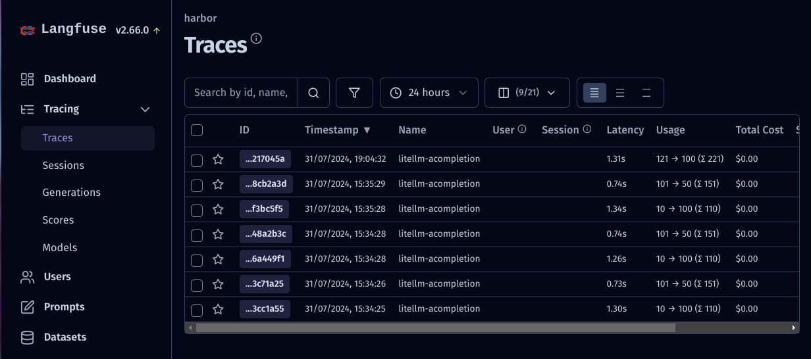

### [langfuse](https://github.com/langfuse/langfuse)

> Handle: `langfuse`<br/>
> URL: [http://localhost:33881](http://localhost:33881)<br/>



🪢 Open source LLM engineering platform.

### Starting

Spin up with:
```bash
# [Optional] Pull the langfuse images
# ahead of starting the service
harbor pull langfuse

# Start the service
harbor up langfuse
```

### Usage

The value is in connecting Langfuse to the other services with OpenAI-compatible APIs, such as `litellm`. In order to do that - you should setup public/secret keys (unforrunately no way to pre-configure on Harbor's end).

#### Configuring Tracing

When langfuse is running, open its UI with:
```bash
harbor open langfuse
```
You'll land on the Project's dashboard - open the "Settings" and create new API keys.

Grab the values from the opened modal and pass them back to the Harbor:

```bash
harbor config set langfuse.secret_key '<secret key>'
harbor config set langfuse.public_key '<public key>'
```

### Configuration

See official [environment variables configuration](https://langfuse.com/self-hosting/configuration) guide. To set them, see Harbor's [environment configuration guide](./1.-Harbor-User-Guide#environment-variables).

```bash
# Example: get/set env vars via Harbor CLI

# Get
harbor env langfuse LANGFUSE_READ_FROM_POSTGRES_ONLY
# Set
harbor env langfuse LANGFUSE_READ_FROM_POSTGRES_ONLY false
```