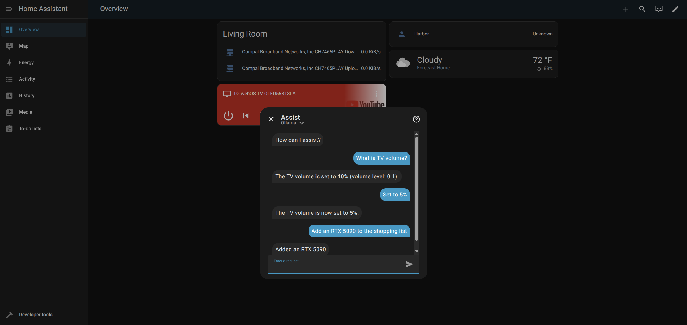

### [Home Assistant](https://github.com/home-assistant/core)

> Handle: `homeassistant`<br/>
> URL: [http://localhost:8123](http://localhost:8123)



Home Assistant is a powerful open source home automation platform that puts local control and privacy first. It can integrate and control thousands of smart home devices from hundreds of different brands, enabling automation, monitoring, and voice control of your entire home. Unlike cloud-dependent solutions, Home Assistant runs entirely on your local network.

#### Starting

```bash
# Pull the image
harbor pull homeassistant

# Start the service
harbor up homeassistant

# Open in browser
harbor open homeassistant
```

**First-time setup:**

- On first start, Home Assistant will initialize and create its configuration
- Initial setup takes 1-2 minutes as it prepares the database and discovers network devices
- Navigate to [http://localhost:8123](http://localhost:8123) to complete the [onboarding wizard](https://www.home-assistant.io/getting-started/onboarding/)
- Create your admin account and configure your home details
- Due to how Home Assistant works, Ollama integration requires manual setup after onboarding (see [Integration with Other Harbor Services](#integration-with-other-harbor-services) section below)

#### Configuration

##### Environment Variables

The following options can be set via [`harbor config`](./3.-Harbor-CLI-Reference.md#harbor-config) or in `homeassistant/override.env`:

```bash
# Main web UI port (Note: port shown for reference, service uses host networking)
HARBOR_HOMEASSISTANT_HOST_PORT        34621

# Docker image settings
HARBOR_HOMEASSISTANT_IMAGE            ghcr.io/home-assistant/home-assistant
HARBOR_HOMEASSISTANT_VERSION          stable

# Configuration directory
HARBOR_HOMEASSISTANT_WORKSPACE        ./homeassistant

# Timezone configuration (affects automations and logs)
HARBOR_HOMEASSISTANT_TIMEZONE         America/Los_Angeles
```

**Important: Timezone Configuration**

Home Assistant requires a valid timezone to function correctly. Set your timezone using the [TZ database name](https://en.wikipedia.org/wiki/List_of_tz_database_time_zones):

```bash
harbor config set homeassistant.timezone "America/New_York"
harbor config set homeassistant.timezone "Europe/London"
harbor config set homeassistant.timezone "Asia/Tokyo"
```

This affects:

- Automation scheduling
- Log timestamps
- Energy dashboard
- Calendar integrations

##### Manual Configuration

Home Assistant's configuration can be customized by editing files in `$(harbor home)/homeassistant/config/`:

- `configuration.yaml` - Main configuration file
- `automations.yaml` - Automation definitions
- `scripts.yaml` - Script definitions
- `scenes.yaml` - Scene definitions
- `secrets.yaml` - Sensitive data storage

After editing configuration files, restart the service:

```bash
harbor restart homeassistant
```

#### Device Discovery

Home Assistant automatically discovers compatible devices on your network using:

- **mDNS/Zeroconf**: For network-attached devices
- **SSDP**: For UPnP devices
- **Bluetooth**: For BLE devices (requires host Bluetooth access)
- **USB**: For Zigbee/Z-Wave controllers (requires device passthrough)

**To connect USB devices** (Zigbee, Z-Wave, etc.), you'll need to modify the compose file to add device mappings. For example:

```yaml
# In compose.homeassistant.yml, add after volumes:
devices:
  - /dev/ttyUSB0:/dev/ttyUSB0 # Zigbee/Z-Wave USB stick
  - /dev/ttyACM0:/dev/ttyACM0 # Alternative USB device
```

Find your device path with: `ls -la /dev/tty*`

#### Integration with Other Harbor Services

While Home Assistant uses host networking, you can still integrate it with other Harbor services using `localhost` or your host's IP address:

**Example: Using Harbor's Ollama for AI features**

Home Assistant supports conversation AI via the [Ollama integration](https://www.home-assistant.io/integrations/ollama/):

1. Start both services: `harbor up homeassistant ollama`
2. In Home Assistant, go to **Settings → Devices & Services → Add Integration**
3. Search for "Ollama" and select it
4. Configure with:
   - URL: `http://localhost:33821` (Harbor's Ollama port)
   - Model: Use one from `harbor ollama list` (e.g., `llama3.2:3b`)
5. Create a conversation agent in Home Assistant

**Example: Text-to-Speech with Harbor's TTS**

Home Assistant can use external TTS services via the [REST TTS platform](https://www.home-assistant.io/integrations/tts/):

1. Start TTS service: `harbor up tts`
2. Edit `homeassistant/config/configuration.yaml`:

```yaml
tts:
  - platform: rest
    resource: http://localhost:33861/api/tts
```

#### Volumes

- `./homeassistant/config` - Configuration files, automations, scripts
- `/etc/localtime` - System timezone (read-only, mounted from host)

**Backup Considerations:**

- Back up the entire `homeassistant/config` directory regularly
- Contains all configurations, history, and user data
- Consider using Home Assistant's built-in backup feature via UI

#### Troubleshooting

**Cannot access Home Assistant at localhost:8123:**

- Check service is running: `harbor ps homeassistant`
- View logs: `harbor logs homeassistant`
- Verify port 8123 is not in use: `lsof -i :8123` (Linux/macOS)
- Wait for initialization to complete (1-2 minutes on first start)

**Device discovery not working:**

- Ensure `network_mode: host` is set in the compose file
- Check your firewall allows mDNS (port 5353)
- Some devices require manual integration configuration

**Bluetooth devices not detected:**

- By default, Bluetooth management is disabled (see "Advanced: Enabling Bluetooth Support")
- To enable: Add NET_ADMIN and NET_RAW capabilities to compose file
- Check host Bluetooth is working: `bluetoothctl list`
- May require host Bluetooth service to be running

**Configuration errors after editing YAML:**

- Check configuration: Go to **Developer Tools → YAML → Check Configuration**
- View detailed errors in: **Settings → System → Logs**
- Restore from automatic backup in `homeassistant/config/.storage/backups/`

**Permission errors on Linux:**

- Ensure the homeassistant directory is writable:
  ```bash
  chmod -R 755 homeassistant/config
  ```
- Check file ownership matches your user

**Cannot connect USB devices:**

- Add device mapping to compose file (see Device Discovery section)
- Check device permissions: `ls -la /dev/ttyUSB*`
- May need to add user to `dialout` group: `sudo usermod -a -G dialout $USER`

For more help, see the [Home Assistant Documentation](https://www.home-assistant.io/docs/) or join the [Community Forum](https://community.home-assistant.io/).
