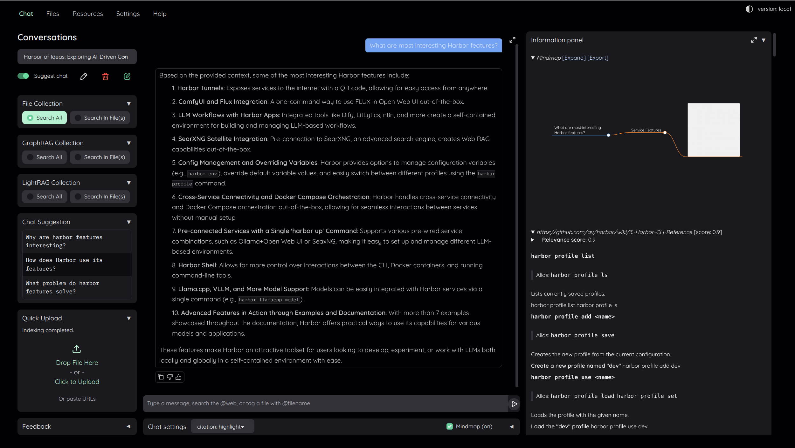

### [Kotaemon](https://github.com/Cinnamon/kotaemon)

> Handle: `kotaemon`<br/>
> URL: [http://localhost:34641](http://localhost:34641)



Kotaemon is a RAG UI for chatting with your documents, built with Gradio.

## Starting

```bash
# Pull the images
harbor pull kotaemon

# Start Kotaemon
harbor up kotaemon --open
```

- Default credentials: `admin` / `admin`

## Configuration

### Environment Variables

Following options can be set via [`harbor config`](./3.-Harbor-CLI-Reference.md#harbor-config):

```bash
# Main UI port
HARBOR_KOTAEMON_HOST_PORT                34641

# Image
HARBOR_KOTAEMON_IMAGE                    ghcr.io/cinnamon/kotaemon
HARBOR_KOTAEMON_VERSION                  main-full

# Persistent workspace directory
HARBOR_KOTAEMON_WORKSPACE                ./kotaemon/ktem_app_data

# Local model defaults (used when Ollama is enabled)
HARBOR_KOTAEMON_LOCAL_MODEL              llama3.2:3b
HARBOR_KOTAEMON_LOCAL_MODEL_EMBEDDINGS   mxbai-embed-large:latest
```

### Volumes

Kotaemon persists application data in:
- `kotaemon/ktem_app_data/`

## Ollama integration

If the `ollama` service is enabled, Harbor injects `KH_OLLAMA_URL` and the local model settings (`LOCAL_MODEL*`) automatically via `compose.x.kotaemon.ollama.yml`.

```bash
harbor up ollama kotaemon --open
```

## Troubleshooting

```bash
harbor logs kotaemon
```

## Links

- [GitHub Repository](https://github.com/Cinnamon/kotaemon)
