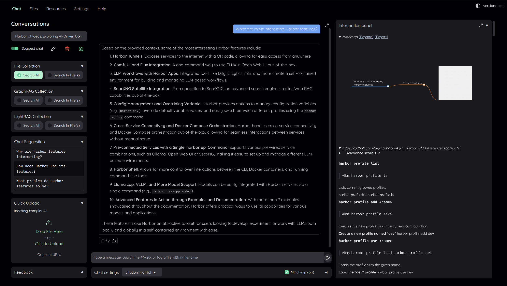

### [Kotaemon](https://github.com/Cinnamon/kotaemon)

> Handle: `kotaemon`<br/>
> URL: [http://localhost:34641](http://localhost:34641)



Kotaemon is a RAG UI for chatting with your documents, built with Gradio.

#### Starting

```bash
# Pull the images
harbor pull kotaemon

# Start Kotaemon
harbor up kotaemon --open
```

- Default credentials: `admin` / `admin`

#### Configuration

##### Environment Variables

Following options can be set via [`harbor config`](./3.-Harbor-CLI-Reference.md#harbor-config):

```bash
# Main UI port
HARBOR_KOTAEMON_HOST_PORT                34641

# Image
HARBOR_KOTAEMON_IMAGE                    ghcr.io/cinnamon/kotaemon
HARBOR_KOTAEMON_VERSION                  main-full

# Persistent workspace directory
HARBOR_KOTAEMON_WORKSPACE                ./services/kotaemon/ktem_app_data

# Local model defaults (used when Ollama is enabled)
HARBOR_KOTAEMON_LOCAL_MODEL              qwen3.5:4b
HARBOR_KOTAEMON_LOCAL_MODEL_EMBEDDINGS   mxbai-embed-large:latest

# Default chat model for the llamacpp integration
# Must be a model id llamacpp actually serves (see its /v1/models)
HARBOR_KOTAEMON_LLAMACPP_MODEL           LiquidAI/LFM2.5-8B-A1B-GGUF:Q8_0
```

##### Volumes

Kotaemon persists application data in:
- `services/kotaemon/ktem_app_data/`

#### Ollama integration

If the `ollama` service is enabled, Harbor injects `KH_OLLAMA_URL` and the local model settings (`LOCAL_MODEL*`) automatically via `compose.x.kotaemon.ollama.yml`.

```bash
harbor up ollama kotaemon --open
```

#### llama.cpp integration

If the `llamacpp` service is enabled, Harbor points Kotaemon's default "openai" LLM/embeddings pair at llamacpp via `compose.x.kotaemon.llamacpp.yml`. The chat model comes from `HARBOR_KOTAEMON_LLAMACPP_MODEL` and must be a model id llamacpp actually serves (Ollama-style tags like `qwen3.5:4b` match nothing there):

```bash
harbor config set kotaemon.llamacpp.model "unsloth/Qwen3.5-4B-GGUF:Q4_K_M"
harbor up llamacpp kotaemon --open
```

Notes:
- Kotaemon pins LLM records into its workspace database at first run. If you change the model after the first start, update it in the UI (Resources → LLMs) or start with a fresh `HARBOR_KOTAEMON_WORKSPACE`.
- Embeddings default to OpenAI's `text-embedding-3-large` name against llamacpp; llamacpp must serve an embeddings-capable model for RAG indexing to work.

#### Troubleshooting

```bash
harbor logs kotaemon
```

#### Links

- [GitHub Repository](https://github.com/Cinnamon/kotaemon)
