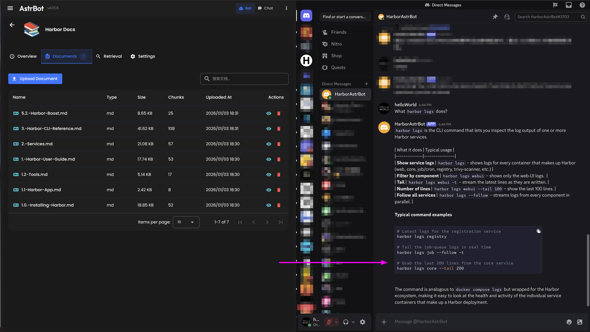

### [AstrBot](https://github.com/AstrBotDevs/AstrBot)

> Handle: `astrbot`<br/>
> URL: [http://localhost:34661](http://localhost:34661)



AstrBot is an open-source, all-in-one agentic chatbot platform and development framework. It enables you to deploy and develop LLM-powered chatbots across multiple messaging platforms with a comprehensive web-based configuration interface.

**Key Features:**
- **Multi-LLM Support**: Integrates with OpenAI, Anthropic, Google Gemini, DeepSeek, Ollama, LM Studio, vLLM, and 10+ other providers
- **Multi-Platform**: Connect to QQ, Telegram, Discord, Lark, DingTalk, WeChat, WeCom, KOOK, and more
- **Agent Capabilities**: Multi-turn tool calling, sandboxed code interpreter, web search, and custom tool integration
- **Plugin System**: Deep plugin mechanism with a thriving community ecosystem
- **Knowledge Base**: Native knowledge base with RAG support for document-based Q&A
- **WebUI**: Feature-rich visual configuration and management interface
- **LLMOps Integration**: Connect to Dify, Coze, and Alibaba Cloud Bailian platforms
- **Speech Services**: TTS (Text-to-Speech) and STT (Speech-to-Text) support
- **Rate Limiting**: Built-in rate limiting and whitelisting for production use

## Starting

```bash
# Pull the image
harbor pull astrbot

# Start AstrBot
harbor up astrbot --open
```

- Access the WebUI at [http://localhost:34661](http://localhost:34661)
- Default credentials: `astrbot` / `astrbot`
  - You will be prompted to change the password on first login
- You can connect AstrBot to LLM/Embedding backends in Harbor
- Most useful part of the service is to create functional chatbots in Discord, Slack, Telegram, etc with your local LLM and AstrBot as the orchestrator

## Configuration

### Environment Variables

Following options can be set via [`harbor config`](./3.-Harbor-CLI-Reference.md#harbor-config):

```bash
# Main WebUI port
HARBOR_ASTRBOT_HOST_PORT          34661

# Container image
HARBOR_ASTRBOT_IMAGE              soulter/astrbot
HARBOR_ASTRBOT_VERSION            latest
```

### Initial Setup

All configuration is done through the WebUI after starting the service:

1. **First Login**: Navigate to [http://localhost:34661](http://localhost:34661) and log in with `astrbot` / `astrbot`
2. **Change Password**: Go to Settings → Security to update credentials
3. **Configure LLM Provider**: Navigate to "Service Provider Management" to add your LLM backends

### Volumes

AstrBot persists all configuration and data in:
- `astrbot/data/` - Database, configuration, plugins, and uploaded files

## Backend Integration

AstrBot works seamlessly with Harbor's inference backends. When running alongside Ollama, llama.cpp, or vLLM, you can configure them directly in the WebUI.

### Using with Ollama

When running both AstrBot and Ollama:

```bash
harbor up astrbot ollama --open
```

**Configuration in AstrBot WebUI:**
1. Navigate to **Service Provider Management**
2. Click **Add Provider** → Select **Ollama**
3. Configure:
   - **API Base URL**: `http://ollama:11434/v1`
   - **API Key**: `ollama` (or leave default)
4. Click **Save**
5. Pull models using Harbor: `harbor ollama pull llama3.2:3b`
6. Select the model in AstrBot's chat interface

### Using with llama.cpp

When running both AstrBot and llama.cpp:

```bash
harbor up astrbot llamacpp --open
```

**Configuration in AstrBot WebUI:**
1. Navigate to **Service Provider Management**
2. Click **Add Provider** → Select **OpenAI** (llama.cpp is OpenAI-compatible)
3. Configure:
   - **Provider Name**: `llama.cpp` (custom name)
   - **API Base URL**: `http://llamacpp:8080/v1`
   - **API Key**: Any value (llama.cpp doesn't require authentication)
4. Click **Save**
5. Load a model in llama.cpp: `harbor llamacpp load <model-file>`
6. Select the provider in AstrBot's chat interface

### Using with vLLM

When running both AstrBot and vLLM:

```bash
harbor up astrbot vllm --open
```

**Configuration in AstrBot WebUI:**
1. Navigate to **Service Provider Management**
2. Click **Add Provider** → Select **OpenAI** (vLLM is OpenAI-compatible)
3. Configure:
   - **Provider Name**: `vLLM` (custom name)
   - **API Base URL**: `http://vllm:8000/v1`
   - **API Key**: Any value (vLLM doesn't require authentication)
4. Click **Save**
5. vLLM should already have a model loaded
6. Select the provider in AstrBot's chat interface

## Usage

### Setting Up a Chatbot

1. **Configure LLM Provider** (see Backend Integration above)
2. **Configure Messaging Platform**:
   - Navigate to **Platform Configuration**
   - Select your messaging platform (Telegram, Discord, etc.)
   - Follow platform-specific setup instructions
   - Enable the platform

3. **Optional: Configure Persona**:
   - Navigate to **Persona Management**
   - Create custom personas with system prompts
   - Assign personas to different platforms or conversations

4. **Optional: Enable Plugins**:
   - Navigate to **Plugin Market**
   - Browse and install community plugins
   - Configure plugin settings as needed

### Knowledge Base (RAG)

AstrBot includes a built-in knowledge base system:

1. Navigate to **Knowledge Base** in the WebUI
2. Create a new knowledge base
3. Upload documents (PDF, TXT, Markdown, etc.)
4. Configure embedding provider (OpenAI, local embeddings, etc.)
5. Enable knowledge base for specific conversations or globally

### Multi-Platform Support

Configure multiple messaging platforms simultaneously:

- **Telegram**: Create bot via @BotFather, add token in AstrBot
- **Discord**: Create application, add bot token
- **QQ**: Use NapCat or other QQ protocol adapters
- **Lark/Feishu**: Configure app credentials
- **Custom Webhook**: Use built-in webhook server for custom integrations

## Troubleshooting

### Cannot Access WebUI

**Problem**: WebUI not loading at http://localhost:34661

**Solutions**:
```bash
# Check if service is running
harbor ps astrbot

# View logs
harbor logs astrbot

# Restart the service
harbor restart astrbot
```

### LLM Provider Connection Failed

**Problem**: Cannot connect to Ollama/llama.cpp/vLLM

**Solutions**:
1. Verify both services are running: `harbor ps`
2. Check network connectivity: Use correct internal URLs (e.g., `http://ollama:11434/v1`)
3. For Ollama, ensure model is pulled: `harbor ollama pull <model>`
4. Check provider configuration in WebUI matches Harbor's service endpoints

### Plugin Installation Failed

**Problem**: Plugin download or installation errors

**Solutions**:
1. Check internet connectivity from container
2. Verify plugin compatibility with current AstrBot version
3. Review plugin logs in **Plugin Management** → Plugin Details
4. Try manual plugin installation by cloning to `astrbot/data/plugins/`

### Memory or Performance Issues

**Problem**: High memory usage or slow responses

**Solutions**:
1. Reduce concurrent conversation limits in Settings
2. Enable conversation history pruning
3. Disable unused plugins
4. Use lighter LLM models
5. Configure response streaming for better UX

## Resources

- [Official Documentation](https://docs.astrbot.app/)
- [GitHub Repository](https://github.com/AstrBotDevs/AstrBot)
- [Community Forum](https://docs.astrbot.app/en/community.html)
- [Plugin Development Guide](https://docs.astrbot.app/)
- [Ollama Configuration Guide](https://docs.astrbot.app/en/config/providers/provider-ollama.html)

## Version Information

- **Current Version**: 4.10.6 (as of Jan 2026)
- **Docker Image**: `soulter/astrbot:latest`
- **License**: AGPL-v3
- **Requires**: Python 3.11+, Node.js (included in Docker image)

For more information about Harbor's CLI capabilities, see the [CLI Reference](./3.-Harbor-CLI-Reference.md).
