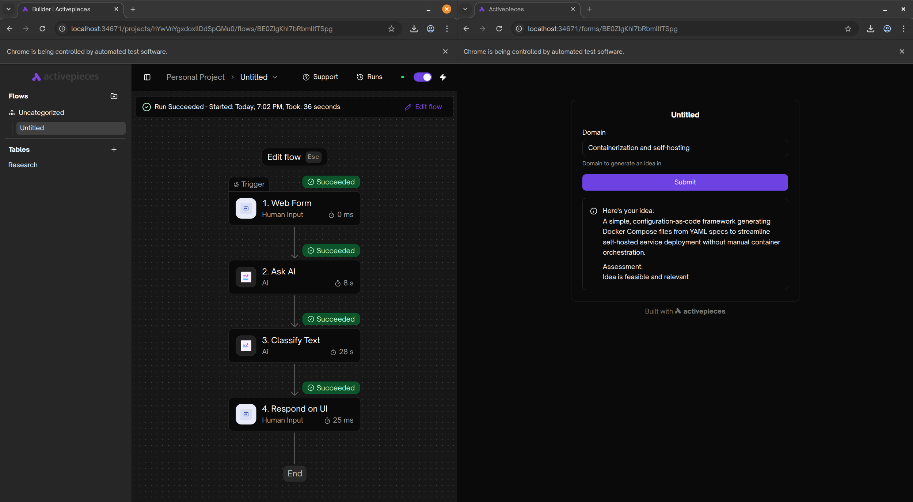

### [Activepieces](https://github.com/activepieces/activepieces)

> Handle: `activepieces`
> URL: [http://localhost:34671](http://localhost:34671)



`activepieces` is an open-source workflow automation tool that allows you to connect apps and automate workflows with AI capabilities. It provides a visual workflow builder similar to Zapier or n8n, with 200+ app connectors and built-in AI features.

#### Starting

```bash
# [Optional] Pre-pull the images
harbor pull activepieces

# Start the service
harbor up activepieces

# [Optional] Open the web interface
harbor open activepieces
```

When running for the first time, `activepieces` will require you to set up an owner account. Follow the instructions on the web interface to complete the setup.

#### Usage

You can interact with `activepieces` primarily through its web interface. The visual workflow builder allows you to create automated workflows connecting different services with triggers and actions.

Key features:
- **200+ App Connectors** - Connect to popular services and APIs
- **AI Workflows** - Built-in AI capabilities for intelligent automation
- **Visual Builder** - Drag-and-drop workflow designer
- **Webhook Support** - Trigger workflows from external events
- **Custom Code** - Write custom TypeScript code when needed

Explore pre-built templates and examples:
- [Official workflow templates](https://www.activepieces.com/templates)
- [Documentation](https://www.activepieces.com/docs)

#### Webhook URL Configuration

For webhook triggers to work properly, especially when accessing from external sources, you need to configure the frontend URL:

```bash
# Configure webhook URL for local access
harbor env activepieces AP_FRONTEND_URL http://localhost:$(harbor config get activepieces.host.port)
```

**Important:** By default, Activepieces attempts to use your public IP address for webhooks. For production deployments behind a reverse proxy or with a public domain, you must configure `AP_FRONTEND_URL` to your actual public URL:

```bash
# Example for production with domain
harbor env activepieces AP_FRONTEND_URL https://activepieces.yourdomain.com
```

#### Credentials Configuration

When configuring credentials to access Harbor's services (like Ollama for AI features), ensure you use "Internal" versions of the URLs:

```bash
# "Internal" URL can be obtained with '-i' flag
harbor url -i ollama

# This won't work, as it's outside of the Docker network
harbor url ollama
```

You can then use the internal URL in Activepieces workflow nodes that support custom LLM endpoints.

## Configuration

### Environment Variables

Following options can be set via [`harbor config`](./3.-Harbor-CLI-Reference.md#harbor-config):

```bash
# Main web UI port
HARBOR_ACTIVEPIECES_HOST_PORT             34671

# PostgreSQL database port
HARBOR_ACTIVEPIECES_PG_HOST_PORT          34672

# Data persistence path
HARBOR_ACTIVEPIECES_WORKSPACE             ./activepieces

# Container images
HARBOR_ACTIVEPIECES_IMAGE                 activepieces/activepieces
HARBOR_ACTIVEPIECES_VERSION               latest
HARBOR_ACTIVEPIECES_PG_IMAGE              postgres
HARBOR_ACTIVEPIECES_PG_VERSION            16-alpine

# PostgreSQL database credentials
HARBOR_ACTIVEPIECES_PG_USER               harbor
HARBOR_ACTIVEPIECES_PG_PASSWORD           sk-harbor
HARBOR_ACTIVEPIECES_PG_DB                 activepieces

# Security settings (⚠️ change for production!)
HARBOR_ACTIVEPIECES_ENCRYPTION_KEY        <32 characters>
HARBOR_ACTIVEPIECES_JWT_SECRET            <16 characters>

# Execution configuration
HARBOR_ACTIVEPIECES_EXECUTION_MODE        UNSANDBOXED
HARBOR_ACTIVEPIECES_TRIGGER_POLL_INTERVAL 5
```

### Advanced Configuration

Additional settings can be configured using [`harbor env`](./3.-Harbor-CLI-Reference.md#harbor-env):

```bash
# Frontend URL for webhooks (important for production)
harbor env activepieces AP_FRONTEND_URL http://localhost:34671

# Change execution mode
harbor env activepieces AP_EXECUTION_MODE SANDBOX_PROCESS

# Adjust trigger polling interval (in minutes)
harbor env activepieces AP_TRIGGER_POLL_INTERVAL 10
```

### Volumes

Activepieces persists all configuration and data in:
- `activepieces/` - PostgreSQL database, workflow definitions, credentials, and logs

#### Security Notes

**Critical for Production Deployments:**

The default `HARBOR_ACTIVEPIECES_ENCRYPTION_KEY` and `HARBOR_ACTIVEPIECES_JWT_SECRET` are insecure defaults meant for local development only. You must change these values before deploying to production or storing sensitive credentials.

Generate secure keys using OpenSSL:

```bash
# Generate encryption key (16 bytes / 32 hex characters)
openssl rand -hex 16

# Generate JWT secret (32 bytes / 64 hex characters)
openssl rand -hex 32
```

Then set them in Harbor:

```bash
# Set encryption key
harbor env activepieces AP_ENCRYPTION_KEY <your-generated-encryption-key>

# Set JWT secret
harbor env activepieces AP_JWT_SECRET <your-generated-jwt-secret>

# Restart the service for changes to take effect
harbor restart activepieces
```

**Important:** Changing the encryption key after storing credentials will make existing credentials inaccessible. Back up your data before making changes.

#### Execution Modes

Activepieces supports two execution modes:

- **UNSANDBOXED** (default): Faster execution but runs code directly on the host
- **SANDBOX_PROCESS**: Runs code in isolated sandboxed processes for better security

For production deployments with untrusted workflows or custom code, consider using sandboxed mode:

```bash
harbor env activepieces AP_EXECUTION_MODE SANDBOX_PROCESS
harbor restart activepieces
```

#### Integration with Harbor Services

Activepieces can integrate with other Harbor services. For example, to use Harbor's Ollama instance for AI workflows:

1. Start Ollama in Harbor:
   ```bash
   harbor up ollama
   ```

2. Get the internal Ollama URL:
   ```bash
   harbor url -i ollama
   ```

3. Use this URL in Activepieces workflow nodes that support custom LLM endpoints (e.g., HTTP Request nodes or custom AI actions).

#### Troubleshooting

**Webhooks not working:**
- Verify `AP_FRONTEND_URL` is correctly configured
- Check that the port is accessible from the webhook source
- Review webhook logs in the Activepieces UI under Run Details

**Cannot connect to Ollama or other Harbor services:**
- Ensure you're using internal URLs (use `harbor url -i <service>`)
- Verify both services are on the `harbor-network`
- Check service status with `harbor ps`

**Database connection issues:**
- Ensure the PostgreSQL container is healthy: `docker ps`
- Check logs: `harbor logs activepieces-db`
- Verify database credentials in environment variables

For more help, refer to:
- [Official Activepieces Documentation](https://www.activepieces.com/docs)
- [Community Discord](https://discord.gg/2jUXBKDdP8)
- [GitHub Issues](https://github.com/activepieces/activepieces/issues)
