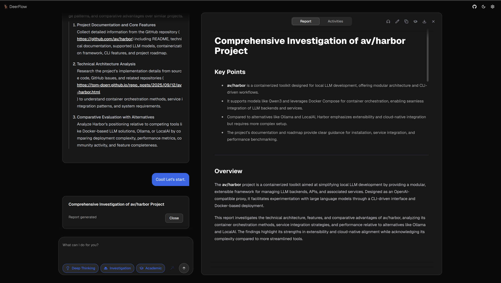

### [DeerFlow](https://github.com/bytedance/deer-flow)

> Handle: `deerflow`<br/>
> URL: [http://localhost:34681](http://localhost:34681)



DeerFlow is a community-driven deep research framework that combines LLMs with web search, web crawling, and multi-agent workflows to generate comprehensive research reports.

**Key Features:**
- **Multiple LLM provider support**: Works with Ollama, OpenAI-compatible APIs
- **Web search integration**: Supports Tavily, InfoQuest, DuckDuckGo, and Brave search engines
- **Web crawling tools**: Integrates with Jina and InfoQuest for content extraction
- **RAG support**: Connect to RAGFlow, Qdrant, or Milvus for retrieval-augmented generation
- **MCP integration**: Model Context Protocol server support for enhanced capabilities
- **TTS/STT capabilities**: Text-to-speech and speech-to-text functionality
- **Multi-agent workflows**: Complex research tasks distributed across specialized agents
- **Python 3.12+**: Modern Python backend with FastAPI

## Getting Started

```bash
# Build images from GitHub repository
harbor pull deerflow

# Start DeerFlow and open in browser
harbor up deerflow --open
```

- This is a **Satellite** service (a specialized web UI + backend that integrates with LLM backends like Ollama)
- Default configuration uses DuckDuckGo for search and Jina for web crawling (no API keys required)

## Configuration

### Environment Variables

Following options can be set via [`harbor config`](./3.-Harbor-CLI-Reference.md#harbor-config):

```bash
# Web UI port
HARBOR_DEERFLOW_HOST_PORT              34681

# Backend API port (used by the UI)
HARBOR_DEERFLOW_BACKEND_HOST_PORT      34682

# Workspace directory (persistent data)
HARBOR_DEERFLOW_WORKSPACE              ./deerflow

# Frontend image configuration
HARBOR_DEERFLOW_IMAGE                  bytedance/deer-flow-frontend
HARBOR_DEERFLOW_VERSION                latest

# Backend image configuration
HARBOR_DEERFLOW_BACKEND_IMAGE          bytedance/deer-flow-backend
HARBOR_DEERFLOW_BACKEND_VERSION        latest

# Model configuration (used for basic/reasoning/code)
# Note: Must use a model with proper tool calling support (e.g., qwen3:8b, mistral)
HARBOR_DEERFLOW_MODEL                  qwen3:8b

# Search and crawler configuration
HARBOR_DEERFLOW_SEARCH_API             duckduckgo
HARBOR_DEERFLOW_CRAWLER_ENGINE         jina

# Additional settings
HARBOR_DEERFLOW_DEBUG                  false
HARBOR_DEERFLOW_ALLOWED_ORIGINS        http://localhost:34681
```

### Configuration Files

Harbor renders DeerFlow backend configuration at container startup:

- Base fragment: `deerflow/configs/deerflow.config.yaml`
- Optional overrides (for example, Ollama): additional fragments mounted into `/app/configs/*.yaml`
- Rendered output inside the container: `/app/conf.yaml`

If you use the Ollama variant:

```bash
harbor up deerflow ollama --open
```

Harbor will mount an override config fragment that points DeerFlow to Harbor's Ollama endpoint (OpenAI-compatible `/v1`).

### Volumes

DeerFlow persists data in:
- `deerflow/data/` - research reports, cache, and generated content
- `deerflow/configs/` - Harbor-managed configuration fragments
- `deerflow/override.env` - optional environment variable overrides

## Integration with Harbor

### Ollama Integration

Use the Ollama compose variant for automatic local LLM integration:

```bash
harbor up deerflow ollama --open
```

This automatically configures DeerFlow to use your Harbor Ollama instance.

## Troubleshooting

### Model Requirements

DeerFlow relies heavily on **tool calling** (function calling) for its multi-agent workflow. If you see "No tool calls in legacy mode - ending workflow gracefully" in the logs, your model doesn't support tool calling properly.

I've tested that at least `qwen3:8b` and above/newer models work well.

Change the model:

```bash
harbor config set deerflow.model "qwen3:8b"
harbor restart deerflow
```

### Check Logs

```bash
# All services
harbor logs deerflow

# Backend only
harbor logs deerflow-backend

# Frontend only
harbor logs deerflow
```

### Backend Health Issues

The UI waits for the backend to be healthy before starting. If the UI doesn't start:

```bash
harbor logs deerflow-backend
harbor restart deerflow
```

### Configuration Errors

If DeerFlow fails to start, inspect the rendered config inside the backend container:

```bash
# While DeerFlow is running, check the rendered config
harbor exec deerflow-backend cat /app/conf.yaml
```

## Links

- [Official Repository](https://github.com/bytedance/deer-flow)
- [Documentation](https://github.com/bytedance/deer-flow/blob/main/README.md)
