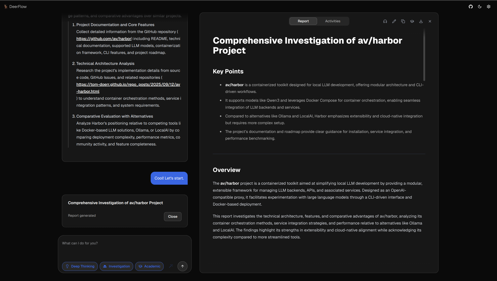

### [DeerFlow](https://github.com/bytedance/deer-flow)

> Handle: `deerflow`<br/>
> URL: [http://localhost:34681](http://localhost:34681)



DeerFlow is a community-driven deep research framework that combines LLMs with web search, web crawling, and multi-agent workflows to generate comprehensive research reports.

**Key Features:**
- **Multiple LLM provider support**: Works with Ollama, llama.cpp, and any OpenAI-compatible API
- **Web search integration**: DuckDuckGo by default (no API key); Serper, Brave, SearXNG, and Tavily configurable
- **Multi-agent workflows**: Lead agent + subagents with skills, sandboxed bash, and file tools
- **MCP integration**: Model Context Protocol server support for enhanced capabilities
- **Deep research reports**: Long-running research threads with artifacts and uploads

#### Getting Started

```bash
# Build images from the upstream repository
harbor build deerflow

# Start DeerFlow and open in browser
harbor up deerflow --open
```

- This is a **Satellite** service (a specialized web UI + backend that integrates with LLM backends like Ollama or llama.cpp)
- Harbor runs four containers, building two of them from the upstream repository at the ref in `HARBOR_DEERFLOW_GIT_REF` (`harbor config get deerflow.git_ref`), pinned to the **v2.0.0** tag:
  - `deerflow` — nginx entry point (routes `/api/*` to the gateway, everything else to the frontend; config vendored at `services/deerflow/nginx.conf`)
  - `deerflow-frontend` — Next.js UI
  - `deerflow-backend` — the Gateway API + agent runtime
  - `deerflow-redis` — Redis stream bridge used by the gateway for SSE delivery
- On first visit, DeerFlow shows a setup screen to create the admin account (upstream better-auth flow). Accounts and research threads persist in `services/deerflow/data/`

#### Configuration

##### Environment Variables

Following options can be set via [`harbor config`](./3.-Harbor-CLI-Reference.md#harbor-config):

```bash
# Web UI port
HARBOR_DEERFLOW_HOST_PORT              34681

# Gateway API port
HARBOR_DEERFLOW_BACKEND_HOST_PORT      34682

# Workspace directory (persistent data)
HARBOR_DEERFLOW_WORKSPACE              ./services/deerflow

# Upstream ref both images are built from
HARBOR_DEERFLOW_GIT_REF                https://github.com/bytedance/deer-flow.git#v2.0.0

# Model used with the Ollama integration
# Note: must be a model with proper tool calling support
HARBOR_DEERFLOW_MODEL                  qwen3.5:4b

# Model used with the llama.cpp integration (HF GGUF spec)
HARBOR_DEERFLOW_LLAMACPP_MODEL         LiquidAI/LFM2.5-8B-A1B-GGUF:Q8_0

# Default OpenAI-compatible endpoint for the model entry
# (overridden automatically by the ollama/llamacpp cross-service files)
HARBOR_DEERFLOW_MODEL_BASE_URL         http://llamacpp:8080/v1
HARBOR_DEERFLOW_MODEL_API_KEY          sk-deerflow

# Signs frontend auth sessions; must be 32+ characters.
# Change this if the instance is reachable by anyone but you.
HARBOR_DEERFLOW_AUTH_SECRET            harbor-deerflow-auth-secret-change-me-32chars
```

##### Configuration Files

Harbor mounts a static DeerFlow v2 config at `/app/backend/config.yaml`:

- Source: `services/deerflow/config.yaml`
- Model access is a single OpenAI-compatible entry whose `model`, `base_url`, and `api_key` are resolved by DeerFlow from the `DEERFLOW_MODEL*` container environment variables — no config rendering at startup
- Edit `services/deerflow/config.yaml` directly to add more models, search tools, MCP servers, or agent settings (see upstream `config.example.yaml` for the schema), then `harbor restart deerflow`

##### Volumes

DeerFlow persists data in:
- `services/deerflow/data/` - gateway state: auth users, research threads, sqlite databases, artifacts
- `services/deerflow/redis/` - Redis append-only stream data
- `services/deerflow/override.env` - optional environment variable overrides

#### Integration with Harbor

```bash
# Use Harbor's Ollama as the model backend
harbor up deerflow ollama --open

# Use Harbor's llama.cpp as the model backend
harbor up deerflow llamacpp --open
```

The cross-service files point the `Harbor Backend` model entry at the respective service's OpenAI-compatible endpoint and set the matching default model (`deerflow.model` for Ollama, `deerflow.llamacpp_model` for llama.cpp).

#### Troubleshooting

##### Model Requirements

DeerFlow relies heavily on **tool calling** (function calling) for its multi-agent workflow. Use a tool-capable model. Change it with:

```bash
harbor config set deerflow.model "qwen3.5:4b"
harbor restart deerflow
```

##### Backend Health Issues

The UI waits for the gateway to be healthy before starting. If the UI doesn't start, check the gateway logs (`docker logs harbor.deerflow-backend`) — a common cause is a `$VAR` in `services/deerflow/config.yaml` referencing an environment variable that is not set in the container (DeerFlow fails loudly on missing variables).

##### Auth / Login Issues

The first browser session creates the admin account. If you recreate the stack and want a clean slate, remove `services/deerflow/data/` while the stack is down.

#### Links

- [Official Repository](https://github.com/bytedance/deer-flow)
- [Documentation](https://github.com/bytedance/deer-flow/blob/main/README.md)
