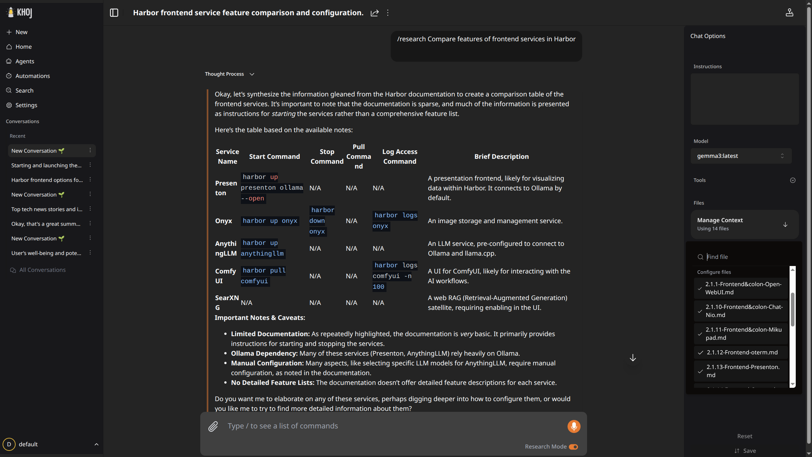

### [Khoj](https://github.com/khoj-ai/khoj)

> Handle: `khoj`<br/>
> URL: [http://localhost:34701](http://localhost:34701)



Khoj is an open-source personal AI "second brain" application. It enables chat with any local or online LLM (like llama, gpt, claude, gemini), gets answers from the internet and your documents (PDF, markdown, org-mode, Word, Notion), provides semantic search across your knowledge base, and allows creating custom agents. It supports RAG (Retrieval Augmented Generation) for document-based chat.

**Key Features:**
- Chat with any LLM (local via Ollama or cloud providers like OpenAI, Anthropic, Gemini)
- RAG with your documents (PDF, Markdown, Org-mode, Word, Notion)
- Semantic search across your knowledge base
- Create custom AI agents with specific personas and tools
- Web search integration via SearXNG
- Code execution capabilities
- Browser, Obsidian, Emacs, and Desktop clients available

## Starting

```bash
# Start Khoj with Ollama for local LLM
harbor up khoj ollama

# Start with SearXNG for web search
harbor up khoj ollama searxng

# Open the UI
harbor open khoj

# Open the admin panel
harbor open khoj-admin
```

### First Launch Notes

- Default admin credentials: `admin@example.com` / `harbor-khoj` (change these for production!)
- Access admin panel via `harbor open khoj_admin` or at [http://localhost:34701/server/admin](http://localhost:34701/server/admin)
  - Use `localhost` instead of `127.0.0.1` to avoid CSRF errors
- On first startup, Khoj downloads sentence transformer models (~400MB), this is cached in the workspace
- Database initialization happens automatically
- Service shows "🌖 Khoj is ready to engage" when startup is complete

## Usage

### Document Chat (RAG)

1. Navigate to the Khoj UI at [http://localhost:34701](http://localhost:34701)
2. Upload documents via the "search" page
3. Khoj indexes your documents for semantic search and RAG
4. Ask questions about your documents in the chat interface

### Custom Agents

Create custom AI agents with specific:
- Personas (system prompts)
- Tools (web search, code execution, etc.)
- Knowledge bases (specific document collections)

### Web Search

When running with SearXNG, Khoj can search the web to augment its responses:

```bash
harbor up khoj searxng
```

### Using Cloud LLMs

Set API keys via `harbor config` for cloud providers:

```bash
# OpenAI
harbor config set khoj.openai_api_key "sk-..."

# Anthropic
harbor config set khoj.anthropic_api_key "sk-ant-..."

# Google Gemini
harbor config set khoj.gemini_api_key "..."
```

## Configuration

Following options can be set via [`harbor config`](./3.-Harbor-CLI-Reference.md#harbor-config):

```bash
# Main UI port
HARBOR_KHOJ_HOST_PORT              34701

# Database port (PostgreSQL with pgvector)
HARBOR_KHOJ_DB_HOST_PORT           34702

# Container images
HARBOR_KHOJ_IMAGE                  ghcr.io/khoj-ai/khoj
HARBOR_KHOJ_VERSION                latest
HARBOR_KHOJ_DB_IMAGE               pgvector/pgvector
HARBOR_KHOJ_DB_VERSION             pg15

# Persistent storage
HARBOR_KHOJ_WORKSPACE              ./khoj

# Admin credentials (change for production!)
HARBOR_KHOJ_ADMIN_EMAIL            admin@example.com
HARBOR_KHOJ_ADMIN_PASSWORD         harbor-khoj

# Django secret key (change for production!)
HARBOR_KHOJ_DJANGO_SECRET_KEY      harbor-khoj-secret-key-change-me

# Database configuration
HARBOR_KHOJ_DB_NAME                khoj
HARBOR_KHOJ_DB_USER                khoj
HARBOR_KHOJ_DB_PASSWORD            sk-harbor-khoj

# Debug and telemetry
HARBOR_KHOJ_DEBUG                  False
HARBOR_KHOJ_TELEMETRY_DISABLE      True

# Open URLs
HARBOR_KHOJ_ADMIN_OPEN_URL         http://localhost:34701/server/admin

# Default chat model (used when running with Ollama)
HARBOR_KHOJ_DEFAULT_MODEL          gemma3
```

### Volumes

- `khoj/` - Workspace directory containing:
  - Model cache (sentence transformers, ~400MB)
  - Uploaded documents
  - Configuration files

## Using with Ollama

When running Khoj with Ollama, Harbor automatically configures the connection:

```bash
harbor up khoj ollama
```

This configures:
- `OPENAI_BASE_URL` pointing to Ollama's OpenAI-compatible API endpoint
- `KHOJ_DEFAULT_CHAT_MODEL` set to `HARBOR_KHOJ_DEFAULT_MODEL` (default: `llama3.2:3b`)

To change the default model:

```bash
harbor config set khoj.default_model "llama3.1:8b"
```

**Note:** While the model is pre-configured, you may still need to enable it in the Khoj admin panel for certain operations. Access via `harbor open khoj_admin`.

## Using with SearXNG

When running Khoj with SearXNG, Harbor automatically configures web search:

```bash
harbor up khoj searxng
```

This sets `KHOJ_SEARXNG_URL` to connect to the SearXNG instance, enabling web search capabilities in Khoj's chat.
