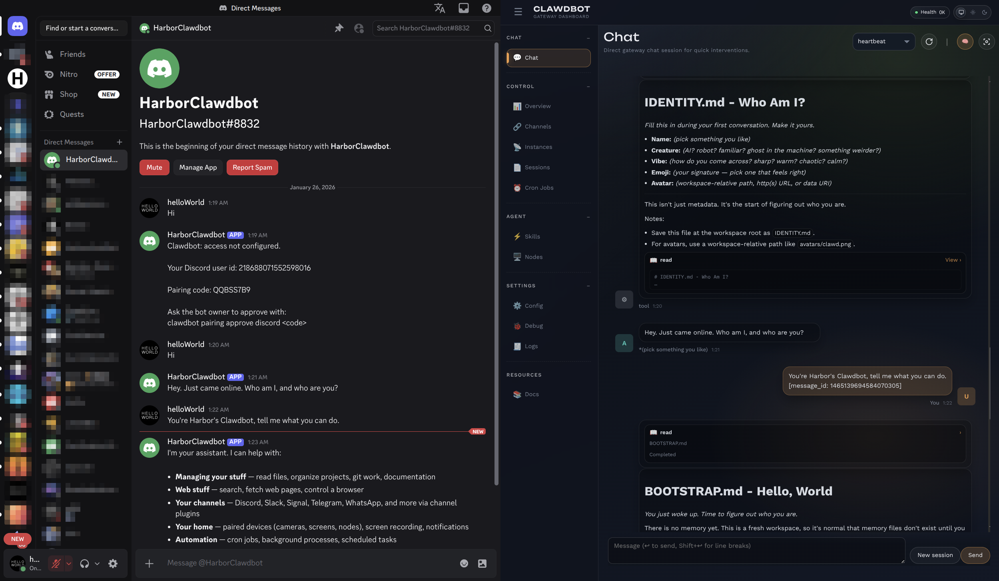

### [OpenClaw](https://github.com/openclaw/openclaw)

> Handle: `openclaw`<br/>
> URL: [http://localhost:34721](http://localhost:34721)



OpenClaw is a personal AI assistant that runs locally and connects to your existing chat channels through a self-hosted gateway and Control UI.

> **Note:** This service was previously named "Moltbot" and was renamed to "OpenClaw".

## Starting

```bash
# Build from source (recommended for Docker installs)
harbor build openclaw

# Set the model (required on first start)
harbor config set openclaw.model "llama3.1:8b"

# Start OpenClaw with a backend (Ollama, llamacpp, vllm, etc.)
harbor up openclaw ollama --open

# Open the Control UI
harbor open openclaw
```

- OpenClaw requires an OpenAI-compatible backend. Start with one of: `ollama`, `llamacpp`, `vllm`, `tabbyapi`, `mistralrs`, `sglang`, or `lmdeploy`.
- Harbor automatically configures OpenClaw to use whichever backend is running.
- `harbor open openclaw` uses the configured `openclaw.open_url` which includes the gateway token, so no manual token entry is required by default.
- If `OPENCLAW_MODEL` is unset, OpenClaw will exit on first start and ask you to set it.

### Channel Configuration

#### Discord Setup

Before adding your Discord bot to OpenClaw, you must enable required privileged intents in the Discord Developer Portal:

1. Go to [Discord Developer Portal](https://discord.com/developers/applications)
2. Select your application
3. Navigate to **Bot** settings
4. Under **Privileged Gateway Intents**, enable:
   - **Message Content Intent** (required for reading messages)
   - **Server Members Intent** (recommended for better user management)
   - **Presence Intent** (optional)
5. Save changes

Without these intents enabled, Discord will reject the connection with error code 4014.

#### Adding Channels

To configure Discord or other chat channels:

```bash
# Interactive channel configuration
harbor run openclaw configure --section channels
```

Or add channels directly via CLI:

```bash
# Add Discord channel
harbor run openclaw channels add --channel discord --token <bot-token>

# Add other channels (Telegram, WhatsApp, etc.)
harbor run openclaw channels add --channel telegram --token <telegram-token>
```

The configuration wizard will guide you through:
1. Selecting a channel (Discord, Telegram, WhatsApp, etc.)
2. Entering credentials (bot token, etc.)
3. Configuring access policies

Your channel configurations persist across container restarts thanks to Harbor's config preservation system.

## Configuration

### Environment Variables

Following options can be set via [`harbor config`](./3.-Harbor-CLI-Reference.md#harbor-config):

```bash
# Control UI (Gateway) port
OPENCLAW_HOST_PORT=34721

# Bridge port (device nodes)
OPENCLAW_BRIDGE_HOST_PORT=34722

# Image + build source
OPENCLAW_IMAGE="openclaw"
OPENCLAW_VERSION="local"
OPENCLAW_GIT_REF="https://github.com/openclaw/openclaw.git#main"

# Persistent configuration + workspace
OPENCLAW_CONFIG_DIR="~/.openclaw"
OPENCLAW_WORKSPACE_DIR="~/openclaw"

# Gateway settings
OPENCLAW_GATEWAY_MODE="local"
OPENCLAW_GATEWAY_BIND="lan"
OPENCLAW_GATEWAY_TOKEN="harbor-openclaw-token-change-me"

# Model (required)
# Specify the model ID exactly as it appears in your backend.
# Harbor automatically prepends the provider prefix (e.g., "llamacpp/") internally.
#
# For llamacpp models with vendor prefixes, include the full path:
#   unsloth/GLM-4.7-Flash-GGUF:Q8_0
#   bartowski/Qwen2.5-Coder-7B-Instruct-GGUF:Q6_K
# For Ollama models:
#   llama3.1:8b
#   qwen3-vl:8b
#
# Note: Do NOT include the backend name (e.g., "llamacpp/") in OPENCLAW_MODEL.
# Harbor handles provider prefixing automatically.
OPENCLAW_MODEL=""

# Context window for the model
OPENCLAW_CONTEXT_WINDOW=16384

# Build-time extra apt packages
OPENCLAW_DOCKER_APT_PACKAGES=""

# Auto-approve Control UI device pairing
OPENCLAW_AUTO_APPROVE_UI=true

# Optional Claude session values
OPENCLAW_CLAUDE_AI_SESSION_KEY=""
OPENCLAW_CLAUDE_WEB_SESSION_KEY=""
OPENCLAW_CLAUDE_WEB_COOKIE=""
```

### Volumes

OpenClaw persists data in the following directories:
- `OPENCLAW_CONFIG_DIR` - Gateway configuration, credentials, and tokens
- `OPENCLAW_WORKSPACE_DIR` - Agent workspace, skills, and session data

### Configuration Persistence

On first start, Harbor creates the initial `openclaw.json` configuration file. On subsequent restarts, Harbor only updates the dynamic parts (gateway tokens, backend URL, model ID) while preserving all user customizations including:
- Channel configurations (Discord, Telegram, etc.)
- Custom agent settings
- Model provider customizations
- Any other manual edits to the config file

This ensures your customizations aren't lost when switching models or backends.

### First-time Control UI pairing

OpenClaw runs inside Docker, so the Control UI connects from the Docker bridge and can require device pairing. Harbor auto-approves this by default. If you disable it, run:

```bash
harbor exec openclaw node dist/index.js devices list --json
harbor exec openclaw node dist/index.js devices approve <request-id>
```

## Troubleshooting

### Discord: Fatal Gateway error 4014

If you see `Fatal Gateway error: 4014` in logs or the Control UI when using Discord:

**Cause:** Discord is rejecting the connection because required privileged intents are not enabled.

**Fix:**
1. Go to [Discord Developer Portal](https://discord.com/developers/applications)
2. Select your bot application
3. Navigate to **Bot** settings
4. Under **Privileged Gateway Intents**, enable:
   - **Message Content Intent** (required)
   - **Server Members Intent** (recommended)
5. Click **Save Changes**
6. Restart OpenClaw: `harbor restart openclaw`

The bot should now connect successfully. Check logs with `harbor logs openclaw` to verify.

### Check Logs

```bash
harbor logs openclaw
```

### Reset Local Data

```bash
# Stop the service
harbor down openclaw

# Remove local data (WARNING: destroys config and sessions)
rm -rf ~/.openclaw ~/openclaw

# Restart
harbor up openclaw --open