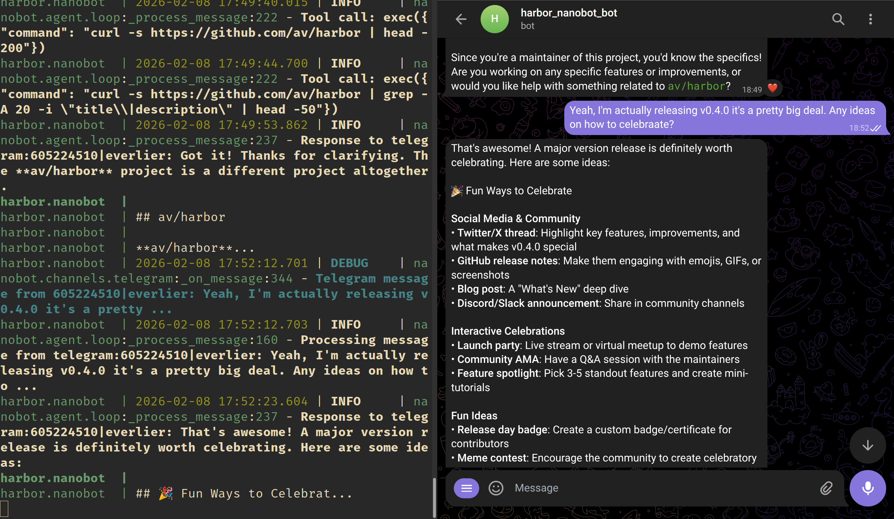

### [nanobot](https://github.com/HKUDS/nanobot)

> Handle: `nanobot`<br/>
> URL: [http://localhost:34731](http://localhost:34731)



nanobot is an ultra-lightweight personal AI assistant (~4,000 lines of code) with a gateway mode for multi-channel messaging. It supports Telegram, Discord, WhatsApp, and Feishu channels, along with a wide range of LLM providers including OpenRouter, Anthropic, OpenAI, DeepSeek, Groq, and Gemini.

**Key Features:**
- CLI agent for one-shot and interactive chat
- Gateway mode for multi-channel messaging (Telegram, Discord, WhatsApp, Feishu)
- Support for many LLM providers out of the box
- Ollama integration for local inference
- Persistent config directory for API keys and settings

## Starting

### Gateway Mode

```bash
# Build the image (built from source)
harbor build nanobot

# Start the gateway (long-running, for messaging channels)
harbor up nanobot
```

### CLI Mode

```bash
# Chat with the agent (one-shot)
harbor nanobot agent -m "Hello!"

# Interactive chat
harbor nanobot agent

# Check status
harbor nanobot status
```

See [`harbor build`](./3.-Harbor-CLI-Reference.md#harbor-build) and [`harbor up`](./3.-Harbor-CLI-Reference.md#harbor-up) for more options.

### With Local Backends

```bash
# Start nanobot with Ollama as the backend
harbor up nanobot ollama

# Or with any other OpenAI-compatible backend
harbor up nanobot vllm
harbor up nanobot llamacpp
harbor up nanobot tabbyapi

# Set a local model
harbor nanobot model llama3.1:8b
```

When started with any OpenAI-compatible backend, Harbor auto-detects and configures nanobot to use it as the vllm provider. Supported backends: ollama, llamacpp, vllm, tabbyapi, mistralrs, sglang, lmdeploy, aphrodite, ktransformers.

## Usage

- `harbor up nanobot` starts the gateway, a long-running process for handling messages from configured channels (Telegram, Discord, WhatsApp, Feishu)
- `harbor nanobot <args>` runs one-shot CLI commands against the nanobot container
- The config directory is mounted from the host, so API keys and settings persist across restarts

### CLI Subcommands

```bash
# One-shot message
harbor nanobot agent -m "Explain quicksort"

# Interactive chat mode
harbor nanobot agent

# Show service status
harbor nanobot status

# Get or set the model
harbor nanobot model
harbor nanobot model anthropic/claude-sonnet-4-20250514
```

### Channel Configuration

To set up messaging channels (Telegram, Discord, WhatsApp, Feishu), edit the nanobot config file at `~/.nanobot/config.json` (or the path configured via `HARBOR_NANOBOT_CONFIG_DIR`). Refer to the [nanobot documentation](https://github.com/HKUDS/nanobot) for channel-specific setup instructions.

### Manual Configuration

The nanobot configuration is stored in `~/.nanobot/config.json` on your host machine. This directory is mounted as a volume, so any changes you make persist across container restarts.

To manually edit the config:

```bash
# Open the config directory
code ~/.nanobot

# Or edit the config file directly
nano ~/.nanobot/config.json
# or
vim ~/.nanobot/config.json
```

The `config.json` file contains:
- API keys for various LLM providers (OpenRouter, Anthropic, OpenAI, DeepSeek, Groq, Gemini)
- Channel configurations (Telegram bot tokens, Discord webhooks, etc.)
- Model preferences and provider settings
- Gateway settings

After editing the config file, restart nanobot for changes to take effect:

```bash
harbor restart nanobot
```

## Configuration

Following options can be set via [`harbor config`](./3.-Harbor-CLI-Reference.md#harbor-config):

```bash
# Gateway host port
HARBOR_NANOBOT_HOST_PORT          34731

# Docker image name (built from source)
HARBOR_NANOBOT_IMAGE              nanobot

# Image version tag
HARBOR_NANOBOT_VERSION            local

# Git reference for building from source
HARBOR_NANOBOT_GIT_REF            https://github.com/HKUDS/nanobot.git#main

# Host directory for nanobot config (API keys, settings)
HARBOR_NANOBOT_CONFIG_DIR         ~/.nanobot

# Default model to use
HARBOR_NANOBOT_MODEL              anthropic/claude-sonnet-4-20250514
```

## Volumes

- `HARBOR_NANOBOT_CONFIG_DIR` (`~/.nanobot`) mounted to `/root/.nanobot` - Persistent configuration including API keys, channel settings, and `config.json`

## Backend Integration

When started with any OpenAI-compatible inference backend, Harbor automatically detects and configures nanobot's vllm provider. The TypeScript compose integration (`compose.nanobot.ts`) handles:

- Auto-detection of active backends (ollama, llamacpp, vllm, tabbyapi, mistralrs, sglang, lmdeploy, aphrodite, ktransformers)
- Priority to explicitly requested backends (`harbor up nanobot ollama` vs `harbor up nanobot ollama vllm`)
- Injection of backend URL and name as environment variables
- Dependency management for proper startup order

```bash
# Start with Ollama
harbor up nanobot ollama

# Pull a model for use with nanobot
harbor ollama pull llama3.1:8b

# Set the model
harbor nanobot model llama3.1:8b

# Start with vLLM instead
harbor up nanobot vllm
```

No manual configuration needed - the entrypoint script automatically patches `~/.nanobot/config.json` with the detected backend's `vllm` provider. Model names should be set as the raw name the backend reports (no `openai/` or `ollama/` prefix) - the prefix is stripped automatically.

## Troubleshooting

Refer to the [Troubleshooting guide](./5.-Troubleshooting.md) for general Harbor issues.

```bash
# Check nanobot logs
harbor logs nanobot

# Verify the service is running
harbor ps

# Rebuild from source after upstream changes
harbor build nanobot --no-cache
```
