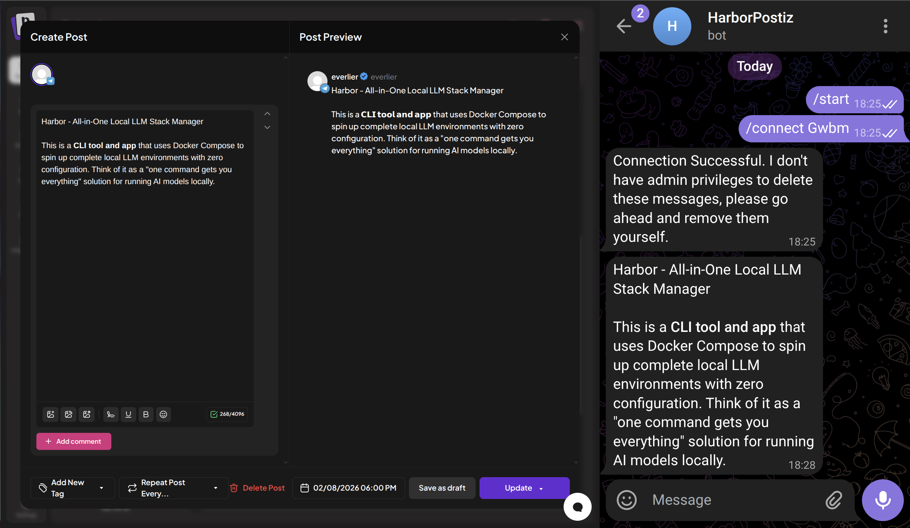

### [Postiz](https://github.com/gitroomhq/postiz-app)

> Handle: `postiz`<br/>
> URL: [http://localhost:34741](http://localhost:34741)



Postiz is an open-source, AI-powered social media scheduling tool. It helps manage posts across multiple platforms, generate content with AI, track analytics, and collaborate with team members. It supports X (Twitter), LinkedIn, Reddit, Facebook, Instagram, YouTube, TikTok, Pinterest, Mastodon, Discord, Slack, and more.

## Starting

```bash
# Pull the images
harbor pull postiz

# Start Postiz
harbor up postiz --open
```

- First launch requires account registration via the web UI
- Social media provider credentials must be configured before connecting platforms (see [Provider Setup](https://docs.postiz.com/providers/overview) and [Social Media Providers](#social-media-providers) section below)
- Temporal workflow UI is available at [http://localhost:34742](http://localhost:34742) for monitoring scheduled tasks

## Configuration

### Environment Variables

Following options can be set via [`harbor config`](./3.-Harbor-CLI-Reference.md#harbor-config):

```bash
# Main UI port
HARBOR_POSTIZ_HOST_PORT               34741

# Temporal workflow UI port
HARBOR_POSTIZ_TEMPORAL_UI_HOST_PORT   34742

# Postiz image
HARBOR_POSTIZ_IMAGE                   ghcr.io/gitroomhq/postiz-app
HARBOR_POSTIZ_VERSION                 latest

# JWT secret for authentication (change for production)
HARBOR_POSTIZ_JWT_SECRET              harbor-postiz-jwt-secret-change-me

# Default model (reserved for future use)
HARBOR_POSTIZ_MODEL

# Database configuration
HARBOR_POSTIZ_DB_USER                 postiz
HARBOR_POSTIZ_DB_PASSWORD             postiz
HARBOR_POSTIZ_DB_NAME                 postiz
```

### AI Backend

Postiz includes AI-powered features (post generation, AI copilot) that require an OpenAI-compatible inference backend. When started alongside a Harbor backend, Postiz is automatically configured to use it:

```bash
# Start with Ollama
harbor up postiz ollama

# Or with any other OpenAI-compatible backend
harbor up postiz vllm
harbor up postiz llamacpp
```

Harbor auto-injects `OPENAI_API_KEY` and `OPENAI_BASE_URL` into the Postiz container, so no manual setup is needed.

`HARBOR_POSTIZ_MODEL` is available in the default config but Postiz currently hardcodes model names internally. This variable may become useful in future versions.

To use an external provider (e.g. OpenAI, OpenRouter) instead of a local backend, set the credentials using `harbor env`:

```bash
harbor env postiz OPENAI_API_KEY sk-your-key
harbor env postiz OPENAI_BASE_URL https://api.openai.com/v1
```

### Social Media Providers

Provider API keys are configured using the [`harbor env`](./3.-Harbor-CLI-Reference.md#harbor-env-service-key-value) command:

```bash
# View current Postiz environment overrides
harbor env postiz

# Set OAuth credentials for social media platforms
harbor env postiz X_API_KEY your-twitter-api-key
harbor env postiz X_API_SECRET your-twitter-api-secret
harbor env postiz LINKEDIN_CLIENT_ID your-linkedin-client-id
harbor env postiz LINKEDIN_CLIENT_SECRET your-linkedin-client-secret

# Restart Postiz to apply changes
harbor restart postiz
```

Alternatively, you can manually edit `services/postiz/override.env` if you prefer.

> [!IMPORTANT]
> When creating OAuth applications with social media platforms, configure the redirect URI as:
>
> ```
> http://localhost:34741/integrations/social/{provider}
> ```
>
> Replace `{provider}` with the platform name (e.g., `x`, `linkedin`, `reddit`). Note the port `34741` is Harbor's default for Postiz, different from Postiz's standard port `5000`.

Refer to the [Postiz Provider Docs](https://docs.postiz.com/providers/overview) for detailed setup instructions per platform and to obtain OAuth credentials.

### Volumes

Postiz persists data in the following directories:

- `services/postiz/config/` - Application configuration
- `services/postiz/uploads/` - Uploaded media files
- `services/postiz/db/` - PostgreSQL database
- `services/postiz/redis-data/` - Redis cache
- `services/postiz/temporal-db/` - Temporal workflow database

## Troubleshooting

### Channel Connection Failures

If social media channels fail to connect with errors like "Could not connect to the platform" or OAuth errors:

1. **Check OAuth credentials are configured**:

   ```bash
   # View current configuration
   harbor env postiz
   ```

2. **Verify credentials are set** for the platform you're trying to connect (e.g., `X_API_KEY`, `LINKEDIN_CLIENT_ID`)

3. **Confirm OAuth redirect URI** in your platform's app settings matches:

   ```
   http://localhost:34741/integrations/social/{provider}
   ```

4. **Restart Postiz** after adding credentials:
   ```bash
   harbor restart postiz
   ```

Platforms requiring OAuth credentials won't work without proper configuration. See [Social Media Providers](#social-media-providers) section above.

### Check Logs

```bash
# Main application
harbor logs postiz

# Database
harbor logs postiz-postgres

# Redis
harbor logs postiz-redis

# Temporal workflow engine
harbor logs postiz-temporal
```

### Database Issues

If the database becomes corrupted:

```bash
# Stop services
harbor down postiz

# Remove database (WARNING: destroys all data)
rm -rf services/postiz/db

# Restart
harbor up postiz
```

### Reset Everything

```bash
harbor down postiz
rm -rf services/postiz/db services/postiz/redis-data services/postiz/temporal-db services/postiz/config services/postiz/uploads
harbor up postiz
```

## Links

- [Official Documentation](https://docs.postiz.com/)
- [GitHub Repository](https://github.com/gitroomhq/postiz-app)
- [Provider Setup Guide](https://docs.postiz.com/providers/overview)
- [Discord Community](https://discord.postiz.com/)
