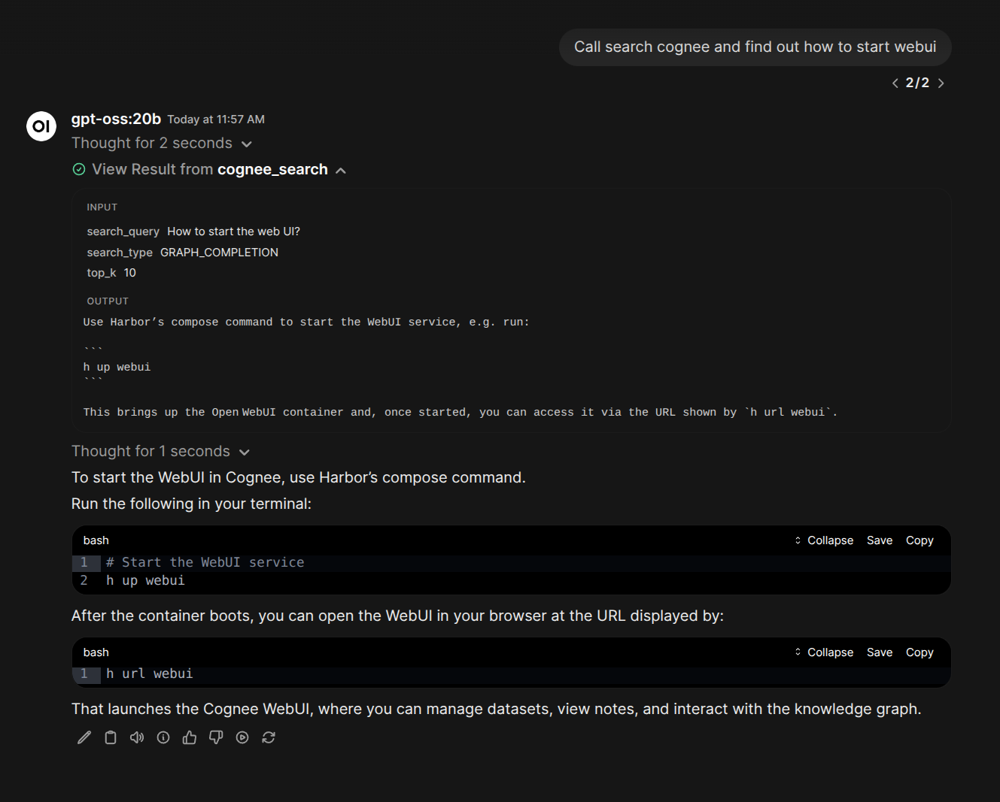

### [Cognee](https://github.com/topoteretes/cognee)

> Handle: `cognee`<br/>
> URL: [http://localhost:34761](http://localhost:34761)



Cognee is an open-source knowledge engine that transforms raw data into persistent, dynamic AI memory for agents. It combines vector search (LanceDB), graph databases (KuzuDB), and relational storage (SQLite) to make documents both searchable by meaning and connected by relationships. All databases are file-based by default -- no external database services required.

Harbor includes both the Cognee API server and a direct-mode Cognee MCP server for IDE integration.

#### Starting

```bash
# Build from source (first build takes several minutes)
harbor build cognee

# Start Cognee (API server + direct-mode MCP server)
# Also starts Ollama with Cognee's validated default models
harbor up cognee
```

- API documentation (Swagger UI) is available at [http://localhost:34761/docs](http://localhost:34761/docs)
- MCP server is available at [http://localhost:34762/mcp](http://localhost:34762/mcp) and exposes the full upstream Harbor-validated tool set in direct mode.
- Authentication is disabled by default -- no registration or login needed.
- `harbor up cognee` brings up the default Ollama backend automatically so the bundled runtime is usable without extra service arguments.
- Harbor will pre-configure Open WebUI to use Cognee MCP when launched together
- For other backends, see [Backend Integration](#backend-integration)

#### Configuration

##### Environment Variables

Following options can be set via [`harbor config`](./3.-Harbor-CLI-Reference.md#harbor-config):

```bash
# API port
HARBOR_COGNEE_HOST_PORT              34761

# Git reference for building from source
HARBOR_COGNEE_GIT_REF               https://github.com/topoteretes/cognee.git#main

# Workspace root for persisted Cognee state shared by the API and MCP containers
HARBOR_COGNEE_WORKSPACE              ./services/cognee/workspace

# LLM configuration (validated Ollama defaults)
HARBOR_COGNEE_LLM_API_KEY           ollama
HARBOR_COGNEE_LLM_MODEL             qwen3.5:9b
HARBOR_COGNEE_LLM_PROVIDER          ollama
HARBOR_COGNEE_LLM_ENDPOINT          http://ollama:11434/v1

# Embedding configuration (Ollama defaults)
HARBOR_COGNEE_EMBEDDING_PROVIDER    ollama
HARBOR_COGNEE_EMBEDDING_MODEL       nomic-embed-text:latest
HARBOR_COGNEE_EMBEDDING_ENDPOINT    http://ollama:11434/api/embed
HARBOR_COGNEE_EMBEDDING_DIMENSIONS  768

# HuggingFace tokenizer (used with Ollama embeddings)
HARBOR_COGNEE_HUGGINGFACE_TOKENIZER nomic-ai/nomic-embed-text-v1.5

# MCP server configuration
HARBOR_COGNEE_MCP_HOST_PORT          34762
HARBOR_COGNEE_MCP_IMAGE              cognee/cognee-mcp
HARBOR_COGNEE_MCP_VERSION            main
```

##### Volumes

Cognee stores its persisted state under `HARBOR_COGNEE_WORKSPACE` using these subdirectories:
- `./services/cognee/workspace/data/` - Data files (LanceDB vectors, KuzuDB graphs, SQLite database)
- `./services/cognee/workspace/system/` - Shared system state used by both the API server and `cognee-mcp`
- `./services/cognee/workspace/cache/` - Cache files

Harbor mounts the workspace root into both containers and points Cognee at those subdirectories. That shared parent mount is required for `prune` to succeed.

#### Backend Integration

Cognee defaults to Ollama for both LLM and embeddings. `harbor up cognee` starts Ollama automatically and pre-pulls Cognee's validated default models. When you add another inference backend, its cross-file overrides the LLM connection while keeping Ollama for embeddings unless you change the embedding settings too.

##### Ollama (default)

`harbor up cognee` already starts the default Ollama backend. You only need to name `ollama` explicitly when composing it with additional services.

##### Other Backends

```bash
# vLLM for LLM, Ollama for embeddings
harbor up cognee vllm ollama

# llama.cpp for LLM, Ollama for embeddings
harbor up cognee llamacpp ollama

# Any OpenAI-compatible backend works
harbor up cognee tabbyapi ollama
harbor up cognee aphrodite ollama
harbor up cognee sglang ollama
```

Supported backends: Ollama, vLLM, llama.cpp, LiteLLM, TabbyAPI, Aphrodite, SGLang, mistral.rs, KTransformers, TGI, LMDeploy, AirLLM, KoboldCpp, Modular MAX, LocalAI, Nexa.

##### Overriding Defaults

```bash
# Change the LLM model
harbor config set cognee.llm_model qwen2.5:7b

# Change the embedding model
harbor config set cognee.embedding_model mxbai-embed-large:latest
harbor config set cognee.embedding_dimensions 1024

# Switch to OpenAI entirely
harbor config set cognee.llm_provider openai
harbor config set cognee.llm_api_key sk-your-key-here
harbor config set cognee.llm_model openai/gpt-4o-mini
harbor config set cognee.llm_endpoint ""
harbor config set cognee.embedding_provider openai
harbor config set cognee.embedding_model openai/text-embedding-3-large
harbor config set cognee.embedding_endpoint ""
harbor config set cognee.embedding_dimensions 3072
```

#### MCP Server

The Cognee MCP server starts automatically alongside the API server. Harbor runs it in direct mode with the same storage, cache, graph, vector, and model configuration as the API container, and serves it over streamable HTTP at [http://localhost:34762/mcp](http://localhost:34762/mcp).

Harbor builds a local MCP image overlay from `HARBOR_COGNEE_MCP_IMAGE:HARBOR_COGNEE_MCP_VERSION` and upgrades the embedded `cognee` package to the same `HARBOR_COGNEE_GIT_REF` that the API service uses. This keeps Alembic migrations aligned between `cognee` and `cognee-mcp`.

##### IDE Configuration

Add the following to your MCP client configuration:

**Claude Code** (`~/.claude.json`):
```json
{
  "mcpServers": {
    "cognee": {
      "type": "streamable-http",
      "url": "http://localhost:34762/mcp"
    }
  }
}
```

**Cursor** (`~/.cursor/mcp.json`):
```json
{
  "mcpServers": {
    "cognee": {
      "url": "http://localhost:34762/mcp"
    }
  }
}
```

#### Troubleshooting

##### Check Logs

```bash
# API server logs
harbor logs cognee

# MCP server logs
harbor logs cognee-mcp
```

##### Rebuild After Source Changes

```bash
harbor down cognee
harbor build cognee --no-cache
harbor up cognee
```

##### Reset Data

```bash
harbor down cognee
rm -rf services/cognee/workspace
harbor up cognee
```

##### Search Prerequisites

`search` only works after the dataset has been added and `cognify` has completed successfully. If Cognee has no processed graph data yet, the API returns `404 Search prerequisites not met`.

For the API workflow, prefer `CHUNKS` first because it avoids completion-time JSON generation:

```bash
curl -X POST http://localhost:34761/api/v1/search \
  -H 'Content-Type: application/json' \
  -d '{"query": "your query", "search_type": "CHUNKS", "datasets": ["notes"]}'
```

If `cognify` or completion-style searches fail because the configured model cannot load or cannot produce valid structured output, switch to a working LLM model:
```bash
harbor config set cognee.llm_model qwen2.5:3b
```

#### Links

- [GitHub Repository](https://github.com/topoteretes/cognee)
- [Official Documentation](https://docs.cognee.ai/)
- [API Reference](http://localhost:34761/docs)
- [MCP Server Docs](https://github.com/topoteretes/cognee/tree/main/cognee-mcp)
