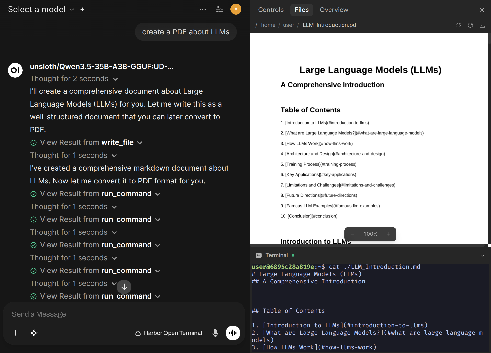

### [Open Terminal](https://github.com/open-webui/open-terminal)

> Handle: `openterminal`<br/>
> URL: [http://localhost:34771](http://localhost:34771)



Open Terminal is a lightweight remote shell and file-management API for AI agents. In Harbor it becomes a practical execution layer for local AI workflows: Open WebUI can talk to it without manual setup, local backends can be reached from inside the terminal with Harbor-provided environment variables, and you can choose between a Harbor-managed sandbox, a mounted host project, or full Docker control.

## Starting

```bash
# Pull the image
harbor pull openterminal

# Start Open Terminal
harbor up openterminal --open
```

- `webui` integration can be pre-wired with the right internal URL and bearer token
- `ollama` and `llamacpp` can be exposed inside the terminal with stable Harbor environment variables
- the default workspace is persisted under Harbor so agent output survives restarts
- host workspace access is opt-in instead of always-on
- Docker socket access is opt-in instead of always-on
- notebook execution stays enabled by default, which is useful for exploratory analysis and artifact generation
- API docs are available at [http://localhost:34771/docs](http://localhost:34771/docs)
- Health endpoint is available at [http://localhost:34771/health](http://localhost:34771/health)
- OpenAPI JSON is available at [http://localhost:34771/openapi.json](http://localhost:34771/openapi.json)
- The Harbor-managed sandbox is mounted at `/home/user`
- If `HARBOR_OPENTERMINAL_API_KEY` is blank, Harbor generates a strong API key on first start and persists it for future runs
- Harbor sets a default execute wait timeout of `5` seconds so short commands often return inline output to Open WebUI instead of only returning a process handle

To inspect the generated key:

```bash
harbor config get openterminal.api.key
```

If you prefer to pin your own key before first start:

```bash
harbor config set openterminal.api.key your-secret-key
harbor up openterminal
```

## Configuration

Following options can be set via [`harbor config`](./3.-Harbor-CLI-Reference.md#harbor-config):

```bash
# Host port for the Open Terminal API and docs UI
HARBOR_OPENTERMINAL_HOST_PORT          34771

# Upstream image
HARBOR_OPENTERMINAL_IMAGE              ghcr.io/open-webui/open-terminal
HARBOR_OPENTERMINAL_VERSION            v0.10.2

# Harbor-managed persistent workspace mounted to /home/user
HARBOR_OPENTERMINAL_WORKSPACE          ./services/openterminal/data

# Bearer token used by Open Terminal and Harbor's WebUI integration
# Blank means Harbor generates and persists one on first use
HARBOR_OPENTERMINAL_API_KEY            ""

# Extra packages installed on container startup
HARBOR_OPENTERMINAL_PACKAGES           ""
HARBOR_OPENTERMINAL_PIP_PACKAGES       ""

# Default number of seconds Open Terminal waits before returning
# background-process polling instead of inline output
HARBOR_OPENTERMINAL_EXECUTE_TIMEOUT    5

# Keep upstream interactive terminal and notebook APIs enabled by default
HARBOR_OPENTERMINAL_ENABLE_TERMINAL    true
HARBOR_OPENTERMINAL_ENABLE_NOTEBOOKS   true

# Optional host project mount, exposed inside the container as /workspace/host
HARBOR_OPENTERMINAL_HOST_WORKSPACE     ""

# Optional Docker socket mount
HARBOR_OPENTERMINAL_DOCKER_SOCKET      false
```

For additional upstream environment variables, use [`harbor env`](./3.-Harbor-CLI-Reference.md#harbor-env-service-key-value) or `services/openterminal/override.env`.

Harbor also injects a runtime `OPEN_TERMINAL_EXECUTE_DESCRIPTION` into the service so Open WebUI receives Harbor-specific hints about the sandbox path, optional host mount, optional Docker access, and any active backend environment variables.

## Volumes and filesystem layout

Harbor mounts the following paths into Open Terminal:

- `HARBOR_OPENTERMINAL_WORKSPACE` → `/home/user` - persistent Harbor-managed working directory
- `HARBOR_OPENTERMINAL_HOST_WORKSPACE` → `/workspace/host` - optional mount of a real host project or folder
- `/var/run/docker.sock` → `/var/run/docker.sock` - optional Docker daemon access when enabled

The default path to use for experiments, generated files, quick scripts, and agent scratch work is `/home/user`. Keep `HARBOR_OPENTERMINAL_HOST_WORKSPACE` empty until you intentionally want the service to touch host files outside Harbor's managed sandbox.

## Open WebUI integration

When `webui` and `openterminal` run together, Harbor mounts a system-level Open Terminal connection into Open WebUI. That connection:

- uses the internal service URL `http://openterminal:8000`
- points Open WebUI at `/openapi.json`
- uses the same Harbor-managed bearer token from `HARBOR_OPENTERMINAL_API_KEY`
- avoids manual copy-paste of terminal URL and key into the UI

Start both services together:

```bash
harbor up webui openterminal
```

## Notebook execution

Upstream Open Terminal includes notebook execution endpoints in current releases, and Harbor leaves them enabled by default.

This is useful when an assistant needs to:

- generate charts or tables as notebook outputs
- iterate on data exploration without building a separate Jupyter stack
- produce richer HTML, image, or LaTeX outputs as part of a task

To disable notebook execution:

```bash
harbor config set openterminal.enable_notebooks false
harbor restart openterminal
```

To re-enable it:

```bash
harbor config set openterminal.enable_notebooks true
harbor restart openterminal
```

## Interactive terminal sessions

Current upstream Open Terminal also exposes PTY-backed interactive terminal sessions. Harbor keeps them enabled by default because they are the most natural fit for Open WebUI's terminal integration.

To disable interactive terminals while still keeping the file and command APIs:

```bash
harbor config set openterminal.enable_terminal false
harbor restart openterminal
```

This can be useful when you want a narrower execution surface for a shared environment.

## Launching preview servers inside Open Terminal

One upstream capability that is especially useful in Harbor is port discovery and proxying for processes started from inside Open Terminal.

Typical workflow:

1. Start `openterminal`
2. Run an app or preview server inside the terminal, for example `python -m http.server 3000`
3. Use the Open Terminal `/ports` endpoint to discover the listening port
4. Reach the app through `/proxy/3000/`

This is a good fit for:

- quick HTML or Markdown previews
- temporary dashboards or notebook exports
- local dev servers created by an agent during a task

The proxy only exposes descendant processes started from Open Terminal itself, which is a sensible default for Harbor use.

## Optional host workspace mount

By default, Open Terminal only sees the Harbor-managed sandbox mounted at `/home/user`.

To additionally expose a real host folder at `/workspace/host`:

```bash
harbor config set openterminal.host.workspace /absolute/path/to/project
harbor restart openterminal
```

After restart, the mounted project will be available at `/workspace/host` inside Open Terminal.

Recommended uses:

- let an assistant inspect or edit a real codebase while keeping `/home/user` as scratch space
- provide access to datasets or documents stored outside Harbor
- run project-specific scripts against a real repository checkout

Use an absolute path when possible so the mount target is unambiguous.

## Optional Docker socket mount

Upstream Open Terminal includes Docker CLI, Compose, and Buildx in the container image. Harbor keeps Docker access disabled by default.

To enable it:

```bash
harbor config set openterminal.docker.socket true
harbor restart openterminal
```

This mounts `/var/run/docker.sock` into the container and gives Open Terminal full access to the host Docker daemon.

Use this only in trusted environments. It effectively removes most of the isolation benefits of running the terminal in a container.

## Optional package installs

You can extend the container at startup without building a custom image.

```bash
harbor config set openterminal.packages "ripgrep fd-find jq"
harbor config set openterminal.pip_packages "httpx polars"
harbor restart openterminal
```

- `HARBOR_OPENTERMINAL_PACKAGES` installs space-separated apt packages
- `HARBOR_OPENTERMINAL_PIP_PACKAGES` installs space-separated Python packages

These packages are installed on each container start, so larger lists will increase startup time. For heavy customization, pin a custom image and update `HARBOR_OPENTERMINAL_IMAGE` and `HARBOR_OPENTERMINAL_VERSION`.

## Harbor-specific capability recipes

These are the most useful ways to use Open Terminal inside Harbor.

### 1. Give Open WebUI a real execution environment

```bash
harbor up webui openterminal ollama --open
```

Use this when you want an assistant to chat in Open WebUI, browse files, upload or download artifacts, run commands, and call a local model from inside the terminal.

Because Harbor injects backend URLs into the terminal container, the same assistant can immediately run follow-up shell commands like `curl "$HARBOR_OLLAMA_URL/api/tags"` without any manual environment setup.

### 2. Keep agent work sandboxed by default

```bash
harbor up openterminal
```

Use `/home/user` for quick scripts, one-off data processing, markdown generation, or code experiments that should stay inside Harbor-managed storage.

### 3. Escalate to a real project only when needed

```bash
harbor config set openterminal.host.workspace /absolute/path/to/project
harbor restart openterminal
```

This is a good fit for coding, refactors, repo analysis, or documentation work where the agent needs access to real files but you still want a clear, explicit opt-in.

### 4. Let the terminal build and run containers

```bash
harbor config set openterminal.docker.socket true
harbor restart openterminal
```

Use this for advanced local automation such as build pipelines, image inspection, containerized test runs, or agent-driven dev workflows. Only enable it when you trust the terminal workload.

### 5. Spin up a temporary app preview from the terminal

```bash
harbor up openterminal
```

Run a lightweight server inside Open Terminal, then access it through the service's port-proxy endpoints. This is useful for quick prototypes, generated reports, and agent-created previews without adding another Harbor service.

## Troubleshooting

### Check the service logs

```bash
harbor logs openterminal
```

### Check health and feature discovery

```bash
curl http://localhost:34771/health
curl -H "Authorization: Bearer $(harbor config get openterminal.api.key)" \
	http://localhost:34771/api/config
```

### Verify the current configuration

```bash
harbor config get openterminal.api.key
harbor config get openterminal.host.workspace
harbor config get openterminal.docker.socket
```

### Restart after changing mounts or packages

```bash
harbor restart openterminal
```

### Reset the Harbor-managed sandbox

```bash
harbor down openterminal
rm -rf services/openterminal/data
harbor up openterminal
```

## Links

- [GitHub Repository](https://github.com/open-webui/open-terminal)
- [Project Website](https://openterminal.sh/)
- [Open WebUI Integration Docs](https://github.com/open-webui/open-terminal#using-with-open-webui)
- [Configuration Reference](https://github.com/open-webui/open-terminal#configuration)
- [Changelog](https://github.com/open-webui/open-terminal/blob/main/CHANGELOG.md)
