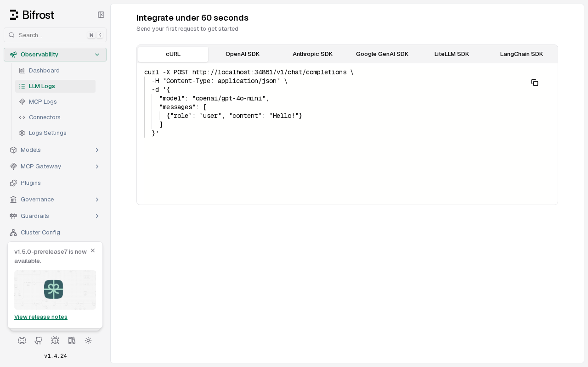

### [Bifrost](https://github.com/maximhq/bifrost)

> Handle: `bifrost`<br/>
> URL: [http://localhost:34861/workspace/logs](http://localhost:34861/workspace/logs)

Bifrost is a high-performance AI gateway that exposes an OpenAI-compatible API over local and remote model providers. Harbor runs it with persistent SQLite-backed configuration and can bootstrap Harbor backends such as Ollama, llama.cpp, Docker Model Runner, MLX, and oMLX as Bifrost providers.



## Starting

```bash
harbor pull bifrost
harbor up bifrost --open
```

The dashboard starts with no required credentials. Configure cloud providers in the UI, or start Bifrost together with Harbor backends to auto-register them:

```bash
harbor up bifrost ollama
harbor up bifrost llamacpp
harbor up bifrost ollama llamacpp
```

Bifrost's OpenAI-compatible endpoint is available at:

```bash
http://localhost:34861/v1
```

From inside the Harbor network, use:

```bash
http://bifrost:8080/v1
```

## Harbor integrations

### Ollama

When `bifrost` and `ollama` run together, Harbor starts a one-shot bootstrap container that registers an `ollama` provider pointing at `${HARBOR_OLLAMA_INTERNAL_URL}`.

Use Bifrost models with the provider prefix, for example:

```bash
curl http://localhost:34861/v1/chat/completions \
  -H 'Content-Type: application/json' \
  -H 'Authorization: Bearer sk-bifrost' \
  -d '{
    "model": "ollama/qwen3.5:4b",
    "messages": [{"role": "user", "content": "hello"}]
  }'
```

### llama.cpp

When `bifrost` and `llamacpp` run together, Harbor registers a custom OpenAI-compatible provider named `llamacpp` pointing at `http://llamacpp:8080`.

```bash
harbor up llamacpp bifrost
```

By default, Harbor discovers model IDs from `http://llamacpp:8080/v1/models` during bootstrap and registers them with Bifrost. Then call models through Bifrost using the `llamacpp/` provider prefix, for example `llamacpp/Qwen3-0.6B-Q4_K_M.gguf`.

### Docker Model Runner

When `bifrost` and `dmr` run together, Harbor registers a custom OpenAI-compatible provider pointing at `http://dmr:8080` using `HARBOR_BIFROST_DMR_*`.

```bash
harbor up dmr bifrost
```

Call models through Bifrost with the `dmr/` prefix, for example `dmr/ai/smollm2`.

### MLX

When `bifrost` and `mlx` run together, Harbor registers MLX at `http://mlx:8080` using `HARBOR_BIFROST_MLX_*`.

```bash
harbor up mlx bifrost
```

Call models through Bifrost with the `mlx/` prefix, for example `mlx/mlx-community/Qwen3.5-4B-4bit`.

### oMLX

When `bifrost` and `omlx` run together, Harbor registers oMLX at `http://omlx:8080` using `HARBOR_BIFROST_OMLX_*`.

```bash
harbor up omlx bifrost
```

Call models through Bifrost with the `omlx/` prefix, for example `omlx/Qwen3.5-4B-4bit`.

### Open WebUI

```bash
harbor up bifrost webui
```

This adds Bifrost to Open WebUI as an OpenAI-compatible backend.

### Harbor Boost

```bash
harbor up bifrost boost
```

This registers Bifrost as a named downstream API for Harbor Boost.

## Configuration

### Environment Variables

Following options can be set via [`harbor config`](./3.-Harbor-CLI-Reference.md#harbor-config):

```bash
HARBOR_BIFROST_HOST_PORT              # Host port for the Bifrost UI/API
HARBOR_BIFROST_IMAGE                  # Container image
HARBOR_BIFROST_VERSION                # Container image tag
HARBOR_BIFROST_WORKSPACE              # Persistent Harbor workspace
HARBOR_BIFROST_APP_PORT               # Internal Bifrost HTTP port
HARBOR_BIFROST_INTERNAL_URL           # Internal Harbor URL for other services
HARBOR_BIFROST_OPEN_URL               # Browser URL opened by `harbor open bifrost`
HARBOR_BIFROST_API_KEY                # Placeholder bearer token used by Harbor clients
HARBOR_BIFROST_LOG_LEVEL              # Bifrost log level
HARBOR_BIFROST_LOG_STYLE              # Bifrost log format
HARBOR_BIFROST_BOOTSTRAP_IMAGE        # Provider bootstrap helper image
HARBOR_BIFROST_BOOTSTRAP_VERSION      # Provider bootstrap helper image tag
HARBOR_BIFROST_OLLAMA_MODELS          # Models allowlist for the auto-registered Ollama key
HARBOR_BIFROST_LLAMACPP_BASE_URL      # Internal llama.cpp base URL registered in Bifrost
HARBOR_BIFROST_LLAMACPP_API_KEY       # API key sent from Bifrost to llama.cpp
HARBOR_BIFROST_LLAMACPP_MODELS        # Models allowlist for llama.cpp; `*` auto-discovers /v1/models
HARBOR_BIFROST_DMR_BASE_URL           # Internal Docker Model Runner base URL registered in Bifrost
HARBOR_BIFROST_DMR_API_KEY            # API key sent from Bifrost to DMR
HARBOR_BIFROST_DMR_MODELS             # Models allowlist for DMR; `*` auto-discovers /v1/models
HARBOR_BIFROST_MLX_BASE_URL           # Internal MLX base URL registered in Bifrost
HARBOR_BIFROST_MLX_API_KEY            # API key sent from Bifrost to MLX
HARBOR_BIFROST_MLX_MODELS             # Models allowlist for MLX; `*` auto-discovers /v1/models
HARBOR_BIFROST_OMLX_BASE_URL          # Internal oMLX base URL registered in Bifrost
HARBOR_BIFROST_OMLX_API_KEY           # API key sent from Bifrost to oMLX
HARBOR_BIFROST_OMLX_MODELS            # Models allowlist for oMLX; `*` auto-discovers /v1/models
```

Harbor also forwards shared provider keys such as `HARBOR_OPENAI_KEY`, `HARBOR_ANTHROPIC_KEY`, `HARBOR_MISTRAL_KEY`, `HARBOR_GROQ_KEY`, and `HARBOR_COHERE_KEY` into the Bifrost container using the environment variable names expected by Bifrost examples.

### Volumes

```bash
${HARBOR_BIFROST_WORKSPACE}:/app/data
```

Bifrost stores its SQLite configuration database, request logs database, and optional `config.json` under `/app/data`.

## Troubleshooting

```bash
harbor logs bifrost
```

Check the health endpoint:

```bash
curl http://localhost:34861/health
```

If a backend was not registered, inspect the bootstrap sidecar logs:

```bash
docker logs harbor.bifrost-ollama-bootstrap
docker logs harbor.bifrost-llamacpp-bootstrap
docker logs harbor.bifrost-dmr-bootstrap
docker logs harbor.bifrost-mlx-bootstrap
docker logs harbor.bifrost-omlx-bootstrap
```

If you already configured Bifrost manually, the bootstrap sidecars update the Harbor-managed provider and key IDs rather than replacing unrelated providers.

## Links

- [Official Documentation](https://docs.getbifrost.ai/)
- [GitHub Repository](https://github.com/maximhq/bifrost)
- [Provider Configuration](https://docs.getbifrost.ai/quickstart/gateway/provider-configuration)
