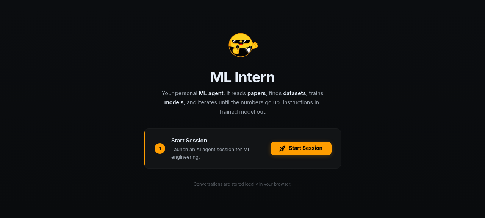

### [ML Intern](https://github.com/huggingface/ml-intern)

> Handle: `ml-intern`<br/>
> URL: [http://localhost:34870](http://localhost:34870)

ML Intern is a Hugging Face ML engineering agent that can research papers, inspect Hugging Face resources, train models, and ship ML-related code. Harbor builds the web/API service from the upstream Dockerfile and wires it to local OpenAI-compatible backends through LiteLLM.



#### Starting

```bash
# Build the image from the upstream GitHub repository
harbor build ml-intern

# Start with Ollama as the default local model backend
harbor up ml-intern ollama --open

# Or start only the web service and configure an external provider
harbor up ml-intern --open
```

The first build clones the upstream repository and builds both the Node frontend and Python backend, so it can take several minutes. The web UI is served on port `7860` inside the container and mapped to `HARBOR_ML_INTERN_HOST_PORT` on the host.

For cloud providers, set the relevant shared Harbor keys before starting:

```bash
harbor config set openai.key sk-...
harbor config set anthropic.key sk-ant-...
harbor config set hf.token hf_...
harbor env ml-intern GITHUB_TOKEN ghp_...
```

#### Configuration

##### Environment Variables

Following options can be set via [`harbor config`](./3.-Harbor-CLI-Reference.md#harbor-config):

```bash
# Host port for the ML Intern web UI/API
HARBOR_ML_INTERN_HOST_PORT=34870

# Upstream Git build context
HARBOR_ML_INTERN_GIT_REF="https://github.com/huggingface/ml-intern.git#main"

# Persistent workspace root
HARBOR_ML_INTERN_WORKSPACE="./services/ml-intern"

# Default model id passed to ML Intern
HARBOR_ML_INTERN_MODEL="ollama/qwen3.5:9b"

# Model names used by Harbor cross-service integrations
HARBOR_ML_INTERN_OLLAMA_MODEL="qwen3.5:9b"
HARBOR_ML_INTERN_LLAMACPP_MODEL="auto"
HARBOR_ML_INTERN_VLLM_MODEL="Qwen/Qwen3.5-4B"

# Shared local LiteLLM fallback endpoint for standalone launches
HARBOR_ML_INTERN_LOCAL_LLM_BASE_URL=""
HARBOR_ML_INTERN_LOCAL_LLM_API_KEY=""

# Optional GitHub token for repository tooling
HARBOR_ML_INTERN_GITHUB_TOKEN=""

# Session trace settings. Harbor disables trace sharing by default.
HARBOR_ML_INTERN_SHARE_TRACES=false
HARBOR_ML_INTERN_SESSION_DATASET_REPO="smolagents/ml-intern-sessions"

# Agent approval defaults
HARBOR_ML_INTERN_YOLO_MODE=false
HARBOR_ML_INTERN_CONFIRM_CPU_JOBS=true
HARBOR_ML_INTERN_AUTO_FILE_UPLOAD=true
```

ML Intern also receives these shared Harbor variables:

| Harbor Variable | Container Variable | Purpose |
|---|---|---|
| `HARBOR_HF_TOKEN` | `HF_TOKEN` | Hugging Face API access and sandbox/Hub operations |
| `HARBOR_HF_CACHE` | `HF_HOME` mount | Shared Hugging Face cache |
| `HARBOR_OPENAI_KEY` | `OPENAI_API_KEY` | OpenAI provider key |
| `HARBOR_ANTHROPIC_KEY` | `ANTHROPIC_API_KEY` | Anthropic provider key |

##### Local Backends

ML Intern uses LiteLLM model prefixes for local providers. Harbor cross-files set the right model id and base URL when the backend is started alongside `ml-intern`.

```bash
# Ollama
harbor up ml-intern ollama

# llama.cpp
harbor up ml-intern llamacpp

# vLLM
harbor up ml-intern vllm
```

The Ollama integration sets `ML_INTERN_MODEL=ollama/${HARBOR_ML_INTERN_OLLAMA_MODEL}` and `OLLAMA_BASE_URL=${HARBOR_OLLAMA_INTERNAL_URL}`. The vLLM integration sets the corresponding `vllm/` model prefix plus an OpenAI-compatible `/v1` endpoint.

The llama.cpp integration defaults to `HARBOR_ML_INTERN_LLAMACPP_MODEL=auto`. On startup, ML Intern queries `http://llamacpp:8080/v1/models` and uses the first advertised model id, which matches llama.cpp router mode. To pin a specific model, list available ids and set the value explicitly:

```bash
harbor llamacpp models
harbor config set ml-intern.llamacpp.model unsloth/Qwen3.5-4B-GGUF:Q4_K_M
harbor restart ml-intern
```

##### Volumes

| Mount | Description |
|---|---|
| `${HARBOR_ML_INTERN_WORKSPACE}/data:/app/session_logs` | ML Intern session logs |
| `${HARBOR_ML_INTERN_WORKSPACE}/workspace:/workspace` | User workspace for files created or edited by the agent |
| `${HARBOR_HF_CACHE}:/home/user/.cache/huggingface` | Shared Hugging Face cache and token storage |
| `./services/ml-intern/config.json:/app/configs/*.json:ro` | Harbor-managed ML Intern config |

Harbor runs an init sidecar before the main container to create and chown the workspace directories for the non-root upstream user.

#### Troubleshooting

```bash
harbor logs ml-intern
harbor down ml-intern
```

If the UI loads but agent calls fail, verify that the selected model has a reachable backend. For Ollama, start with `harbor up ml-intern ollama` and make sure `HARBOR_ML_INTERN_OLLAMA_MODEL` names a model available in Ollama. For llama.cpp, `auto` should resolve to the first `/v1/models` id; set `HARBOR_ML_INTERN_LLAMACPP_MODEL` explicitly if you want a different router model.

If Hugging Face tools fail, set `HARBOR_HF_TOKEN`:

```bash
harbor config set hf.token hf_...
harbor restart ml-intern
```

If GitHub repository operations fail or hit rate limits, set a GitHub token through the service override env:

```bash
harbor env ml-intern GITHUB_TOKEN ghp_...
harbor restart ml-intern
```

#### Links

- [GitHub Repository](https://github.com/huggingface/ml-intern)
- [Hugging Face Space](https://huggingface.co/spaces/smolagents/ml-intern)
- [LiteLLM Providers](https://docs.litellm.ai/docs/providers)
