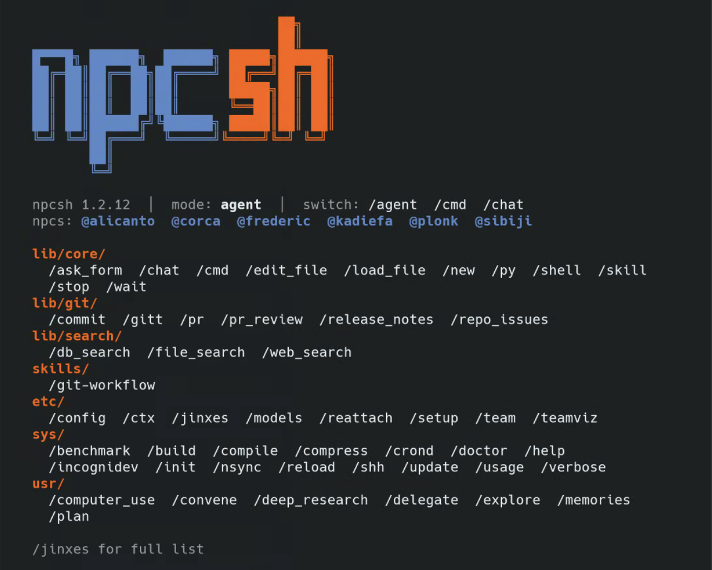

### [npcsh](https://github.com/NPC-Worldwide/npcsh)

> Handle: `npcsh`<br/>
> URL: [http://localhost:34880](http://localhost:34880)



npcsh is an agentic command-line shell for working with NPC teams, jinxes, slash commands, and local or cloud LLM providers. In Harbor it runs as an API service that serves the current NPC team through OpenAI-compatible endpoints, while CLI commands remain available through `harbor exec`.

## Starting

```bash
harbor build npcsh
harbor up npcsh ollama
```

The service listens on `http://localhost:34880` and exposes the npcsh server on port `5337` inside the container.

Use the Harbor launcher for interactive shell/TUI usage or one-shot commands inside the container:

```bash
harbor npcsh
harbor npcsh --help
harbor exec npcsh npc "say hello" --provider ollama --model qwen3.5:4b
```

## Configuration

### Environment Variables

Following options can be set via [`harbor config`](./3.-Harbor-CLI-Reference.md#harbor-config):

```bash
HARBOR_NPCSH_HOST_PORT                    # Host port for the npcsh API server
HARBOR_NPCSH_IMAGE                        # Harbor-built npcsh image name
HARBOR_NPCSH_VERSION                      # Harbor-built npcsh image tag
HARBOR_NPCSH_BASE_IMAGE                   # Base image used to build the service
HARBOR_NPCSH_BASE_VERSION                 # Base image tag used to build the service
HARBOR_NPCSH_PACKAGE_VERSION              # npcsh PyPI package version, or latest
HARBOR_NPCSH_WORKSPACE                    # Persistent npcsh data root
HARBOR_NPCSH_MODEL                        # Default chat model
HARBOR_NPCSH_PROVIDER                     # Default chat provider
HARBOR_NPCSH_VISION_MODEL                 # Default vision model
HARBOR_NPCSH_VISION_PROVIDER              # Default vision provider
HARBOR_NPCSH_EMBEDDING_MODEL              # Default embedding model
HARBOR_NPCSH_EMBEDDING_PROVIDER           # Default embedding provider
HARBOR_NPCSH_REASONING_MODEL              # Default reasoning model
HARBOR_NPCSH_REASONING_PROVIDER           # Default reasoning provider
HARBOR_NPCSH_DEFAULT_MODE                 # npcsh shell mode used by CLI prompts
HARBOR_NPCSH_CORS                         # Comma-separated API CORS origins, or *
HARBOR_NPCSH_STREAM_OUTPUT                # Enable streaming output in CLI commands
HARBOR_NPCSH_BUILD_KG                     # Enable automatic knowledge graph building
HARBOR_NPCSH_API_URL                      # OpenAI-compatible base URL for openai-like providers
HARBOR_NPCSH_OLLAMA_MODEL                 # Chat model used by the Ollama integration
HARBOR_NPCSH_OLLAMA_VISION_MODEL          # Vision model used by the Ollama integration
HARBOR_NPCSH_OLLAMA_EMBEDDING_MODEL       # Embedding model used by the Ollama integration
HARBOR_NPCSH_OLLAMA_REASONING_MODEL       # Reasoning model used by the Ollama integration
HARBOR_NPCSH_LLAMACPP_MODEL               # Model id used by the llama.cpp integration
HARBOR_NPCSH_VLLM_MODEL                   # Model id used by the vLLM integration
```

Cloud provider keys are inherited from Harbor's global key settings where supported:

```bash
harbor config set openai.key sk-...
harbor config set anthropic.key sk-ant-...
harbor config set google.key ...
harbor config set deepseek.api.key ...
```

### Volumes

- `${HARBOR_NPCSH_WORKSPACE}/home` -> `/root/.npcsh` - persistent NPC team, jinxes, and npcsh home data.
- `${HARBOR_NPCSH_WORKSPACE}/data` -> `/data` - SQLite history and vector database files.
- `${HARBOR_NPCSH_WORKSPACE}/workspace` -> `/workspace` - default working directory for the running server.

## Harbor Integrations

Start npcsh with a Harbor backend to automatically configure its provider and model environment:

```bash
harbor up npcsh ollama
harbor up npcsh llamacpp
harbor up npcsh vllm
```

Available cross-service files:

| Backend | Cross-file | Provider |
|---------|------------|----------|
| Ollama | `compose.x.npcsh.ollama.yml` | `ollama` |
| llama.cpp | `compose.x.npcsh.llamacpp.yml` | `openai-like` |
| vLLM | `compose.x.npcsh.vllm.yml` | `openai-like` |

For llama.cpp and vLLM, npcsh uses `NPCSH_API_URL` to point at the backend's OpenAI-compatible `/v1` API.

## Frontend Integrations

npcsh can be added to Harbor LLM frontends and gateways:

| Frontend | Cross-file |
|----------|------------|
| Open WebUI | `compose.x.webui.npcsh.yml` |
| ChatUI | `compose.x.chatui.npcsh.yml` |
| LiteLLM | `compose.x.litellm.npcsh.yml` |

The Harbor wrapper adapts frontend chat calls so selecting an NPC model such as `sibiji` routes the request to that NPC while using the configured backend model.

## API

The npcsh server exposes OpenAI-compatible endpoints for NPC teams:

```bash
curl http://localhost:34880/v1/models

curl http://localhost:34880/v1/chat/completions \
  -H 'Content-Type: application/json' \
  -d '{
    "model": "qwen3.5:4b",
    "agent": "sibiji",
    "messages": [{"role": "user", "content": "say hello"}]
  }'
```

When called by frontends, the Harbor wrapper also accepts NPC names such as `sibiji` in the `model` field and maps them to the configured backend model automatically.

## Troubleshooting

```bash
docker logs harbor.npcsh
harbor exec npcsh npc --help
```

If npcsh starts but model calls fail, verify the backend integration is running and the configured model exists in that backend.

```bash
harbor config get npcsh.ollama.model
harbor config get npcsh.llamacpp.model
harbor config get npcsh.vllm.model
```

## Links

- [Official Documentation](https://npc-shell.readthedocs.io/)
- [GitHub Repository](https://github.com/NPC-Worldwide/npcsh)
