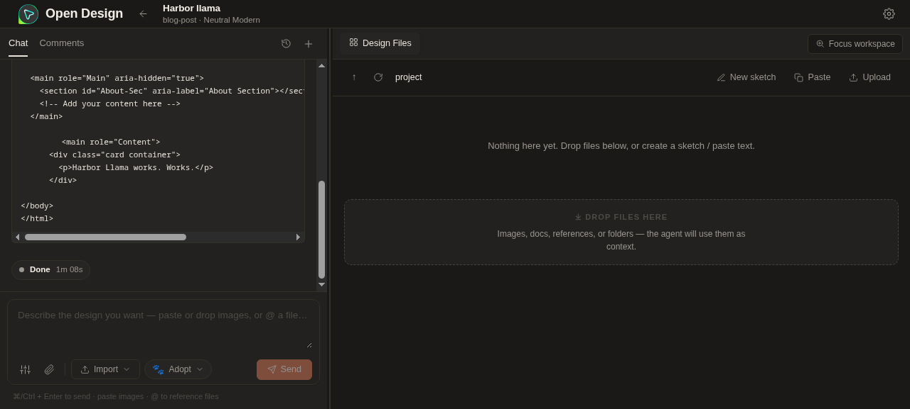

### [Open Design](https://github.com/nexu-io/open-design)

> Handle: `open-design`<br/>
> URL: [http://localhost:34900](http://localhost:34900)



Open Design is a local-first design artifact workspace for prototypes, decks, dashboards, posters, mobile screens, and other visual outputs. It serves a web UI and daemon from one container, persists projects in `.od`, and can use BYOK cloud APIs or Harbor Ollama as the model provider.

## Starting

```bash
harbor pull open-design
harbor up open-design --open
```

Open Design starts at `http://localhost:34900`. On first launch, open Settings and configure a model provider if you run the service by itself.

For a fully local Harbor model path, start it with Ollama:

```bash
harbor up open-design ollama --open
```

When Open Design starts with Ollama, Harbor configures the browser app for:

```bash
Provider: OpenAI-compatible
Base URL: http://127.0.0.1:11434/v1
API key: ollama
Model: llama3.2:1b
```

The `127.0.0.1:11434` URL is inside the Open Design container. Harbor runs a small loopback proxy in the same network namespace and forwards it to the `ollama` service, which keeps Open Design inside its upstream SSRF protections while still making the Harbor backend usable. Open Design talks to Ollama through Ollama's OpenAI-compatible `/v1` API.

## Configuration

### Environment Variables

Following options can be set via [`harbor config`](./3.-Harbor-CLI-Reference.md#harbor-config):

```bash
HARBOR_OPEN_DESIGN_HOST_PORT             # Host port for the Open Design web UI and API
HARBOR_OPEN_DESIGN_IMAGE                 # Open Design runtime image
HARBOR_OPEN_DESIGN_VERSION               # Open Design image tag
HARBOR_OPEN_DESIGN_WORKSPACE             # Persistent data root
HARBOR_OPEN_DESIGN_ALLOWED_ORIGINS       # Comma-separated browser origins allowed to call /api
HARBOR_OPEN_DESIGN_MEM_LIMIT             # Compose memory limit
HARBOR_OPEN_DESIGN_NODE_OPTIONS          # Node.js runtime options
HARBOR_OPEN_DESIGN_API_PROTOCOL          # First-run provider protocol when started without an integration
HARBOR_OPEN_DESIGN_BASE_URL              # First-run provider base URL
HARBOR_OPEN_DESIGN_API_KEY               # First-run provider API key
HARBOR_OPEN_DESIGN_MODEL                 # First-run provider model
HARBOR_OPEN_DESIGN_PROVIDER_BASE_URL     # First-run provider preset URL
HARBOR_OPEN_DESIGN_FORCE_DEFAULTS        # Overwrite existing browser provider config on load
HARBOR_OPEN_DESIGN_OLLAMA_MODEL          # Model used by the Harbor Ollama integration
HARBOR_OPEN_DESIGN_LLAMACPP_MODEL        # Model id sent to the Harbor llama.cpp integration
HARBOR_OPEN_DESIGN_VLLM_MODEL            # Model id sent to the Harbor vLLM integration
```

Example:

```bash
harbor config set open-design.ollama.model llama3.2:1b
harbor config set open-design.force.defaults true
harbor up open-design ollama --open
```

Set `open-design.force.defaults` back to `false` after forcing a one-time browser reconfiguration.

### Volumes

- `${HARBOR_OPEN_DESIGN_WORKSPACE}/data` -> `/app/.od` - Open Design projects, SQLite database, app config, and runtime data.
- `services/open-design/start.sh` -> `/usr/local/bin/harbor-open-design-start.sh` - Harbor entrypoint that injects first-run provider defaults before starting the upstream daemon.

## Harbor Integrations

Open Design can use Harbor Ollama as its local model provider:

```bash
harbor up open-design ollama
harbor up open-design llamacpp
harbor up open-design vllm
```

Available cross-service files:

| Backend | Cross-file | Behavior |
|---------|------------|----------|
| Ollama | `compose.x.open-design.ollama.yml` | Adds a loopback proxy at `127.0.0.1:11434` inside Open Design and preconfigures the app for `HARBOR_OPEN_DESIGN_OLLAMA_MODEL` through Ollama's OpenAI-compatible `/v1` API |
| llama.cpp | `compose.x.open-design.llamacpp.yml` | Preconfigures Open Design for `http://llamacpp:8080/v1` with `HARBOR_OPEN_DESIGN_LLAMACPP_MODEL` |
| vLLM | `compose.x.open-design.vllm.yml` | Preconfigures Open Design for `http://vllm:8000/v1` with `HARBOR_OPEN_DESIGN_VLLM_MODEL` |

`HARBOR_OPEN_DESIGN_LLAMACPP_MODEL=auto` asks Open Design's Harbor startup shim to read the first model advertised by llama.cpp's `/v1/models` endpoint and use that in the browser config.

Open Design's upstream container does not bundle local coding-agent CLIs such as Codex, Claude Code, Gemini CLI, or OpenCode. Use the BYOK provider path for Harbor-managed container runs.

If the browser already has older Open Design settings, either update Settings manually or force the Harbor defaults once:

```bash
harbor config set open-design.force.defaults true
harbor up open-design llamacpp --open
harbor config set open-design.force.defaults false
```

## Security

The upstream deploy guide warns that Open Design's API is unauthenticated for non-browser clients. Harbor publishes the service on the configured host port for local use. If exposing it through a domain, public IP, or reverse proxy, set allowed origins explicitly:

```bash
harbor config set open-design.allowed.origins "https://od.example.com,http://203.0.113.10:34900"
```

## Troubleshooting

```bash
docker logs harbor.open-design
docker logs harbor.open-design-ollama-proxy
```

If the UI opens but model calls fail with an upstream or provider error:

```bash
harbor config get open-design.ollama.model
harbor ollama list
```

Pull or choose a model that exists in Ollama, then restart:

```bash
harbor ollama pull llama3.2:1b
harbor up open-design ollama
```

If the browser already has different Open Design provider settings, either update Settings manually or force Harbor defaults once:

```bash
harbor config set open-design.force.defaults true
harbor up open-design ollama --open
harbor config set open-design.force.defaults false
```

## Links

- [Official Deployment Guide](https://github.com/nexu-io/open-design/tree/main/deploy)
- [GitHub Repository](https://github.com/nexu-io/open-design)
