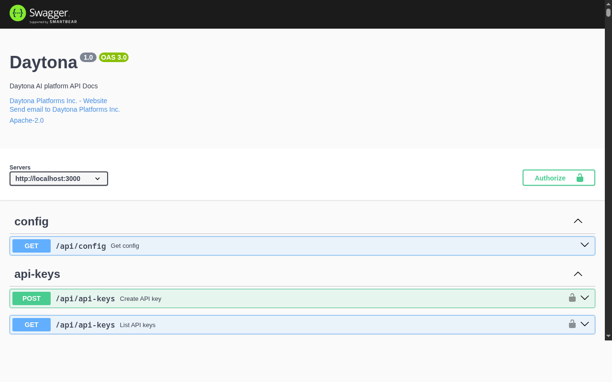

### [Daytona](https://github.com/daytonaio/daytona)

> Handle: `daytona`<br/>
> URL: [http://localhost:35000](http://localhost:35000)



Daytona is a self-hosted sandbox platform for AI agents. It provides isolated environments with Docker-in-Docker support, desktop computer use (screenshot, mouse, keyboard via API), and GPU passthrough. Sandboxes are managed via REST API, Python/TypeScript SDKs, or the Daytona CLI with MCP integration for Claude Code.

#### Starting

```bash
# Pull the images (14 containers)
harbor pull daytona

# Start Daytona
harbor up daytona --open
```

- Default credentials: `dev@daytona.io` / `password` (via Dex OIDC; login is by email)
- Email: `dev@daytona.io`
- Admin API key: configured via `HARBOR_DAYTONA_ADMIN_API_KEY`
- The dashboard is available at `http://localhost:35000/dashboard`

#### Connecting the CLI

```bash
# Point the Daytona CLI at the local instance
daytona login --api-key $(harbor config get daytona.admin_api_key)
```

#### Configuration

##### Environment Variables

Following options can be set via [`harbor config`](./3.-Harbor-CLI-Reference.md#harbor-config):

```bash
# Ports
HARBOR_DAYTONA_HOST_PORT               35000   # API + Dashboard
HARBOR_DAYTONA_PROXY_HOST_PORT         35001   # Sandbox preview proxy
HARBOR_DAYTONA_RUNNER_HOST_PORT        35002   # Runner API
HARBOR_DAYTONA_SSH_HOST_PORT           35003   # SSH gateway
HARBOR_DAYTONA_DEX_HOST_PORT           35006   # OIDC provider
HARBOR_DAYTONA_DB_HOST_PORT            35007   # PostgreSQL
HARBOR_DAYTONA_PGADMIN_HOST_PORT       35008   # pgAdmin UI
HARBOR_DAYTONA_REGISTRY_HOST_PORT      35009   # Container registry
HARBOR_DAYTONA_REGISTRY_UI_HOST_PORT   35010   # Registry browser
HARBOR_DAYTONA_MINIO_HOST_PORT         35011   # S3-compatible storage
HARBOR_DAYTONA_MINIO_CONSOLE_HOST_PORT 35012   # MinIO console
HARBOR_DAYTONA_JAEGER_HOST_PORT        35013   # Tracing UI
HARBOR_DAYTONA_MAILDEV_HOST_PORT       35014   # Mail capture UI

# Images
HARBOR_DAYTONA_IMAGE                   daytonaio/daytona-api
HARBOR_DAYTONA_VERSION                 latest
HARBOR_DAYTONA_PROXY_IMAGE             daytonaio/daytona-proxy
HARBOR_DAYTONA_PROXY_VERSION           latest
HARBOR_DAYTONA_RUNNER_IMAGE            daytonaio/daytona-runner
HARBOR_DAYTONA_RUNNER_VERSION          latest
HARBOR_DAYTONA_SSH_IMAGE               daytonaio/daytona-ssh-gateway
HARBOR_DAYTONA_SSH_VERSION             latest

# Database
HARBOR_DAYTONA_DB_USER                 user
HARBOR_DAYTONA_DB_PASSWORD             pass
HARBOR_DAYTONA_DB_NAME                 daytona

# Security
HARBOR_DAYTONA_ENCRYPTION_KEY          supersecretkey
HARBOR_DAYTONA_ENCRYPTION_SALT         supersecretsalt
HARBOR_DAYTONA_ADMIN_API_KEY           harbor-daytona-admin-key

# Sandbox defaults
HARBOR_DAYTONA_DEFAULT_SNAPSHOT        daytonaio/sandbox:v0.185.0-amd64

# Workspace
HARBOR_DAYTONA_WORKSPACE               ./services/daytona/data
```

##### SSH Gateway Keys

The SSH gateway (`daytona-ssh`, published on `HARBOR_DAYTONA_SSH_HOST_PORT`) requires an RSA gateway keypair and a host key. Harbor does not ship any keys — on the first `harbor up daytona`, unique per-install keys are generated with `ssh-keygen` and persisted (base64-encoded) to your `.env` as:

- `HARBOR_DAYTONA_SSH_GATEWAY_PRIVATE_KEY` / `HARBOR_DAYTONA_SSH_GATEWAY_PUBLIC_KEY`
- `HARBOR_DAYTONA_SSH_HOST_KEY`

`ssh-keygen` (OpenSSH client) must be installed on the host; Harbor aborts startup with instructions if it is missing. To rotate keys, clear all three values (`harbor config set daytona.ssh_gateway_private_key ""`, etc.) and run `harbor up daytona` again.

##### Volumes

Daytona persists data in the following directories:
- `services/daytona/data/db/` - PostgreSQL database
- `services/daytona/data/dex/` - Dex OIDC state
- `services/daytona/data/registry/` - Container image registry
- `services/daytona/data/minio/` - S3-compatible object storage

#### Architecture

The service runs 14 containers:

| Container | Role |
|---|---|
| `daytona` | API server + dashboard |
| `daytona-proxy` | Sandbox preview URL proxy |
| `daytona-runner` | Sandbox lifecycle manager (privileged) |
| `daytona-ssh` | SSH gateway for sandbox access |
| `daytona-dex` | OIDC identity provider |
| `daytona-db` | PostgreSQL database |
| `daytona-pgadmin` | Database admin UI |
| `daytona-redis` | Cache and queue |
| `daytona-registry` | Container image registry |
| `daytona-registry-ui` | Registry browser |
| `daytona-minio` | S3-compatible object storage |
| `daytona-jaeger` | Distributed tracing UI |
| `daytona-otel` | OpenTelemetry collector |
| `daytona-maildev` | Mail capture for dev |

#### Troubleshooting

```bash
# Check API server logs
harbor logs daytona

# Check runner logs (sandbox creation issues)
harbor logs daytona-runner
```

##### Database Issues

```bash
harbor down daytona
rm -rf services/daytona/data/db
harbor up daytona
```

##### Dex Port Mismatch

The Dex OIDC config at `services/daytona/dex/config.yaml` has hardcoded port numbers. If you change `HARBOR_DAYTONA_HOST_PORT`, `HARBOR_DAYTONA_PROXY_HOST_PORT`, or `HARBOR_DAYTONA_DEX_HOST_PORT`, update the corresponding values in that file.

##### Snapshot Stuck in "pending"

Daytona's runner scheduler considers host disk usage when assigning work. If host disk usage exceeds ~80%, the default snapshot initialization will loop with `"No available runners"` errors even though the runner is registered and healthy. Free up disk space (`docker system prune -f`) to bring usage below 80%, then restart:

```bash
harbor down daytona
rm -rf services/daytona/data/db
harbor up daytona
```

##### Dex Permission Denied

On first start, the Dex container may fail with "Permission denied" because Docker creates `services/daytona/data/dex/` as root but Dex runs as UID 1001. Fix:

```bash
docker run --rm -v ./services/daytona/data:/data alpine:3.20 chown -R 1001:1001 /data/dex
harbor up daytona
```

#### Links

- [Official Documentation](https://www.daytona.io/docs/)
- [GitHub Repository](https://github.com/daytonaio/daytona)
- [Python SDK](https://pypi.org/project/daytona/)
- [MCP Server Docs](https://www.daytona.io/docs/en/mcp/)
- [Computer Use Docs](https://www.daytona.io/docs/en/computer-use/)
