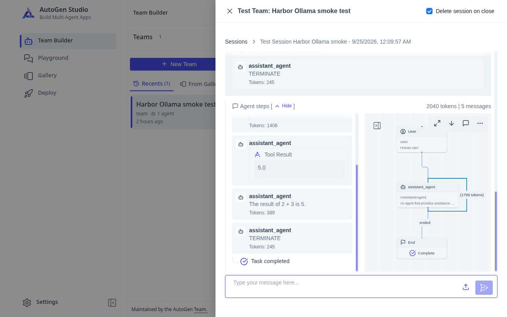

### [AutoGen Studio](https://github.com/microsoft/autogen/tree/main/python/packages/autogen-studio)

> Handle: `autogenstudio`<br/>
> URL: [http://localhost:34960](http://localhost:34960)



AutoGen Studio is a low-code interface for prototyping agents and multi-agent workflows. Harbor builds the [published `autogenstudio` Python package](https://pypi.org/project/autogenstudio/) into an isolated container.

#### Starting

```bash
harbor build autogenstudio
harbor up autogenstudio --open
```

No account is required by the app. AutoGen Studio is a research prototype **without authentication**, so Harbor binds its port to `127.0.0.1` by default. Do not expose it to an untrusted network. It can execute agent tools and reach other Harbor services on `harbor-network`.

#### Configuration

The defaults are in `services/autogenstudio/default.env`. Set them with `harbor config set` and run `harbor config update` after changing defaults in a checkout:

```bash
HARBOR_AUTOGENSTUDIO_HOST_PORT=34960
HARBOR_AUTOGENSTUDIO_BIND_ADDRESS=127.0.0.1
HARBOR_AUTOGENSTUDIO_IMAGE="harbor/autogenstudio"
HARBOR_AUTOGENSTUDIO_VERSION="0.4.2.2"
HARBOR_AUTOGENSTUDIO_WORKSPACE="./services/autogenstudio/data"
```

The workspace is mounted at `/data`, where Studio stores its SQLite database and generated files. `harbor down autogenstudio` leaves the workspace intact. To pass additional environment variables, use `harbor env autogenstudio <KEY> <VALUE>`.

#### Local models

Start a Harbor Ollama model alongside Studio:

```bash
harbor up autogenstudio ollama
harbor ollama pull qwen3:4b
```

In **Team Builder**, select a team and switch **Visual Builder** to **View JSON**. Set the participant's `model_client.config` to a Harbor Ollama model, then click **Save Changes**:

```json
{
  "model": "qwen3:4b",
  "api_key": "ollama",
  "base_url": "http://ollama:11434/v1",
  "model_info": {
    "vision": false,
    "function_calling": true,
    "json_output": false,
    "family": "unknown",
    "structured_output": true
  }
}
```

These are the fields inside `model_client.config`, not a replacement for the whole team JSON. Ollama does not check the API key. Match `model_info` capabilities to the selected model. The URL uses Docker's internal `ollama` hostname, not `localhost`, because Studio runs in its own container. See [AutoGen's model-client guidance](https://microsoft.github.io/autogen/stable/user-guide/autogenstudio-user-guide/faq.html).

#### Troubleshooting

If the UI fails to start, inspect `docker logs harbor.autogenstudio` for the package or database error. If a local model cannot be reached, confirm Ollama is running with `harbor ps` and check that the model base URL uses `http://ollama:11434/v1`.

#### Links

- [AutoGen Studio installation](https://microsoft.github.io/autogen/stable/user-guide/autogenstudio-user-guide/installation.html)
- [AutoGen source](https://github.com/microsoft/autogen)
