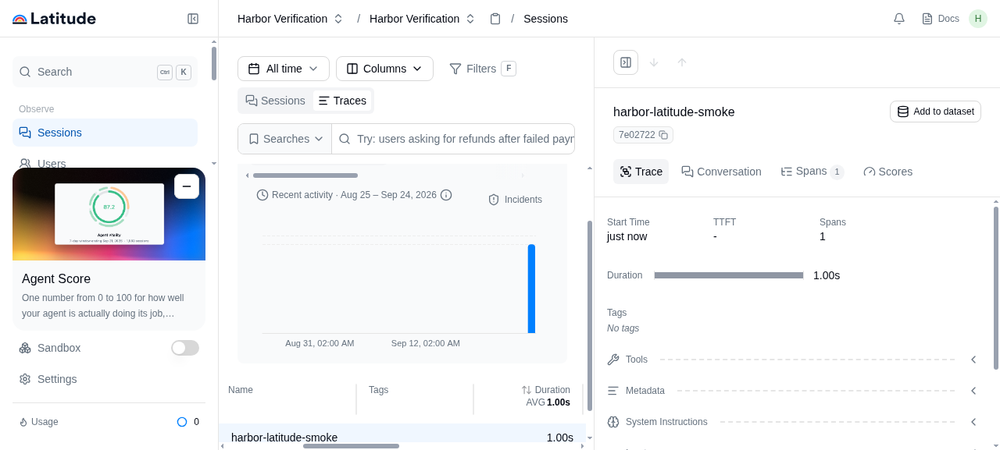

### [Latitude](https://github.com/latitude-dev/latitude-llm)

> Handle: `latitude`<br/>
> Web UI: [http://localhost:34960](http://localhost:34960)<br/>
> API: [http://localhost:34961](http://localhost:34961)<br/>
> Trace ingest: [http://localhost:34962](http://localhost:34962)



Latitude collects traces from AI agents, groups failures into signals, and supports evaluations and regression testing. Harbor runs the [official single-host Latitude images](https://docs.latitude.so/deployment/single-host) with local datastores and a Mailpit inbox for the sign-in email.

#### Starting

```bash
harbor up latitude
harbor open latitude
```

The first start pulls the application and datastore images and runs PostgreSQL and ClickHouse migrations before the web UI becomes healthy. Open [Mailpit](http://localhost:34963) after entering your email on the Latitude sign-in page, then follow the magic link in the message to create your first organization. Mailpit is local to this stack; no external mail account is required.

Once signed in, create an API key in Latitude and point an [instrumented application](https://docs.latitude.so/guides/getting-started/start-tracing) at the API and ingest URLs above. The core trace collection and viewing flow works without any AI provider credentials. AI features such as signal summaries and evaluations require a configured provider.

```bash
harbor down latitude
```

#### Configuration

These defaults live in `services/latitude/default.env` and can be changed with `harbor config set`. Harbor creates the six blank secrets on the first `harbor up latitude` and stores them in the active Harbor configuration. Keep those values stable after data has been created.

```bash
HARBOR_LATITUDE_IMAGE                       latitudedata/web
HARBOR_LATITUDE_VERSION                     latest
HARBOR_LATITUDE_HOST_IP                     127.0.0.1
HARBOR_LATITUDE_HOST_PORT                   34960
HARBOR_LATITUDE_API_HOST_PORT               34961
HARBOR_LATITUDE_INGEST_HOST_PORT            34962
HARBOR_LATITUDE_MAILPIT_HOST_PORT           34963
HARBOR_LATITUDE_WEB_URL                     auto (localhost + web port)
HARBOR_LATITUDE_API_URL                     auto (localhost + API port)
HARBOR_LATITUDE_INGEST_URL                  auto (localhost + ingest port)
HARBOR_LATITUDE_TRUSTED_ORIGINS             auto (web URL)
HARBOR_LATITUDE_CORS_ALLOWED_ORIGINS        auto (web URL)
HARBOR_LATITUDE_POSTGRES_PASSWORD           generated
HARBOR_LATITUDE_POSTGRES_RUNTIME_PASSWORD   generated
HARBOR_LATITUDE_CLICKHOUSE_PASSWORD         generated
HARBOR_LATITUDE_STORAGE_SECRET              generated
HARBOR_LATITUDE_MASTER_ENCRYPTION_KEY       generated
HARBOR_LATITUDE_BETTER_AUTH_SECRET          generated
```

The four published ports bind to `127.0.0.1` by default. To expose Latitude to other users, change `HARBOR_LATITUDE_HOST_IP`, configure a reverse proxy, and set the five public URL and origin keys above to the proxy addresses. See the [upstream deployment guide](https://docs.latitude.so/deployment/single-host#custom-domain) for the required URL relationships.

To use an external email transport instead of Mailpit, set the appropriate `LAT_SMTP_*`, `LAT_MAILGUN_*`, or `LAT_SENDGRID_*` variables in `services/latitude/override.env` with `harbor env latitude`. The app services all read that override file. For optional AI features, configure Latitude's `LAT_CUSTOM_AI_*` variables there, or use any of the [provider settings](https://docs.latitude.so/deployment/configuration).

##### Storage and services

Harbor creates Docker volumes for Latitude's PostgreSQL database, ClickHouse data, BullMQ queue, and SeaweedFS object store. They survive `harbor down latitude` and subsequent starts. SeaweedFS creates the Latitude bucket on startup if it is missing. Back up all four volumes together before upgrading. Redis cache is disposable. The application services are `latitude`, `latitude-api`, `latitude-ingest`, `latitude-workers`, and `latitude-workflows`; `latitude-migrations` runs once at startup. The stack also includes PostgreSQL, ClickHouse, two Redis instances, Temporal, SeaweedFS, and Mailpit.

#### Troubleshooting

```bash
harbor ps latitude
docker logs harbor.latitude
docker logs harbor.latitude-migrations
docker logs harbor.latitude-postgres
docker logs harbor.latitude-clickhouse
```

If the sign-in email is missing, check [Mailpit](http://localhost:34963) and `docker logs harbor.latitude-mailpit`. If the web UI remains unavailable, inspect the migrations container first: the application services wait for it to finish successfully.

#### Links

- [Latitude single-host deployment](https://docs.latitude.so/deployment/single-host)
- [Latitude source](https://github.com/latitude-dev/latitude-llm)
