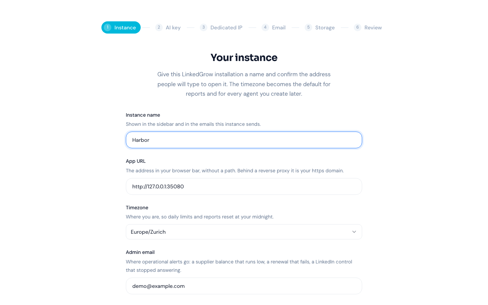

### [LinkedGrow](https://github.com/DigiHold/LinkedGrow)

> Handle: `linkedgrow`<br/>
> URL: [http://localhost:35080](http://localhost:35080)



LinkedGrow runs AI agents that find leads and clients on LinkedIn. You describe who you sell to, and an agent goes looking for those people where they already are: under a competitor's post, inside a search you trust, among the people who reacted to a topic. It reads each profile, scores the fit, sends an invitation, and once the person accepts it runs a short conversation in your name and hands you the ones who want to talk. The posting side comes with it, including a generator, a calendar and the analytics it reads back off your own posts.

There is no LinkedIn API for any of this. Every action happens in a real Chrome, signed in to the account you connected, driven by the worker container under Xvfb at a human pace. That choice is what the resource footprint below is about.

**Key Features:**
- **Lead discovery**: mines post reactions, comments and searches for people matching a customer profile you describe
- **Scoring and outreach**: reads the profile, scores the fit, sends the invitation, then runs a follow up conversation
- **Publishing**: draft generator, an editor that scores hook and length, and a calendar that hands posts to LinkedIn's own scheduler
- **Analytics**: impressions, reactions, comments and follower count read off your own posts, never estimated
- **MCP server**: 26 tools behind one URL and one key, so an assistant can drive the agents and the leads

#### Starting

```bash
# Pull the images
harbor pull linkedgrow

# Start LinkedGrow
harbor up linkedgrow --open
```

- On the first start, create an account via **Sign Up**. That first account is the administrator. Sign ups stay open until the setup wizard finishes, and after that a new account needs the administrator to reopen them, so finish the wizard before the instance is reachable by anyone else.
- The setup wizard then runs, and it does not finish without an AI key. Pick Anthropic, OpenAI, Google, Grok or Kimi and paste a key of your own. The agents run on it, under the daily and monthly ceilings the same screen sets.
- **The agents cannot use a Harbor backend.** LinkedGrow calls its five providers at their own addresses and has no configurable base URL, so there is no Ollama or llama.cpp cross-file for this service and pointing it at one is not possible today. This is the one integration a Harbor user reasonably expects and does not get.
- LinkedGrow starts with two auxiliary containers: `linkedgrow-db` (libSQL) and `linkedgrow-worker` (the browser side). The worker waits for the app's health check, because the app applies the migrations and writes the secrets both containers read.
- Connecting a LinkedIn account asks for that account's own credentials and, for anything beyond a look around, an address reserved for it. Read the project's documentation before pointing it at an account that matters to you.

#### Configuration

##### Environment Variables

Following options can be set via [`harbor config`](./3.-Harbor-CLI-Reference.md#harbor-config) or in `services/linkedgrow/override.env`:

```bash
# Web UI port
HARBOR_LINKEDGROW_HOST_PORT           35080

# Images and tag. The worker image carries Chrome, so it is the large one
HARBOR_LINKEDGROW_IMAGE               ghcr.io/digihold/linkedgrow
HARBOR_LINKEDGROW_WORKER_IMAGE        ghcr.io/digihold/linkedgrow-worker
HARBOR_LINKEDGROW_VERSION             latest
HARBOR_LINKEDGROW_DB_IMAGE            ghcr.io/tursodatabase/libsql-server
HARBOR_LINKEDGROW_DB_VERSION          latest


# Empty means the app answers on whatever address the request arrived on.
# Set it behind a reverse proxy, because the links in its emails use it
HARBOR_LINKEDGROW_PUBLIC_URL          ""

# Generated into the config workspace on the first start and read back after,
# so empty is the working default
HARBOR_LINKEDGROW_AUTH_SECRET         ""
HARBOR_LINKEDGROW_ENCRYPTION_KEY      ""

# Concurrent LinkedIn browsers the worker may open
HARBOR_LINKEDGROW_WORKER_SLOTS        2

# Shared memory for the worker's Chrome processes
HARBOR_LINKEDGROW_SHM_SIZE            2gb
```

##### Resources

The worker is where the cost sits, and `HARBOR_LINKEDGROW_WORKER_SLOTS` is the dial. Two slots fit in about 4GB of RAM and twelve want 16GB, so raise it only on a machine that has the room. `HARBOR_LINKEDGROW_SHM_SIZE` exists because Chrome crashes on a full `/dev/shm` and Docker's 64m default is not enough for it.

##### Secrets

`AUTH_SECRET` and `ENCRYPTION_KEY` are written into `secrets.env` inside the `linkedgrow-config` volume on the first start, and read back on every later one. Back that volume up with the database. `ENCRYPTION_KEY` is what every stored LinkedIn password, 2FA secret and API key is encrypted with, so restoring a backup without the original value leaves all of them unreadable. Setting `HARBOR_LINKEDGROW_ENCRYPTION_KEY` overrides the file, which is how you put the original back; it has to be exactly 64 hex characters or the app refuses to boot and says so.

##### Volumes

Both LinkedGrow images run as uid 10001 and refuse to start on a directory they cannot write, so this service uses named volumes rather than a workspace bind mount: Docker gives a fresh named volume the image's own ownership, while a bind mount target is created root owned and cannot be fixed portably from a sidecar.

- `linkedgrow-config` the generated secrets, mounted read only into the worker
- `linkedgrow-uploads` media attached to posts
- `linkedgrow-profiles` one persistent Chrome profile per connected LinkedIn account
- `linkedgrow-db-data` the libSQL database file

Reach any of them with `docker volume inspect harbor_linkedgrow-config` and the equivalent for the others.

#### Troubleshooting

```bash
harbor logs linkedgrow
harbor logs linkedgrow-worker
```

**The app exits complaining about ENCRYPTION_KEY.** `HARBOR_LINKEDGROW_ENCRYPTION_KEY` is set to something that is not 64 hex characters. Either put the original value back or clear it and let the instance generate one.

**The app exits saying a directory is not writable by uid 10001.** Something replaced a named volume with a bind mount, in `docker-compose.override.yml` or by hand. Either put the named volume back or chown the directory to 10001 on the host, which is what the error message suggests.

**The worker logs "waiting for the app".** Normal on a cold start: it blocks until the app answers its health check, which happens once the migrations finish.

**A browser action fails after LinkedIn changes its interface.** Selector maintenance is the standing cost of driving a real browser. Check the project's issues before assuming the install is broken.

#### Links

- [GitHub Repository](https://github.com/DigiHold/LinkedGrow)
- [Self hosting documentation](https://github.com/DigiHold/LinkedGrow/tree/main/src/content/docs/self-hosting)
- [Hosted version](https://linkedgrow.ai)
