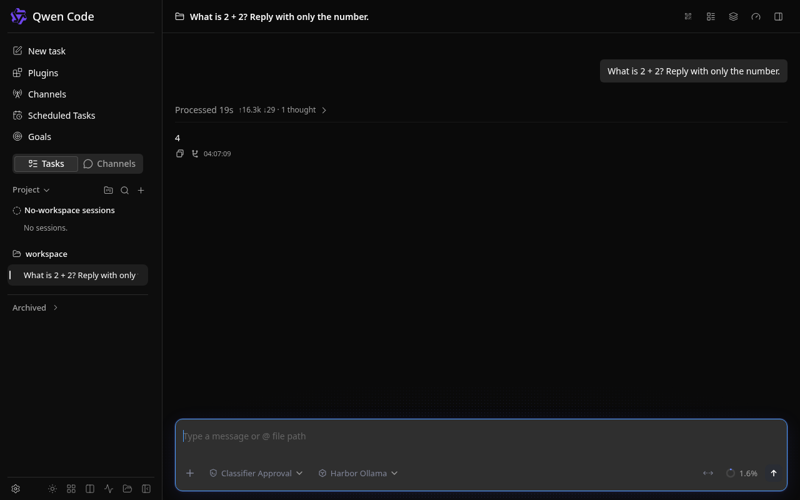

### [Qwen Code](https://github.com/QwenLM/qwen-code)

> Handle: `qwencode`<br/>
> URL: [http://localhost:34970](http://localhost:34970)

Qwen Code is a coding agent with a terminal interface and a browser Web Shell. Harbor runs the official Qwen Code image as a daemon with a persistent project workspace and user configuration.



## Starting

```bash
harbor pull qwencode
harbor up --no-defaults qwencode
harbor open qwencode
```

The daemon binds inside its container on port 4170. Because the container listener is not loopback-only, Qwen Code requires a bearer token even if Docker publishes the port only on the host's loopback interface. With no configured token, Qwen Code generates one at startup; view it with `docker logs --tail 30 harbor.qwencode`. Treat that token as a password. For a stable token, set `harbor config set qwencode.server.token <long-random-token>` before startup. Harbor stores this value in its local `.env` file, so protect that file and never commit it. A newly created Harbor bridge network binds published ports to loopback on Harbor versions with that default; an existing or LAN-enabled network may publish this daemon on all interfaces. Do not expose the agent to an untrusted network.

## Ollama integration

For a local model, pull a tool-capable model and start both services:

```bash
harbor pull qwen3.5:4b
harbor up --no-defaults qwencode ollama
```

On startup, Harbor adds the configured Ollama model to `~/.qwen/settings.json` if it is not already listed, selects OpenAI-compatible authentication only if the user has not chosen another provider, and keeps other Qwen settings intact. The Ollama endpoint is `http://ollama:11434/v1`; `sk-ollama` is a placeholder API key because local Ollama does not require one. Change the default model with `harbor config set qwencode.ollama.model <installed-model>` and restart Qwen Code. An existing model entry with the same ID is left untouched; edit `services/qwencode/config/settings.json` if it points elsewhere. Model quality determines tool-use reliability.

The terminal CLI is available inside the running service:

```bash
harbor exec qwencode qwen --version
harbor exec qwencode qwen -p 'Summarize this workspace'
```

Qwen Code can read and modify files under the configured workspace. Mount only a project you intend the agent to access, and review tool approvals before allowing edits.

## Configuration

| Harbor setting | Default | Purpose |
| --- | --- | --- |
| `qwencode.host.port` | `34970` | Host port for the Web Shell and daemon API |
| `qwencode.image` | `ghcr.io/qwenlm/qwen-code` | Official image repository |
| `qwencode.version` | `0.24.5` | Official image tag |
| `qwencode.config` | `./services/qwencode/config` | Persistent Qwen user settings and sessions |
| `qwencode.workspace` | `./services/qwencode/workspace` | Project directory mounted at `/workspace` |
| `qwencode.server.token` | empty | Optional stable daemon bearer token |
| `qwencode.ollama.model` | `qwen3.5:4b` | Default model seeded when Ollama runs alongside Qwen Code |

Use `harbor config get <setting>` and `harbor config set <setting> <value>` to inspect or change these. The host config and workspace directories are bind-mounted into the container, so they survive container replacement. The official image runs as root and may create root-owned files there; host-side edits can require elevated permissions. `services/qwencode/override.env` can pass additional upstream environment variables through `harbor env qwencode`.

## Troubleshooting

- `harbor up` waits for the daemon port to open. If the Web Shell asks for a token, read the startup token with `docker logs --tail 30 harbor.qwencode` or set a stable token and restart.
- If the model is missing, run `harbor exec ollama ollama list`, check `qwencode.ollama.model`, and start both services together so Harbor applies the integration overlay.
- If a prompt fails, check `harbor logs qwencode` and confirm the Ollama model responds independently before investigating Qwen Code.

## Links

- [Official documentation](https://qwenlm.github.io/qwen-code-docs/en/users/overview/)
- [Qwen Code repository](https://github.com/QwenLM/qwen-code)
- [Daemon security and Web Shell](https://qwenlm.github.io/qwen-code-docs/en/users/qwen-serve/)
