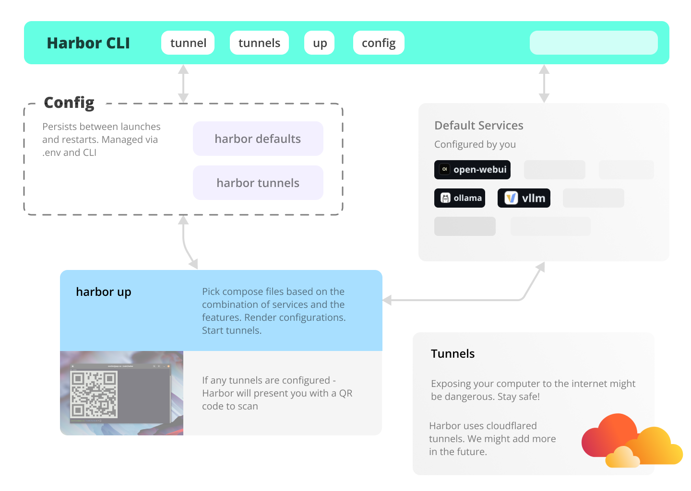
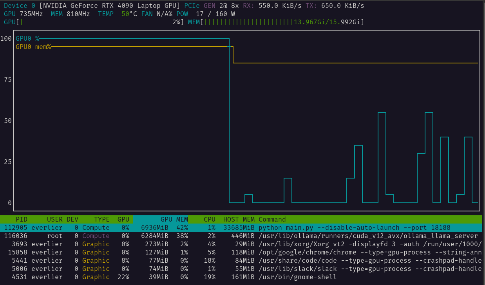

# Compose Setup commands

### `harbor up <services>`

> Alias: `harbor u`

Starts selected services. See the list of available services here. Run `harbor defaults` to see the default list
of services that will be started. When starting additional services, you might need to `harbor down` first, so that all the services can pick updated configuration. API-only services can be started without stopping the main stack.

```bash
# Start with default services
harbor up

# Start with additional services
# See service descriptions in the Services Overview section
harbor up searxng

# Start with multiple additional services
harbor up webui ollama searxng llamacpp tts tgi lmdeploy litellm
```

`up` supports a few additional behaviors, see below.

#### Tail logs

You can instruct Harbor to start tailing logs of the services that are started.

```bash
# Starts tailing logs as soon as "docker compose up" is done
harbor up webui --tail
# Alias
harbor up webui -t
```

#### Open

You can instruct Harbor to also open the service that is started with `up`, once the `docker compose up` is done.

```bash
# Start default services + searxng and open
# searxng in the default browser
harbor up searxng --open
# Alias
harbor up searxng -o
```

You can also configure Harbor to automatically run [`harbor open`](#harbor-open-service) for the current default UI service. This is useful if you always want to have the UI open when you start Harbor. The behavior can be enabled by setting `ui.autoopen` [config](#harbor-config) field to `true`.

```bash
# Enable auto-open
harbor config set ui.autoopen true
# Disable auto-open (default)
harbor config set ui.autoopen false
```

You can switch the default UI service with the `ui.main` config field.

```bash
# Set the default UI service
harbor config set ui.main hollama
```

#### Skip defaults

You can instruct Harbor to only start the services you specify and skip the default ones.

```bash
# Start only the services you explicitly specify
harbor up --no-defaults searxng
```

#### Auto-tunnel

You can configure Harbor to automatically start tunnels for given services when running `up`. This is managed by [`harbor tunnels`](#harbor-tunnels) command.

```bash
# Add webui to the list of services that will be tunneled
# whenever `harbor up` is run
harbor tunnels add webui
```

> [!WARN]
> Exposing your services to the internet is dangerous. Be safe!
> It's a bad idea to expose a service to the Internet without any authentication.

#### Capabilities detection

By default, Harbor will try to infer some capabilities of the host (and match related [cross files](./6.-Harbor-Compose-Setup#cross-service-file)), such as Nvidia GPU availability (`nvidia` capability) or presence of modern Docker Compose features (`mdc` capability).

If this behavior is undesirable or you want to provide a manual list of capabilities, you can disable the automatic detection.

```bash
# Disable automatic capability detection
harbor config set capabilities.autodetect false
```

It's also possible to provide a manual list of capabilities to use instead of the detected ones.

```bash
# Provide a default capabilities list manually,
# as a colon-separated list
harbor config set capabilities.default 'rocm;cdi'
```

### `harbor down`

> Alias: `harbor d`

Stops all currently running services.

```bash
# Stop all services
harbor down

# Pass down options to docker-compose
harbor down --remove-orphans
```

### `harbor restart <services>`

> Alias: `harbor r`

Restarts Harbor stack. Very useful for adjusting the configuration on the fly.

```bash
# Restart everything
harbor restart

# Restart a specific service only
harbor restart tabbyapi
# 🚩 Restarting a single service might be
# finicky, if something doesn't look right
# try down/up cycle instead
```

### `harbor pull <services>`

Pulls the latest images for the selected services. Note that it works with harbor service handles instead of docker container names (those will match for primary service container, however).

```bash
# Pull the latest images for the default services
harbor pull

# Pull the latest images for additional services
harbor pull searxng

# Do not pull default services alongside the specified ones
harbor pull --no-defaults searxng

# Pull everything (used or not)
# ⚠️ Warning: This will consume
# a few dozen gigabytes of bandwidth
harbor pull "*"
```

### `harbor build <services>`

Builds the images for the selected services. Mostly relevant for services that have their `Dockerfile` local in the Harbor repository.

```bash
# HF Downloader is an example of a service that
# has a local Dockerfile
harbor build hfdownload
```

### `harbor ps`

Proxy to `docker-compose ps` command. Displays the status of all services.

```bash
harbor ps
```

### `harbor logs`

> Alias: `harbor l`

Tails logs for all or selected services.

```bash
harbor logs

# Show logs for a specific service
harbor logs webui

# Show logs for multiple services
harbor logs webui ollama

# Filter specific logs with grep
harbor logs webui | grep ERROR

# Start tailing logs after "harbor up"
harbor up llamacpp --tail

# Show last 1000 lines in the initial tail chunk
harbor logs -n 1000
```

Additionally, `harbor logs` accepts all the options that [`docker-compose logs`](https://docs.docker.com/compose/reference/logs/) does.

### `harbor exec <service> <command>`

Allows executing arbitrary commands in the container running given service. Useful for inspecting service at runtime or performing some custom operations that aren't natively covered by Harbor CLI.

```bash
# This is the same folder as "harbor/open-webui"
harbor exec webui ls /app/backend/data

# Check the processes in searxng container
harbor exec searxng ps aux
```

`exec` offers plenty of flexibility. Some useful examples below.

Launch an interactive shell in the running container with one of the services.

```bash
# Launch "bash" in the ollama service
harbor exec ollama bash

# You are then landed in the interactive
# container shell
$ root@279a3a523a0b:/#
```

Access useful scripts and CLIs from the `llamacpp`.

```bash
# See .sh scripts from the llama.cpp
harbor exec llamacpp ls ./scripts
# Run one of the bundled CLI tools
harbor exec llamacpp ./llama-bench --help
```

Ensuring that the service is running might not be convenient. See [`harbor run`](#harbor-run-service-command) and [`harbor cmd`](#harbor-cmd-services).

### `harbor run <service> <command>`

Runs (in the order of precedence):
- One of configured [aliases](#harbor-aliases)
- A command in the Harbor services

#### Aliases

```bash
# Configure and run an alias to quickly edit
harbor alias set env 'code $(harbor home)/.env
harbor run env
```

Aliases take precedence over services in case of a name conflict. See the [`harbor aliases` reference](#harbor-aliases) for more details.

#### Services

Unlike [`harbor exec`](#harbor-exec-service-command), `harbor run` starts a new container with the given command. This is useful for running one-off commands or scripts that don't require the service to be running. Note that the command accepts the service handle, not the container name, main container for the service will be used.

```bash
# Run a one-off command in the litellm service
harbor run litellm --help
```

This command has a pretty rigid structure, it doesn't allow you to override the entypoint or run an interactive shell. See [`harbor exec`](#harbor-exec-service-command) and [`harbor cmd`](#harbor-cmd-services) for more flexibility.

```bash
harbor run litellm --help
# Will run the same command as
$(harbor cmd litellm) run litellm --help
```

### `harbor shell <service>`

Launch interactive shell in the service's container. Useful for debug and inspection.

```bash
# Tries to launch with "bash" shell by default
harbor shell tabbyui

# You can switch to another shell by supplying
# an additional argument (must be available in the container)
harbor shell tabbyui sh
harbor shell tabbyui ash
harbor shell tabbyui fish
harbor shell tabbyui zsh
```

### `harbor cmd <services>`

Prepares the same `docker compose` call that is used by the Harbor itself, you can then use it to run arbitrary Docker commands.

```bash
# Will print docker compose command
# that is used to start these services
harbor cmd webui litellm vllm
```

It's most useful to be combined with eval of the returned command.

```bash
$(harbor cmd litellm) run litellm --help
# Unlike exec, this doesn't require service to be running
$(harbor cmd litellm) run -it --entrypoint bash litellm

# Note, this is not an equivalent of `harbor down`,
# It'll only shut down default services.
$(harbor cmd) down

# Harbor has a special wildcard notation for compose commands.
# Note the quotes around the wildcard (otherwise it'll be expanded by the shell)
$(harbor cmd "*") down
# And now, this is an equivalent of
harbor down
```

### `harbor eject`

Renders Harbor's Docker Compose configuration into a standalone config that can be moved and used elsewhere. Accepts the same options as `harbor up`.

```bash
# Eject with default services
harbor eject

# Eject with additional services
harbor eject searxng

# Likely, you want the output to be saved in a file
harbor eject searxng llamacpp > docker-compose.harbor.yml
```

### `harbor home`

Prints the path to the Harbor's home directory, where the Harbor CLI is located and where the configuration and data are stored.

```bash
harbor home
```

Most notably, you can use this command to refer to Harbor's workspace for other commands and services that might require it.

```bash
# For example - see all files in the Harbor workspace
ls $(harbor home)

# Or, inspect a folder used by a specific service
ls $(harbor home)/ollama
```

### `harbor doctor`

Runs a diagnostic script to check if all requirements are met for Harbor to run properly.

Will check things like relevant Docker and Docker Compose versions, the presence of required directories, and other things that might prevent Harbor CLI or the Harbor App running as expected.

```bash
harbor doctor
```

# Setup Management Commands

### `harbor ollama <command>`

Runs Ollama CLI in the container against the Harbor configuration.

```bash
# All Ollama commands are available
harbor ollama --version

# Show currently cached models
harbor ollama list

# See for more commands
harbor ollama --help

# Configure ollama version, accepts a docker tag
harbor config set ollama.version 0.3.7-rc5-rocm
```

### `harbor llamacpp <command>`

Runs CLI tasks specific to managing `llamacpp` service.

```bash
# Show the model currently configured to run
harbor llamacpp model

# Set a new model to run via a HuggingFace URL
# ⚠️ Note, other kinds of URLs are not supported
harbor llamacpp model https://huggingface.co/user/repo/blob/main/file.gguf
# Above command is an equivalent of
harbor config set llamacpp.model https://huggingface.co/user/repo/blob/main/file.gguf
# And will translate to a --hf-repo and --hf-file flags for the llama.cpp CLI runtime
```

### `harbor tgi <command>`

Runs CLI tasks specific to managing `text-generation-inference` service.

```bash
# Show the model currently configured to run
harbor tgi model

# Unlike llama.cpp, a few more parameters are needed,
# example of setting them below
harbor tgi quant awq
harbor tgi revision 4.0bpw

# Alternatively, configure all in one go
harbor config set tgi.model.specifier '--model-id repo/model --quantize awq --revision 3_5'
```

### `harbor litellm <command>`
Runs CLI tasks specific to managing `litellm` service.

```bash
# change default username and password to use litellm UI
harbor litellm username admin
harbor litellm password admin

# Open LiteLLM UI in the browser
harbor litellm ui
# Note that it's different from the main litellm endpoint
# that can be opened/accessed with general commands:
harbor open litellm
harbor url litellm
```

### `harbor hf`

Runs HuggingFace CLI in the container against the hosts' HuggingFace cache.

```bash
# All HF commands are available
harbor hf --help

# Show current cache status
harbor hf scan-cache
```

Harbor's `hf` CLI is expanded with some additional commands for convenience.

#### `harbor hf parse-url <url>`

Parses the HuggingFace URL and prints the repository and file names. Useful for setting the model in the `llamacpp` service.

```bash
# Get repository and file names from the HuggingFace URL
harbor hf parse-url https://huggingface.co/user/repo/blob/main/file.gguf
# > Repository: user/repo
# > File: file.gguf
```

#### `harbor hf token`

Manage HF token for accessing private/gated models.

```bash
# Set the token
harbor hf token <token>

# Show the token
harbor hf token
```

#### `harbor hf dl`

This is a proxy for the awesome [HuggingFaceModelDownloader](https://github.com/bodaay/HuggingFaceModelDownloader) CLI pre-configured to run in the same way as the other Harbor services.

```bash
# See the original help
harbor hf dl --help

# EXL2 example
#
# -s ./hf - Save the model to global HuggingFace cache (mounted to ./hf)
# -c 10   - make download go brr with 10 concurrent connections
# -m      - model specifier in user/repo format
# -b      - model revision/branch specifier (where applicable)
harbor hf dl -c 10 -m turboderp/TinyLlama-1B-exl2 -b 2.3bpw -s ./hf

# GGUF example
#
# -s ./llama.cpp - Save the model to global llama.cpp cache (mounted to ./llama.cpp)
# -c 10          - make download go brr with 10 concurrent connections
# -m             - model specifier in user/repo format
# :Q2_K          - file filter postfix - will only download files with this postfix
harbor hf dl -c 10 -m TheBloke/TinyLlama-1.1B-Chat-v1.0-GGUF:Q2_K -s ./llama.cpp
```

### `harbor hf download`

HuggingFace's own download utility. Works great when you want to download things for `tgi`, `aphrodite`, `tabbyapi`, `vllm`, etc.

```bash
# Download the model to the global HuggingFace cache
harbor hf download user/repo

# Set the token for private/gated models
harbor hf token <token>
harbor hf download user/private-repo

# Download a specific file
harbor hf download user/repo file
```

> [!TIP]
> You can use [`harbor find`](#harbor-find) to locate downloaded files on your system.

#### `harbor hf find <query>`

A shortcut from the terminal to the HuggingFace model search. It will open the search results in the default browser.

```bash
# Search for the models with the query
harbor hf find gguf gemma-2
# will open this URL
# https://huggingface.co/models?sort=trending&search=gguf%20gemma-2

# Search for the models with the query
harbor hf find exl2 gemma-2-2b
# will open this URL
# https://huggingface.co/models?sort=trending&search=exl2%20gemma-2-2b
```

### `harbor vllm`

Runs CLI tasks specific to managing `vllm` service.

#### `harbor vllm model`

Get/set the model currently configured to run.

```bash
# Show the model currently configured to run
harbor vllm model
# Set a new model to run via a repository specifier
harbor vllm model user/repo
```

#### `harbor vllm args`

Manage extra arguments to pass to the `vllm` engine.

```bash
# See the list of arguments in
# the official CLI
harbor run vllm --help

# Show the current arguments
harbor vllm args

# Set new arguments
harbor vllm args '--served-model-name vllm --device cpu'
```

#### `harbor vllm attention`

Select one of the attention backends. See [VLLM_ATTENTION_BACKEND](https://docs.vllm.ai/en/latest/serving/env_vars.html) in the official env var docs for reference.

```bash
# Show the current attention backend
harbor vllm attention

# Set a new attention backend
harbor vllm attention 'ROCM_FLASH'
```

### `harbor webui`

Runs CLI tasks specific to managing `webui` service.

#### `harbor webui version`

Get/set current version of the WebUI. Accepts a docker tag from the [GHCR registry](https://github.com/open-webui/open-webui/pkgs/container/open-webui)

```bash
# Show the current version
harbor webui version

# Set a new version
harbor webui version dev-cuda
```

#### `harbor webui secret <secret>`

Get/Set the secret JWT key for the webui service. Allows Open WebUI JWT tokens to remain valid between Harbor restarts.

```bash
# Show the current secret
harbor webui secret

# Set a new secret
harbor webui secret sk-203948
```

#### `harbor webui name <name>`

Get/Set the name of the service for Open WebUI (by default "Harbor").

```bash
# Show the current name
harbor webui name

# Set a new name
harbor webui name "Pirate Harbor"
```

#### `harbor webui log <level>`

Get/Set the log level for the webui service. Allows to control the verbosity of the logs. See [Official logging documentation](https://docs.openwebui.com/getting-started/logging/#application-serverbackend-logging).

```bash
# INFO is the default log level
harbor webui log

# Set to DEBUG for more visibility
harbor webui log DEBUG
```

### `harbor openai <command>`

Manage OpenAI-related configurations for related services.

One unusual thing is that Harbor allows setting up multiple OpenAI APIs and Keys. This is mostly useful for the services that support such a configuration, for example LiteLLM or Open WebUI.

When setting one or more Keys/URLs - the first one will be propagated to serve as "default" for services that require strictly one url/key pair.

#### `harbor openai keys`

Manage OpenAI API keys for the services that require them.

```bash
# Show the current API keys
harbor openai keys
harbor openai keys ls

# Add a new API key
harbor openai keys add <key>

# Remove an API key
harbor openai keys rm <key>
# Remove by index (zero-based)
harbor openai keys rm 0

# Underlying config option
harbor config get openai.keys
```

When settings API keys, the first one is also propagated to be the "default" one, for services that require strictly one key.

#### `harbor openai urls`

Manage OpenAI API URLs for the services that require them.

```bash
# Show the current URLs
harbor openai urls
harbor openai urls ls

# Add a new URL
harbor openai keys add <url>

# Remove a URL
harbor openai keys rm <url>
# Remove by index (zero-based)
harbor openai keys rm 0

# Underlying config option
harbor config get openai.urls
```

When settings API URLs, the first one is also propagated to be the "default" one, for services that require strictly one URL.

### `harbor tabbyapi <command>`

Manage TabbyAPI-related configurations for related services.

#### `harbor tabbyapi model`

Get/Set the model currently configured to run.

```bash
# Show the model currently configured to run
harbor tabbyapi model

# Set a new model to run via a repository specifier
harbor tabbyapi model user/repo
# For example:
harbor tabbyapi model Annuvin/gemma-2-2b-it-abliterated-4.0bpw-exl2
```

#### `harbor tabbyapi args`

Manage extra arguments to pass to the `tabbyapi` engine. See the arguments in official [Configuration Wiki](https://github.com/theroyallab/tabbyAPI/wiki/2.-Configuration).

```bash
# Show the current arguments
harbor tabbyapi args

# Set new arguments
harbor tabbyapi args --log-prompt true
```

You can find some other items not listed above running the `tabbyapi` CLI with Harbor:

```bash
harbor run tabbyapi --help
```

#### `harbor tabbyapi docs`

When `tabbyapi` is running - will open the Docs Swagger UI in the default browser.

```bash
harbor tabbyapi docs
```


### `harbor plandex <command>`

> [!TIP]
> Similarly to the official Plandex CLI, also available with `pdx` alias.

Access Plandex CLI for interactions with the self-hosted Plandex instance.

See the [service guide](https://github.com/av/harbor/wiki/Services#plandex) for some additional details on the Plandex service setup.

```bash
# Access Plandex own CLI
harbor pdx --help
```

Whenever you're running `harbor pdx`, the tool will have access to the current folder as if it was called directly in the terminal.

#### `harbor plandex health`

Pings the Plandex server to check if it's up and running, using the official `/health` endpoint.

```bash
# Check the Plandex server health
harbor pdx health # OK
```

#### `harbor plandex pwd`

Allows you to verify which specific folder will be mounted to the Plandex containers as the workspace.

```bash
# Show the folder that will be mounted to the Plandex CLI
# against the current location
harbor pdx pwd
```

### `harbor mistralrs <command>`

A CLI to manage the `mistralrs` service.

Everything except the commands specified below is passed to the original `mistralrs-server` CLI.

#### `harbor mistralrs health`

Pings the MistralRS server to check if it's up and running, using the official `/health` endpoint.

```bash
# Check the MistralRS server health
harbor mistralrs health # OK
```

#### `harbor mistralrs docs`

Open official service docs in the default browser (when the service is running).

```bash
# Open MistralRS docs in the browser
harbor mistralrs docs
```

#### `harbor mistralrs model`

Get/Set the model currently configured to run. See a more detailed guide in the [`mistralrs` service guide](./Services.md#mistralrs).

```bash
# Show the model currently configured to run
harbor mistralrs model

# Set a new model to run via a repository specifier
# For "plain" models:
harbor mistralrs model user/repo
# For "gguf" models:
harbor mistralrs model "container/folder -f model.gguf"
# See the guide above for a more detailed overview
```

#### `harbor mistralrs args`

Manage extra arguments to pass to the `mistralrs` engine. See the full list with `harbor mistralrs --help`.

```bash
# Show the current arguments
harbor mistralrs args

# Set new arguments
harbor mistralrs args "--no-paged-attn --throughput"
# Reset the arguments to the default
harbor mistralrs args ""
```

#### `harbor mistralrs type`

Get/Set the model type currently configured to run.

```bash
# Show the model type currently configured to run
harbor mistralrs type

# Set a new model type to run
harbor mistralrs type gguf
harbor mistralrs type plain
# See the service guide for setup on both
```

#### `harbor mistralrs arch`

For `plain` type, allows to set the architecture of the model. See the [official reference](https://github.com/EricLBuehler/mistral.rs?tab=readme-ov-file#architecture-for-plain-models).

```bash
# Show the model architecture currently configured to run
harbor mistralrs arch

# Set a new model architecture to run
harbor mistralrs arch mistral
harbor mistralrs arch gemma2
```

#### `harbor mistralrs isq`

For `plain` type, allows to set the [in situ quantization](https://github.com/EricLBuehler/mistral.rs/blob/master/docs/ISQ.md).

```bash
# Show the ISQ status currently configured to run
harbor mistralrs isq

# Set a new ISQ status to run
harbor mistralrs isq Q2K
```

### `harbor opint <command>`

Configure and run Open Interpreter CLI. (Almost) everything except the commands specified below is passed to the original `interpreter` CLI.

#### `harbor opint model`

Get/Set the model currently configured to run.

```bash
# Show the model currently configured to run
harbor opint model

# Set a new model to run
# must match the "id" of a model of a backend
# that'll be used to serve interpreter requests
harbor opint model <model>

# For example, for ollama
harbor opint model codestral
```

#### `harbor opint args`

Manage extra arguments to pass to the Open Interpreter engine.

```bash
# Show the current arguments
harbor opint args

# Set new arguments
harbor opint args "--no-paged-attn --throughput"
```

#### `harbor opint cmd`

Overrides the whole command that will be run in the Open Interpreter container. Useful for running something completely custom.

> [!WARN]
> Resets "model" and "args" to empty strings.

```bash
# Set the command to run in the Open Interpreter container
harbor opint cmd "--profile agentic_code_expert.py"
```

#### `harbor opint pwd`

Prints the directory that will be mounted to the Open Interpreter container as the workspace.

```bash
# Show the folder that will be mounted
# to the Open Interpreter CLI
harbor opint pwd
```

#### `harbor opint profiles`

> Alias: `harbor opint --profiles`
> Alias: `harbor opint -p`

Works identically (hopefully) to the `interpreter --profiles` - open the directory storing custom profiles for the Open Interpreter.

#### `harbor opint --os`

OS Mode is not supported as there's no established way to have full OS host control from within a container.

# Harbor CLI Commands

### `harbor open <service>`

Opens the service URL in the default browser. In case of API services, you'll see the response from the service main endpoint.

```bash
# Without any arguments, will open
# the service from main.ui config field
harbor open

# `harbor open` will now open hollama
# by default
harbor config set main.ui hollama

# Open a specific service
# using its handle
harbor open ollama
```

### `harbor url <service>`

Prints the URL of the service to the terminal.

```bash
# With default settings, this will print
# http://localhost:33831
harbor url llamacpp
```

Harbor will try to determine multiple additional URLs for the service:
```bash
# URL on local host
harbor url ollama

# URL on LAN
harbor url --lan ollama
harbor url --addressable ollama
harbor url --a ollama

# URL on Docker's intranet
harbor url -i ollama
harbor url --internal ollama
```

### `harbor qr <service>`

Generates a QR code for the service URL and prints it in the terminal.

```bash
# This service will open by default
harbor config get ui.main

# Generate a QR code for default UI
harbor qr

# Generate a QR code for a specific service
# Makes little sense for non-UI services.
harbor qr ollama
```

#### Example


### `harbor tunnel <service>`

> Alias: `harbor t`

Opens a `cloudflared` tunnel to the local instance of the service. Useful for sharing the service with others or accessing it from a remote location.

> [!WARN]
> Exposing your services to the internet is dangerous. Be safe!
> It's a bad idea to expose a service without any authentication whatsoever.

```bash
# Open a tunnel to the default UI service
harbor tunnel

# Open a tunnel to a specific service
harbor tunnel ollama

# Stop all running tunnels
harbor tunnel down
harbor tunnel stop
harbor t s
harbor t d
```

The command will print the URL of the tunnel as well as the QR code for it.

### `harbor tunnels`



Let's say that you are absolutely certain that you want a tunnel to be available all the time you run Harbor. You can set up a list of services that will be tunneled automatically.

```bash
# See list config docs
harbor tunnels --help

# Show the current list of services
harbor tunnels
harbor tunnels ls

# Add a new service to the list
harbor tunnels add ollama

# Remove a service from the list
harbor tunnels rm ollama
# Remove by index (zero-based)
harbor tunnels rm 0

# Remove all services from the list
# Don't confuse with stopping the tunnels (see above)
harbor tunnels rm
harbor tunnels clear

# Stop all running tunnels
harbor tunnel down
harbor tunnel stop
harbor t s
harbor t d
```

You can also edit this setting directly in the `.env`:
```bash
HARBOR_SERVICES_TUNNELS="webui"
```

Whenever a `harbor up` is run - these tunnels will be established, Harbor will print their URLs as well as QR codes in the terminal.

### `harbor link`

> Alias: `harbor ln`

Creates a symlink to the `harbor.sh` script in the user's home bin directory. This allows you to run the script from any directory.

```bash
# Puts the script in the bin directory
harbor ln
```

If you're me and have to run `harbor` hundreds of times a day, `ln` comes with a `--short` option.

```bash
# Also links the short alias
harbor ln --short
```

#### Configuration

You can adjust where harbor is linked and the names for the symlinks:
```bash
# Assuming it's not linked yet

# See the defaults
./harbor.sh config get cli.path
./harbor.sh config get cli.name
./harbor.sh config get cli.short

# Customize
./harbor.sh config set cli.path ~/bin
./harbor.sh config set cli.name ai
./harbor.sh config set cli.short ai

# Link
./harbor.sh ln --short

# Use
ai up
ai down
```

### `harbor unlink`

An antipode to `harbor link`. Removes previously added symlinks. Note that this uses _current_ links configuration, so if it was changed since the link was added, it might not work as expected.

```bash
# Removes the symlink(s)
harbor unlink
```

### `harbor defaults`

Displays or sets the list of default services that will be started when running `harbor up`. Will include one LLM backend and one LLM frontend out of the box.

```bash
# Show the current default services
harbor defaults
harbor defaults ls

# Add a new default service
harbor defaults add tts

# Remove a default service
harbor defaults rm tts
# Remove by index (zero-based)
harbor defaults rm 0

# Remove all services from the default list
harbor defaults rm

# This is an alias for the
# services.default config field
harbor config set services.default 'webui ollama searxng'

# You can also configure it
# via the .env file
cat $(harbor home)/.env | grep HARBOR_SERVICES_DEFAULT
```

### `harbor aliases`

Allows configuring additional aliases for the `harbor run` command. Any arbitrary shell command can be added as an alias. Aliases are managed in a key-value format, where the key is the alias name and the value is the command.

```bash
# Show the current list of aliases
harbor aliases
# Show aliases help
harbor aliases --help
# Same as above
harbor alias
harbor a
```

The `alias` is managed by [`harbor config`](#harbor-config) internally, and is linked to the `aliases` config field.

```bash
# Will be empty, unless some aliases are configured
harbor config get aliases
# Placement in the `.env`:
cat $(harbor home)/.env | grep HARBOR_ALIASES
```

#### `harbor aliases ls`

Lists all the currently set aliases.

```bash
harbor aliases ls

# Running without any args
# defaults to "ls" behavior
harbor aliases
harbor alias
harbor a
```

#### `harbor aliases set <alias> <command>`

Adds a new alias to the list.

```bash
# Note the single quotes on the outside
# and double quotes on the inside
harbor alias set echo 'echo "I like $PWD!"'
```

You can then see the set alias:

```bash
harbor alias
echo: echo "I like $PWD!"

harbor alias get echo
# echo "I like $PWD!"
```

You can run aliases with [`harbor run`](#harbor-run-service-command):

```bash
harbor run echo
# I like /home/user/harbor
```

#### `harbor aliases get <alias>`

Obtain a command for a specific alias.

```bash
harbor alias get echo
```

#### `harbor aliases rm <alias>`

Removes an alias from the list.

```bash
harbor alias rm echo
```

### `harbor help`

Print basic help information to the console.

```bash
harbor help
harbor --help
```

### `harbor version`

Prints the current version of the Harbor script.

```bash
harbor version
harbor --version
```

### `harbor config`

```bash
# Show the help for the config command
harbor config --help
```

Allows working with the harbor configuration via the CLI. Mostly useful for the automation and scripting, as the configuration can also be managed via the `.env` file variables.

Translating CLI config fields to `.env` file variables:

```bash
# All three version are pointing to the same
# environment variable in the .env file
webui.host.port -> HARBOR_WEBUI_HOST_PORT
webui_host_port -> HARBOR_WEBUI_HOST_PORT
WEBUI_HOST_PORT -> HARBOR_WEBUI_HOST_PORT
```

#### `harbor config list`

> Alias: `harbor config ls`

```bash
# Show the current configuration
harbor config list
```

This will print all the configuration options and their values. List could be quite long, so it's handy to pipe it to `grep` or `less`.

```bash
# Show the current configuration
harbor config list | grep WEBUI
```

You will see that configuration options have a namespace hierarchy, for example - everything related to the `webui` service will be under the `WEBUI_` namespace.

Unprefixed variables will either be global or will be related to the Harbor CLI itself.

#### `harbor config get <key>`

```bash
# Get a specific configuration value
# All versions below are equivalent and will return the same value
harbor config get webui.host.port
harbor config get webui.host_port
harbor config get WEBUI_HOST.PORT
harbor config get webui.HOST_PORT
```

#### `harbor config set <key> <value>`

```bash
# Set a new configuration value
harbor config set webui.host.port 8080
```

#### `harbor config reset`

Resets the current `.env` configuration to its original form, based on the `default.env` file.

```bash
# You'll be asked to confirm the reset
harbor config reset
```

#### `harbor config update`

Will merge `default.env` with the current local `.env` in order to add new configuration options. Typically used after updating Harbor when new variables are added. Most likely, you won't need to run this manually, as it's done automatically after `harbor update`.

This process won't overwrite user-defined variables, only add new ones.

```bash
# Merge the default.env with the current .env
harbor config update
```

### `harbor profile`

> Alias: `harbor profiles`, `harbor p`

Allows creating and managing configuration profiles. It's attached to the `.env` file under the hood and allows you to switch between different configurations easily.

```bash
# Show the help for the profile command
harbor profile --help
```

> [!NOTE]
> There are a few considerations when using profiles. Please read below.

- When the profile is loaded, modifications are not saved by default and will be lost when switching to another profile (or reloading the current one). Use `harbor profile save <name>` to persist the changes after making them
- Profiles are stored in the Harbor workspace and can be shared between different Harbor instances
- Profiles are not versioned and are not guaranteed to work between different Harbor versions
- You can also edit profiles as `.env` files in the workspace, it's not necessary to use the CLI

#### `harbor profile list`

> Alias: `harbor profile ls`

Lists currently saved profiles.

```bash
harbor profile list
harbor profile ls
```

#### `harbor profile add <name>`

> Alias: `harbor profile save`

Creates the new profile from the current configuration.

```bash
# Create a new profile named "dev"
harbor profile add dev
```

#### `harbor profile use <name>`

> Alias: `harbor profile load`, `harbor profile set`

Loads the profile with the given name.

```bash
# Load the "dev" profile
harbor profile use dev
```

#### `harbor profile remove <name>`

> Alias: `harbor profile rm`

Removes the profile with the given name.

```bash
# Remove the "dev" profile
harbor profile remove dev
```


### `harbor env`

This is a helper command to similar configuration experience provided by the [`harbor config`](#harbor-config) to the service-specific environment variables, that are not directly managed by the Harbor CLI.

This command writes to the `override.env` file for a given service, you can also do that manually, if more convenient.

```bash
# List current override env vars
# Note, that it doesn't include the ones from main "harbor config"
harbor env <service>

# Get a specific env var
harbor env <service> <key>

# Set a new env var
harbor env <service> <key> <value>
```

The `<key>` supports same naming convention as used by the [`harbor config`](#harbor-config) command.

```bash
# All keys below are equivalent
# and will write to the same env var: "N8N_SECURE_COOKIE"
harbor env n8n N8N_SECURE_COOKIE # original notation
harbor env n8n n8n_secure_cookie # underscore notation
harbor env n8n n8n.secure_cooke  # mixed dot/underscore notation
```

#### Examples

```bash
# Show the current environment variables for the "n8n" service
harbor env n8n

# Get a specific environment variable
# for the dify service (LOG_LEVEL under the hood)
harbor env dify log.level

# Set a brand new environment variable for the service
# All three are equivalent
harbor env cmdh NODE_ENV development
harbor env cmdh node_env development
harbor env cmdh node.env development
```

### `harbor history`

Harbor remembers a number of most recently executed CLI commands. You can search/re-run the commands via the `harbor history` command.

This is an addition to the native history in your shell, that'll persist longer and is specific to the Harbor CLI.


Use `history.size` config option to adjust the number of commands stored in the history.

```bash
# Get/set current history size
harbor history size
harbor history size 50

# Same, but with harbor config
harbor config get history.size
harbor config set history.size 50
```

History is stored in the `.history` file in the Harbor workspace, you can also edit/access it manually.

```bash
# Using a built-in helper
harbor history ls | grep ollama

# Manually, using the file
cat $(harbor home)/.history | grep ollama
```

You can clear the history with the `harbor history clear` command.

```bash
# Clear the history
harbor history clear

# Empty
harbor history ls
```


### `harbor dive <image>`

Launched a Docker container with the [Dive CLI](https://github.com/wagoodman/dive) to inspect the given image layers and sizes.

Might be integrated with service handles in the future.

```bash
# Dive into the latest image of the webui service
harbor dive ghcr.io/open-webui/open-webui
```

### `harbor update`

Pulls the latest version of the Harbor script from the repository.

```bash
# Pull the latest version of the Harbor script
harbor update
```

> [!NOTE]
> Updates implementation is likely to change in the future Harbor versions.

### `harbor how`

> [!NOTE]
> Harbor needs to be running with `ollama` backend to use the `how` command.

Harbor can actually tell you how to do things. It's _a bit_ of a gimmick, but it's also surprisingly useful and fun.

```bash
# Ok, I'm cheesing a bit here, this is one of the examples
$ harbor how to ping a service from another service?
✔ Retrieving command... to ping a service from another service?
desired command: harbor exec webui curl $(harbor url -i ollama)
assistant message: The command 'harbor exec webui curl $(harbor url -i ollama)' will ping the Ollama service from within the WebUI service's container. This can be useful for checking network connectivity or testing service communication.

# But this is for real
$ harbor how to filter webui error logs with grep?
✔ Retrieving command... to filter webui error logs with grep?
setup commands: [ harbor logs webui -f ]
desired command: harbor logs webui | grep error
assistant message: You can filter webui error logs with grep like this. Note: the '-f' option is for follow and will start tailing new logs after current ones.

# And this is a bit of a joke
$ harbor how to make a sandwich?
✔ Retrieving command... to make a sandwich?
desired command: None (harbor is a CLI for managing LLM services, not making sandwiches)
assistant message: Harbor is specifically designed to manage and run Large Language Model services, not make physical objects like sandwiches. If you're hungry, consider opening your fridge or cooking an actual meal!

# And this is surprisingly useful
$ harbor how to run a command in the ollama container?
✔ Retrieving command... to run a command in the ollama container?
setup commands: [ docker exec -it ollama bash ]
desired command: harbor exec ollama <command>
assistant message: You can run any command in the running Ollama container. Make sure that command is valid and doesn't try to modify the container's state, because it might affect the behavior of Harbor services.
```

### `harbor find`

A simple wrapper around the `find` command that allows you to search for files in the service's cache directories. Uses a substring match on a file path.

```bash
# Find all GGUFs
harbor find .gguf

# Use wildcards for more complex searches
harbor find Q8_0*.gguf

# Find all files from bartowski repos
harbor find bartowski

# Find all .safetensors files
harbor find .safetensors
```

### `harbor top`

An alias for `nvtop` on the host system. Will display the GPU usage and processes running on the GPU, including those in the containers of the Harbor services.



```bash
# Show the GPU usage
harbor top
```

### `harbor size`

Walks all `CACHE` and `WORKSPACE` directories from [`harbor config ls`](#harbor-config-list) and prints their sizes, additionally displays a size for `$(harbor home)` directory.

```bash
# Show the sizes of the cache and workspace directories
harbor size

Harbor size:
----------------------------------
/home/user/.cache/huggingface: 277G
/home/user/.cache/llama.cpp: 64G
/home/user/.ollama: 241G
/home/user/.cache/vllm: 8.0K
/home/user/.cache/txtai: 92K
/home/user/.cache/nexa: 1.9G
/home/user/.parllama: 80K
./lmeval/cache: 2.5M
./langfuse/data: 89M
./comfyui/workspace: 33G
./omnichain: 108K
./jupyter/workspace: 1.5M
./n8n: 48M
./promptfoo/data: 356K
./webtop/data: 152M
./flowise/data: 176K
./langflow: 3.1M
./optillm/data: 4.0K
./kobold/data: 5.3G
./agent: 6.6M
/home/user/code/harbor: 72G
```

### `harbor dev <script>`

Launch development scripts from `.scripts` folder in the Harbor's workspace. Requires `deno` to be installed and available in the system's PATH.

```bash
# Scaffold a template for a new service
harbor dev scaffold <service>

# Seed release values
harbor dev seed
```