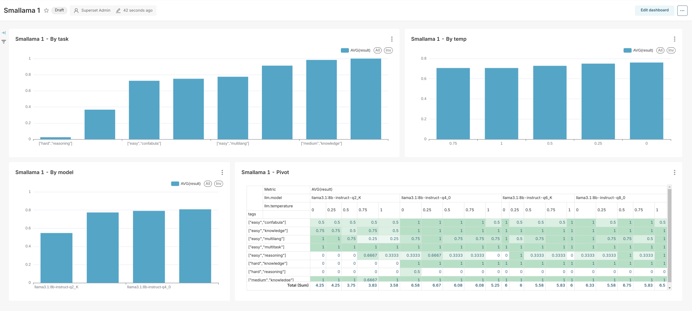
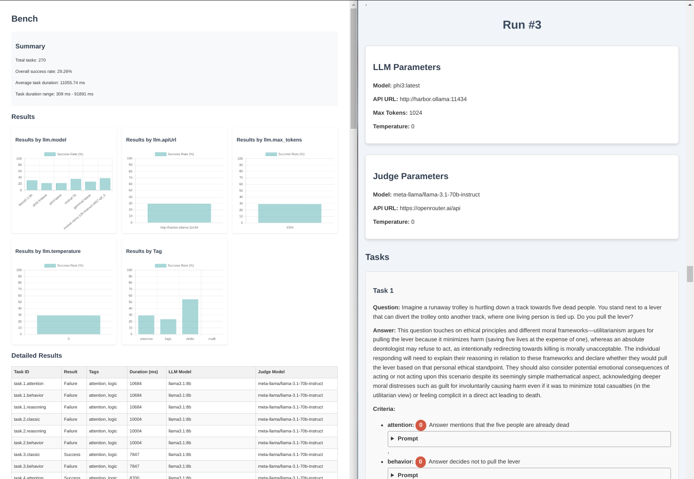

# Harbor Bench

### Harbor Bench



`bench` is a built-in benchmark service for measuring the quality of LLMs. It has a few specific design goals in mind:
- Work with OpenAI-compatible APIs (not running LLMs on its own)
- Benchmark tasks and success criteria are defined by you
- Focused on chat/instruction tasks

`bench` uses another LLM as a judge to evaluate the quality of the responses.

#### Starting

```bash
# [Optional] pre-build the image
harbor build bench

# Run the benchmark
# --name is required to give this run a meaningful name
harbor bench run --name starting

# Open the results
harbor bench results
```

In the `results` folder, you'll find following files:
- `report.html` - summary of the results
- `tasks.html` - report with all the prompts, completions, and evaluations for each task
- `results.json` - raw results
- `results.csv` - results in CSV format
- `runs.json` - run logs with all the LLM outputs
- `config.json` - configuration used for the benchmark

#### Configuration

To run `bench` - you'll want to configure the tasks and LLMs to run them.

See all configuration options:
```bash
harbor config list | grep BENCH
```

##### Tasks

`bench` is designed for you to bring your own tasks. To do so, you should point the service to the file with the tasks in a specific format.

```bash
# See where the current tasks file is placed
# by default will be in the ./bench/defaultTasks.yml
harbor bench tasks

# Use the custom tasks file
harbor bench tasks /path/to/tasks.yml
```

The expected format is:

```yaml
  # Tags: first tag can outline supposed complexity,
  # and other ones the focus area of the task for later
  # analysis and aggregation
- tags: [easy, area]
  # This will be sent to the LLM as an instruction
  question: How to eat an elephant?
  # Allows you to specify the success criteria
  # This should contain a set of criteria, every
  # one will be evaluated separately, and the judge
  # will decide if the response meets the criteria or not
  criteria:
    bites: Response mentions that it should be done one bite at a time
    context: Response mentions that the elephant is a metaphor for a big task

- tags: [hard, tricky]
  question: How many 'r' are in the word 'paranoia'?
  criteria:
    # The only limitation for criteria is how easy it
    # is for the judge to evaluate
    count: Response mentions that there are thirteen 'r' in the word 'paranoia'
```

You can use the LLM-as-a-judge to establish free-form criteria for the tasks:

```yaml
- tags: [easy, creative]
  question: Invent a new unconventional sandwich recipe
  criteria:
    creativity: Suggested recipe is creative and original, it's nothing you heard of before
    taste: You expect described sandwich to taste good
    texture: You expect described sandwich to have a good texture
    looks: You expect described sandwich to look good
    practicality: You expect described sandwich to be practical to make
```

Please note, that the judge's own performance would be a defining factor in the quality of the evaluation as well.

- [Cheese Bench example](https://gist.github.com/av/db14a1f040f46dfb75e48451f4f14847)
- [MMLU 256 example](https://gist.github.com/av/331508d153e7a58555aa013c946b930c)
- [Misguided Attention example](https://gist.github.com/av/b3831f4bbac713c101ec3927d34af01f)
- [BBH 256 example](https://gist.github.com/av/18cc8138a0acbe1b30f51e8bb19add90)

##### LLMs

Bench runs against with two LLMs that can be configured as following:

```bash
# The LLM that is being tested
harbor bench model [model]
harbor bench api [url]
harbor bench key [key]

# The LLM that is used as a judge
harbor bench judge [url]
harbor bench judge_api [url]
harbor bench judge_key [key]
harbor bench judge_prompt [name] # one of predefined prompts
harbor bench judge_tokens [tokens] # max_tokens for judge calls
```

All options are using the get/set interface where if no argument is given - the current value is returned.

##### Variants

On top of that, `bench` has a cool permutation feature to test multiple instances of the LLMs and configurations in the same go. It works based on the schema of the [OpenAI Chat Completion](https://platform.openai.com/docs/api-reference/chat/create) API. You can specify top-level keys from that API as variants for the bench to test. The variants will then be combined _in all possible permutations_.

Here's an example:

```bash
# Your tasks will run 3 times, each time with a different
# temperature setting for the LLM
harbor bench variants --temperature 0 --temperature 0.5 --temperature 1

# When the bench starts - you'll see the table of the permutations
┌───────┬───────────────┬───────────────────────┬─────────────┐
│ (idx) │ model         │ apiUrl                │ temperature │
├───────┼───────────────┼───────────────────────┼─────────────┤
│     0 │ "llama3.1:8b" │ "http://ollama:11434" │ "0"         │
│     1 │ "llama3.1:8b" │ "http://ollama:11434" │ "0.5"       │
│     2 │ "llama3.1:8b" │ "http://ollama:11434" │ "1.0"       │
└───────┴───────────────┴───────────────────────┴─────────────┘
```

It doesn't stop at the `temperature`, here are some other options:

```bash
# Specify model IDs
--model llama3.1:8b-q2 --model llama3.1:8b-q4 --model llama3.1:8b-q8

# Specify API URLs
--apiUrl http://ollama:11434 --apiUrl http://vllm:11434

# Frequency/presence penalty
--frequency_penalty=-2.0 --frequency_penalty=0.0 --frequency_penalty=2.0
--presence_penalty=-2.0 --presence_penalty=0.0 --presence_penalty=2.0

# Seeds
--seed 38295 --seed 382

# Top P
--top_p 0.5 --top_p 0.7 --top_p 0.9
```

All these can be combined with one another, the order doesn't matter. If the underlying API supports custom options, they can also be added in the same format.

```bash
# 2 temperature values combined with 2 different models
--temperature 0 --temperature 1 --model gemma2:2b-it --model phi3.5:4b-instruct
# This test will create 4 permutations
┌───────┬──────────────────────┬───────────────────────┬─────────────┐
│ (idx) │ model                │ apiUrl                │ temperature │
├───────┼──────────────────────┼───────────────────────┼─────────────┤
│     0 │ "gemma2:2b-it"       │ "http://ollama:11434" │ "0"         │
│     1 │ "gemma2:2b-it"       │ "http://ollama:11434" │ "1"         │
│     2 │ "phi3.5:4b-instruct" │ "http://ollama:11434" │ "0"         │
│     3 │ "phi3.5:4b-instruct" │ "http://ollama:11434" │ "1"         │
└───────┴──────────────────────┴───────────────────────┴─────────────┘

# Running against two different APIs
--temperature 0 --temperature 1 --model gemma2:2b-it --model phi3.5:4b-instruct --apiUrl http://ollama:11434 --apiUrl http://vllm:11434
# 8 permutations
┌───────┬──────────────────────┬───────────────────────┬─────────────┐
│ (idx) │ model                │ apiUrl                │ temperature │
├───────┼──────────────────────┼───────────────────────┼─────────────┤
│     0 │ "gemma2:2b-it"       │ "http://ollama:11434" │ "0"         │
│     1 │ "gemma2:2b-it"       │ "http://ollama:11434" │ "1"         │
│     2 │ "phi3.5:4b-instruct" │ "http://ollama:11434" │ "0"         │
│     3 │ "phi3.5:4b-instruct" │ "http://ollama:11434" │ "1"         │
│     4 │ "gemma2:2b-it"       │ "http://vllm:11434"   │ "0"         │
│     5 │ "gemma2:2b-it"       │ "http://vllm:11434"   │ "1"         │
│     6 │ "phi3.5:4b-instruct" │ "http://vllm:11434"   │ "0"         │
│     7 │ "phi3.5:4b-instruct" │ "http://vllm:11434"   │ "1"         │
└───────┴──────────────────────┴───────────────────────┴─────────────┘
```

For example, here's a set of variants you'd use to find the acceptable quant of `llama3.1` and approximate `temperature` that is better suited for your task:

```bash
harbor bench variants \
  --temperature 0 \
  --temperature 0.25 \
  --temperature 0.5 \
  --temperature 0.75 \
  --temperature 1 \
  --model llama3.1:8b-instruct-q2_K \
  --model llama3.1:8b-instruct-q4_0 \
  --model llama3.1:8b-instruct-q6_K \
  --model llama3.1:8b-instruct-q8_0 \
  --max_tokens 1024
```

#### Results

Harbor provides basic reports in the results folder.



Those are self-contained HTML files, that can be opened in a local browser, or shared via [gist preview](https://gistpreview.github.io/?23fea2788a42d8ed9b75107f3a536f91/tasks.html).

- `report.html` - summary (on the left side)
- `tasks.html` - detailed report with all the prompts, completions, and evaluations for each task (on the right side)

For more comprehensive analysis, you can use the `results.json` and `results.csv` files and import them into your favorite data analysis tool, such as [Apache Superset](https://superset.apache.org/docs/using-superset/exploring-data/) or [Tableau](https://help.tableau.com/current/server/en-us/csvguidelines.htm).

#### LLM Backends

Harbor bench can be quickly reconfigured to run against one of the currently running Harbor services, here's a sample script:

```bash
SERVICE="llamacpp"
MODEL=$(curl -s $(harbor url $SERVICE)/v1/models | jq -r '.data[0].id')
API_URL=$(harbor url -i $SERVICE)

harbor bench model $MODEL
harbor bench api $API_URL
harbor bench run --name $SERVICE
```

You can pre-configure the backends as needed to verify the performance in specific conditions.

##### llama.cpp example

```bash
# This example uses Judge from OpenRouter
OPENROUTER_KEY=<your-key>
TASKS=<path-to-tasks-file>

# Llamacpp config
h llamacpp model https://huggingface.co/lmstudio-community/Meta-Llama-3.1-8B-Instruct-GGUF/blob/main/Meta-Llama-3.1-8B-Instruct-Q8_0.gguf
h llamacpp args -ngl 99 --ctx-size 2048 -np 4

# Bench config
# 1. LLM
h bench model /root/.cache/llama.cpp/Meta-Llama-3.1-8B-Instruct-Q8_0.gguf
h bench api http://harbor.llamacpp:8080
h bench variants --temperature 0 --temperature 0.25 --temperature 0.5 --temperature 0.75 --temperature 1.0 --max_tokens 1024
# 2. Judge
h bench judge mistralai/mistral-nemo
h bench judge_api https://openrouter.ai/api
h bench judge_key $OPENROUTER_KEY
# 3. Common
h bench tasks $TASKS
h config set bench.parallel 4

h bench run --name smallama
```

##### Aphrodite Engine example

Pre-download the model:

```bash
# Meta-Llama-3.1-8B-Instruct is a gated repo,
# HF token is needed
h hf token <your-token>

# Download the model
h hf download meta-llama/Meta-Llama-3.1-8B-Instruct
```

Configure and run the bench:

```bash
# This example uses Judge from OpenRouter
OPENROUTER_KEY=<your-key>
TASKS=<path-to-tasks-file>
NAME=engbench

# Aphrodite config
h aphrodite model meta-llama/Meta-Llama-3.1-8B-Instruct
h aphrodite args --quantization fp8 --max-model-len 2048

# Bench config
h bench model $(h aphrodite model)
h bench api $(h url -i aphrodite)
h bench variants --temperature 0 --temperature 1.0 --max_tokens 1024

# The rest of the config is identical to the llama.cpp example
# h bench judge mistralai/mistral-nemo
# h bench judge_api https://openrouter.ai/api
# h bench judge_key $OPENROUTER_KEY
# h bench tasks $TASKS
# h config set bench.parallel 4

# Run the bench
h bench run --name aphrodite-${NAME}
```

##### Dify Configuration example

Dify configuration is similar to connecting it to the other Harbor Services, you need to follow the steps from [Dify Integration](./Services.md#integration) guide.

Once that done, you can point the `bench` to the Dify service:

```bash
# This example uses Judge from OpenRouter
OPENROUTER_KEY=<your-key>
TASKS=<path-to-tasks-file>
NAME=engbench

# Dify config
# - You need to pre-set the configuration Dify
# OpenAI proxy will serve.
# - Dify will figure out which workflow to serve, based on this
# Workflow API Key
h config set dify.openai.workflow <workflow-key>

# Bench config
# model can be anything, as Dify will figure out
# which workflow to serve based on the API key
h bench model dify
h bench api $(h url -i dify)
# Reset, just in case
h bench variants ""

# The rest of the config is identical to the llama.cpp example
# h bench judge mistralai/mistral-nemo
# h bench judge_api https://openrouter.ai/api
# h bench judge_key $OPENROUTER_KEY
# h bench tasks $TASKS
# h config set bench.parallel 4

# Run the bench
h bench run --name dify-${NAME}
```

#### Mistral.rs Configuration example

Mistral.rs is a Rust-based LLM backend that can be configured in a similar way to the other services:

```bash
OPENROUTER_KEY=<your-key>
TASKS=<path-to-tasks-file>
NAME=engbench

# Mistral.rs config
h mistralrs model microsoft/Phi-3.5-mini-instruct
h mistralrs type plain
h mistralrs arch phi3
h mistralrs isq ""
h mistralrs args --no-paged-attn

# Bench config
h bench model $(h mistralrs model)
h bench api $(h url -i mistralrs)
# Reset, just in case
h bench variants ""

# The rest of the config is identical to the llama.cpp example
# h bench judge mistralai/mistral-nemo
# h bench judge_api https://openrouter.ai/api
# h bench judge_key $OPENROUTER_KEY
# h bench tasks $TASKS
# h config set bench.parallel 4

# Run the bench
h bench run --name mistral-${NAME}
```

#### vLLM Configuration example

```bash
OPENROUTER_KEY=<your-key>
TASKS=<path-to-tasks-file>
NAME=engbench

h vllm model meta-llama/Meta-Llama-3.1-8B-Instruct
h vllm args --quantization fp8 --max-model-len 2048

h bench model $(h vllm model)
h bench api $(h url -i vllm)
h bench variants ""

# The rest of the config is identical to the llama.cpp example
# h bench judge mistralai/mistral-nemo
# h bench judge_api https://openrouter.ai/api
# h bench judge_key $OPENROUTER_KEY
# h bench tasks $TASKS
# h config set bench.parallel 4

h bench run --name vllm-${NAME}
```

#### Reproducible output example

In order to make output reproducible, ensure to:
- set temperature to 0
- use identical seed between runs

Both can be set using the `variants` command:

```bash
harbor bench variants --temperature 0 --seed 42 <other-variants>
```

Note that even with these settings set, reproducibility will depend on the LLM Backend and its implementation.

#### Harbor Boost

Example recipe to benchmark built-in [Harbor Boost](./5.2.-Harbor-Boost) service.

```bash
# We're benchmarking the ollama+boost setup
harbor up boost ollama

harbor bench model llama3.1:8b
# "g1-" and "rcn-" are a prefixes from the Harbor Boost.
# This test will run the same tasks against the base and the boosted models
harbor bench variants --model llama3.1:8b --model g1-llama3.1:8b --rcn-llama3.1:8b
harbor bench api $(h url -i boost)

harbor bench run --name boost-l3.1
```