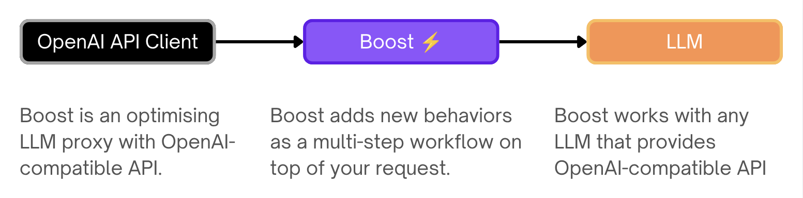

> Handle: `boost`<br/>
> URL: [http://localhost:34131/](http://localhost:34131/)


`boost` is an optimising LLM proxy with OpenAI-compatible, Anthropic-compatible, and OpenAI Responses APIs.

### Documentation

- [Features](#features)
- [Starting](#starting)
- [Configuration](#configuration)
- [Workspace bind mount](#workspace-bind-mount)
- [API](#api)
- [Environment Variables Reference](./5.2.2-Harbor-Boost-Configuration.md)
- [Built-in Modules Reference](./5.2.3-Harbor-Boost-Modules.md)
- [Custom Modules Guide](./5.2.1.-Harbor-Boost-Custom-Modules.md)
- [Standalone Usage Guide](#standalone-usage)
- [Boost Starter repo](https://github.com/av/boost-starter)

---

### Features

#### OpenAI-compatible API

Acts as a drop-in proxy for OpenAI APIs, compatible with most LLM providers and clients. Boost can be used as a "plain" proxy to combine multiple LLM backends behind a single endpoint with a single API key.

#### Anthropic-compatible API

Boost can also accept requests in the Anthropic Messages API format. Any Anthropic SDK client can be pointed at Boost's URL, and Boost will convert the request to OpenAI format internally, route it through the normal proxy pipeline (modules, workflows, model routing), and convert the response back to Anthropic format.

This is enabled by default. See the [API section](#anthropic-compatible-api-1) below for endpoint details and usage examples.

#### OpenAI Responses API

Boost supports the OpenAI Responses API (`/v1/responses`), a newer alternative to Chat Completions. The Responses API uses a different input/output shape (input items and output items instead of messages) and a different streaming event format. Boost converts Responses API requests to Chat Completions internally, routes them through the normal pipeline, and converts results back to Responses API format.

This is enabled by default. See the [API section](#openai-responses-api-1) below for endpoint details and usage examples.



```bash
POST http://localhost:34131/v1/chat/completions

{
  "model": "llama3.1",
  "messages": [{ "role": "user", "content": "Tell me about LLMs" }]
}
```

#### Modules

Run custom code inside or instead of a chat completion, to fetch external data, improve reasoning, perform trace inference, and more.

```bash
POST http://localhost:34131/v1/chat/completions

{
  "model": "klmbr-llama3.1",
  "messages": [{ "role": "user", "content": "Suggest me a random color" }]
}
```

Boost comes with [a lot of built-in modules](./5.2.3-Harbor-Boost-Modules.md) with various functions. You can use them directly or as a base for your own creations.

| [`markov`](./5.2.3-Harbor-Boost-Modules.md#markov) | [`concept`](./5.2.3-Harbor-Boost-Modules.md#concept) |
|-|-|
|  |  |

| [`nbs`](./5.2.3-Harbor-Boost-Modules.md#nbs) |
|-|
|  |

| [`dnd`](./5.2.3-Harbor-Boost-Modules.md#dnd) | [`promx`](./5.2.3-Harbor-Boost-Modules.md#promx) |
|-|-|
|  |  |

| [`dot`](./5.2.3-Harbor-Boost-Modules.md#dot) | [`klmbr`](./5.2.3-Harbor-Boost-Modules.md#klmbr) | [`r0`](./5.2.3-Harbor-Boost-Modules.md#r0) |
|-|-|-|
|  |  |  |

Recent additions include web research flows — [`quickhop`](./5.2.3-Harbor-Boost-Modules.md#quickhop) (single-hop search + read) and [`deephop`](./5.2.3-Harbor-Boost-Modules.md#deephop) (two-hop deep research) — and style modules [`caveman`](./5.2.3-Harbor-Boost-Modules.md#caveman) (terse output, `HARBOR_BOOST_CAVEMAN_LEVEL`) and [`ponytail`](./5.2.3-Harbor-Boost-Modules.md#ponytail) (YAGNI build discipline, `HARBOR_BOOST_PONYTAIL_LEVEL`). Research budgets and triggers are configurable via `HARBOR_BOOST_QUICKHOP_*` / `HARBOR_BOOST_DEEPHOP_*` — see the [modules reference](./5.2.3-Harbor-Boost-Modules.md) for details.


#### Scripting

Creating custom modules is a first-class feature and one of the main use-cases for Harbor Boost.

```python
# Simplest echo module replies back
# with the last message from the input
def apply(llm, chat):
  await llm.emit_message(prompt=chat.tail.content)
```

See the [Custom Modules](./5.2.1.-Harbor-Boost-Custom-Modules.md) guide for more information on how to create your own modules and overview of available interfaces.

### Starting

#### Start with Harbor

```bash
# [Optional] pre-build the image
harbor build boost

# Start the service
harbor up boost
```

- Harbor connects `boost` with:
  - to all included LLM backends (`ollama`, `llamacpp`, `vllm`, etc.)
  - [`optillm`](./2.3.33-Satellite&colon-OptiLLM.md) as a backend
  - `webui` and `dify` frontends

```bash
# Get the URL for the boost service
harbor url boost

# Open default boost endpoint in the browser
harbor open boost
```

#### Start standalone

```bash
docker run \
  -e "HARBOR_BOOST_OPENAI_URLS=http://172.17.0.1:11434/v1" \
  -e "HARBOR_BOOST_OPENAI_KEYS=sk-ollama" \
  -e "HARBOR_BOOST_MODULES=dot;klmbr;promx;autotemp;markov;" \
  -e "HARBOR_BOOST_BASE_MODELS=true" \
  -e "HARBOR_BOOST_API_KEY=sk-boost" \
  -p 34131:8000 \
  ghcr.io/av/harbor-boost:latest
```

See [standalone usage](#standalone-usage) guide below.

### Configuration

[Configuration](1.-Harbor-User-Guide.md#configuring-services) can be performed via Harbor CLI, [`harbor config`](./3.-Harbor-CLI-Reference.md#harbor-config), [`harbor env`](./3.-Harbor-CLI-Reference.md#harbor-env) or the `.env` file.

All of the above ways are interchangeable and result in setting environment variables for the service.

#### Harbor CLI

Specific options can be set using `harbor` CLI:

```bash
# Enable/Disable a module
harbor boost modules add <module>
harbor boost modules rm <module>

# Set a parameter
harbor boost <module> <parameter>
harbor boost <module> <parameter> <value>

# See boost/module help entries
# for more info
harbor boost --help
harbor boost klmbr --help
harbor boost rcn --help
harbor boost g1 --help

# Additional OpenAI-compatible APIs to boost
harbor boost urls add http://localhost:11434/v1
harbor boost urls rm http://localhost:11434/v1
harbor boost urls rm 0 # by index
harbor boost urls ls

# Keys for the OpenAI-compatible APIs to boost. Semicolon-separated list.
# ⚠️ These are index-matched with the URLs. Even if the API doesn't require a key,
# you still need to provide a placeholder for it.
harbor boost keys add sk-ollama
harbor boost keys rm sk-ollama
harbor boost keys rm 0 # by index
harbor boost keys ls
```

#### Harbor Config

More options are available via [`harbor config`](./3.-Harbor-CLI-Reference.md#harbor-config).

```bash
# See all available options
harbor config ls boost

# Some of the available options
harbor config set boost.host.port 34131
harbor config set boost.api.key sk-boost
harbor config set boost.api.keys sk-user1;sk-user2;sk-user3
```

Below are additional configuration options that do not have an alias in the Harbor CLI (so you need to use [`harbor config`](./3.-Harbor-CLI-Reference.md#harbor-config) directly). For example `harbor config set boost.intermediate_output true`.

#### Environment Variables

Most comprehensive way to configure `boost` is to use environment variables. You can set them in the `.env` file or via [`harbor env`](./3.-Harbor-CLI-Reference.md#harbor-env).

```bash
# Using harbor env
harbor env boost HARBOR_BOOST_API_KEY_MISTRAL sk-mistral

# Or open one of these in your text editor
open $(harbor home)/.env
open $(harbor home)/services/boost/override.env
```

See all supported environment variables in the [Environment Variables Reference](./5.2.2-Harbor-Boost-Configuration.md).

#### Workspace bind mount

Agentic Boost workflows can read, grep, and (optionally) write files in your project when Harbor bind-mounts a host directory into the Boost container. This is required for modules like `autocheck` and `diffscope` to verify cited paths and run workspace-aware audits.

Two settings work together:

- [`HARBOR_BOOST_WORKSPACE`](./5.2.2-Harbor-Boost-Configuration.md#harbor_boost_workspace_root) — host directory Harbor mounts at `/workspace` in the container (empty defaults to `./services/boost/workspace`)
- [`HARBOR_BOOST_WORKSPACE_ROOT`](./5.2.2-Harbor-Boost-Configuration.md#harbor_boost_workspace_root) — in-container jail root for workspace file tools and module evidence checks (set to `/workspace` when using the bind mount above)

```bash
# From your project repo
harbor config set boost.workspace "$(pwd)"
harbor config set boost.workspace.root /workspace
harbor config update
harbor restart boost
```

You can also set `HARBOR_BOOST_WORKSPACE` in `.env` or via [`harbor env`](./3.-Harbor-CLI-Reference.md#harbor-env), or add a custom mount with `harbor volumes add boost <host>:/workspace`.

For workspace tools, module behavior (`tools`, `autocheck`, `diffscope`), and standalone Docker examples, see the [modules reference — workspace setup](./5.2.3-Harbor-Boost-Modules.md#workspace-bind-mount).

### API

`boost` works as an OpenAI-compatible API proxy. It'll query configured downstream services for which models they serve and provide "boosted" wrappers in its own API.

See the [http catalog](https://github.com/av/harbor/blob/main/http-catalog/boost.http) entry for some sample requests.

**Authorization**

When [configured](#boost-configuration) to require an API key, you can provide the API key in the `Authorization` or `x-api-key` header. All API surfaces (Chat Completions, Messages, Responses, Models) accept both styles.

```http
<!-- All of these are accepted -->
Authorization: sk-boost
Authorization: bearer sk-boost
Authorization: Bearer sk-boost
x-api-key: sk-boost
```

**`GET /v1/models`** and **`GET /v1/models/{model_id}`**

List boosted models or retrieve a specific model. The response format is auto-detected based on client headers: Anthropic SDK clients (detected via `anthropic-version` header, or `x-api-key` without `Authorization`) receive Anthropic `ModelInfo` format (with `data`/`has_more`/`first_id`/`last_id` envelope and `type: "model"` items); all other clients receive OpenAI format. The single-model endpoint returns 404 in the appropriate error format when a model is not found.

`boost` will serve additional models as per enabled modules. For example:

```jsonc
[
  {
    // Original, unmodified model proxy
    "id": "llama3.1:8b"
    // ...
  },
  {
    // LLM with klmbr technique applied
    "id": "klmbr-llama3.1:8b"
    // ...
  },
  {
    // LLM with rcn technique applied
    "id": "rcn-llama3.1:8b"
    // ...
  }
]
```

**`POST /v1/chat/completions`**

Chat completions endpoint.

- Proxies all parameters to the downstream API, so custom payloads are supported out of the box, for example `json` format for Ollama
- Supports streaming completions and tool calls

```bash
POST http://localhost:34131/v1/chat/completions

{
  "model": "llama3.1:8b",
  "messages": [
    { "role": "user", "content": "Suggest me a random color" }
  ],
  "stream": true
}
```

**`GET /events/:stream_id`**

Listen to a specific stream of events (associated with a single completion workflow). The stream ID is a unique identifier of the LLM instance processing the request (you may decide to advertise/pass it to the client in the workflow's code).

**`GET /health`**

Health check endpoint. Returns `{ status: 'ok' }` if the service is running.

#### Anthropic-compatible API

Boost exposes an Anthropic-compatible Messages API that translates between Anthropic and OpenAI formats. Enabled by default via [`HARBOR_BOOST_ANTHROPIC_COMPAT`](./5.2.2-Harbor-Boost-Configuration.md#harbor_boost_anthropic_compat).

Incoming requests are converted to OpenAI format, routed through the normal Boost pipeline (model routing, modules, workflows), and responses are converted back to Anthropic format. Both streaming and non-streaming modes are supported.

**Supported features:**
- Messages with text content
- System prompts (top-level `system` parameter, string or array-of-blocks)
- Images (base64 and URL sources)
- Document content blocks (best-effort; image-type documents forwarded as images, others as text placeholders)
- Tool use (function calling) with tool ID normalization (`toolu_`/`call_` prefix conversion)
- `tool_result` with `is_error` flag and image content (images forwarded as follow-up user message)
- Tool choice (`auto`, `any`, `none`, named tool)
- `disable_parallel_tool_use` mapped to `parallel_tool_calls: false`
- Stop sequences (OpenAI backends strip stop sequences from output; Boost infers `stop_sequence` vs `end_turn` by checking the generated text)
- Extended thinking (`thinking.type: enabled` maps to `max_completion_tokens` for backends; responses include `thinking` content blocks with required `signature: ""` field). Adaptive thinking (`thinking.type: adaptive`) maps to `max_completion_tokens = max_tokens`, letting the backend decide how much reasoning to use. `output_config.effort` is also accepted as a reasoning-effort signal when no explicit `thinking` config is present. Streaming emits `signature_delta` events for SDK compatibility.
- `max_tokens` validated as a positive integer (rejects non-numeric, zero, and negative values)
- `top_k` passthrough (best-effort for backends that support it, e.g. vLLM, Ollama)
- `anthropic-beta` header accepted (parsed and logged, recognized flags echoed back in response)
- `anthropic-version` response header on all responses
- `@boost_` params via `metadata` dict (workflow selection, module config forwarded to the proxy pipeline)
- Request parameter passthrough: `seed`, `frequency_penalty`, `presence_penalty`, `logit_bias`, `logprobs`, `top_logprobs`, `response_format`, `n` are forwarded to the backend when present in the request body (not part of the Anthropic spec, but useful for backends that support them)
- Streaming (SSE with Anthropic event types: `message_start`, `ping`, `content_block_start`, `content_block_delta`, `content_block_stop`, `message_delta`, `message_stop`); optimized for performance with direct dict access on the hot path
- SSE streams include a `retry: 3000` interval for client reconnection, periodic keep-alive comments (every 15 s) to prevent proxy/load-balancer idle-timeout disconnects, and standard headers (`Cache-Control: no-cache`, `Connection: keep-alive`, `X-Accel-Buffering: no`)
- Mid-stream error handling (if the backend stream fails, a sanitized error is emitted as a text block and the SSE envelope is properly closed; raw exception details are logged server-side only). `BackendError` exceptions from the backend are caught during streaming with status-code-specific messages (429 becomes "Rate limit exceeded", 5xx becomes "Backend server error").
- Backend error mapping (429 mapped to `rate_limit_error`, 5xx to `api_error`) with rate limit header forwarding (`retry-after`, `x-ratelimit-*`)
- `cache_creation_input_tokens` and `cache_read_input_tokens` fields included in usage (always 0, for SDK compatibility)
- Token counting (local estimation via tiktoken or chars/4 heuristic; no backend call needed)
- Authentication returns 401 (not 403) with Anthropic-format error body on failure; case-insensitive `Bearer` prefix stripping
- Message batches API stubs with informative error messages guiding callers to use `/v1/messages` (create/list return 501, get/results/cancel return 404)

**Authentication**

The same API keys configured for the OpenAI-compatible API apply. You can authenticate using either header style:

```http
x-api-key: sk-boost
Authorization: Bearer sk-boost
```

**`POST /v1/messages`**

Anthropic Messages API endpoint. Accepts the same request format as the Anthropic API.

```bash
POST http://localhost:34131/v1/messages

{
  "model": "llama3.1",
  "max_tokens": 1024,
  "messages": [
    { "role": "user", "content": "Tell me about LLMs" }
  ]
}
```

Streaming is supported via `"stream": true` in the request body. When streaming, the response uses Anthropic SSE event types: `message_start`, `content_block_start`, `content_block_delta`, `content_block_stop`, `message_delta`, `message_stop`.

**`POST /v1/messages/count_tokens`**

Returns the input token count for a set of messages without generating a completion. Token counting is performed locally using tiktoken (cl100k_base encoding) with a chars/4 heuristic fallback, so no backend call is made.

```bash
POST http://localhost:34131/v1/messages/count_tokens

{
  "model": "llama3.1",
  "messages": [
    { "role": "user", "content": "Tell me about LLMs" }
  ]
}
```

Response:
```json
{ "input_tokens": 12 }
```

**Example: Anthropic Python SDK**

Point the Anthropic SDK at Boost's URL:

```python
import anthropic

client = anthropic.Anthropic(
    base_url="http://localhost:34131",
    api_key="sk-boost",  # or any valid Boost API key
)

message = client.messages.create(
    model="llama3.1",
    max_tokens=1024,
    messages=[
        {"role": "user", "content": "Hello!"}
    ],
)

print(message.content[0].text)
```

Streaming:

```python
with client.messages.stream(
    model="llama3.1",
    max_tokens=1024,
    messages=[{"role": "user", "content": "Hello!"}],
) as stream:
    for text in stream.text_stream:
        print(text, end="", flush=True)
```

#### OpenAI Responses API

Boost exposes an OpenAI Responses API-compatible endpoint that translates between the Responses API format and Chat Completions. Enabled by default via [`HARBOR_BOOST_RESPONSES_API`](./5.2.2-Harbor-Boost-Configuration.md#harbor_boost_responses_api).

Incoming requests are converted to Chat Completions format, routed through the normal Boost pipeline (model routing, modules, workflows), and responses are converted back to Responses API format. Both streaming and non-streaming modes are supported.

**Supported features:**
- String input (single user message) and array input (message items, function call outputs, function call items for multi-turn context)
- Content parts: `input_text`, `input_image` (URL and base64 with `detail`), `input_audio`, `input_file` (graceful degradation to text placeholder)
- `reasoning` and `computer_call_output` input items silently skipped (not supported)
- Instructions (mapped to a system message, echoed back in the response)
- Function tools (with name, description, parameters) and tool ID normalization (`call_` prefix)
- `web_search` / `web_search_preview` tool mapped to Harbor's web_search function; unsupported built-in tool types (`file_search`, `code_interpreter`, `computer_use_preview`, `image_generation`, `mcp`, `local_shell`, etc.) logged as warnings and skipped
- Tool choice (`auto`, `none`, `required`, named function); string values pass through directly
- `parallel_tool_calls` passthrough
- `max_output_tokens`, `temperature`, `top_p`
- `user` parameter passthrough (echoed in the response)
- `include` parameter accepted without error (SDK compatibility; not acted on)
- Request parameter passthrough: `seed`, `frequency_penalty`, `presence_penalty`, `logit_bias`, `logprobs`, `top_logprobs`, `n` are forwarded to the backend when present (not part of the Responses API spec, but useful for backends that support them)
- `service_tier` parameter accepted without error (SDK compatibility; not acted on)
- `@boost_` params via `metadata` dict (workflow selection, module config forwarded to the proxy pipeline)
- Reasoning (`reasoning.effort` mapped to backend `reasoning_effort`; `reasoning.summary`/`reasoning.generate_summary` forwarded as `reasoning_summary`; responses include `reasoning` output items with `status` field and summary text). The reasoning config from the request is echoed in the response.
- Structured outputs via `text.format` (`json_schema` and `json_object` mapped to `response_format`)
- Refusal handling (backend refusals emitted as `refusal` content parts with streaming `refusal.delta` / `refusal.done` events)
- Annotations from backends: OpenAI `url_citation`, `file_citation`, `file_path` annotations and Perplexity-style `citations` (flat URL list) are extracted and included in output text content parts
- Truncation parameter (accepted and reflected; backends manage their own context windows)
- `store` (always false) and `metadata` (passthrough)
- `completed_at` timestamp set on responses with `completed` status
- `incomplete_details` with reason (`max_output_tokens` or `content_filter`) when status is `incomplete`
- Streaming with full Responses API event lifecycle: `response.created`, `response.in_progress`, output item/content part events, `.done` events for text/function args, and terminal events (`response.completed`, `response.incomplete`, or `response.failed`); optimized for performance with direct dict access on the hot path
- All streaming events include `sequence_number` (monotonically increasing) and text events include `logprobs: []`
- SSE streams include a `retry: 3000` interval (embedded in the first event to avoid data-less SSE frames that crash some SDKs), periodic keep-alive comments (every 15 s), and standard headers (`Cache-Control: no-cache`, `Connection: keep-alive`, `X-Accel-Buffering: no`)
- Mid-stream error handling (sanitized errors emitted as text content; stream terminates with `response.failed`; raw details logged server-side only). `BackendError` exceptions are caught during streaming with status-code-specific messages.
- Backend error mapping (429 mapped to `rate_limit_error`, 5xx to `server_error`) with rate limit header forwarding (`retry-after`, `x-ratelimit-*`)
- Authentication returns 401 with OpenAI-format error body on failure; case-insensitive `Bearer` prefix stripping
- GET/DELETE/cancel stubs with informative error messages and response IDs (returns 404 since responses are not persisted)

**Authentication**

The same API keys configured for the OpenAI-compatible API apply. Both `Authorization` and `x-api-key` headers are supported:

```http
Authorization: Bearer sk-boost
x-api-key: sk-boost
```

**`POST /v1/responses`**

OpenAI Responses API endpoint.

```bash
POST http://localhost:34131/v1/responses

{
  "model": "llama3.1",
  "input": "Tell me about LLMs"
}
```

Array input with structured messages:

```bash
POST http://localhost:34131/v1/responses

{
  "model": "llama3.1",
  "instructions": "You are a helpful assistant.",
  "input": [
    {
      "type": "message",
      "role": "user",
      "content": "Tell me about LLMs"
    }
  ]
}
```

The response is a response object with output items:

```json
{
  "id": "resp_abc123",
  "object": "response",
  "status": "completed",
  "model": "llama3.1",
  "output": [
    {
      "type": "message",
      "role": "assistant",
      "content": [
        {
          "type": "output_text",
          "text": "LLMs are..."
        }
      ]
    }
  ],
  "usage": {
    "input_tokens": 12,
    "output_tokens": 48,
    "total_tokens": 60
  }
}
```

Streaming is supported via `"stream": true` in the request body. When streaming, the response uses Responses API SSE event types: `response.created`, `response.in_progress`, `response.output_item.added`, `response.content_part.added`, `response.output_text.delta`, `response.output_text.done`, `response.function_call_arguments.delta`, `response.function_call_arguments.done`, `response.content_part.done`, `response.output_item.done`, and a terminal event (`response.completed`, `response.incomplete`, or `response.failed`). Reasoning streams additionally emit `response.reasoning_summary_part.added`, `response.reasoning_summary_text.delta`, `response.reasoning_summary_text.done`, and `response.reasoning_summary_part.done`.

**Example: OpenAI Python SDK**

Point the OpenAI SDK at Boost's URL and use the `responses.create()` method:

```python
from openai import OpenAI

client = OpenAI(
    base_url="http://localhost:34131/v1",
    api_key="sk-boost",  # or any valid Boost API key
)

response = client.responses.create(
    model="llama3.1",
    input="Hello!",
)

print(response.output[0].content[0].text)
```

Streaming:

```python
stream = client.responses.create(
    model="llama3.1",
    input="Hello!",
    stream=True,
)

for event in stream:
    if event.type == "response.output_text.delta":
        print(event.delta, end="", flush=True)
```

With tools:

```python
response = client.responses.create(
    model="llama3.1",
    input="What is the weather in Paris?",
    tools=[{
        "type": "function",
        "name": "get_weather",
        "description": "Get current weather",
        "parameters": {
            "type": "object",
            "properties": {
                "location": {"type": "string"}
            },
            "required": ["location"],
        },
    }],
)

for item in response.output:
    if item.type == "function_call":
        print(f"Call: {item.name}({item.arguments})")
```

### Standalone usage

You can run boost as a standalone Docker container. See [harbor-boost](https://github.com/av/harbor/pkgs/container/harbor-boost) package in GitHub Container Registry.

```bash
# [Optional] pre-pull the image
docker pull ghcr.io/av/harbor-boost:latest

# Start the container
docker run \
  # 172.17.0.1 is the default IP of the host, when running on Linux
  # So, the example below is for local ollama
  -e "HARBOR_BOOST_OPENAI_URLS=http://172.17.0.1:11434/v1" \
  -e "HARBOR_BOOST_OPENAI_KEYS=sk-ollama" \
  # Configuration for the boost modules
  -e "HARBOR_BOOST_MODULES=klmbr;rcn;g1" \
  -e "HARBOR_BOOST_KLMBR_PERCENTAGE=60" \
  # [Optional] mount folder with custom modules
  -v /path/to/custom_modules/folder:/app/custom_modules \
  -p 8004:8000 \
  ghcr.io/av/harbor-boost:latest

# In the separate terminal (or detach the container)
curl http://localhost:8004/health
curl http://localhost:8004/v1/models
```

You can take a look at a [`boost-starter`](https://github.com/av/boost-starter) repo for a minimal example repository to get started.

**Configuration**

See [Environment Variables Reference](./5.2.2-Harbor-Boost-Configuration.md).
