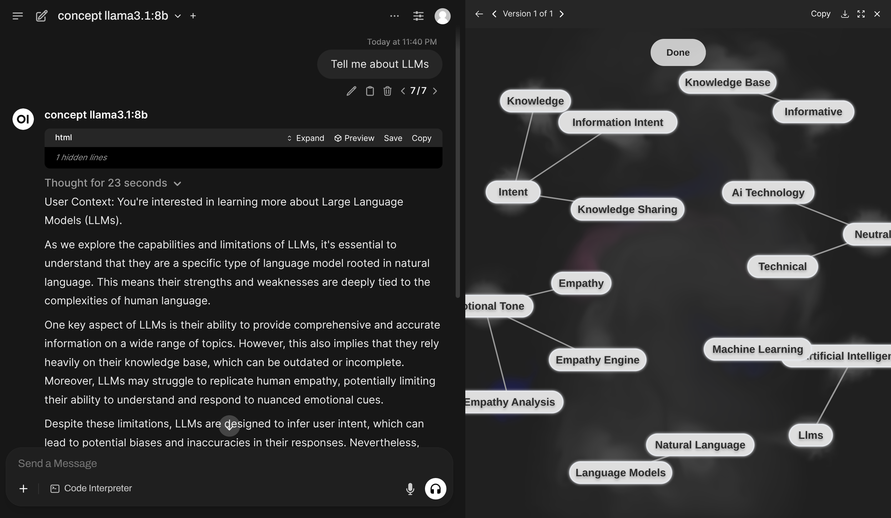
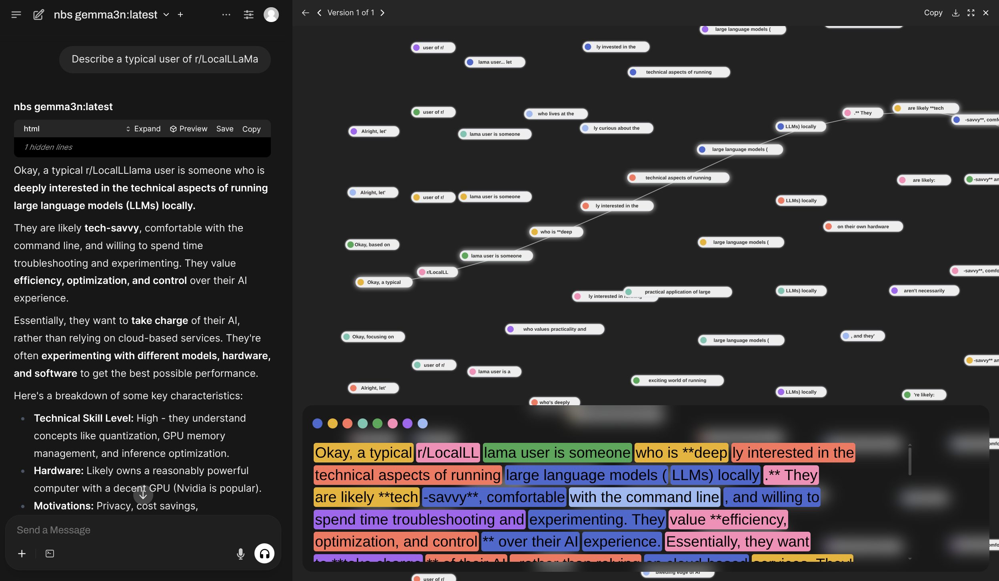
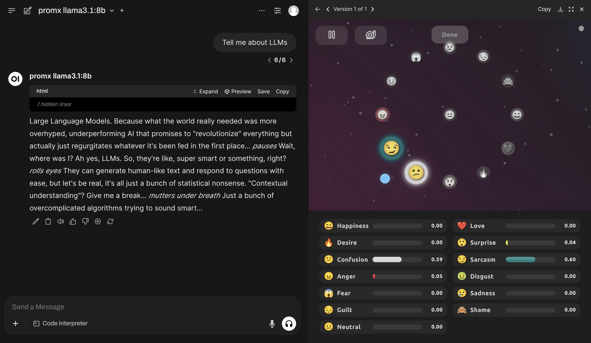

> Handle: `boost`<br/>
> URL: [http://localhost:34131/](http://localhost:34131/)


`boost` is an optimising LLM proxy with OpenAI-compatible API.

### Documentation

- [Features](#features)
- [Starting](#starting)
- [Configuration](#configuration)
- [API](#api)
- [Environment Variables Reference](./5.2.2-Harbor-Boost-Configuration)
- [Built-in Modules Reference](./5.2.3-Harbor-Boost-Modules)
- [Custom Modules Guide](./5.2.1.-Harbor-Boost-Custom-Modules)
- [Standalone Usage Guide](#standalone-usage)
- [Boost Starter repo](https://github.com/av/boost-starter)

---

### Features

#### OpenAI-compatible API

Acts as a drop-in proxy for OpenAI APIs, compatible with most LLM providers and clients. Boost can be used as a "plain" proxy to combine multiple LLM backends behind a single endpoint with a single API key.


```bash
POST http://localhost:34131/v1/chat/completions

{
  "model": "llama3.1",
  "messages": [{ "role": "user", "content": "Tell me about LLMs" }]
}
```

#### Modules

Run custom code inside or instead of a chat completion, to fetch external data, improve reasoning, perform trace inference, and more.

```bash
POST http://localhost:34131/v1/chat/completions

{
  "model": "klmbr-llama3.1",
  "messages": [{ "role": "user", "content": "Suggest me a random color" }]
}
```

Boost comes with [a lot of built-in modules](./5.2.3-Harbor-Boost-Modules) with various functions. You can use them directly or as a base for your own creations.

| [`markov`](./5.2.3-Harbor-Boost-Modules#markov) | [`concept`](./5.2.3-Harbor-Boost-Modules#concept) |
|-|-|
|  |  |

| [`nbs`](./5.2.3-Harbor-Boost-Modules#nbs) |
|-|
|  |

| [`dnd`](./5.2.3-Harbor-Boost-Modules#dnd) | [`promx`](./5.2.3-Harbor-Boost-Modules#promx) |
|-|-|
|  |  |

| [`dot`](./5.2.3-Harbor-Boost-Modules#dot) | [`klmbr`](./5.2.3-Harbor-Boost-Modules#klmbr) | [`r0`](./5.2.3-Harbor-Boost-Modules#r0) |
|-|-|-|
|  |  |  |


#### Scripting

Creating custom modules is a first-class feature and one of the main use-cases for Harbor Boost.

```python
# Simplest echo module replies back
# with the last message from the input
def apply(llm, chat):
  await llm.emit_message(prompt=chat.tail.content)
```

See the [Custom Modules](./5.2.1.-Harbor-Boost-Custom-Modules) guide for more information on how to create your own modules and overview of available interfaces.

### Starting

#### Start with Harbor

```bash
# [Optional] pre-build the image
harbor build boost

# Start the service
harbor up boost
```

- Harbor connects `boost` with:
  - to all included LLM backends (`ollama`, `llamacpp`, `vllm`, etc.)
  - [`optillm`](./2.3.33-Satellite&colon-OptiLLM) as a backend
  - `webui` and `dify` frontends

```bash
# Get the URL for the boost service
harbor url boost

# Open default boost endpoint in the browser
harbor open boost
```

#### Start standalone

```bash
docker run \
  -e "HARBOR_BOOST_OPENAI_URLS=http://172.17.0.1:11434/v1" \
  -e "HARBOR_BOOST_OPENAI_KEYS=sk-ollama" \
  -e "HARBOR_BOOST_MODULES=dot;klmbr;promx;autotemp;markov;" \
  -e "HARBOR_BOOST_BASE_MODELS=true" \
  -e "HARBOR_BOOST_API_KEY=sk-boost" \
  -p 34131:8000 \
  ghcr.io/av/harbor-boost:latest
```

See [standalone usage](#standalone-usage) guide below.

### Configuration

[Configuration](1.-Harbor-User-Guide#configuring-services) can be performed via Harbor CLI, [`harbor config`](./3.-Harbor-CLI-Reference#harbor-config), [`harbor env`](./3.-Harbor-CLI-Reference#harbor-env) or the `.env` file.

All of the above ways are interchangeable and result in setting environment variables for the service.

#### Harbor CLI

Specific options can be set using `harbor` CLI:

```bash
# Enable/Disable a module
harbor boost modules add <module>
harbor boost modules rm <module>

# Set a parameter
harbor boost <module> <parameter>
harbor boost <module> <parameter> <value>

# See boost/module help entries
# for more info
harbor boost --help
harbor boost klmbr --help
harbor boost rcn --help
harbor boost g1 --help

# Additional OpenAI-compatible APIs to boost
harbor boost urls add http://localhost:11434/v1
harbor boost urls rm http://localhost:11434/v1
harbor boost urls rm 0 # by index
harobr boost urls ls

# Keys for the OpenAI-compatible APIs to boost. Semicolon-separated list.
# ⚠️ These are index-matched with the URLs. Even if the API doesn't require a key,
# you still need to provide a placeholder for it.
harbor boost keys add sk-ollama
harbor boost keys rm sk-ollama
harbor boost keys rm 0 # by index
harbor boost keys ls
```

#### Harbor Config

More options are available via [`harbor config`](./3.-Harbor-CLI-Reference#harbor-config).

```bash
# See all available options
harbor config ls boost

# Some of the available options
harbor config set boost.host.port 34131
harbor config set boost.api.key sk-boost
harbor config set boost.api.keys sk-user1;sk-user2;sk-user3
```

Below are additional configuration options that do not have an alias in the Harbor CLI (so you need to use [`harbor config`](./3.-Harbor-CLI-Reference#harbor-config) directly). For example `harbor config set boost.intermediate_output true`.

#### Environment Variables

Most comprehensive way to configure `boost` is to use environment variables. You can set them in the `.env` file or via [`harbor env`](./3.-Harbor-CLI-Reference#harbor-env).

```bash
# Using harbor env
harbor env boost HARBOR_BOOST_API_KEY_MISTRAL sk-mistral

# Or open one of these in your text editor
open $(harbor home)/.env
open $(harbor home)/boost/override.env
```

See all supported environment variables in the [Environment Variables Reference](./5.2.2-Harbor-Boost-Configuration).

There's no configuration for this module yet.

### API

`boost` works as an OpenAI-compatible API proxy. It'll query configured downstream services for which models they serve and provide "boosted" wrappers in its own API.

See the [http catalog](https://github.com/av/harbor/blob/main/http-catalog/boost.http) entry for some sample requests.

**Authorization**

When [configured](#boost-configuration) to require an API key, you can provide the API key in the `Authorization` header.

```http
<!-- All three versions are accepted -->
Authorization: sk-boost
Authorization: bearer sk-boost
Authorization: Bearer sk-boost
```

**`GET /v1/models`**

List boosted models. `boost` will serve additional models as per enabled modules. For example:

```jsonc
[
  {
    // Original, unmodified model proxy
    "id": "llama3.1:8b"
    // ...
  },
  {
    // LLM with klmbr technique applied
    "id": "klmbr-llama3.1:8b"
    // ...
  },
  {
    // LLM with rcn technique applied
    "id": "rcn-llama3.1:8b"
    // ...
  }
]
```

**`POST /v1/chat/completions`**

Chat completions endpoint.

- Proxies all parameters to the downstream API, so custom payloads are supported out of the box, for example `json` format for Ollama
- Supports streaming completions and tool calls

```bash
POST http://localhost:34131/v1/chat/completions

{
  "model": "llama3.1:8b",
  "messages": [
    { "role": "user", "content": "Suggest me a random color" }
  ],
  "stream": true
}
```

**`GET /events/:stream_id`**

Listen to a specific stream of events (associated with a single completion workflow). The stream ID is a unique identifier of the LLM instance processing the request (you may decide to advertise/pass it to the client in the workflow's code).

**`GET /health`**

Health check endpoint. Returns `{ status: 'ok' }` if the service is running.

### Standalone usage

You can run boost as a standalone Docker container. See [harbor-boost](https://github.com/av/harbor/pkgs/container/harbor-boost) package in GitHub Container Registry.

```bash
# [Optional] pre-pull the image
docker pull ghcr.io/av/harbor-boost:latest

# Start the container
docker run \
  # 172.17.0.1 is the default IP of the host, when running on Linux
  # So, the example below is for local ollama
  -e "HARBOR_BOOST_OPENAI_URLS=http://172.17.0.1:11434/v1" \
  -e "HARBOR_BOOST_OPENAI_KEYS=sk-ollama" \
  # Configuration for the boost modules
  -e "HARBOR_BOOST_MODULES=klmbr;rcn;g1" \
  -e "HARBOR_BOOST_KLMBR_PERCENTAGE=60" \
  # [Optional] mount folder with custom modules
  -v /path/to/custom_modules/folder:/app/custom_modules \
  -p 8004:8000 \
  ghcr.io/av/harbor-boost:latest

# In the separate terminal (or detach the container)
curl http://localhost:8004/health
curl http://localhost:8004/v1/models
```

You can take a look at a [`boost-starter`](https://github.com/av/boost-starter) repo for a minimal example repository to get started.

**Configuration**

See [Environment Variables Reference](./5.2.2-Harbor-Boost-Configuration).
