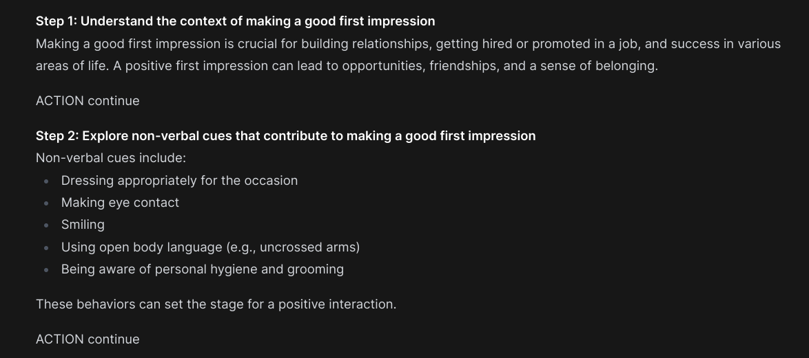
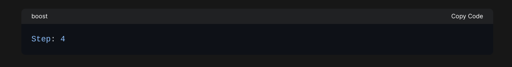

# Harbor Boost Configuration

Harbor Boost is configured using environment variables. Following options are available:
  

## HARBOR_OPENAI_URLS
> **Type**: `StrList`<br/>
> **Default**: ``<br/>

An alias for `HARBOR_BOOST_OPENAI_URLS`.


## HARBOR_OPENAI_KEYS
> **Type**: `StrList`<br/>
> **Default**: ``<br/>

An alias for `HARBOR_BOOST_OPENAI_KEYS`.


## HARBOR_BOOST_OPENAI_URLS
> **Type**: `StrList`<br/>
> **Default**: ``<br/>

A semicolon-separated list of URLs to the OpenAI APIs to boost.
Prefer using named APIs via `HARBOR_BOOST_OPENAI_URL_*` and `HARBOR_BOOST_OPENAI_KEY_*` instead.
Must index-match contents of `HARBOR_BOOST_OPENAI_KEYS`.

Example:
```bash
HARBOR_OPENAI_URLS=https://localhost:11434/v1;https://localhost:8080/v1
```


## HARBOR_BOOST_OPENAI_KEYS
> **Type**: `StrList`<br/>
> **Default**: ``<br/>

A semicolon-separated list of API keys to use for the OpenAI APIs to boost.
Prefer using named APIs via `HARBOR_BOOST_OPENAI_URL_*` and `HARBOR_BOOST_OPENAI_KEY_*` instead.
Must index-match contents of `HARBOR_BOOST_OPENAI_URLS`.

Example:
```bash
HARBOR_OPENAI_KEYS=sk-abc123;sk-def456
```


## HARBOR_BOOST_OPENAI_URL_*
> **Type**: `str`<br/>
> **Default**: ``<br/>


Named OpenAI-compatible API URLs to boost.
`*` means multiple variables can be defined with arbitrary postfix.

Example:
```bash
HARBOR_BOOST_OPENAI_URL_OLLAMA=https://localhost:11434/v1
HARBOR_BOOST_OPENAI_KEY_OLLAMA=sk-ollama123

HARBOR_BOOST_OPENAI_URL_HF=https://api-inference.huggingface.co/v1
HARBOR_BOOST_OPENAI_KEY_HF=sk-hf456
```


## HARBOR_BOOST_OPENAI_KEY_*
> **Type**: `str`<br/>
> **Default**: ``<br/>

Example:
```bash
HARBOR_BOOST_OPENAI_URL_OLLAMA=https://localhost:11434/v1
HARBOR_BOOST_OPENAI_KEY_OLLAMA=sk-ollama123

HARBOR_BOOST_OPENAI_URL_HF=https://api-inference.huggingface.co/v1
HARBOR_BOOST_OPENAI_KEY_HF=sk-hf456
```


## HARBOR_BOOST_EXTRA_LLM_PARAMS
> **Type**: `ConfigDict`<br/>
> **Default**: `temperature=0.35`<br/>

Allows to specify extra payload for /chat/completions endpoints for all downstream services at once.
Format is `key=value,key2=value2,...`.

Example:
```bash
HARBOR_BOOST_EXTRA_LLM_PARAMS=temperature=0.35,top_p=0.9

# Be careful using provider-specific parameters
HARBOR_BOOST_EXTRA_LLM_PARAMS=temperature=0.12,max_ctx=8192
```


## HARBOR_BOOST_MODULES
> **Type**: `StrList`<br/>
> **Default**: `all`<br/>

A list of boost modules that will be advertised by `/v1/models` endpoint.
All loaded modules can still be used directly, this configuration only affects
which modules are advertised in the API.

Supports `all` value to enable all modules.

Example:
```bash
# Serve all modules
HARBOR_BOOST_MODULES=all

# Only serve klmbr and rcn modules
HARBOR_BOOST_MODULES=klmbr;rcn
```

When using with Harbor, you can configure this via Harbor CLI:

```bash
# Enable the module
harbor boost modules add <module>
# Disable the module
harbor boost modules rm <module>
# List enabled modules
harbor boost modules ls
```


Note that new Harbor releases might introduce new modules, so the default value of this setting could change in the future. Check out [Harbor Profiles](./3.-Harbor-CLI-Reference#harbor-profile) for a way to save and restore your configuration.


## HARBOR_BOOST_MODULE_FOLDERS
> **Type**: `StrList`<br/>
> **Default**: `modules;custom_modules`<br/>

A list of folders to load boost modules from.
You can mount custom modules to the `/boost/custom_modules` or a custom location and use this configuration to load them.

Example:
```bash
# Load from default locations
HARBOR_BOOST_MODULE_FOLDERS=modules;custom_modules

# Disable all built-in modules and load only custom ones
HARBOR_BOOST_MODULE_FOLDERS=/some/custom/path
```


## HARBOR_BOOST_INTERMEDIATE_OUTPUT
> **Type**: `bool`<br/>
> **Default**: `true`<br/>

When set to `true`, the boost output the intermediate steps of the module, not only the final result, providing more dynamic feedback to the user.

Intermediate output includes status messages, internal monologue, and other non-final completions. Note that it doesn't mean "all output" from the module, as the module source can still decide to not emit specific things at all, or inverse - emit them even if this setting is off.

Example of the intermediate output from the `g1` module - underlying reasoning steps:




## HARBOR_BOOST_STATUS_STYLE
> **Type**: `str`<br/>
> **Default**: `md:codeblock`<br/>

A module can call `llm.emit_status` during its processing, which will be streamed as a "status" or "progress" message to the user. This setting controls the format of this message, which will be dependent on what's supported by the frontend where boost response is displayed.

Options:

````bash
md:codeblock "
```boost
{status}
```
",
md:h1        "

# {status}

",
md:h2        "

## {status}

",
md:h3        "

### {status}

",
plain        "

{status}

",
none         ""
````

The default is `md:codeblock` and looks like this in the WebUI:




## HARBOR_BOOST_BASE_MODELS
> **Type**: `bool`<br/>
> **Default**: `false`<br/>

Depending on the configuration of your setup, your LLM backend might or might not be connected to the UI directly. If not (or using boost as a standalone service), you can toggle this option on for the `boost` to serve them as is.

```bash
# Now "unboosted" models will also be available
# via the boost API
harbor config boost.base_models true
```


## HARBOR_BOOST_MODEL_FILTER
> **Type**: `ConfigDict`<br/>
> **Default**: ``<br/>

When specified, `boost` will only serve models matching the filter. The filter is a key/value expression that'll be matched against the model metadata. See examples below:

```bash
# Only boost models with the "llama" in the name
harbor config set boost.model_filter id.contains=llama
# Only boost models matching the regex
harbor config set boost.model_filter id.regex=.+q8_0$
# Boost by regex matching multiple IDs
harbor config set boost.model_filter "id.regex=.*(llama3.1:8b|llama3.2:3b|qwen2.5:7b)"
# Only boost a model with the exact ID
harbor config set boost.model_filter id=llama3.1:8b
```

This filter runs _after_ the boosted models (per module) are added, so you can filter them out as well.


## HARBOR_BOOST_API_KEY
> **Type**: `str`<br/>
> **Default**: ``<br/>

By default, boost will accept and serve any request, but you can configure one or more API keys to restrict access to the service.

Example:

```bash
# Configure the API key
HARBOR_BOOST_API_KEY=sk-boost
# Send the API key in the header
# Authorization: sk-boost
```


## HARBOR_BOOST_API_KEYS
> **Type**: `StrList`<br/>
> **Default**: ``<br/>

A colon-separated list of API keys to use for the boost API. Counterpart to `HARBOR_BOOST_API_KEY`.

Example:
```bash
# Configure the API keys
HARBOR_BOOST_API_KEYS=sk-user1;sk-user2;sk-user3
```


## HARBOR_BOOST_API_KEY_*
> **Type**: `str`<br/>
> **Default**: ``<br/>

Allows specifying additional, "named" API keys that will be accepted by the boost API.

Example:
```bash
# Configure the API keys
HARBOR_BOOST_API_KEY_MAIN=sk-main

# Temporary API key for testing
HARBOR_BOOST_API_KEY_TEST=sk-test
```


## HARBOR_BOOST_PUBLIC_URL
> **Type**: `str`<br/>
> **Default**: `http://localhost:34131`<br/>

URL which boost artifacts should use to access the boost API


## HARBOR_BOOST_KLMBR_PERCENTAGE
> **Type**: `int`<br/>
> **Default**: `15`<br/>

The percentage of text to modify with the klmbr module


## HARBOR_BOOST_KLMBR_MODS
> **Type**: `StrList`<br/>
> **Default**: `all`<br/>

The list of modifications klmbr will apply


## HARBOR_BOOST_KLMBR_STRAT
> **Type**: `str`<br/>
> **Default**: `all`<br/>

The strategy that selects messages to modify for the klmbr module


## HARBOR_BOOST_KLMBR_STRAT_PARAMS
> **Type**: `ConfigDict`<br/>
> **Default**: ``<br/>

The parameters for the strategy that selects messages to modify for the klmbr module


## HARBOR_BOOST_RCN_STRAT
> **Type**: `str`<br/>
> **Default**: `match`<br/>

The strategy that selects messages to modify for the rcn module


## HARBOR_BOOST_RCN_STRAT_PARAMS
> **Type**: `ConfigDict`<br/>
> **Default**: `role=user,index=-1`<br/>

Parameters for rcn message selection


## HARBOR_BOOST_G1_STRAT
> **Type**: `str`<br/>
> **Default**: `match`<br/>

The strategy that selects messages to modify for the g1 module


## HARBOR_BOOST_G1_STRAT_PARAMS
> **Type**: `ConfigDict`<br/>
> **Default**: `role=user,index=-1`<br/>

Parameters for g1 message selection


## HARBOR_BOOST_G1_MAX_STEPS
> **Type**: `int`<br/>
> **Default**: `15`<br/>

The maximum number of reasoning steps to generate


## HARBOR_BOOST_MCTS_STRAT
> **Type**: `str`<br/>
> **Default**: `match`<br/>

The strategy that selects messages to target for the mcts module


## HARBOR_BOOST_MCTS_STRAT_PARAMS
> **Type**: `ConfigDict`<br/>
> **Default**: `role=user,index=-1`<br/>

Parameters for mcts message selection


## HARBOR_BOOST_MCTS_MAX_SIMULATIONS
> **Type**: `int`<br/>
> **Default**: `2`<br/>

The maximum number of simulations to run (per iteration)


## HARBOR_BOOST_MCTS_MAX_ITERATIONS
> **Type**: `int`<br/>
> **Default**: `2`<br/>

The maximum number of iterations to run


## HARBOR_BOOST_MCTS_THOUGHTS
> **Type**: `int`<br/>
> **Default**: `2`<br/>

The amount of thoughts (node expansions) to generate per simulation


## HARBOR_BOOST_MCTS_EXPLORATION_CONSTANT
> **Type**: `float`<br/>
> **Default**: `1.414`<br/>

The exploration constant for the MCTS algorithm


## HARBOR_BOOST_ELI5_STRAT
> **Type**: `str`<br/>
> **Default**: `match`<br/>

The strategy that selects messages to target for the eli5 module


## HARBOR_BOOST_ELI5_STRAT_PARAMS
> **Type**: `ConfigDict`<br/>
> **Default**: `role=user,index=-1`<br/>

Parameters for eli5 message selection


## HARBOR_BOOST_SUPERSUMMER_STRAT
> **Type**: `str`<br/>
> **Default**: `match`<br/>

The strategy that selects messages to target for the supersummer module


## HARBOR_BOOST_SUPERSUMMER_STRAT_PARAMS
> **Type**: `ConfigDict`<br/>
> **Default**: `role=user,index=-1`<br/>

Parameters for supersummer message selection


## HARBOR_BOOST_SUPERSUMMER_NUM_QUESTIONS
> **Type**: `int`<br/>
> **Default**: `5`<br/>

The number of questions to generate for the summarisation


## HARBOR_BOOST_SUPERSUMMER_LENGTH
> **Type**: `str`<br/>
> **Default**: `few paragraphs`<br/>

Desired length of the summary


## HARBOR_BOOST_R0_THOUGHTS
> **Type**: `int`<br/>
> **Default**: `5`<br/>

The amount of thoughts to generate for the r0 module