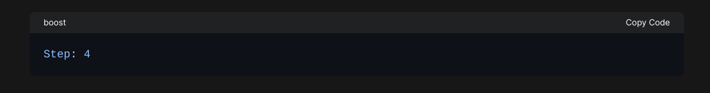

#1 [internal] load local bake definitions
#1 reading from stdin 528B done
#1 DONE 0.0s

#2 [internal] load build definition from Dockerfile
#2 transferring dockerfile:
#2 transferring dockerfile: 339B done
#2 DONE 0.1s

#3 [internal] load metadata for ghcr.io/av/tools:latest
#3 DONE 1.5s

#4 [internal] load .dockerignore
#4 transferring context: 108B done
#4 DONE 0.1s

#5 [1/5] FROM ghcr.io/av/tools:latest@sha256:585173c187f15c50680727f17c5d63b292cdeec35d5ffa467a3fc7c609b57c2a
#5 resolve ghcr.io/av/tools:latest@sha256:585173c187f15c50680727f17c5d63b292cdeec35d5ffa467a3fc7c609b57c2a 0.1s done
#5 ...

#6 [internal] load build context
#6 transferring context: 984.68kB 0.0s done
#6 DONE 0.2s

#5 [1/5] FROM ghcr.io/av/tools:latest@sha256:585173c187f15c50680727f17c5d63b292cdeec35d5ffa467a3fc7c609b57c2a
#5 DONE 0.5s

#5 [1/5] FROM ghcr.io/av/tools:latest@sha256:585173c187f15c50680727f17c5d63b292cdeec35d5ffa467a3fc7c609b57c2a
#5 sha256:9895a2d062ac1680c984327769f7012c52ae2ee3a07b553e23c7a6e735c1aadb 0B / 87.19MB 0.2s
#5 sha256:905d2475747650b5c8f09d096f43af18c225fc35b6dcf3419584cf9d944b207f 0B / 213.23MB 0.2s
#5 sha256:e787867bf3c74d0dd053721ca47b96f83bf2a9066e2dee766323c6832b0f63f6 0B / 96.48MB 0.2s
#5 sha256:54eb836c3a5e50a423d0b8fed3a7ce27dbd1c4626f161c034015cc073913ade7 0B / 93B 0.2s
#5 sha256:9895a2d062ac1680c984327769f7012c52ae2ee3a07b553e23c7a6e735c1aadb 9.44MB / 87.19MB 0.6s
#5 sha256:54eb836c3a5e50a423d0b8fed3a7ce27dbd1c4626f161c034015cc073913ade7 93B / 93B 0.4s done
#5 sha256:939af5eb95545244b4d4acb122796a50a03821b816b15d701fec571ec73fe32a 0B / 57.63MB 0.2s
#5 sha256:9895a2d062ac1680c984327769f7012c52ae2ee3a07b553e23c7a6e735c1aadb 14.68MB / 87.19MB 0.9s
#5 sha256:e787867bf3c74d0dd053721ca47b96f83bf2a9066e2dee766323c6832b0f63f6 10.49MB / 96.48MB 0.9s
#5 sha256:9895a2d062ac1680c984327769f7012c52ae2ee3a07b553e23c7a6e735c1aadb 19.92MB / 87.19MB 1.2s
#5 sha256:905d2475747650b5c8f09d096f43af18c225fc35b6dcf3419584cf9d944b207f 12.58MB / 213.23MB 1.1s
#5 sha256:e787867bf3c74d0dd053721ca47b96f83bf2a9066e2dee766323c6832b0f63f6 20.97MB / 96.48MB 1.2s
#5 sha256:9895a2d062ac1680c984327769f7012c52ae2ee3a07b553e23c7a6e735c1aadb 26.21MB / 87.19MB 1.5s
#5 sha256:939af5eb95545244b4d4acb122796a50a03821b816b15d701fec571ec73fe32a 3.15MB / 57.63MB 0.9s
#5 sha256:905d2475747650b5c8f09d096f43af18c225fc35b6dcf3419584cf9d944b207f 27.26MB / 213.23MB 1.5s
#5 sha256:e787867bf3c74d0dd053721ca47b96f83bf2a9066e2dee766323c6832b0f63f6 29.36MB / 96.48MB 1.5s
#5 sha256:9895a2d062ac1680c984327769f7012c52ae2ee3a07b553e23c7a6e735c1aadb 31.46MB / 87.19MB 1.8s
#5 sha256:e787867bf3c74d0dd053721ca47b96f83bf2a9066e2dee766323c6832b0f63f6 34.60MB / 96.48MB 1.7s
#5 sha256:939af5eb95545244b4d4acb122796a50a03821b816b15d701fec571ec73fe32a 6.29MB / 57.63MB 1.2s
#5 sha256:9895a2d062ac1680c984327769f7012c52ae2ee3a07b553e23c7a6e735c1aadb 36.70MB / 87.19MB 2.1s
#5 sha256:905d2475747650b5c8f09d096f43af18c225fc35b6dcf3419584cf9d944b207f 41.94MB / 213.23MB 2.0s
#5 sha256:e787867bf3c74d0dd053721ca47b96f83bf2a9066e2dee766323c6832b0f63f6 42.99MB / 96.48MB 2.0s
#5 sha256:939af5eb95545244b4d4acb122796a50a03821b816b15d701fec571ec73fe32a 9.44MB / 57.63MB 1.5s
#5 sha256:e787867bf3c74d0dd053721ca47b96f83bf2a9066e2dee766323c6832b0f63f6 48.23MB / 96.48MB 2.1s
#5 sha256:9895a2d062ac1680c984327769f7012c52ae2ee3a07b553e23c7a6e735c1aadb 41.94MB / 87.19MB 2.4s
#5 sha256:939af5eb95545244b4d4acb122796a50a03821b816b15d701fec571ec73fe32a 12.58MB / 57.63MB 1.8s
#5 sha256:905d2475747650b5c8f09d096f43af18c225fc35b6dcf3419584cf9d944b207f 55.57MB / 213.23MB 2.4s
#5 sha256:e787867bf3c74d0dd053721ca47b96f83bf2a9066e2dee766323c6832b0f63f6 56.62MB / 96.48MB 2.4s
#5 sha256:9895a2d062ac1680c984327769f7012c52ae2ee3a07b553e23c7a6e735c1aadb 47.19MB / 87.19MB 2.7s
#5 sha256:e787867bf3c74d0dd053721ca47b96f83bf2a9066e2dee766323c6832b0f63f6 61.87MB / 96.48MB 2.6s
#5 sha256:939af5eb95545244b4d4acb122796a50a03821b816b15d701fec571ec73fe32a 15.73MB / 57.63MB 2.1s
#5 sha256:9895a2d062ac1680c984327769f7012c52ae2ee3a07b553e23c7a6e735c1aadb 52.43MB / 87.19MB 3.0s
#5 sha256:905d2475747650b5c8f09d096f43af18c225fc35b6dcf3419584cf9d944b207f 70.25MB / 213.23MB 2.9s
#5 sha256:e787867bf3c74d0dd053721ca47b96f83bf2a9066e2dee766323c6832b0f63f6 70.25MB / 96.48MB 2.9s
#5 sha256:939af5eb95545244b4d4acb122796a50a03821b816b15d701fec571ec73fe32a 18.87MB / 57.63MB 2.4s
#5 sha256:9895a2d062ac1680c984327769f7012c52ae2ee3a07b553e23c7a6e735c1aadb 57.67MB / 87.19MB 3.3s
#5 sha256:e787867bf3c74d0dd053721ca47b96f83bf2a9066e2dee766323c6832b0f63f6 79.69MB / 96.48MB 3.2s
#5 sha256:939af5eb95545244b4d4acb122796a50a03821b816b15d701fec571ec73fe32a 22.02MB / 57.63MB 2.7s
#5 sha256:905d2475747650b5c8f09d096f43af18c225fc35b6dcf3419584cf9d944b207f 83.89MB / 213.23MB 3.3s
#5 sha256:9895a2d062ac1680c984327769f7012c52ae2ee3a07b553e23c7a6e735c1aadb 63.96MB / 87.19MB 3.6s
#5 sha256:e787867bf3c74d0dd053721ca47b96f83bf2a9066e2dee766323c6832b0f63f6 88.08MB / 96.48MB 3.5s
#5 sha256:939af5eb95545244b4d4acb122796a50a03821b816b15d701fec571ec73fe32a 25.17MB / 57.63MB 3.0s
#5 sha256:9895a2d062ac1680c984327769f7012c52ae2ee3a07b553e23c7a6e735c1aadb 69.21MB / 87.19MB 3.9s
#5 sha256:905d2475747650b5c8f09d096f43af18c225fc35b6dcf3419584cf9d944b207f 97.52MB / 213.23MB 3.8s
#5 sha256:e787867bf3c74d0dd053721ca47b96f83bf2a9066e2dee766323c6832b0f63f6 96.48MB / 96.48MB 3.8s done
#5 sha256:939af5eb95545244b4d4acb122796a50a03821b816b15d701fec571ec73fe32a 28.31MB / 57.63MB 3.3s
#5 sha256:f647e5d6dddb86fa9cd340ccd92fbfd0f3a48c56030f97c9a85ed37ed0a742a7 0B / 285.04MB 0.2s
#5 sha256:9895a2d062ac1680c984327769f7012c52ae2ee3a07b553e23c7a6e735c1aadb 74.45MB / 87.19MB 4.2s
#5 sha256:939af5eb95545244b4d4acb122796a50a03821b816b15d701fec571ec73fe32a 31.46MB / 57.63MB 3.6s
#5 sha256:905d2475747650b5c8f09d096f43af18c225fc35b6dcf3419584cf9d944b207f 112.20MB / 213.23MB 4.2s
#5 sha256:9895a2d062ac1680c984327769f7012c52ae2ee3a07b553e23c7a6e735c1aadb 79.69MB / 87.19MB 4.5s
#5 sha256:939af5eb95545244b4d4acb122796a50a03821b816b15d701fec571ec73fe32a 35.65MB / 57.63MB 3.9s
#5 sha256:9895a2d062ac1680c984327769f7012c52ae2ee3a07b553e23c7a6e735c1aadb 84.93MB / 87.19MB 4.8s
#5 sha256:905d2475747650b5c8f09d096f43af18c225fc35b6dcf3419584cf9d944b207f 125.83MB / 213.23MB 4.7s
#5 sha256:939af5eb95545244b4d4acb122796a50a03821b816b15d701fec571ec73fe32a 38.80MB / 57.63MB 4.2s
#5 sha256:f647e5d6dddb86fa9cd340ccd92fbfd0f3a48c56030f97c9a85ed37ed0a742a7 15.73MB / 285.04MB 0.9s
#5 sha256:9895a2d062ac1680c984327769f7012c52ae2ee3a07b553e23c7a6e735c1aadb 87.19MB / 87.19MB 5.0s done
#5 sha256:905d2475747650b5c8f09d096f43af18c225fc35b6dcf3419584cf9d944b207f 140.51MB / 213.23MB 5.1s
#5 sha256:939af5eb95545244b4d4acb122796a50a03821b816b15d701fec571ec73fe32a 41.94MB / 57.63MB 4.5s
#5 sha256:f2141055ea06800212a013b10fd8f51686883534855725ad4066cb583cf33f1b 0B / 208.72kB 0.2s
#5 sha256:939af5eb95545244b4d4acb122796a50a03821b816b15d701fec571ec73fe32a 45.09MB / 57.63MB 4.8s
#5 sha256:f647e5d6dddb86fa9cd340ccd92fbfd0f3a48c56030f97c9a85ed37ed0a742a7 33.55MB / 285.04MB 1.5s
#5 sha256:f2141055ea06800212a013b10fd8f51686883534855725ad4066cb583cf33f1b 208.72kB / 208.72kB 0.3s done
#5 sha256:905d2475747650b5c8f09d096f43af18c225fc35b6dcf3419584cf9d944b207f 156.24MB / 213.23MB 5.6s
#5 sha256:8c53069d555e9eb744cf51954484f1e8c1ceae8bebf965f72690b5f807dd7e30 0B / 21.56MB 0.2s
#5 sha256:939af5eb95545244b4d4acb122796a50a03821b816b15d701fec571ec73fe32a 49.28MB / 57.63MB 5.1s
#5 sha256:f647e5d6dddb86fa9cd340ccd92fbfd0f3a48c56030f97c9a85ed37ed0a742a7 48.23MB / 285.04MB 2.0s
#5 sha256:905d2475747650b5c8f09d096f43af18c225fc35b6dcf3419584cf9d944b207f 170.92MB / 213.23MB 6.0s
#5 sha256:939af5eb95545244b4d4acb122796a50a03821b816b15d701fec571ec73fe32a 52.43MB / 57.63MB 5.4s
#5 sha256:8c53069d555e9eb744cf51954484f1e8c1ceae8bebf965f72690b5f807dd7e30 4.19MB / 21.56MB 0.6s
#5 sha256:8c53069d555e9eb744cf51954484f1e8c1ceae8bebf965f72690b5f807dd7e30 6.29MB / 21.56MB 0.8s
#5 sha256:939af5eb95545244b4d4acb122796a50a03821b816b15d701fec571ec73fe32a 55.57MB / 57.63MB 5.7s
#5 sha256:8c53069d555e9eb744cf51954484f1e8c1ceae8bebf965f72690b5f807dd7e30 9.44MB / 21.56MB 0.9s
#5 sha256:905d2475747650b5c8f09d096f43af18c225fc35b6dcf3419584cf9d944b207f 185.60MB / 213.23MB 6.5s
#5 sha256:939af5eb95545244b4d4acb122796a50a03821b816b15d701fec571ec73fe32a 57.63MB / 57.63MB 5.8s done
#5 sha256:f647e5d6dddb86fa9cd340ccd92fbfd0f3a48c56030f97c9a85ed37ed0a742a7 67.11MB / 285.04MB 2.6s
#5 sha256:8c53069d555e9eb744cf51954484f1e8c1ceae8bebf965f72690b5f807dd7e30 11.53MB / 21.56MB 1.1s
#5 sha256:8c53069d555e9eb744cf51954484f1e8c1ceae8bebf965f72690b5f807dd7e30 14.68MB / 21.56MB 1.2s
#5 sha256:20043066d3d5c78b45520c5707319835ac7d1f3d7f0dded0138ea0897d6a3188 0B / 29.72MB 0.2s
#5 sha256:8c53069d555e9eb744cf51954484f1e8c1ceae8bebf965f72690b5f807dd7e30 17.83MB / 21.56MB 1.4s
#5 sha256:905d2475747650b5c8f09d096f43af18c225fc35b6dcf3419584cf9d944b207f 200.28MB / 213.23MB 6.9s
#5 sha256:f647e5d6dddb86fa9cd340ccd92fbfd0f3a48c56030f97c9a85ed37ed0a742a7 81.79MB / 285.04MB 3.0s
#5 sha256:8c53069d555e9eb744cf51954484f1e8c1ceae8bebf965f72690b5f807dd7e30 19.92MB / 21.56MB 1.5s
#5 sha256:8c53069d555e9eb744cf51954484f1e8c1ceae8bebf965f72690b5f807dd7e30 21.56MB / 21.56MB 1.6s done
#5 sha256:20043066d3d5c78b45520c5707319835ac7d1f3d7f0dded0138ea0897d6a3188 3.15MB / 29.72MB 0.6s
#5 sha256:20043066d3d5c78b45520c5707319835ac7d1f3d7f0dded0138ea0897d6a3188 5.24MB / 29.72MB 0.8s
#5 sha256:f647e5d6dddb86fa9cd340ccd92fbfd0f3a48c56030f97c9a85ed37ed0a742a7 97.52MB / 285.04MB 3.5s
#5 sha256:20043066d3d5c78b45520c5707319835ac7d1f3d7f0dded0138ea0897d6a3188 8.39MB / 29.72MB 1.1s
#5 sha256:905d2475747650b5c8f09d096f43af18c225fc35b6dcf3419584cf9d944b207f 213.23MB / 213.23MB 7.4s done
#5 sha256:20043066d3d5c78b45520c5707319835ac7d1f3d7f0dded0138ea0897d6a3188 10.49MB / 29.72MB 1.2s
#5 sha256:20043066d3d5c78b45520c5707319835ac7d1f3d7f0dded0138ea0897d6a3188 12.58MB / 29.72MB 1.4s
#5 sha256:f647e5d6dddb86fa9cd340ccd92fbfd0f3a48c56030f97c9a85ed37ed0a742a7 114.29MB / 285.04MB 3.9s
#5 sha256:20043066d3d5c78b45520c5707319835ac7d1f3d7f0dded0138ea0897d6a3188 14.68MB / 29.72MB 1.5s
#5 sha256:20043066d3d5c78b45520c5707319835ac7d1f3d7f0dded0138ea0897d6a3188 16.78MB / 29.72MB 1.7s
#5 sha256:20043066d3d5c78b45520c5707319835ac7d1f3d7f0dded0138ea0897d6a3188 18.87MB / 29.72MB 1.8s
#5 sha256:f647e5d6dddb86fa9cd340ccd92fbfd0f3a48c56030f97c9a85ed37ed0a742a7 132.12MB / 285.04MB 4.4s
#5 sha256:20043066d3d5c78b45520c5707319835ac7d1f3d7f0dded0138ea0897d6a3188 20.97MB / 29.72MB 2.0s
#5 sha256:20043066d3d5c78b45520c5707319835ac7d1f3d7f0dded0138ea0897d6a3188 24.12MB / 29.72MB 2.1s
#5 sha256:20043066d3d5c78b45520c5707319835ac7d1f3d7f0dded0138ea0897d6a3188 26.21MB / 29.72MB 2.3s
#5 sha256:f647e5d6dddb86fa9cd340ccd92fbfd0f3a48c56030f97c9a85ed37ed0a742a7 149.95MB / 285.04MB 4.8s
#5 sha256:20043066d3d5c78b45520c5707319835ac7d1f3d7f0dded0138ea0897d6a3188 28.31MB / 29.72MB 2.4s
#5 sha256:20043066d3d5c78b45520c5707319835ac7d1f3d7f0dded0138ea0897d6a3188 29.72MB / 29.72MB 2.5s done
#5 sha256:f647e5d6dddb86fa9cd340ccd92fbfd0f3a48c56030f97c9a85ed37ed0a742a7 168.82MB / 285.04MB 5.3s
#5 extracting sha256:20043066d3d5c78b45520c5707319835ac7d1f3d7f0dded0138ea0897d6a3188
#5 sha256:f647e5d6dddb86fa9cd340ccd92fbfd0f3a48c56030f97c9a85ed37ed0a742a7 186.65MB / 285.04MB 5.7s
#5 extracting sha256:20043066d3d5c78b45520c5707319835ac7d1f3d7f0dded0138ea0897d6a3188 0.7s done
#5 extracting sha256:8c53069d555e9eb744cf51954484f1e8c1ceae8bebf965f72690b5f807dd7e30
#5 sha256:f647e5d6dddb86fa9cd340ccd92fbfd0f3a48c56030f97c9a85ed37ed0a742a7 204.47MB / 285.04MB 6.2s
#5 extracting sha256:8c53069d555e9eb744cf51954484f1e8c1ceae8bebf965f72690b5f807dd7e30 0.5s done
#5 extracting sha256:f2141055ea06800212a013b10fd8f51686883534855725ad4066cb583cf33f1b 0.0s done
#5 sha256:f647e5d6dddb86fa9cd340ccd92fbfd0f3a48c56030f97c9a85ed37ed0a742a7 222.30MB / 285.04MB 6.6s
#5 sha256:f647e5d6dddb86fa9cd340ccd92fbfd0f3a48c56030f97c9a85ed37ed0a742a7 240.12MB / 285.04MB 7.1s
#5 sha256:f647e5d6dddb86fa9cd340ccd92fbfd0f3a48c56030f97c9a85ed37ed0a742a7 257.95MB / 285.04MB 7.5s
#5 sha256:f647e5d6dddb86fa9cd340ccd92fbfd0f3a48c56030f97c9a85ed37ed0a742a7 275.78MB / 285.04MB 8.0s
#5 sha256:f647e5d6dddb86fa9cd340ccd92fbfd0f3a48c56030f97c9a85ed37ed0a742a7 285.04MB / 285.04MB 8.5s done
#5 extracting sha256:f647e5d6dddb86fa9cd340ccd92fbfd0f3a48c56030f97c9a85ed37ed0a742a7
#5 extracting sha256:f647e5d6dddb86fa9cd340ccd92fbfd0f3a48c56030f97c9a85ed37ed0a742a7 5.7s done
#5 DONE 18.5s

#5 [1/5] FROM ghcr.io/av/tools:latest@sha256:585173c187f15c50680727f17c5d63b292cdeec35d5ffa467a3fc7c609b57c2a
#5 extracting sha256:939af5eb95545244b4d4acb122796a50a03821b816b15d701fec571ec73fe32a
#5 extracting sha256:939af5eb95545244b4d4acb122796a50a03821b816b15d701fec571ec73fe32a 1.6s done
#5 DONE 20.2s

#5 [1/5] FROM ghcr.io/av/tools:latest@sha256:585173c187f15c50680727f17c5d63b292cdeec35d5ffa467a3fc7c609b57c2a
#5 extracting sha256:54eb836c3a5e50a423d0b8fed3a7ce27dbd1c4626f161c034015cc073913ade7 0.0s done
#5 extracting sha256:e787867bf3c74d0dd053721ca47b96f83bf2a9066e2dee766323c6832b0f63f6
#5 extracting sha256:e787867bf3c74d0dd053721ca47b96f83bf2a9066e2dee766323c6832b0f63f6 0.9s done
#5 DONE 21.1s

#5 [1/5] FROM ghcr.io/av/tools:latest@sha256:585173c187f15c50680727f17c5d63b292cdeec35d5ffa467a3fc7c609b57c2a
#5 extracting sha256:905d2475747650b5c8f09d096f43af18c225fc35b6dcf3419584cf9d944b207f
#5 extracting sha256:905d2475747650b5c8f09d096f43af18c225fc35b6dcf3419584cf9d944b207f 3.8s done
#5 DONE 25.0s

#5 [1/5] FROM ghcr.io/av/tools:latest@sha256:585173c187f15c50680727f17c5d63b292cdeec35d5ffa467a3fc7c609b57c2a
#5 extracting sha256:9895a2d062ac1680c984327769f7012c52ae2ee3a07b553e23c7a6e735c1aadb
#5 extracting sha256:9895a2d062ac1680c984327769f7012c52ae2ee3a07b553e23c7a6e735c1aadb 3.7s done
#5 DONE 28.6s

#7 [2/5] WORKDIR /boost
#7 DONE 1.2s

#8 [3/5] COPY pyproject.toml uv.lock /boost
#8 DONE 0.1s

#9 [4/5] RUN uv sync --frozen
#9 0.353 Using CPython 3.12.3 interpreter at: /usr/bin/python3
#9 0.353 Creating virtual environment at: .venv
#9 0.663 Downloading hf-xet (3.0MiB)
#9 0.664 Downloading litellm (7.2MiB)
#9 0.664 Downloading tiktoken (1.1MiB)
#9 0.664 Downloading aiohttp (1.3MiB)
#9 0.665 Downloading tokenizers (3.0MiB)
#9 0.669 Downloading uvloop (4.5MiB)
#9 0.674 Downloading pydantic-core (1.9MiB)
#9 0.943 Downloading pygments (1.2MiB)
#9 1.078  Downloaded tiktoken
#9 1.088  Downloaded aiohttp
#9 1.122  Downloaded pygments
#9 1.136  Downloaded pydantic-core
#9 1.179  Downloaded tokenizers
#9 1.195  Downloaded hf-xet
#9 1.237  Downloaded uvloop
#9 1.302  Downloaded litellm
#9 1.302 Prepared 73 packages in 940ms
#9 1.354 Installed 73 packages in 51ms
#9 1.354  + aiohappyeyeballs==2.6.1
#9 1.354  + aiohttp==3.10.5
#9 1.354  + aiosignal==1.4.0
#9 1.354  + annotated-types==0.7.0
#9 1.354  + anyio==4.9.0
#9 1.354  + asyncache==0.3.1
#9 1.354  + attrs==25.3.0
#9 1.354  + cachetools==5.5.2
#9 1.354  + certifi==2025.8.3
#9 1.354  + charset-normalizer==3.4.2
#9 1.354  + click==8.2.1
#9 1.354  + distro==1.9.0
#9 1.354  + dnspython==2.7.0
#9 1.354  + email-validator==2.2.0
#9 1.354  + fastapi==0.111.0
#9 1.354  + fastapi-cli==0.0.8
#9 1.354  + filelock==3.18.0
#9 1.354  + frozenlist==1.7.0
#9 1.354  + fsspec==2025.7.0
#9 1.354  + h11==0.16.0
#9 1.354  + hf-xet==1.1.5
#9 1.354  + httpcore==1.0.9
#9 1.354  + httptools==0.6.4
#9 1.354  + httpx==0.28.1
#9 1.354  + httpx-sse==0.4.1
#9 1.354  + huggingface-hub==0.34.3
#9 1.354  + idna==3.10
#9 1.354  + importlib-metadata==8.7.0
#9 1.354  + jinja2==3.1.6
#9 1.354  + jiter==0.10.0
#9 1.354  + jsonschema==4.25.0
#9 1.354  + jsonschema-specifications==2025.4.1
#9 1.354  + litellm==1.65.7
#9 1.354  + markdown-it-py==3.0.0
#9 1.354  + markupsafe==3.0.2
#9 1.354  + mcp==1.6.0
#9 1.354  + mdurl==0.1.2
#9 1.354  + multidict==6.6.3
#9 1.354  + openai==1.98.0
#9 1.354  + orjson==3.11.1
#9 1.354  + packaging==25.0
#9 1.354  + propcache==0.3.2
#9 1.354  + pydantic==2.11.7
#9 1.354  + pydantic-core==2.33.2
#9 1.354  + pydantic-settings==2.10.1
#9 1.354  + pygments==2.19.2
#9 1.354  + python-dotenv==1.1.1
#9 1.354  + python-multipart==0.0.20
#9 1.354  + pyyaml==6.0.2
#9 1.354  + referencing==0.36.2
#9 1.355  + regex==2025.7.34
#9 1.355  + requests==2.32.3
#9 1.355  + rich==14.1.0
#9 1.355  + rich-toolkit==0.14.9
#9 1.355  + rpds-py==0.26.0
#9 1.355  + shellingham==1.5.4
#9 1.355  + sniffio==1.3.1
#9 1.355  + sse-starlette==3.0.2
#9 1.355  + starlette==0.37.2
#9 1.355  + tiktoken==0.9.0
#9 1.355  + tokenizers==0.21.4
#9 1.355  + tqdm==4.67.1
#9 1.355  + typer==0.16.0
#9 1.355  + typing-extensions==4.14.1
#9 1.355  + typing-inspection==0.4.1
#9 1.355  + ujson==5.10.0
#9 1.355  + urllib3==2.5.0
#9 1.355  + uvicorn==0.30.6
#9 1.355  + uvloop==0.21.0
#9 1.355  + watchfiles==1.1.0
#9 1.355  + websockets==15.0.1
#9 1.355  + yarl==1.20.1
#9 1.355  + zipp==3.23.0
#9 DONE 1.7s

#10 [5/5] COPY /src /boost
#10 DONE 0.2s

#11 exporting to image
#11 exporting layers
#11 exporting layers 3.9s done
#11 exporting manifest sha256:ef83309cdc7086279fedc36571a8115152ff0b20a70f6c7fb9b36751fdcb0d3c 0.0s done
#11 exporting config sha256:bf2f4fbf5ca3a3e88fdc78d0e86dce7789a405d6913015b3cf4ac99642d80dc4 0.0s done
#11 exporting attestation manifest sha256:a4e8bf3e1cd8471c01af02913f73460b092951b2beaf1a1a4ff9944152815a21 0.1s done
#11 exporting manifest list sha256:000d88e274662b4f844309cb6322accd47cf351c86ddd59f82d70a4986d16f6c 0.0s done
#11 naming to docker.io/library/harbor-boost:latest 0.0s done
#11 unpacking to docker.io/library/harbor-boost:latest
#11 unpacking to docker.io/library/harbor-boost:latest 1.4s done
#11 DONE 5.5s

#12 resolving provenance for metadata file
#12 DONE 0.0s

# Harbor Boost Configuration

Harbor Boost is configured using environment variables. Following options are available:
  

## HARBOR_OPENAI_URLS
> **Type**: `StrList`<br/>
> **Default**: ``<br/>

An alias for `HARBOR_BOOST_OPENAI_URLS`.


## HARBOR_OPENAI_KEYS
> **Type**: `StrList`<br/>
> **Default**: ``<br/>

An alias for `HARBOR_BOOST_OPENAI_KEYS`.


## HARBOR_BOOST_OPENAI_URLS
> **Type**: `StrList`<br/>
> **Default**: ``<br/>

A semicolon-separated list of URLs to the OpenAI APIs to boost.
Prefer using named APIs via `HARBOR_BOOST_OPENAI_URL_*` and `HARBOR_BOOST_OPENAI_KEY_*` instead.
Must index-match contents of `HARBOR_BOOST_OPENAI_KEYS`.

Example:
```bash
HARBOR_OPENAI_URLS=https://localhost:11434/v1;https://localhost:8080/v1
```


## HARBOR_BOOST_OPENAI_KEYS
> **Type**: `StrList`<br/>
> **Default**: ``<br/>

A semicolon-separated list of API keys to use for the OpenAI APIs to boost.
Prefer using named APIs via `HARBOR_BOOST_OPENAI_URL_*` and `HARBOR_BOOST_OPENAI_KEY_*` instead.
Must index-match contents of `HARBOR_BOOST_OPENAI_URLS`.

Example:
```bash
HARBOR_OPENAI_KEYS=sk-abc123;sk-def456
```


## HARBOR_BOOST_OPENAI_URL_*
> **Type**: `str`<br/>
> **Default**: ``<br/>


Named OpenAI-compatible API URLs to boost.
`*` means multiple variables can be defined with arbitrary postfix.

Example:
```bash
HARBOR_BOOST_OPENAI_URL_OLLAMA=https://localhost:11434/v1
HARBOR_BOOST_OPENAI_KEY_OLLAMA=sk-ollama123

HARBOR_BOOST_OPENAI_URL_HF=https://api-inference.huggingface.co/v1
HARBOR_BOOST_OPENAI_KEY_HF=sk-hf456
```


## HARBOR_BOOST_OPENAI_KEY_*
> **Type**: `str`<br/>
> **Default**: ``<br/>

Example:
```bash
HARBOR_BOOST_OPENAI_URL_OLLAMA=https://localhost:11434/v1
HARBOR_BOOST_OPENAI_KEY_OLLAMA=sk-ollama123

HARBOR_BOOST_OPENAI_URL_HF=https://api-inference.huggingface.co/v1
HARBOR_BOOST_OPENAI_KEY_HF=sk-hf456
```


## HARBOR_MINIMAX_API_KEY
> **Type**: `str`<br/>
> **Default**: ``<br/>

MiniMax API key. When set, the MiniMax OpenAI-compatible
endpoint (https://api.minimax.io/v1) is automatically
registered as a boost backend with MiniMax-M2.7,
MiniMax-M2.7-highspeed, and previous MiniMax models.


## HARBOR_BOOST_EXTRA_LLM_PARAMS
> **Type**: `ConfigDict`<br/>
> **Default**: `temperature=0.35`<br/>

Allows to specify extra payload for /chat/completions endpoints for all downstream services at once.
Format is `key=value,key2=value2,...`.

Example:
```bash
HARBOR_BOOST_EXTRA_LLM_PARAMS=temperature=0.35,top_p=0.9

# Be careful using provider-specific parameters
HARBOR_BOOST_EXTRA_LLM_PARAMS=temperature=0.12,max_ctx=8192
```


## HARBOR_BOOST_MODULES
> **Type**: `StrList`<br/>
> **Default**: `all`<br/>

A list of boost modules that will be advertised by `/v1/models` endpoint.
All loaded modules can still be used directly, this configuration only affects
which modules are advertised in the API.

Supports `all` value to enable all modules.

Example:
```bash
# Serve all modules
HARBOR_BOOST_MODULES=all

# Only serve klmbr and rcn modules
HARBOR_BOOST_MODULES=klmbr;rcn
```

When using with Harbor, you can configure this via Harbor CLI:

```bash
# Enable the module
harbor boost modules add <module>
# Disable the module
harbor boost modules rm <module>
# List enabled modules
harbor boost modules ls
```


Note that new Harbor releases might introduce new modules, so the default value of this setting could change in the future. Check out [Harbor Profiles](./3.-Harbor-CLI-Reference#harbor-profile) for a way to save and restore your configuration.


## HARBOR_BOOST_MODULE_FOLDERS
> **Type**: `StrList`<br/>
> **Default**: `modules;custom_modules`<br/>

A list of folders to load boost modules from.
You can mount custom modules to the `/boost/custom_modules` or a custom location and use this configuration to load them.

Example:
```bash
# Load from default locations
HARBOR_BOOST_MODULE_FOLDERS=modules;custom_modules

# Disable all built-in modules and load only custom ones
HARBOR_BOOST_MODULE_FOLDERS=/some/custom/path
```


## HARBOR_BOOST_INTERMEDIATE_OUTPUT
> **Type**: `bool`<br/>
> **Default**: `true`<br/>

When set to `true`, the boost output the intermediate steps of the module, not only the final result, providing more dynamic feedback to the user.

Intermediate output includes status messages, internal monologue, and other non-final completions. Note that it doesn't mean "all output" from the module, as the module source can still decide to not emit specific things at all, or inverse - emit them even if this setting is off.

Example of the intermediate output from the `g1` module - underlying reasoning steps:


## HARBOR_BOOST_STATUS_STYLE
> **Type**: `str`<br/>
> **Default**: `md:codeblock`<br/>

A module can call `llm.emit_status` during its processing, which will be streamed as a "status" or "progress" message to the user. This setting controls the format of this message, which will be dependent on what's supported by the frontend where boost response is displayed.

Options:

````bash
md:codeblock "
```boost
{status}
```
",
md:h1        "

# {status}

",
md:h2        "

## {status}

",
md:h3        "

### {status}

",
plain        "

{status}

",
none         ""
````

The default is `md:codeblock` and looks like this in the WebUI:




## HARBOR_BOOST_BASE_MODELS
> **Type**: `bool`<br/>
> **Default**: `false`<br/>

Depending on the configuration of your setup, your LLM backend might or might not be connected to the UI directly. If not (or using boost as a standalone service), you can toggle this option on for the `boost` to serve them as is.

```bash
# Now "unboosted" models will also be available
# via the boost API
harbor config boost.base_models true
```


## HARBOR_BOOST_MODEL_FILTER
> **Type**: `ConfigDict`<br/>
> **Default**: ``<br/>

When specified, `boost` will only serve models matching the filter. The filter is a key/value expression that'll be matched against the model metadata. See examples below:

```bash
# Only boost models with the "llama" in the name
harbor config set boost.model_filter id.contains=llama
# Only boost models matching the regex
harbor config set boost.model_filter id.regex=.+q8_0$
# Boost by regex matching multiple IDs
harbor config set boost.model_filter "id.regex=.*(llama3.1:8b|llama3.2:3b|qwen2.5:7b)"
# Only boost a model with the exact ID
harbor config set boost.model_filter id=llama3.1:8b
```

This filter runs _after_ the boosted models (per module) are added, so you can filter them out as well.


## HARBOR_BOOST_API_KEY
> **Type**: `str`<br/>
> **Default**: ``<br/>

By default, boost will accept and serve any request, but you can configure one or more API keys to restrict access to the service.

Example:

```bash
# Configure the API key
HARBOR_BOOST_API_KEY=sk-boost
# Send the API key in the header
# Authorization: sk-boost
```


## HARBOR_BOOST_API_KEYS
> **Type**: `StrList`<br/>
> **Default**: ``<br/>

A colon-separated list of API keys to use for the boost API. Counterpart to `HARBOR_BOOST_API_KEY`.

Example:
```bash
# Configure the API keys
HARBOR_BOOST_API_KEYS=sk-user1;sk-user2;sk-user3
```


## HARBOR_BOOST_API_KEY_*
> **Type**: `str`<br/>
> **Default**: ``<br/>

Allows specifying additional, "named" API keys that will be accepted by the boost API.

Example:
```bash
# Configure the API keys
HARBOR_BOOST_API_KEY_MAIN=sk-main

# Temporary API key for testing
HARBOR_BOOST_API_KEY_TEST=sk-test
```


## HARBOR_BOOST_PUBLIC_URL
> **Type**: `str`<br/>
> **Default**: `http://localhost:34131`<br/>

URL which boost artifacts should use to access the boost API


## HARBOR_BOOST_KLMBR_PERCENTAGE
> **Type**: `int`<br/>
> **Default**: `15`<br/>

The percentage of text to modify with the klmbr module


## HARBOR_BOOST_KLMBR_MODS
> **Type**: `StrList`<br/>
> **Default**: `all`<br/>

The list of modifications klmbr will apply


## HARBOR_BOOST_KLMBR_STRAT
> **Type**: `str`<br/>
> **Default**: `all`<br/>

The strategy that selects messages to modify for the klmbr module


## HARBOR_BOOST_KLMBR_STRAT_PARAMS
> **Type**: `ConfigDict`<br/>
> **Default**: ``<br/>

The parameters for the strategy that selects messages to modify for the klmbr module


## HARBOR_BOOST_RCN_STRAT
> **Type**: `str`<br/>
> **Default**: `match`<br/>

The strategy that selects messages to modify for the rcn module


## HARBOR_BOOST_RCN_STRAT_PARAMS
> **Type**: `ConfigDict`<br/>
> **Default**: `role=user,index=-1`<br/>

Parameters for rcn message selection


## HARBOR_BOOST_G1_STRAT
> **Type**: `str`<br/>
> **Default**: `match`<br/>

The strategy that selects messages to modify for the g1 module


## HARBOR_BOOST_G1_STRAT_PARAMS
> **Type**: `ConfigDict`<br/>
> **Default**: `role=user,index=-1`<br/>

Parameters for g1 message selection


## HARBOR_BOOST_G1_MAX_STEPS
> **Type**: `int`<br/>
> **Default**: `15`<br/>

The maximum number of reasoning steps to generate


## HARBOR_BOOST_MCTS_STRAT
> **Type**: `str`<br/>
> **Default**: `match`<br/>

The strategy that selects messages to target for the mcts module


## HARBOR_BOOST_MCTS_STRAT_PARAMS
> **Type**: `ConfigDict`<br/>
> **Default**: `role=user,index=-1`<br/>

Parameters for mcts message selection


## HARBOR_BOOST_MCTS_MAX_SIMULATIONS
> **Type**: `int`<br/>
> **Default**: `2`<br/>

The maximum number of simulations to run (per iteration)


## HARBOR_BOOST_MCTS_MAX_ITERATIONS
> **Type**: `int`<br/>
> **Default**: `2`<br/>

The maximum number of iterations to run


## HARBOR_BOOST_MCTS_THOUGHTS
> **Type**: `int`<br/>
> **Default**: `2`<br/>

The amount of thoughts (node expansions) to generate per simulation


## HARBOR_BOOST_MCTS_EXPLORATION_CONSTANT
> **Type**: `float`<br/>
> **Default**: `1.414`<br/>

The exploration constant for the MCTS algorithm


## HARBOR_BOOST_ELI5_STRAT
> **Type**: `str`<br/>
> **Default**: `match`<br/>

The strategy that selects messages to target for the eli5 module


## HARBOR_BOOST_ELI5_STRAT_PARAMS
> **Type**: `ConfigDict`<br/>
> **Default**: `role=user,index=-1`<br/>

Parameters for eli5 message selection


## HARBOR_BOOST_SUPERSUMMER_STRAT
> **Type**: `str`<br/>
> **Default**: `match`<br/>

The strategy that selects messages to target for the supersummer module


## HARBOR_BOOST_SUPERSUMMER_STRAT_PARAMS
> **Type**: `ConfigDict`<br/>
> **Default**: `role=user,index=-1`<br/>

Parameters for supersummer message selection


## HARBOR_BOOST_SUPERSUMMER_NUM_QUESTIONS
> **Type**: `int`<br/>
> **Default**: `5`<br/>

The number of questions to generate for the summarisation


## HARBOR_BOOST_SUPERSUMMER_LENGTH
> **Type**: `str`<br/>
> **Default**: `few paragraphs`<br/>

Desired length of the summary


## HARBOR_BOOST_R0_THOUGHTS
> **Type**: `int`<br/>
> **Default**: `5`<br/>

The amount of thoughts to generate for the r0 module