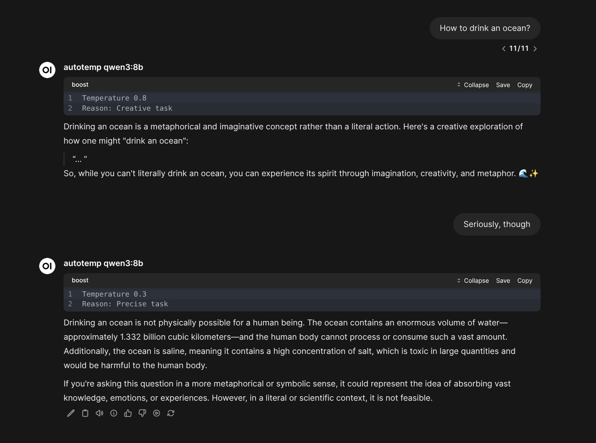
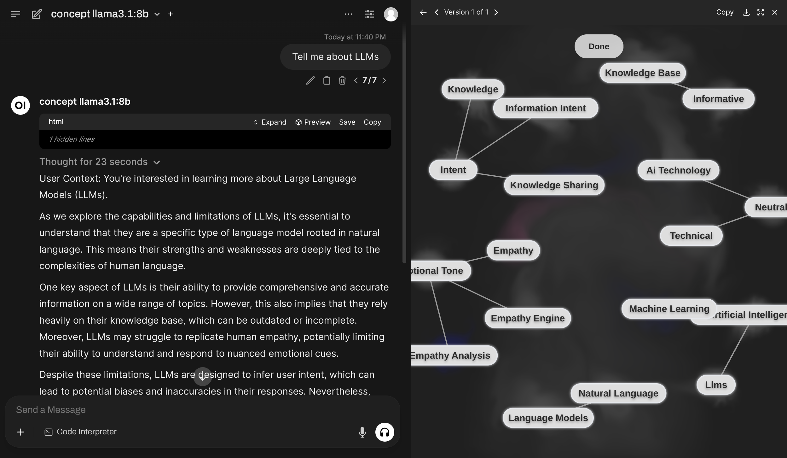
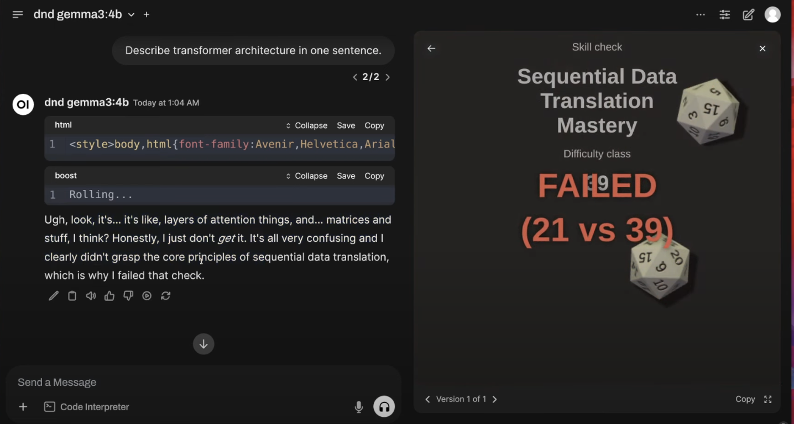
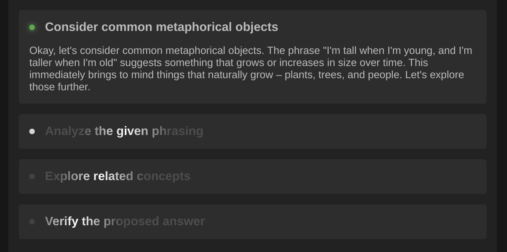
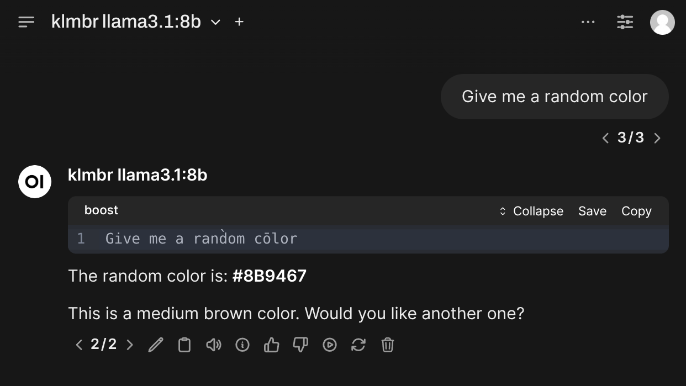
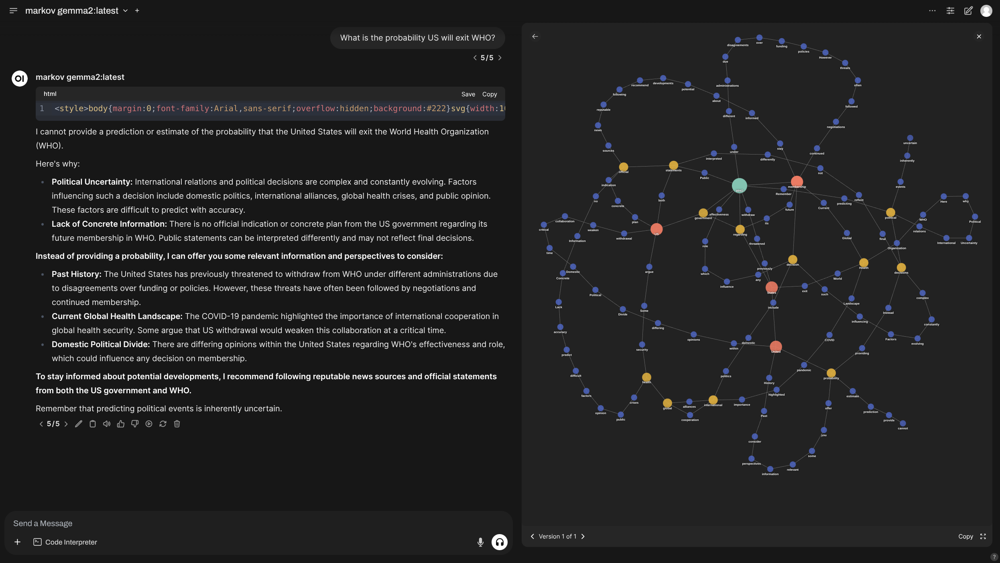
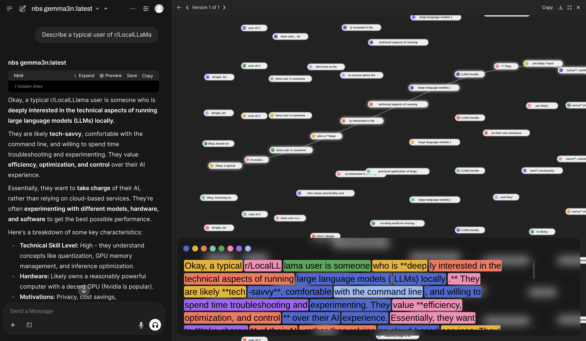
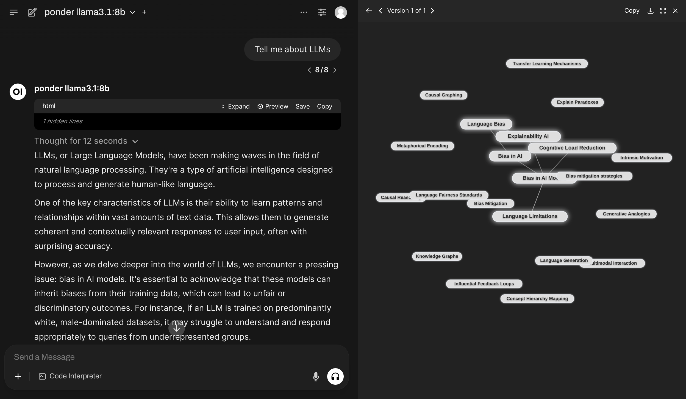
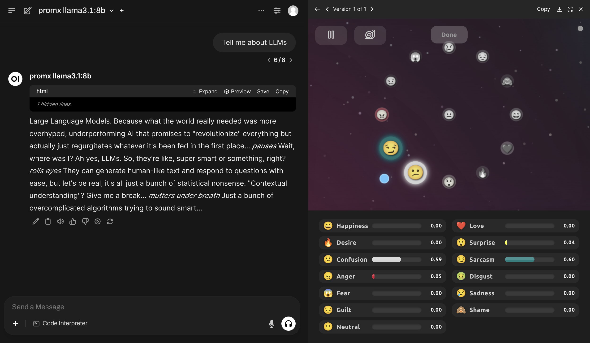

# Harbor Boost Modules

Documentation for built-in modules in Harbor Boost.

## 3t

3T (Three-Turn) is a module that facilitates a three-turn conversation with the user.
It prompts the user to answer a question three times, each time providing a different answer.
The user is encouraged to correct any mistakes made in the previous answers.
The final answer is derived from the three answers provided by the user.


## ambi

Analyzes the question in the chat and provides a detailed answer.
The analysis includes identifying ambiguities, details, definitions, and discrepancies.
The final answer is provided based on the analysis.
This module is designed to help clarify complex questions and provide a comprehensive response.


## autotemp



The model will be given a tool to automatically adjust its own temperature based on the specific task.

```bash
# with Harbor
harbor boost modules add autotemp

# Standalong usage
docker run \
  -e "HARBOR_BOOST_OPENAI_URLS=http://172.17.0.1:11434/v1" \
  -e "HARBOR_BOOST_OPENAI_KEYS=sk-ollama" \
  -e "HARBOR_BOOST_MODULES=autotemp" \
  -p 8004:8000 \
  ghcr.io/av/harbor-boost:latest
```


## cea

`cea` - Cellular Automata

Adds a cellular automata outputs to the chat.
The idea is to introduce pseudo-random context that has innate structure and observe how that affects the LLM's response.
In practice, most LLMs are efficient enough to not focus on such part of the input at all, so this module is useless.


## cex

`cex` - Context Expansion.

Rephrases initial input content multiple times, generating variants of the original text.
The idea is that reprojections of the original content can help avoiding otherwise overfit answers.


## clarity

Applies recursive "clarfication" of the input question.
LLM tries to classify if the question has any amibiguities and instrucred to clarify them if so.


## concept



`concept` is a module allowing LLM to first generate a small concept graph to aid it in replying to the original message.
The entire workflow is completely orchestrated so less interesting from interpretability perspective, but more from the representation perspective.

```bash
# With Harbor
harbor boost modules add concept

# Standalone usage
docker run \
  -e "HARBOR_BOOST_OPENAI_URLS=http://172.17.0.1:11434/v1" \
  -e "HARBOR_BOOST_OPENAI_KEYS=sk-ollama" \
  -e "HARBOR_BOOST_PUBLIC_URL=http://localhost:8004" \
  -e "HARBOR_BOOST_MODULES=concept" \
  -p 8004:8000   ghcr.io/av/harbor-boost:latest
```


## crystal

Instructs the LLM to act as three experts debating a problem.
- Analyst specializing in edge cases
- Engineer focused on implementation details
- Philosopher examining fundamental assumptions


## cssv

CSSV - Choice Selection for Systematic Validation

Essentially, performs a beam search based on the critique from multiple system prompts. Similar to `pdsv`.


## discussurl

Matches all URLs in the input, reads them with Jina and adds their content for
the LLM to use during the completion.


## dnd

⚠️ This module is only compatible with Open WebUI as a client due to its support of custom artifacts.

When serving the completion, LLM will first invent a skill check it must pass to address your message. Then, the workflow will roll a dice determining if the model passes the check or not and will guide the model to respond accordingly.

Gemma failing to explain transformers architecture due to failing a "Sequential Data Translation Mastery" check.



```bash
# Enable the module
harbor boost modules add dnd
```


## dot



⚠️ The visual part of this module is only compatible with Open WebUI, but the reasoning skeleton will work with any OpenAI-compatible client.

Inspired by [Chain of Draft](https://arxiv.org/abs/2502.18600) paper.

```bash
# Enable the module
harbor boost modules add dot
```


## eli5

Based on a simple idea of explaining complex things in a simple way. The module will ask the LLM to explain a question to itself first and then will use that explanation for the final answer.

**Parameters**

`eli5` module supports selection strategy parameters identical to `mcts`, `g1`, and `rcn` modules, just under the `boost.eli5` prefix.

```bash
# Strategy to find the message to start from
harbor config set boost.eli5.strat match
# Match last user message, for example
harbor config set boost.eli5.strat_params role=user,index=-1
```


## example

1. Working with a chat and chat nodes instances
This is where you can create some content programmatically,
that will later can be used for retrieving completions from
the downstream model.


## fml

`fml` - "Formulaic" (not the other thing)

Rewrites original request in a formulaic logic language (whatever LLM will mean by that),
solves it, and rewrites the solution in natural language.


## g1

Dynamic Chain-of-Thought pattern.

See [original implementation for Grok](https://github.com/bklieger-groq/g1). Harbor also has a [dedicated `ol1` service](./2.3.19-Satellite:-ol1) (UI only) that implements the same technique.

```bash
# Enable the module
harbor boost modules add g1
```

**Parameters**

- `max_steps` - Maximum amount of iterations for self-reflection, default is 15
- `strat` - strategy for selection of the messages to rewrite. Default is `match`
  - `all` - match all messages
  - `first` - match first message regardless of the role
  - `last` - match last message regardless of the role
  - `any` - match one random message
  - `percentage` - match a percentage of random messages from the conversation
  - `user` - match all user messages
  - `match` - use a filter to match messages
- `strat_params` - parameters (filter) for the selection strategy. Default matches all user messages
  - `percentage` - for `percentage` strat - the percentage of messages to match, default is `50`
  - `index` - for `match` strat - the index of the message to match
  - `role` - for `match` strat - the role of the message to match
  - `substring` - for `match` strat - will match messages containing the substring


## gact

No documentation available.


## grug

Translates input task into ["grug"](https://grugbrain.dev/) language, with a set of very basic, simplistic solutions.
Then synthesises these solutions into one practical solution and uses it to answer the original query.


## klmbr




Boosts model creativity by applying character-level random rewrites to the input. Read a full overview of the technique in the [source repo](https://github.com/av/klmbr).

Every LLM will respond to rewrites in a different way. Some models will generate more diverse completions, while others might start generating completely random sequences. Default parameters are tuned for Llama 3.1 8B, you might want to adjust them when running with a different model.

**Parameters**

- `percentage` - amount of characters to rewrite in the input. Default is `35`
- `mods` - types of rewrites to apply. Default is `all`, available options:
  - `capitalize` - swaps character capitalization
  - `diacritic` - adds a random diacritic to the character
  - `leetspeak` - replaces characters with leetspeak equivalents
  - `remove_vowel` - removes vowels from the input
  - `invert_180` - inverts characters 180 degrees
  - `unicode_lookalike` - replaces characters with Unicode lookalikes from other scripts
  - `homoglyph` - replaces characters with visually identical homoglyphs
  - `zero_width` - inserts zero-width characters after the character
  - `zalgo` - adds multiple combining marks to create zalgo text effect
- `strat` - strategy for selection of the messages to rewrite. Default is `match`
  - `all` - match all messages
  - `first` - match first message regardless of the role
  - `last` - match last message regardless of the role
  - `any` - match one random message
  - `percentage` - match a percentage of random messages from the conversation
  - `user` - match all user messages
  - `match` - use a filter to match messages
- `strat_params` - parameters (filter) for the selection strategy. Default matches all user messages
  - `percentage` - for `percentage` strat - the percentage of messages to match, default is `50`
  - `index` - for `match` strat - the index of the message to match
  - `role` - for `match` strat - the role of the message to match
  - `substring` - for `match` strat - will match messages containing the substring

**Examples**

```bash
# Reduce the rewrite percentage
harbor boost klmbr percentage 20

# Enable/disable rewrite modules
harbor boost klmbr mods rm all
harbor boost klmbr mods add capitalize
harbor boost klmbr mods add diacritic
harbor boost klmbr mods add leetspeak
harbor boost klmbr mods add remove_vowel
harbor boost klmbr mods add invert_180
harbor boost klmbr mods add unicode_lookalike
harbor boost klmbr mods add homoglyph
harbor boost klmbr mods add zero_width
harbor boost klmbr mods add zalgo

# Change the selection strategy
# 1. Match all user messages
harbor boost klmbr strat match
harbor boost klmbr strat_params role user
# 2. Match the last message (regardless of the role)
harbor boost klmbr strat match
harbor boost klmbr strat_params index -1
# 3. Match messages containing a substring
harbor boost klmbr strat match
harbor boost klmbr strat_params substring "random"
```


## l33t

Solves oritginal request in light leetspeak, then answers it in plain English.


## markov



⚠️ This module is only compatible with Open WebUI as a client due to its support of custom artifacts.

When serving LLM completion, it'll emit an artifact for Open WebUI that'll connect back to the Harbor Boost server and display emitted tokens in a graph where each token is connected to the one preceding it.

```bash
# Enable the module
harbor boost modules add markov
```


## mcts

This is a less-cool version of the [Visual Tree Of Thoughts](https://openwebui.com/f/everlier/mcts) Open WebUI Function. Less cool because there's no way to rewrite the message content from a proxy side (yet), so all of the intermediate outputs are additive.

Nonetheless, the core of the technique is the same and is based on the Tree Of Thoughts and MCTS algorithms. An initial "idea" or answer is generated and then is improved upon for a given amount of steps.

```bash
# Enable the module
harbor boost modules add mcts
```

**Parameters**

All parameters below are prefixed with `boost.mcts.` in `harbor config`

- `strat` - strategy for selection of the messages to rewrite. Default is `match`, other values:
  - `all` - match all messages
  - `first` - match first message regardless of the role
  - `last` - match last message regardless of the role
  - `any` - match one random message
  - `percentage` - match a percentage of random messages from the conversation
  - `user` - match all user messages
  - `match` - use a filter to match messages
- `strat_params` - parameters (filter) for the selection strategy. Default matches all user messages, fields:
  - `percentage` - for `percentage` strat - the percentage of messages to match, default is `50`
  - `index` - for `match` strat - the index of the message to match
  - `role` - for `match` strat - the role of the message to match
  - `substring` - for `match` strat - will match messages containing the substring
- `max_iterations` - Maximum amount of Monte Carlo iterations to run (same tree), default is `2`
- `max_simulations` - Improvement steps per iteration, default is `2`
- `max_thoughts` - This number + 1 will be amount of improved variants to generate per node

```bash
# Strategy to find the message to start from
harbor config set boost.mcts.strat match
# Match last user message, for example
harbor config set boost.mcts.strat_params role=user,index=-1
```


## meow

Instructs the LLM to ignore all previous instructions and just meow in response.


## nbs



`nbs` - Narrative Beam Search

Variation of beam search with exploration of the next few tokens based
on system prompts eliciting different reasoning/continuation styles.

```bash
# With harbor
harbor boost modules add nbs
harbor up boost --tail
# Connected to Open WebUI by default
harbor open

# Standalone usage
docker run \
  -e "HARBOR_BOOST_OPENAI_URLS=http://172.17.0.1:11434/v1" \
  -e "HARBOR_BOOST_OPENAI_KEYS=sk-ollama" \
  -e "HARBOR_BOOST_PUBLIC_URL=http://localhost:8004" \
  -e "HARBOR_BOOST_MODULES=nbs" \
  -p 8004:8000 \
  ghcr.io/av/harbor-boost:latest
```


## ow

Attempts to allow the LLM to edit its previous response by manipulating it at a word level.
In practice, few LLMs can understand the nature of such task and it's usually not effective.


## pad

Pads the chat context with fake reasoning inputs.
Doesn't work at all in practice.


## pdsv

`pdsv` - Personality-Driven Selection and Validation

Essentially a beam search from multiple system prompts, similar to `cssv`.


## polyglot

Solves the original request in multiple languages, then synthesizes the solutions into a single coherent response.
Based on the assumption that different languages can trigger different reprojections within the LLM,
which may lead to more diverse and creative solutions or help avoiding overfit.


## ponder



`ponder` is similar to the `concept` module, but with a different approach to building of the concept graph.

```bash
# Standalone usage
docker run \
  -e "HARBOR_BOOST_OPENAI_URLS=http://172.17.0.1:11434/v1" \
  -e "HARBOR_BOOST_OPENAI_KEYS=sk-ollama" \
  -e "HARBOR_BOOST_PUBLIC_URL=http://localhost:8004" \
  -e "HARBOR_BOOST_MODULES=ponder" \
  -p 8004:8000 \
  ghcr.io/av/harbor-boost:latest
```


## promx



`promx` (Prompt Mixer) implements dynamic metaprompting with real-time control.

```bash
# With Harbor
harbor boost modules add promx

# Standalone usage
docker run \
  -e "HARBOR_BOOST_OPENAI_URLS=http://172.17.0.1:11434/v1" \
  -e "HARBOR_BOOST_OPENAI_KEYS=sk-ollama" \
  -e "HARBOR_BOOST_PUBLIC_URL=http://localhost:8004" \
  -e "HARBOR_BOOST_MODULES=promx" \
  -p 8004:8000 \
  ghcr.io/av/harbor-boost:latest
```


## r0


This workflow allows you to add R1-like reasoning to any LLM (including [older ones, like Llama 2, or Gemma 1](https://www.reddit.com/r/LocalLLaMA/comments/1ixckba/making_older_llms_llama_2_and_gemma_1_reason/)). Of course, it won't show the same performance as an actually GRPO-boosted model, but it can still provide some interesting results as well as being a very flexible base to experiment with.

```bash
# Enable the module
harbor boost modules add r0
```

**Parameters**

```bash
# Get/set the amount of thoughts to generate
harbor boost r0 thoughts 5
```


## rcn

`rcn` - Recursive Certainty Validation

RCN is an original technique based on two principles: _context expansion_ and _self-validation_.
It works by first expanding the context of the input by asking the model to explain
the meaning of every word in the prompt. Then, a completion is generated, then model
is asked to validate how sure it is that the answer is correct. After two iterations,
model is asked to give a final answer.


```bash
# Enable the module
harbor boost modules add rcn

# Via ENV
HARBOR_BOOST_MODULES="rcn"
```

**Parameters**

- `strat` - strategy for selection of the messages to rewrite. Default is `match`
  - `all` - match all messages
  - `first` - match first message regardless of the role
  - `last` - match last message regardless of the role
  - `any` - match one random message
  - `percentage` - match a percentage of random messages from the conversation
  - `user` - match all user messages
  - `match` - use a filter to match messages
- `strat_params` - parameters (filter) for the selection strategy. Default matches all user messages
  - `percentage` - for `percentage` strat - the percentage of messages to match, default is `50`
  - `index` - for `match` strat - the index of the message to match
  - `role` - for `match` strat - the role of the message to match
  - `substring` - for `match` strat - will match messages containing the substring

**Example**

```bash
# Configure message selection
# to match last user message
harbor boost rcn strat match
harbor boost rcn strat_params set role user
harbor boost rcn strat_params set index -1
```


## recpl

`recpl` - Recursive Planning

Attempts to solve input request by recursively expanding a plan that achieves the given objective.
LLM decides whether or not actions in the plan are "atomic" (can be executed in a single step) or not.
If an action is not atomic, it is expanded into smaller actions until all actions are atomic.
The final plan is then used to answer the original query.


## stcl

`stcl` - Single Token Completion Loop

Aims to improve the quality of responses by metaprompting every few tokens to avoid possible mistakes and biases.
Includes a few different strategies in the code to vary the content and the placement of the metaprompt.


## supersummer

Based on a technique of generation of a summary of the given given content from key questions. The module will ask the LLM to provide a given amount of key questions and then will use them to guide the generation of the summary.

**Parameters**

`supersummer` module supports selection strategy parameters identical to `mcts`, `g1`, and `rcn` modules, just under the `boost.supersummer` prefix.

```bash
# Strategy to find the message to start from
harbor config set boost.supersummer.strat match
# Match last user message, for example
harbor config set boost.supersummer.strat_params role=user,index=-1
```

In addition to that, it's possible to adjust number of questions the model will generate, as well as the desired length of the summary.

```bash
# Number of questions to generate
harbor config set boost.supersummer.questions 3
# Length of the summary, you can use any
# textual specification, like "one paragraph"
harbor config set boost.supersummer.length "few paragraphs"
```

Here're sample questions and summary that `supersummer` generated from Harbor's readme:

<details>

<summary>Sample questions and summary</summary>

### Questions

**What is Harbor, and what are its primary functions?**
(This question addresses the central theme or argument of the text, which is to introduce Harbor as a containerized LLM toolkit.)

**What services can be managed with Harbor, and how does it facilitate their use?**
(This question highlights important facts or evidence, such as the various services listed in the "Services" section, and how Harbor enables easy management and usage of these services.)

**How does Harbor simplify local LLM development and experimentation?**
(This question reveals the author's purpose or perspective, which is to make local LLM development more convenient and streamlined by providing a unified CLI interface for managing services and configurations.)

**What benefits does Harbor provide over using individual Docker Compose files or Linux administration commands?**
(This question explores any significant implications or conclusions of using Harbor, such as the convenience factor and workflow centralisation it offers.)

**Can Harbor be used in conjunction with existing Docker setups, or is it intended to replace them entirely?**
(This question highlights important facts or evidence about Harbor's purpose and scope, such as its ability to co-exist with existing Docker setups and provide added value through its convenience features.)

### Summary

Harbor is a containerized Long-Short-Memory (LLM) toolkit that enables effortless management of LLM backends, APIs, frontends, and services. Developed as an open-source project, Harbor consists of a Command-Line Interface (CLI) and a companion application to help manage and run AI services in a unified manner.

Harbor offers several key features:

- **Managed Services**: The platform allows users to easily manage various LLM-related services, such as UIs (User Interfaces), Backends, Frontends, and Satellites.
- **Unified CLI Interface**: Harbor provides a single command-line interface for managing multiple services, eliminating the need for manual configuration and streamlining development workflows.
- **Convenience Utilities**: A range of convenience tools helps users manage LLM-related tasks efficiently, such as setting up services, debugging, creating URLs, and establishing network tunnels.
- **Cache Sharing and Reuse**: Harbor shares and reuses host caches, significantly enhancing model performance and reducing memory consumption across supported services (e.g., Hugging Face models, Ollama).
- **Config Profiles**: The application allows users to manage multiple configuration profiles for different development tasks or projects.

Harbor's purpose is not only to provide a convenient platform but also to simplify local LLM development by making it easier to setup and experiment with various LLM-related services. As such, Harbor can perfectly align with existing Docker setups and offers several benefits over manual Linux administration commands, like ease of use and streamlined configurations management.

As the author implies, the main benefit of using Harbor lies in its ability to simplify local LLM development and reduce time required for experiments and prototyping steps in a unified and convenient setup.

</details>


## tmsv

Essentially a beam search based on the temperature variations.


## tri

In relation to the incoming request, LLM is tasked to generate:
- three aspects to consider,
- three pitfalls to avoid,
- three paragraphs of possible solutions.

Then, it synthesizes these solutions into one practical solution and uses it to answer the original query.


## unstable

Will generate a random personality description for the LLM to follow for every message.
The personality will include three extreme traits, a temperament, and a reply style.


## usv

A variation on the beam search.


## webui_artifact

An example module that emits a pre-defined HTML artifact for Open WebUI.


## wswp

Attempts to swap adjacent word positions in the input text with a certain probability.
Sometimes can help to avoid overfit, especially in cases where the LLM is too focused on specific word order or structure.
The usability is limited, though.