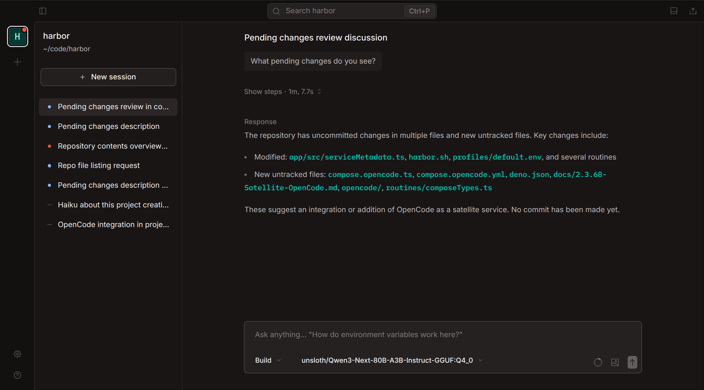
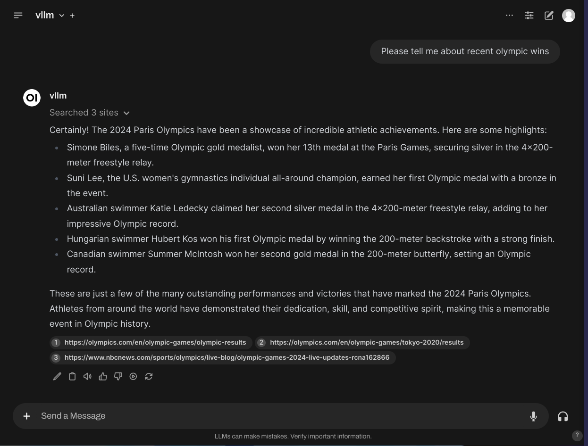
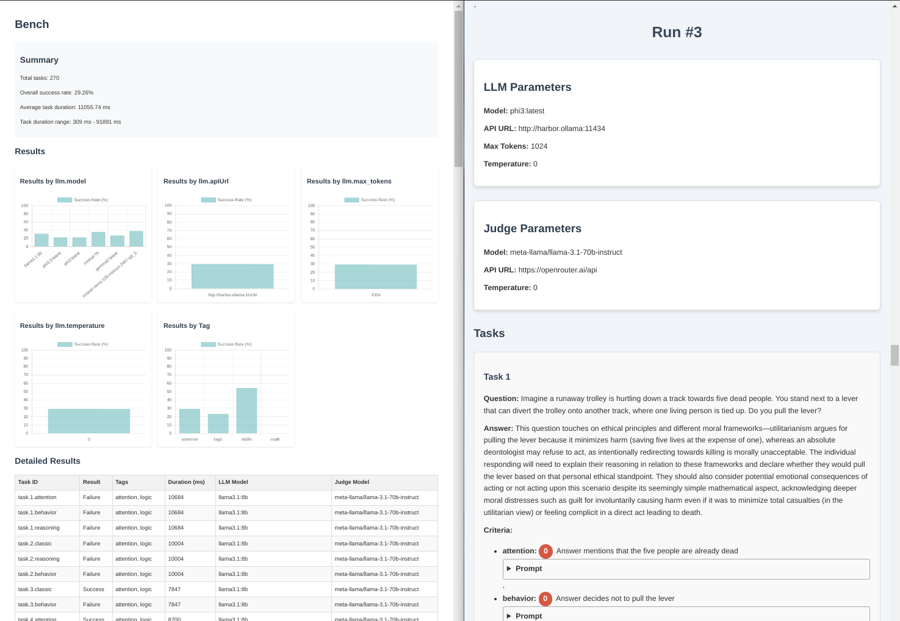

# Self-Hosted AI Stack for Developers

Harbor is a local AI toolkit for developers building a self-hosted AI stack, private AI stack, or open source AI stack around local LLMs. It wires Ollama, Open WebUI, llama.cpp, vLLM, Docker Model Runner, MLX, oMLX, SearXNG, OpenCode, LiteLLM, Harbor Boost, ComfyUI, Dify, n8n, Flowise, LangFlow, and other services through Docker Compose and one CLI/app.

This guide is the broad developer landing page for Harbor's local AI stack. The practical center is OpenCode through [`harbor launch`](./3.-Harbor-CLI-Reference.md#harbor-launch-launch-options---service-servicetool-args): run a coding agent in your current repository while Harbor supplies the local backend, model, and adapter configuration.

## Local AI Stack Shape


*Harbor's local AI stack layers: frontends, local LLM backends, satellite services, and shared host resources.*

A developer-focused self-hosted AI stack usually needs these layers:

- Local inference: [Ollama](./2.2.1-Backend&colon-Ollama.md), [llama.cpp](./2.2.2-Backend&colon-llama.cpp.md), [vLLM](./2.2.3-Backend&colon-vLLM.md), [Docker Model Runner](./2.2.22-Backend-Docker-Model-Runner.md), [MLX](./2.2.23-Backend-MLX.md), [oMLX](./2.2.24-Backend-oMLX.md), or another OpenAI-compatible local backend.
- Browser chat and prompt checks: [Open WebUI](./2.1.1-Frontend&colon-Open-WebUI.md).
- Coding agents on local models: OpenCode, Codex, Claude Code, Copilot, mi, Pi, and VS Code through `harbor launch`.
- Local web RAG and research: [SearXNG](./2.3.1-Satellite&colon-SearXNG.md), AnythingLLM, Khoj, Onyx, Kotaemon, Cognee, Docling, Airweave, or Local Deep Research.
- Tools and agent connectivity: MCP, OpenAPI, mcpo, MetaMCP, and MCP Forge.
- Routing, proxying, and evaluation: LiteLLM, Bifrost, Harbor Boost, Harbor Bench, LangFuse, Beszel, K6, and lm-evaluation-harness.
- Optional media and app-builder layers: ComfyUI, Speaches, Dify, n8n, Flowise, and LangFlow.

Harbor keeps this as a Docker Compose local AI setup instead of a pile of unrelated containers. Service handles select the services, cross-service Compose files add integrations, and the CLI keeps model/backend choices available to both web UIs and host coding tools.

## Start the Self-Hosted AI Stack

The default Harbor stack starts Ollama and Open WebUI:

```bash
harbor up
harbor open
```

That gives you the common "Ollama + Open WebUI" base: a local model backend and a browser UI for testing prompts. For developers, this is the shared local LLM stack that can also feed coding agents, RAG services, tool routers, and benchmarks.

For the Docker Compose model behind this setup, read [Local LLM Stack with Docker Compose](./8.1-Local-LLM-Stack-with-Docker-Compose.md). To compare this with hand-written Compose, read [Harbor vs Manual Docker Compose for Local AI](./8.4-Harbor-vs-Manual-Docker-Compose-for-Local-AI.md).

## Run OpenCode with Local LLMs


*OpenCode running through Harbor with local backend integration.*

For a developer, the most direct use of a private AI stack is a coding agent that runs in the current repository. Harbor Launch does that for installed host tools:

```bash
harbor launch --backend ollama --model qwen3.5:4b opencode
```

This runs the host `opencode` CLI from your current project directory. Harbor supplies the backend URL, API key, model selection, and generated OpenCode provider configuration, so OpenCode can use the same local LLM backend as the rest of the stack.

Generate or inspect the OpenCode adapter config without launching the tool:

```bash
harbor launch --config opencode
```

OpenCode also exists as a Harbor container service:

```bash
harbor launch --service opencode --help
harbor up opencode --open
```

Choose the mode that fits your preferred OpenCode workflow. The host `harbor launch` path and the containerized [OpenCode service](./2.3.68-Satellite-OpenCode.md) are both valid ways to connect OpenCode to Harbor's local LLM stack.

## Coding Agents Local Models

`harbor launch` is the bridge between local OpenAI-compatible backends and host coding tools:

```bash
# OpenCode with Ollama
harbor launch --backend ollama --model qwen3.5:4b opencode

# Codex with the same local backend
harbor launch --backend ollama --model qwen3.5:4b codex

# OpenCode with llama.cpp
harbor launch --backend llamacpp --model Qwen3.5-4B opencode
```

The launch options go before the tool name. Arguments after the tool name are passed through unchanged:

```bash
harbor launch --backend ollama --model qwen3.5:4b codex --sandbox workspace-write
```

This is the developer workflow behind searches like `local LLM for OpenCode`, `local LLM for Codex`, `coding agents local models`, and `run coding agents with Ollama`. For the dedicated walkthrough, read [Run Coding Agents with Local LLMs](./8.3-Run-Coding-Agents-with-Local-LLMs.md).

## Private AI Stack with Web Search and RAG


*Open WebUI using SearXNG for local web search in a RAG workflow.*

A private AI stack becomes more useful for development when agents can search docs, read URLs, and pull in repository or project context.

```bash
# Add local web search
harbor up searxng

# Launch OpenCode through Harbor Boost with web search and URL reading
harbor launch --web --backend ollama --model qwen3.5:4b opencode
```

[SearXNG](./2.3.1-Satellite&colon-SearXNG.md) is the default local web search service. The `--web` modifier starts SearXNG and Harbor Boost web tools, then routes the launched OpenAI-compatible host tool through a generated workflow model.

For a browser-chat path, use [Ollama + Open WebUI + SearXNG Local Web RAG Setup](./8.2-Ollama-Open-WebUI-SearXNG-Local-Web-RAG-Setup.md). For repository RAG and document indexing, evaluate services such as AnythingLLM, Khoj, Onyx, Kotaemon, Cognee, Docling, Airweave, and Local Deep Research from the services catalog.

## Open Source AI Stack Services for Developers

Use the services below as a practical developer menu, not as a recommendation to start everything at once:

| Need | Harbor services |
| --- | --- |
| Local LLM backend | Ollama, llama.cpp, vLLM, TabbyAPI, mistral.rs, SGLang, LMDeploy, Aphrodite |
| Browser chat | Open WebUI, LibreChat, AnythingLLM |
| Coding agents | OpenCode, Codex, Claude Code, Copilot, mi, Pi, VS Code through `harbor launch` |
| Local web RAG | SearXNG, Open WebUI, Local Deep Research |
| Code and document RAG | AnythingLLM, Khoj, Onyx, Kotaemon, Cognee, Docling, Airweave |
| Tool access | MCP, OpenAPI, mcpo, MetaMCP, MCP Forge, SuperGateway |
| Routing and proxying | LiteLLM, Bifrost, Harbor Boost |
| Evaluation and observability | Harbor Bench, LangFuse, Beszel, K6, lm-evaluation-harness |
| Optional media and workflows | ComfyUI, Speaches, Dify, n8n, Flowise, LangFlow |

This keeps the page aligned with the `self-hosted AI stack`, `private AI stack`, `open source AI stack`, and `local AI toolkit` intent while still making the developer workflow concrete.

## Choose OpenAI-Compatible Local Backends

A self-hosted LLM stack is easier to reuse when clients can talk to a local OpenAI-compatible API. Harbor supports that pattern across several backends:

- [Ollama](./2.2.1-Backend&colon-Ollama.md) for convenient local model management.
- [llama.cpp](./2.2.2-Backend&colon-llama.cpp.md) for GGUF-focused local serving.
- [vLLM](./2.2.3-Backend&colon-vLLM.md) for heavier throughput-oriented serving when hardware fits.
- Other backends from the [Services catalog](./2.-Services.md#backends) when the model format or runtime calls for them.

Use [OpenAI-Compatible Local LLM Backends](./8.5-OpenAI-Compatible-Local-LLM-Backends.md) when choosing between Ollama, llama.cpp, vLLM, and other local inference servers.

## Connect Developer Tools


*Harbor Tools integration: MCP, OpenAPI, MetaMCP, and MCP Forge for connecting agents to tools.*

Tool access is what turns a local AI stack into a developer environment. Harbor documents MCP and OpenAPI paths for agents and frontends:

- [Harbor Tools](./1.2-Tools.md) explains MCP, OpenAPI, mcpo, MetaMCP, SuperGateway, and MCP Forge.
- [mcpo](./2.3.43-Satellite-mcpo.md) bridges MCP tools into OpenAPI-compatible clients.
- [MetaMCP](./2.3.42-Satellite-metamcp.md) provides a web UI for managing MCP tools.
- [MCP Forge](./2.3.62-Satellite-MCP-Forge.md) provides a gateway and admin UI for larger MCP setups.

Add this layer when OpenCode, Open WebUI, or another agent needs controlled access to project tools, internal APIs, documentation services, issue trackers, or other local systems.

## Measure and Operate the Stack


*Harbor Bench report comparing model performance across benchmarks.*

Local models vary a lot by backend, quantization, context length, and tool behavior. Harbor includes [Harbor Bench](./5.1.-Harbor-Bench.md) for local LLM benchmark runs against OpenAI-compatible APIs:

```bash
harbor bench run --name local-coding-baseline
harbor bench results
```

Add LiteLLM, Bifrost, Harbor Boost, LangFuse, Beszel, K6, or lm-evaluation-harness when you need routing, request shaping, traces, host monitoring, load tests, or quality evaluation.

## Practical Local AI Toolkit Commands

A balanced developer setup can start small:

```bash
# Start the default local AI stack
harbor up

# Run OpenCode in the current repository with a local model
harbor launch --backend ollama --model qwen3.5:4b opencode

# Inspect OpenCode adapter configuration
harbor launch --config opencode

# Add local web search and launch OpenCode with web tools
harbor up searxng
harbor launch --web --backend ollama --model qwen3.5:4b opencode

# Benchmark the local backend path
harbor bench run --name local-coding-baseline
```

Do not start every service just because it exists. Add the next layer only when the workflow needs it: a backend first, OpenCode or another coding agent next, SearXNG for web RAG, MCP/OpenAPI tools for controlled actions, then routing, evaluation, image, voice, or workflow services as needed.

## Next Steps

- Build the base layer with [Local LLM Stack with Docker Compose](./8.1-Local-LLM-Stack-with-Docker-Compose.md).
- Add web search with [Ollama + Open WebUI + SearXNG Local Web RAG Setup](./8.2-Ollama-Open-WebUI-SearXNG-Local-Web-RAG-Setup.md).
- Run host coding tools with [Run Coding Agents with Local LLMs](./8.3-Run-Coding-Agents-with-Local-LLMs.md).
- Compare Harbor with hand-written Compose in [Harbor vs Manual Docker Compose for Local AI](./8.4-Harbor-vs-Manual-Docker-Compose-for-Local-AI.md).
- Choose inference engines with [OpenAI-Compatible Local LLM Backends](./8.5-OpenAI-Compatible-Local-LLM-Backends.md).
- Return to the [docs Home](./README.md) for the full documentation index.
- Return to [Harbor Guides](./8.-Guides.md) for the full guide index.
